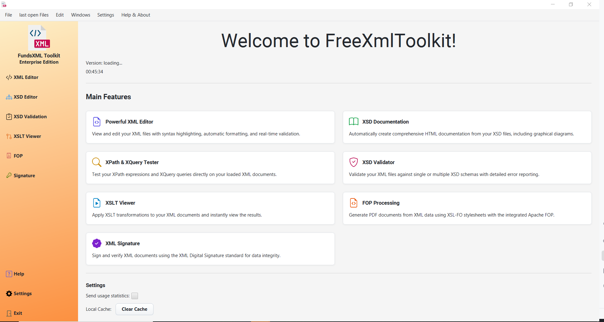

# FreeXmlToolkit - Your Complete XML Workstation

[](https://openjdk.org/)
[](https://openjfx.io/)
[](LICENSE.md)

**FreeXmlToolkit** is a powerful, all-in-one desktop application that makes working with XML files simple and efficient.
Whether you're a business professional, developer, or just someone who needs to work with XML documents, this toolkit
provides everything you need in one convenient application.



## 🎯 What is FreeXmlToolkit?

FreeXmlToolkit is like having a complete XML office suite on your computer. It's designed to handle all the common tasks
you might need when working with XML files, from simple editing to complex transformations and validations. Think of it
as your personal XML assistant that helps you work smarter, not harder.

## ✨ What Can You Do With It?

### 📝 **Smart XML Editor**

- **Write and Edit XML**: A modern, user-friendly text editor specifically designed for XML files
- **Real-time Help**: The editor highlights errors as you type and suggests fixes
- **Auto-Formatting**: Clean up messy XML files with one click - automatically organizes and indents your code
- **Syntax Highlighting**: Different colors for different parts of your XML make it easy to read and understand

### 📚 **Create Beautiful Documentation**

- **Turn XSD Schemas into Web Pages**: Convert complex technical schemas into easy-to-read HTML documentation
- **Interactive Diagrams**: See visual representations of your XML structure with clickable diagrams
- **Professional Output**: Generate documentation that looks like it was created by a professional web designer
- **Search Functionality**: Quickly find what you're looking for in large documentation sets

### ✅ **Validate Your XML Files**

- **Check for Errors**: Verify that your XML files follow the correct structure and rules
- **Detailed Error Reports**: Get clear explanations of what's wrong and where to fix it
- **Multiple Schema Support**: Validate against one or more schema files at the same time
- **Instant Feedback**: See validation results immediately as you work

### 🔍 **Test and Debug XML Queries**

- **XPath Testing**: Try out XML queries and see results instantly
- **XQuery Support**: Work with more advanced XML querying
- **Visual Results**: See exactly which parts of your XML match your queries
- **Copy and Paste**: Easily copy query results for use in other applications

### 🎨 **Transform XML with XSLT**

- **Live Preview**: See how your XML will look after transformation without leaving the application
- **Multiple Output Formats**: Transform XML into HTML, text, or other XML formats
- **Parameter Support**: Customize transformations with different parameters
- **Instant Results**: No waiting - see your transformed data immediately

### 📄 **Create Professional PDFs**

- **XML to PDF**: Convert your XML data into professional-looking PDF documents
- **Industry Standard**: Uses Apache FOP, the same technology used by major corporations
- **Customizable Layouts**: Control exactly how your PDF looks and feels
- **High Quality Output**: Generate print-ready documents

### ✍️ **Digital Signatures**

- **Sign Documents**: Add digital signatures to your XML files to prove authenticity
- **Verify Signatures**: Check if received XML files are genuine and haven't been tampered with
- **Security Standards**: Uses industry-standard XML Digital Signature technology
- **Certificate Support**: Work with standard security certificates

### 🎲 **Generate Sample Data**

- **Create Test Files**: Generate realistic sample XML files from any schema
- **Smart Data**: The generated data respects all the rules and constraints of your schema
- **Perfect for Testing**: Create multiple test scenarios quickly and easily
- **Realistic Content**: Get believable sample data that looks like real information

## 🚀 Why Choose FreeXmlToolkit?

### **All-in-One Solution**

No need to install multiple applications or learn different tools. Everything you need for XML work is right here.

### **User-Friendly Interface**

Designed with the user in mind - clean, intuitive, and easy to navigate. No steep learning curve required.

### **Professional Quality**

Built using industry-standard technologies and libraries, ensuring reliable and professional results.

### **Cross-Platform**

Works on Windows, Mac, and Linux - use it on whatever computer you prefer.

### **Free and Open Source**

Completely free to use, modify, and distribute. No hidden costs or licensing fees.

## 📋 System Requirements

- **Operating System**: Windows 10/11, macOS 10.15+, or Linux
- **Java**: Java 24 or higher (included in the download)
- **Memory**: 4GB RAM minimum (8GB recommended)
- **Storage**: 500MB free disk space

## 🛠️ Getting Started

### **Option 1: Download Ready-to-Use Version (Recommended)**

1. Go to the [Releases page](https://github.com/karlkauc/FreeXmlToolkit/releases)
2. Download the latest version for your operating system
3. Extract the ZIP file to a folder on your computer
4. Run the application:
    - **Windows**: Double-click `FreeXmlToolkit.exe`
    - **Mac**: Double-click the `.app` file
    - **Linux**: Run `./FreeXmlToolkit` in terminal

### **Option 2: Build from Source Code**

If you're a developer or want the latest features:

```bash
git clone https://github.com/karlkauc/FreeXmlToolkit.git
cd FreeXmlToolkit
./gradlew run
```

## 📖 How to Use

### **First Steps**

1. **Launch the Application**: Start FreeXmlToolkit from your computer
2. **Explore the Interface**: The main window has tabs for different functions
3. **Open a File**: Use the file menu or drag and drop XML files into the application
4. **Try the Features**: Each tab offers different tools - experiment to see what each does

### **Common Workflows**

**Editing XML Files:**

1. Go to the "XML" tab
2. Open your XML file
3. Make your changes
4. Save when done

**Validating XML:**

1. Go to the "Validation" tab
2. Load your XML file
3. Select your XSD schema
4. Click "Validate" to check for errors

**Creating Documentation:**

1. Go to the "XSD" tab
2. Load your XSD schema file
3. Click "Generate Documentation"
4. View the beautiful HTML output

**Transforming XML:**

1. Go to the "XSLT" tab
2. Load your XML file
3. Load your XSLT stylesheet
4. See the transformed result instantly

## 🤝 Getting Help

### **Documentation**

- **Official Documentation**: For a complete feature guide, check out the [official documentation](https://karlkauc.github.io/FreeXmlToolkit/).
- **User Guide**: Check the [Wiki](https://github.com/karlkauc/FreeXmlToolkit/wiki) for detailed instructions
- **Examples**: Look in the `examples/` folder for sample files and templates
- **Built-in Help**: Use the Help tab within the application

### **Support**

- **Report Issues**: Found a bug? Report it on the [Issues page](https://github.com/karlkauc/FreeXmlToolkit/issues)
- **Request Features**: Have an idea for improvement? Let us know!
- **Ask Questions**: Use the Issues page to ask questions or get help

## 🎉 Contributing

We welcome contributions from everyone! Whether you're a developer, designer, or just someone who uses the application:

- **Report Bugs**: Help us find and fix problems
- **Suggest Features**: Tell us what would make the tool better for you
- **Write Documentation**: Help others learn how to use the application
- **Code Contributions**: Submit improvements or new features

## 📄 License

This project is licensed under the Apache License 2.0 - see the [LICENSE.md](LICENSE.md) file for details.

## 🙏 Acknowledgments

FreeXmlToolkit is built on the shoulders of many excellent open-source projects:

- **JavaFX** for the modern user interface
- **Apache FOP** for PDF generation
- **Saxon** for XSLT processing
- **Apache Log4j** for logging
- **And many more** - see the build files for a complete list

---

**Ready to simplify your XML work?** Download FreeXmlToolkit today and discover how easy working with XML can be!

[Download Latest Release](https://github.com/karlkauc/FreeXmlToolkit/releases) | [View Source Code](https://github.com/karlkauc/FreeXmlToolkit) | [Report Issues](https://github.com/karlkauc/FreeXmlToolkit/issues)