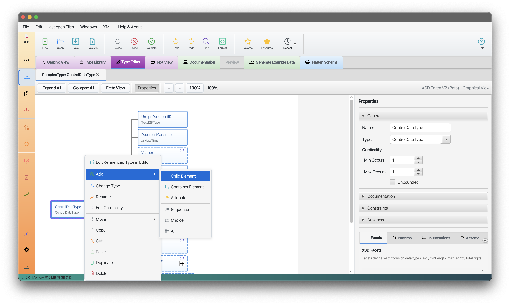
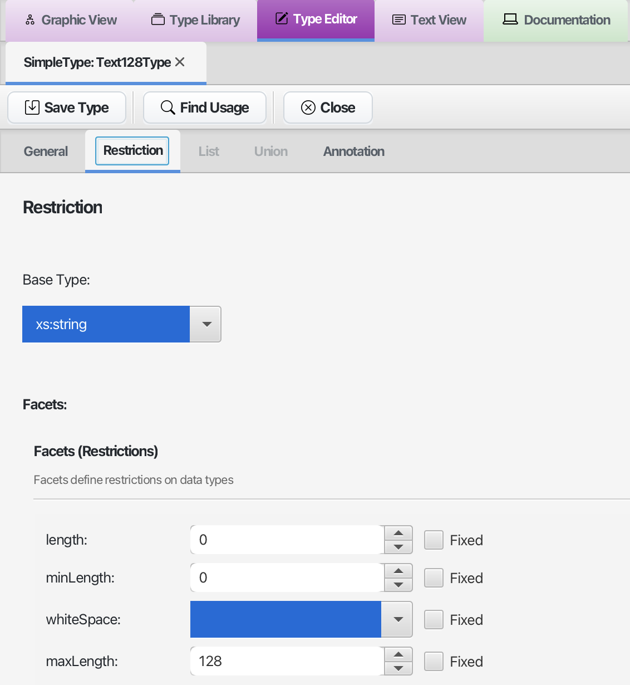
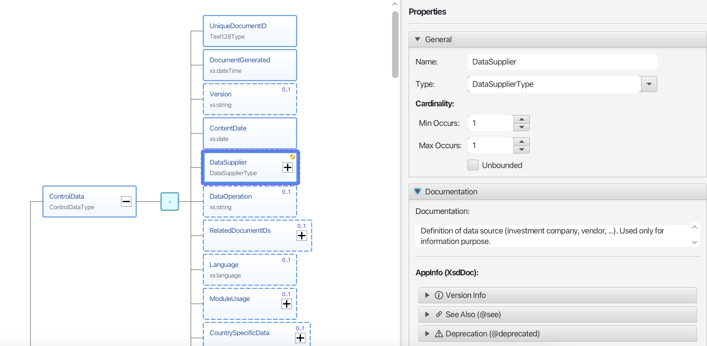

# XSD Editor V2

> **Last Updated:** November 2025 | **Version:** 1.0.0

The XSD Editor V2 is an advanced graphical editor for working with XML Schema (XSD) files.

---

## Overview

*Screenshot placeholder: XSD Editor V2 graphical interface*

### Key Features

- **Visual Schema Editing** - See your schema as an interactive tree
- **Full Undo/Redo** - Go back and forward through your changes
- **Type Editing** - Edit SimpleTypes and ComplexTypes graphically
- **Incremental Updates** - Only changed parts of the display update
- **XSD 1.0 and 1.1 Support** - All XSD features are supported

---

## What Can You Do?

### Edit Schema Structure

*Screenshot placeholder: Schema tree with elements and types*

- Add, remove, and move elements
- Edit element names, types, and properties
- Set cardinality (minOccurs, maxOccurs)
- Drag and drop to reorganize

### Edit Types

*Screenshot placeholder: Type editor panel*

- Create and edit SimpleTypes with facets (patterns, enumerations, etc.)
- Create and edit ComplexTypes with sequences, choices, and attributes
- See the type hierarchy

### Work with Properties

*Screenshot placeholder: Properties panel*

- View and edit all properties of selected elements
- Edit facets like patterns, lengths, and enumerations
- Add documentation to your schema

---

## How to Use

### Opening a Schema

1. Go to the **XSD** tab
2. Open your XSD file
3. The schema appears as an interactive tree

### Editing Elements

*Screenshot placeholder: Element editing*

1. **Select** an element by clicking on it
2. **Edit properties** in the panel on the right
3. **Add children** using the context menu (right-click)
4. **Drag** elements to move them

### Using Undo/Redo

- Press **Ctrl+Z** to undo
- Press **Ctrl+Y** to redo
- All changes can be undone

### Saving Changes

- Press **Ctrl+S** to save
- A backup is created automatically

---

## Supported XSD Features

| Category | Features |
|----------|----------|
| **Elements** | Elements, Attributes, Groups |
| **Types** | ComplexTypes, SimpleTypes |
| **Compositors** | Sequence, Choice, All |
| **Constraints** | Patterns, Enumerations, Length limits |
| **References** | Import, Include |
| **XSD 1.1** | Assertions, Alternatives |

---

## Tips

- **Double-click** an element to edit its name
- **Right-click** for a context menu with common actions
- **Drag and drop** to reorganize elements
- **Use the type panel** to manage global types

---

## Navigation

| Previous | Home | Next |
|----------|------|------|
| [Licenses](licenses.md) | [Home](index.md) | [XSD Editor Roadmap](XSD_EDITOR_V2_ROADMAP.md) |

**All Pages:** [XML Editor](xml-controller.md) | [XML Features](xml-editor-features.md) | [XSD Tools](xsd-controller.md) | [XSD Validation](xsd-validation-controller.md) | [XSLT](xslt-controller.md) | [FOP/PDF](fop-controller.md) | [Signatures](signature-controller.md) | [IntelliSense](context-sensitive-intellisense.md) | [Schematron](schematron-support.md) | [Favorites](favorites-system.md) | [Templates](template-management.md) | [Tech Stack](technology-stack.md) | [Licenses](licenses.md)
