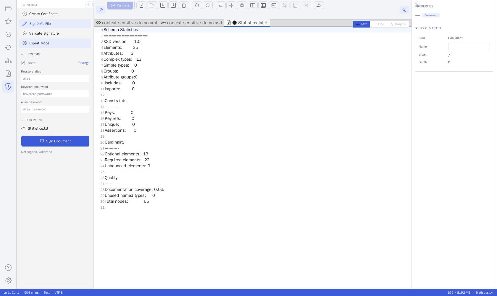
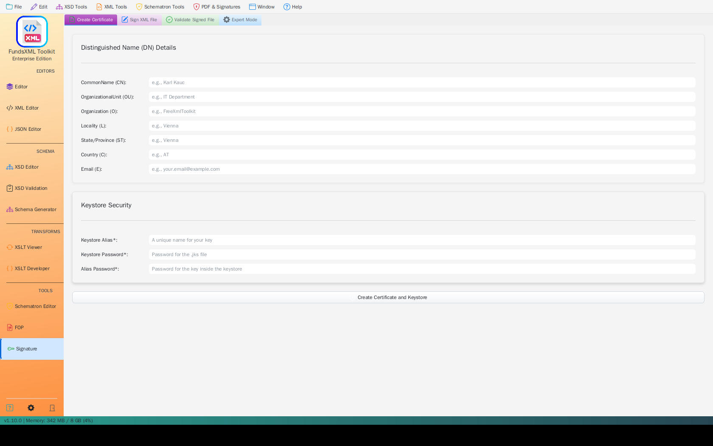
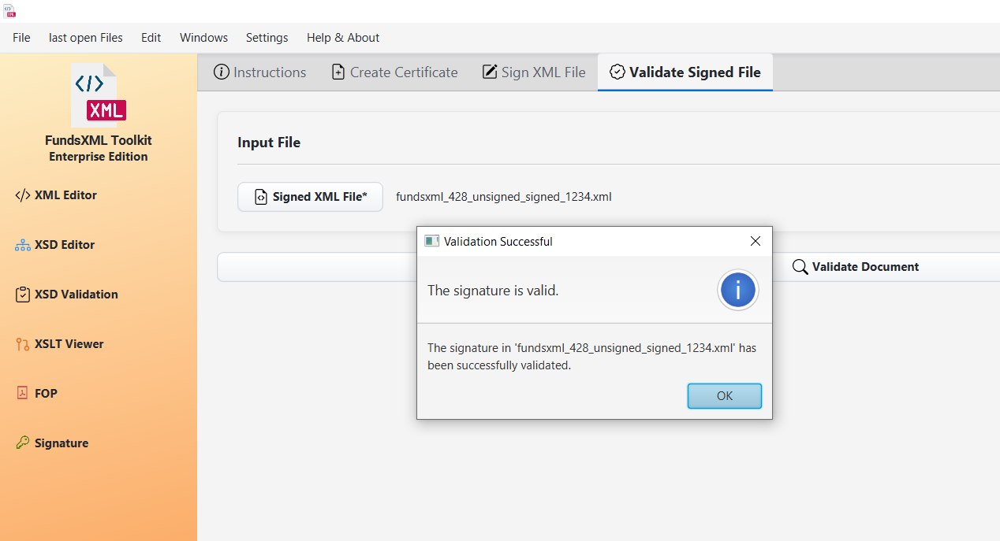
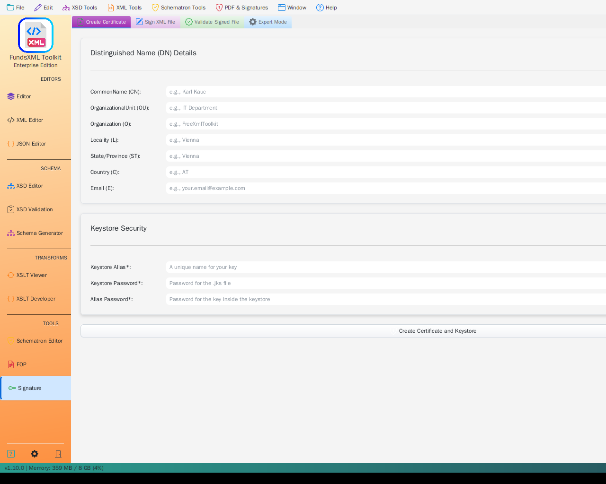

# XML Digital Signatures

> **Last Updated:** May 2026 | **Version:** 1.10.0

> **Note (Phase 10c):** The standalone *Signature* tab has been retired. Signing,
> signature validation (including detailed and PKIX trust/chain/revocation/timestamp
> validation) and self-signed certificate creation now live in the **Unified Shell's
> Signature activity panel**. The capabilities below are unchanged; they are reached
> through the shell rather than a dedicated sidebar tab.

This tool lets you digitally sign XML documents and verify signatures. A digital signature proves that a document is authentic and hasn't been changed.

---

## Overview

*Signing, validation and certificate creation now live in the Unified Shell's Signature activity panel*

### What Can You Do?

In the [Unified Shell](unified-shell.md), open the **Signature** activity from the activity bar.
The panel offers:

| Action | Description |
|-----|-------------|
| **Create Certificate** | Generate your own digital ID (keystore) |
| **Sign XML File** | Add a digital signature to XML files |
| **Validate Signed File** | Check if signed documents are valid |
| **Expert Mode** | Advanced options for power users |

---

## Toolbar

| Button | Shortcut | Description |
|--------|----------|-------------|
| **Add Favorite** | Ctrl+D | Add current file to favorites |
| **Favorites** | Ctrl+Shift+D | Toggle favorites panel |
| **Help** | F1 | Show help |

---

## 1. Create a Certificate

Before signing documents, you need a digital certificate (like a digital ID card).

*Certificate creation form with DN details*

### Certificate Details (Distinguished Name)

| Field | Description | Example |
|-------|-------------|---------|
| **Common Name (CN)** | Your name or the certificate name | John Smith |
| **Organization (O)** | Your company or organization | Acme Corp |
| **Organizational Unit (OU)** | Your department | IT Security |
| **Locality (L)** | Your city | Vienna |
| **State (ST)** | Your state or province | Vienna |
| **Country (C)** | Two-letter country code | AT |

### Keystore Security

| Field | Description |
|-------|-------------|
| **Keystore Password** | Password to protect the keystore file |
| **Key Password** | Password to protect the private key (can be same as keystore) |

### How to Create a Certificate

1. In the **Signature** panel, choose **Create Certificate**
2. Fill in the Distinguished Name fields
3. Set passwords for the keystore and key
4. Click **"Create Certificate"**
5. Choose where to save the keystore file (`.jks`)
6. Keep the keystore file and passwords safe!

**Important:** Remember your passwords! They cannot be recovered.

---

## 2. Sign an XML Document

*Document signing interface*

### Input Files

| Field | Description |
|-------|-------------|
| **XML File** | The document you want to sign |
| **Keystore File** | Your certificate keystore (`.jks`) |

### Keystore Credentials

| Field | Description |
|-------|-------------|
| **Keystore Password** | Password for the keystore file |
| **Key Password** | Password for the private key |
| **Key Alias** | Name of the key in the keystore |

### Output Settings

| Field | Description |
|-------|-------------|
| **Output File** | Where to save the signed XML |

### How to Sign a Document

1. In the **Signature** panel, choose **Sign XML File**
2. Click **"Browse"** to select your XML file
3. Click **"Browse"** to select your keystore file
4. Enter your keystore password and key password
5. Select the key alias (if multiple keys exist)
6. Choose where to save the signed output
7. Click **"Sign"**

The signed file includes the original content plus a digital signature block.

---

## 3. Verify a Signature

*Verifying a signed document*

### How to Verify a Signature

1. In the **Signature** panel, choose **Validate Signed File**
2. Click **"Browse"** to select the signed XML file
3. Click **"Validate"**
4. See the result in the status area

### Validation Results

| Status | Meaning |
|--------|---------|
| **Valid** | The signature is authentic and document unchanged |
| **Invalid** | The signature failed verification |
| **No Signature** | The document doesn't contain a signature |

### What the Verification Checks

| Check | What It Means |
|-------|---------------|
| **Authenticity** | The signature was created by the certificate holder |
| **Integrity** | The document hasn't been changed since signing |
| **Certificate** | The signing certificate is valid |

---

## 3b. Trust Validation

> **New in June 2026** - In addition to checking that a signature is mathematically valid, you
> can now check whether the signing certificate is actually **trusted**.

Basic validation confirms that a signature is intact and matches its certificate. **Trust
validation** goes further: it checks the signing certificate's chain against a **trust store** -
a collection of certificate authorities you trust - to decide whether the certificate really
comes from a trusted source.

In the Unified Shell's **Signature** panel, the action is **Validate (Trust)**.

### How to Run Trust Validation

1. Open the signed XML document.
2. (Optional) Click **Trust store…** to choose the trust store to validate against. By default
   the application uses the JVM's built-in `cacerts` store, which contains well-known public
   certificate authorities.
3. (Optional) Tick **Check revocation (OCSP/CRL)** to also verify that the certificate has not
   been revoked.
4. Click **Validate (Trust)**.
5. A trust report opens in a new tab.

### What the Trust Report Tells You

| Item | What It Means |
|------|---------------|
| **Trusted** | Whether the signing certificate chains up to a certificate in the trust store |
| **Trust anchor** | The trusted certificate (certificate authority) at the top of the chain |
| **Revocation** | Whether the certificate has been revoked (only when revocation checking is on) |
| **Timestamp** | Timestamp information found with the signature, if any |

> **Note:** A signature can be mathematically **valid** but **not trusted** if its certificate
> is self-signed or issued by an authority that is not in your trust store. Trust validation is
> the step that tells the two situations apart.

---

## 4. Expert Mode

For users who need more control over the signing process.

*Expert mode with advanced options*

### Key Generation Options

| Option | Values | Description |
|--------|--------|-------------|
| **Key Algorithm** | RSA, DSA, EC | Cryptographic algorithm for the key pair |
| **Key Size** | 2048, 3072, 4096 (bits) | Larger = more secure but slower |

### Signature Options

| Option | Values | Description |
|--------|--------|-------------|
| **Signature Algorithm** | SHA256withRSA, SHA384withRSA, SHA512withRSA, etc. | Hash and signing algorithm combination |

### Certificate Options

| Option | Description |
|--------|-------------|
| **Validity (Days)** | How long the certificate is valid (e.g., 365 days) |
| **Subject Alternative Names** | Additional identities (email, DNS, IP) |

### When to Use Expert Mode

- **Higher Security**: Use larger key sizes (4096-bit) or stronger algorithms
- **Compliance**: Meet specific security standards (e.g., government, financial)
- **Extended Validity**: Create certificates valid for longer periods
- **Alternative Names**: Include email addresses or domain names in certificate

---

## Favorites Integration

Save frequently used files for quick access:

- **Add Favorite** (Ctrl+D) - Add current file to favorites
- **Favorites** (Ctrl+Shift+D) - Show/hide the favorites panel

The favorites panel appears on the right side and provides quick access to your saved keystores, XML files, and signed documents.

---

## Keyboard Shortcuts

| Shortcut | Action |
|----------|--------|
| Ctrl+D | Add to favorites |
| Ctrl+Shift+D | Toggle favorites |
| F1 | Help |

---

## Tips

- **Keep your keystore safe** - It's your digital identity
- **Remember your passwords** - They cannot be recovered
- **Signed files are new files** - The original is not modified
- **Use strong passwords** - At least 12 characters with mixed case, numbers, symbols
- **Backup your keystore** - Store copies in secure locations
- **Check validity regularly** - Certificates expire after the validity period

---

## Troubleshooting

| Problem | Solution |
|---------|----------|
| Wrong password | Double-check keystore and key passwords |
| Key not found | Verify the key alias exists in the keystore |
| Validation fails | Document may have been modified after signing |
| Certificate expired | Create a new certificate with Expert Mode |

---

## Supported Formats

| Type | Formats |
|------|---------|
| **Input** | XML files (`.xml`) |
| **Keystores** | Java Keystore (`.jks`) |
| **Output** | Signed XML with embedded signature |

---

## Common Questions

### What if I lose my password?

Unfortunately, passwords cannot be recovered. You'll need to create a new certificate.

### Can I sign multiple files at once?

Currently, files must be signed one at a time.

### What signature type is used?

The tool creates enveloped XML signatures (XMLDSig) where the signature is embedded within the XML document.

### Can I sign PDFs?

No, this tool is specifically for XML documents. Use the PDF Generator for PDF-related tasks.

---

## Navigation

| Previous | Home | Next |
|----------|------|------|
| [PDF Generator (FOP)](pdf-generator.md) | [Home](index.md) | [Auto-Completion](context-sensitive-intellisense.md) |

**All Pages:** [XML Editor](xml-editor.md) | [XML Features](xml-editor-features.md) | [XSD Tools](xsd-tools.md) | [XSD Validation](xsd-validation.md) | [XSLT Viewer](xslt-viewer.md) | [XSLT Developer](xslt-developer.md) | [FOP/PDF](pdf-generator.md) | [Signatures](digital-signatures.md) | [IntelliSense](context-sensitive-intellisense.md) | [Schematron](schematron-support.md) | [Favorites](favorites-system.md) | [Templates](template-management.md) | [Tech Stack](technology-stack.md) | [Licenses](licenses.md)
