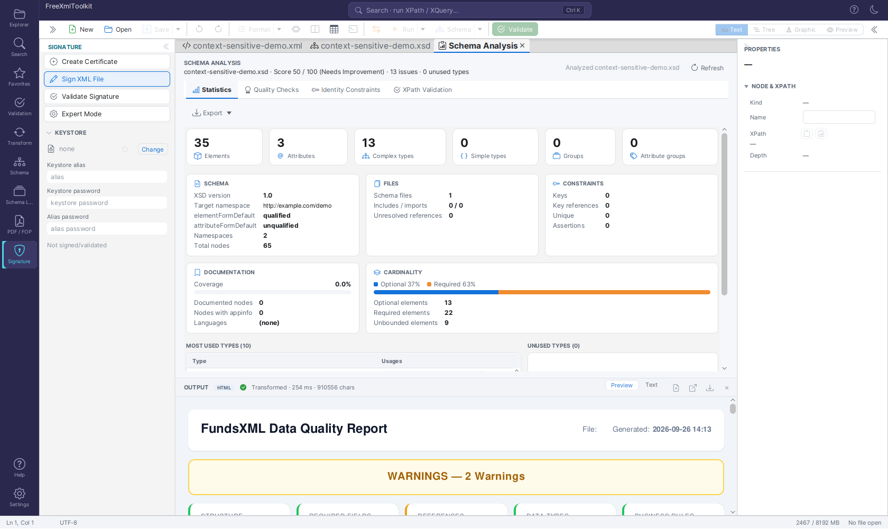
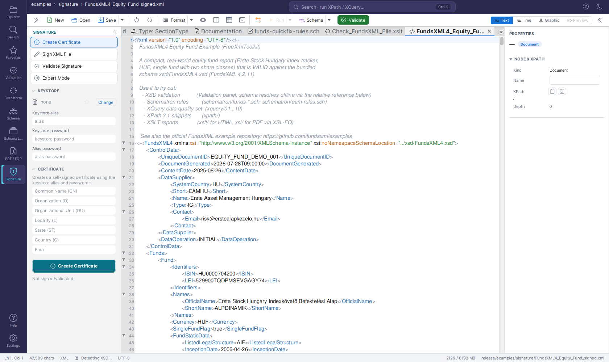
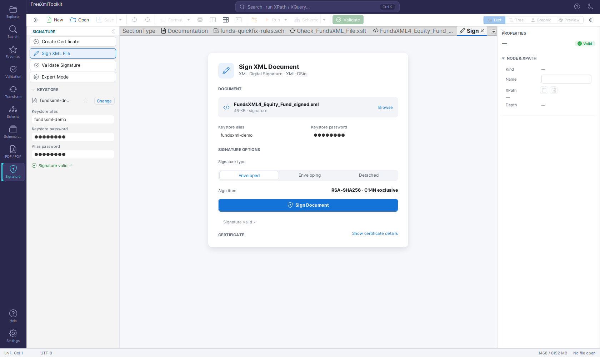
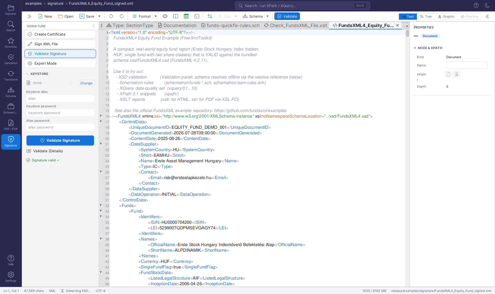
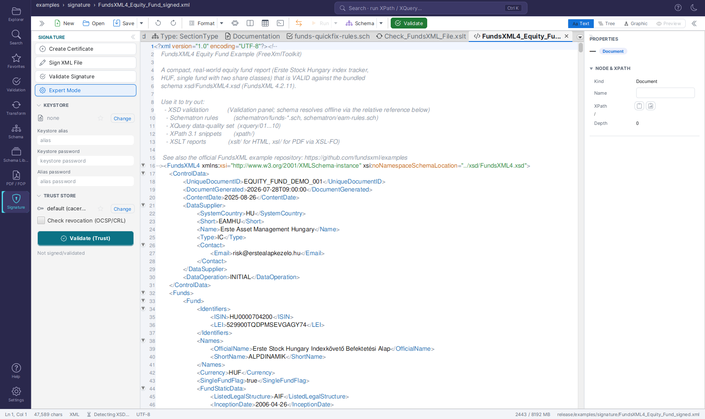

# XML Digital Signatures

> **Version:** 2.1.0

> **Note:** Signing, signature validation (including detailed and PKIX
> trust/chain/revocation/timestamp validation) and self-signed certificate creation
> live in the **Unified Shell's Signature activity panel** - they are reached through
> the shell rather than a dedicated sidebar tab.

This tool lets you digitally sign XML documents and verify signatures. A digital signature proves that a document is authentic and hasn't been changed.

---

## Overview

*Signing, validation and certificate creation now live in the Unified Shell's Signature activity panel*

### What Can You Do?

In the [Unified Shell](unified-shell.md), open the **Signature** activity from the activity bar.
The top of the panel is an **action nav** of four buttons - rendered as raised, bordered
buttons so they are recognizable as clickable. Selecting one
shows the matching form below the shared **KEYSTORE** section (keystore file, alias, passwords):

| Action | Description |
|-----|-------------|
| **Create Certificate** | Generate your own digital ID (keystore) |
| **Sign XML File** | Opens the **Sign XML Document card** in the editor area *(default)* |
| **Validate Signature** | Check if the signed document is valid (plus a detailed report) |
| **Expert Mode** | PKIX trust validation against a trust store, with optional revocation check |

### The KEYSTORE Section

The **KEYSTORE** section sits directly below the action nav and is shared by all actions:

| Field | Description |
|-------|-------------|
| **Keystore row** | The selected keystore file (`none` until you pick one). Click **Change** to browse, pick a favorite from the **star menu**, or drop a file from your file manager (`.jks`, `.keystore`, `.p12`, `.pfx`) |
| **Keystore alias** | Name of the key entry in the keystore |
| **Keystore password** | Password protecting the keystore file (also used to open a password-protected trust store in Expert Mode) |
| **Alias password** | Password protecting the private key |

The status line at the bottom of the panel reports the outcome of the last action.

---

## 1. Create a Certificate

Before signing documents, you need a digital certificate (like a digital ID card).

*Certificate creation form with DN details*

### Certificate Details (Distinguished Name)

All fields are optional - blank ones are simply omitted from the subject.

| Field | Description | Example |
|-------|-------------|---------|
| **Common Name (CN)** | Your name or the certificate name | John Smith |
| **Organization (O)** | Your company or organization | Acme Corp |
| **Organizational Unit (OU)** | Your department | IT Security |
| **Locality (L)** | Your city | Vienna |
| **State (ST)** | Your state or province | Vienna |
| **Country (C)** | Two-letter country code | AT |
| **Email** | Contact e-mail address | john@example.com |

### Keystore Security

The alias and passwords come from the shared **KEYSTORE** section - all three are required:

| Field | Description |
|-------|-------------|
| **Keystore alias** | Alias of the new key entry; also names the output folder and files |
| **Keystore password** | Password to protect the keystore file |
| **Alias password** | Password to protect the private key (can be same as keystore) |

### What Gets Generated

The certificate parameters are fixed - there are no algorithm or validity options:

| Property | Value |
|----------|-------|
| **Key** | RSA, 2048 bits |
| **Signature algorithm** | SHA256withRSA |
| **Validity** | 1 year from creation |
| **Type** | Self-signed (issuer = subject) |

The files are written to `certs/<alias>/` in the application's working directory:

| File | Content |
|------|---------|
| `<alias>_KeyStore.jks` | The Java keystore with the private key and certificate |
| `<alias>_publicKey.pem` | The certificate as PEM |
| `<alias>_privateKey.pem` | The encrypted private key as PEM (encrypted with the keystore password) |
| `summary.txt` | Alias, passwords and certificate details in plain text - **keep it private** |

### How to Create a Certificate

1. In the **Signature** panel, choose **Create Certificate**
2. Fill in the alias and both passwords in the **KEYSTORE** section
3. Fill in the Distinguished Name fields
4. Click **"Create Certificate"**
5. The status line shows the path of the new keystore, which is **selected automatically** -
   you can sign with it right away
6. Keep the keystore file and passwords safe!

**Important:** Remember your passwords! They cannot be recovered.

> **Tip:** If you leave the alias or a password blank, the field is highlighted
> in red when you click **Create Certificate**. The highlight clears as soon as you start typing.

---

## 2. Sign an XML Document

*Document signing interface*

Choosing **Sign XML File** opens the **Sign XML Document** card as a tool tab in the editor
area. It is pre-filled with the active document.

### The Sign Card

| Section | Description |
|---------|-------------|
| **DOCUMENT** | The XML file to sign (the active document by default); **Browse** picks a different file |
| **Keystore alias** / **Keystore password** | Mirrors the fields of the panel's KEYSTORE section (the **alias password** stays in the side panel) |
| **SIGNATURE OPTIONS - Signature type** | **Enveloped** *(default)*, **Enveloping** or **Detached** (see below) |
| **SIGNATURE OPTIONS - Algorithm** | Read-only: `RSA-SHA256 · C14N exclusive` |
| **Sign Document** | Runs the signing; the status line mirrors the panel's status |
| **CERTIFICATE** | **Show certificate details** loads the certificate of the selected keystore/alias: subject, issued/expires, serial, signature algorithm, key usage and the SHA-256 fingerprint (with a copy button) |

### Signature Types and Output Files

There is no output-file picker: the result is written **next to the original**, which is left
untouched, and opened in the editor automatically.

| Type | Structure | Output file |
|------|-----------|-------------|
| **Enveloped** | The `ds:Signature` element is inserted into the signed document | `<name>.signed.xml` |
| **Enveloping** | The signed content is wrapped inside the signature document | `<name>.signed.xml` |
| **Detached** | A standalone signature document referencing the original file by relative URI | `<name>.sig.xml` |

> **Detached signatures:** keep the `.sig.xml` file together with the original document -
> the signature references the file by name and cannot be verified without it.

### How to Sign a Document

1. In the **Signature** panel, select your keystore in the **KEYSTORE** section - click
   **Change**, pick a favorited keystore from the **star menu** next to the keystore row (see
   [Favorites Integration](#favorites-integration) below), or **drop** a keystore file
   (`.jks`, `.keystore`, `.p12`, `.pfx`) from your file manager onto the KEYSTORE row
   (Expert Mode's trust store row accepts drops the same way)
2. Enter the keystore alias, keystore password and alias password
3. Choose **Sign XML File** - the **Sign XML Document** card opens with the active document
   (click **Browse** in the DOCUMENT row to sign a different file)
4. Pick the signature type (Enveloped, Enveloping or Detached)
5. Click **"Sign Document"**
6. The signed file (`<name>.signed.xml` or `<name>.sig.xml`) opens in a new editor tab

> **Tip:** Missing inputs are highlighted in red when you click **Sign Document**: signing
> without a keystore marks the keystore entry, and a blank alias or password marks that field.
> The highlight disappears as soon as you start typing.

---

## 3. Verify a Signature

*Verifying a signed document*

### How to Verify a Signature

1. Open the signed XML file in the editor (it becomes the active document)
2. In the **Signature** panel, choose the **Validate Signature** action
3. Click the **Validate Signature** button
4. See the result in the status area (failures additionally open an explanatory dialog)

For a detailed report (validity plus signing-certificate details), use the outlined
**Validate (Details)** button instead - the report opens as `Signature-Report.txt` in a new tab.

### Validation Results

> Each validation outcome explains in plain language what happened and what to do about it.

| Result | Meaning |
|--------|---------|
| **Valid** (green status) | The signature is authentic and the document is unchanged |
| **No signature found** (red hint) | The document doesn't contain a signature - sign it first |
| **Invalid signature** (error dialog) | The document was modified after signing. The dialog names what failed: the signature value itself or a specific reference |
| **Certificate cannot be used** (dialog) | The signature does not embed an X.509 certificate, only references it, or uses an unsupported algorithm. Ask the sender for a signature that embeds an RSA X.509 certificate, or use **Validate (Details)** |
| **Weak algorithm** (rejected) | The signature uses SHA-1, which is rejected for security reasons. Re-sign the document with SHA-256 or SHA-512 |
| **Error** (dialog) | Something else went wrong - the dialog includes collapsible technical details |

### What the Verification Checks

| Check | What It Means |
|-------|---------------|
| **Authenticity** | The signature was created by the certificate holder |
| **Integrity** | The document hasn't been changed since signing |
| **Certificate** | The signing certificate is valid |

---

## 4. Expert Mode - Trust Validation

> In addition to checking that a signature is mathematically valid, you can
> check whether the signing certificate is actually **trusted**.

*Expert Mode: trust store, revocation check and Validate (Trust)*

Basic validation confirms that a signature is intact and matches its certificate. **Trust
validation** goes further: it checks the signing certificate's chain against a **trust store** -
a collection of certificate authorities you trust - to decide whether the certificate really
comes from a trusted source (PKIX path validation).

Expert Mode consists of the **TRUST STORE** section and one action:

| Control | Description |
|---------|-------------|
| **Trust store row** | The trust store to validate against - `default (cacerts)` until you pick one. **Change** opens a file chooser (`.jks`, `.p12`, `.pfx`, `.keystore`); the **star menu** lists your keystore favorites; dropping a file onto the row works too |
| **Check revocation (OCSP/CRL)** | Also verify that the certificate has not been revoked |
| **Validate (Trust)** | Runs the validation on the active document and opens the report |

### How to Run Trust Validation

1. Open the signed XML document.
2. (Optional) Click **Change** in the trust store row to choose the trust store to validate
   against - or pick a favorited keystore from the **star menu** next to the trust store row.
   By default the application uses the JVM's built-in `cacerts` store, which contains
   well-known public certificate authorities.
3. (Optional) If your trust store is password-protected, enter its password in the
   **Keystore password** field of the KEYSTORE section - it is reused for the trust store.
4. (Optional) Tick **Check revocation (OCSP/CRL)** to also verify that the certificate has not
   been revoked.
5. Click **Validate (Trust)**.
6. A trust report (`Signature-Trust-Report.txt`) opens in a new tab.

### What the Trust Report Tells You

| Item | What It Means |
|------|---------------|
| **Trusted** | Whether the signing certificate chains up to a certificate in the trust store |
| **Trust anchor** | The trusted certificate (certificate authority) at the top of the chain |
| **Revocation** | Whether the certificate has been revoked (only when revocation checking is on) |
| **Timestamp** | Timestamp information found with the signature, if any |

> **Note:** A signature can be mathematically **valid** but **not trusted** if its certificate
> is self-signed or issued by an authority that is not in your trust store. Trust validation is
> the step that tells the two situations apart. Certificates created with **Create Certificate**
> are self-signed, so they are only trusted if you add them to the trust store you validate against.

---

## Favorites Integration

Save frequently used files for quick access:

- **Add Favorite** (Ctrl+D) - Add the active document to favorites
- **Favorites** (Ctrl+Shift+D) - Show/hide the Favorites activity panel

The Favorites panel provides quick access to your saved keystores, XML files, and signed documents.

> Keystore and trust store files (`.jks`, `.p12`, `.pfx`,
> `.keystore`) are their own **Keystore** favorite type with a lock icon.
> In the Signature panel, the **keystore row** (KEYSTORE
> section) and the **trust store row** (Expert Mode) each carry a **star menu** listing
> your keystore favorites - pick one to select it without browsing the file system. See
> [Favorites System](favorites-system.md) for details.

---

## Keyboard Shortcuts

The Signature panel has no shortcuts of its own; the shell-wide favorites shortcuts are the
useful ones here:

| Shortcut | Action |
|----------|--------|
| Ctrl+D | Add the active document to favorites |
| Ctrl+Shift+D | Toggle the Favorites panel |

---

## Tips

- **Keep your keystore safe** - It's your digital identity
- **Remember your passwords** - They cannot be recovered
- **Signed files are new files** - The original is not modified
- **Delete or protect `summary.txt`** - Certificate creation writes your passwords into it in plain text
- **Use strong passwords** - At least 12 characters with mixed case, numbers, symbols
- **Backup your keystore** - Store copies in secure locations
- **Check validity regularly** - Certificates expire after the validity period (one year for
  certificates created here; **Show certificate details** on the sign card shows the days remaining)

---

## Troubleshooting

| Problem | Solution |
|---------|----------|
| Wrong password | Double-check keystore and key passwords |
| A field is highlighted in red | The input is missing - select a keystore or fill in the alias/password; the highlight clears while you type |
| Key not found | Verify the key alias exists in the keystore |
| Validation fails | The error dialog names what changed - the document was modified after signing |
| "Certificate cannot be used" | The signature doesn't embed an RSA X.509 certificate - ask the sender to re-sign with the certificate embedded, or use **Validate (Details)** |
| "Weak algorithm" (SHA-1) | SHA-1 signatures are rejected for security - re-sign the document with SHA-256 or SHA-512 |
| Certificate expired | Create a new certificate with the **Create Certificate** action (certificates are valid for one year) |
| Valid but "not trusted" | The certificate is self-signed or its issuer is not in the trust store - pick a trust store that contains it in **Expert Mode** |
| Detached signature does not verify | The `.sig.xml` references the original by file name - keep both files in the same folder |

---

## Supported Formats

| Type | Formats |
|------|---------|
| **Input** | XML files (`.xml`) |
| **Keystores / trust stores** | `.jks`, `.p12`, `.pfx`, `.keystore` (Create Certificate always produces a `.jks`) |
| **Output** | Enveloped/enveloping: `<name>.signed.xml`; detached: `<name>.sig.xml` |

---

## Common Questions

### What if I lose my password?

Unfortunately, passwords cannot be recovered. You'll need to create a new certificate.

### Can I sign multiple files at once?

Currently, files must be signed one at a time.

### What signature type is used?

The tool creates XML signatures (XMLDSig) with RSA-SHA256 and exclusive canonicalization.
You choose the structure on the sign card: **enveloped** (default - the signature is embedded
within the XML document), **enveloping** (the content is wrapped inside the signature document)
or **detached** (a separate `.sig.xml` file referencing the original).

### Can I sign PDFs?

No, this tool is specifically for XML documents. Use the PDF Generator for PDF-related tasks.

---

## Navigation

| Previous | Home | Next |
|----------|------|------|
| [PDF Generator (FOP)](pdf-generator.md) | [Home](index.md) | [Auto-Completion](context-sensitive-intellisense.md) |

**All Pages:** [Unified Shell](unified-shell.md) | [XML Editor](xml-editor.md) | [XML Features](xml-editor-features.md) | [JSON Editor](json-editor.md) | [XSD Tools](xsd-tools.md) | [Profiled XML Generation](profiled-xml-generation.md) | [XSD Validation](xsd-validation.md) | [XSLT Viewer](xslt-viewer.md) | [XSLT Developer](xslt-developer.md) | [FOP/PDF](pdf-generator.md) | [Signatures](digital-signatures.md) | [IntelliSense](context-sensitive-intellisense.md) | [Schematron](schematron-support.md) | [FundsXML Extensions](fundsxml-extensions.md) | [Favorites](favorites-system.md) | [Templates](template-management.md) | [Tech Stack](technology-stack.md) | [Security](SECURITY.md) | [Licenses](licenses.md)
