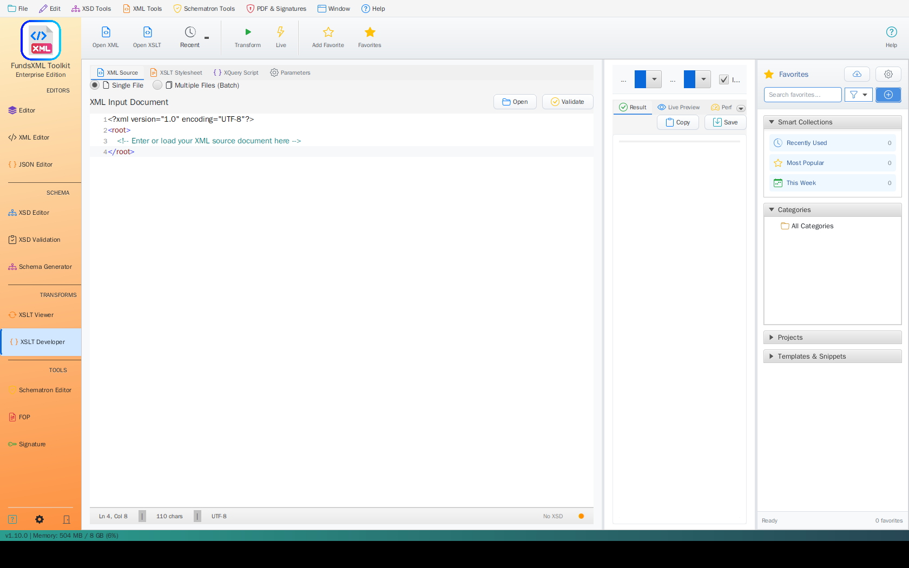

# Favorites System

> **Last Updated:** May 2026 | **Version:** 1.10.0

Save your frequently used files for quick access. The favorites system works across all editors in FreeXmlToolkit.

---

## Overview

*The Favorites panel with Smart Collections, Categories, Projects, and Templates & Snippets*

The favorites system helps you quickly access the files you use most often. Save any file as a favorite and open it with one click from any editor.

---

## Key Features

### Quick Access

| Feature | Description |
|---------|-------------|
| **Works Everywhere** | Access favorites from any editor |
| **File Recognition** | Automatically detects file types (XML, XSD, etc.) |
| **One-Click Loading** | Open files instantly |

### Organization

| Feature | Description |
|---------|-------------|
| **Custom Categories** | Create folders like "Project Files", "Templates", "Schemas" |
| **Easy Management** | Create, rename, and delete categories |
| **Mixed Files** | Store different file types in the same category |

### File Information

| Feature | Description |
|---------|-------------|
| **Custom Names** | Give favorites easy-to-remember names |
| **Descriptions** | Add notes about what each file is for |
| **File Icons** | Quickly see file types at a glance |

---

## How to Use

### Adding Files to Favorites

1. **Open a file** in any editor
2. **Click the star button** in the toolbar
3. **Fill in the form:**
   - **Name:** A descriptive name (auto-filled with filename)
   - **Category:** Choose or create a category
   - **Description:** Optional notes about the file

### Opening Favorites

1. **Click "Favorites"** in any editor toolbar
2. **Browse categories** if you have multiple
3. **Click any file** to open it immediately

### Managing Favorites

The favorites menu includes:
- **Remove missing files** - Clean up favorites that point to deleted files
- **Edit favorites** - Change names, categories, or descriptions

---

## Tips

### Organization Ideas

| Strategy | Description |
|----------|-------------|
| **By Project** | Create a category for each project |
| **By Type** | Organize by file type ("Schemas", "Templates") |
| **By Frequency** | "Daily Use", "Archive" |

### Best Practices

- Use descriptive names that make sense to you
- Add descriptions for complex files
- Clean up favorites regularly when files are moved or deleted

---

## Supported File Types

| Type | Extension |
|------|-----------|
| XML documents | .xml |
| XSD schemas | .xsd |
| Schematron rules | .sch |
| XSLT stylesheets | .xsl, .xslt |

---

## Auto-Populated Categories

Some optional features add their own files to your Favorites automatically:

| Category | Source |
|----------|--------|
| **FundsXML Examples** | Created by the [FundsXML Extensions](fundsxml-extensions.md) feature when you download FundsXML content |
| **FundsXML Schematron** | Schematron rule files downloaded by the FundsXML Extensions feature |

These categories appear only after you enable the corresponding feature.

---

## Navigation

| Previous | Home | Next |
|----------|------|------|
| [Schema Support](schema-support.md) | [Home](index.md) | [Templates](template-management.md) |

**All Pages:
** [XML Editor](xml-editor.md) | [XML Features](xml-editor-features.md) | [XSD Tools](xsd-tools.md) | [XSD Validation](xsd-validation.md) | [XSLT](xslt-viewer.md) | [FOP/PDF](pdf-generator.md) | [Signatures](digital-signatures.md) | [IntelliSense](context-sensitive-intellisense.md) | [Schematron](schematron-support.md) | [Favorites](favorites-system.md) | [Templates](template-management.md) | [Tech Stack](technology-stack.md) | [Licenses](licenses.md)
