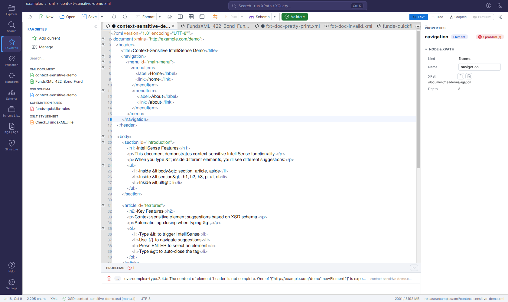

# Favorites System

> **Version:** 1.10.0

Save your frequently used files for quick access. The favorites system works across all editors in FreeXmlToolkit.

---

## Overview

*The Favorites panel with Smart Collections, Categories, Projects, and Templates & Snippets*

The favorites system helps you quickly access the files you use most often. Save any file as a favorite and open it with one click from any editor.

---

## Key Features

### Quick Access

| Feature | Description |
|---------|-------------|
| **Works Everywhere** | Access favorites from any editor |
| **File Recognition** | Automatically detects file types (XML, XSD, etc.) |
| **One-Click Loading** | Open files instantly |

### Organization

| Feature | Description |
|---------|-------------|
| **Custom Categories** | Create folders like "Project Files", "Templates", "Schemas" |
| **Easy Management** | Create, rename, and delete categories |
| **Mixed Files** | Store different file types in the same category |

### File Information

| Feature | Description |
|---------|-------------|
| **Custom Names** | Give favorites easy-to-remember names |
| **Descriptions** | Add notes about what each file is for |
| **File Icons** | Quickly see file types at a glance |

### Grouped by File Type (Unified Shell)

The **Favorites panel** in the Unified Shell (star icon in the activity bar) groups your
favorites **by file type** - for example **XML Document**, **XSD Schema**, **Schematron
Rules**, and **XSLT Stylesheet**. Each entry shows a **colored type icon**, so you can tell
the file kinds apart at a glance. Click an entry to open it as an editor tab.

Keystore and trust store files (`.jks`, `.p12`, `.pfx`, `.keystore`)
are recognized as their own **Keystore** type with a lock icon - they form their own group in the Favorites panel and feed the keystore
star menus in the Signature panel (see below).

### Star Menus in the Side Panels

Wherever a side panel asks you to pick a file, a **star button** next to the row's
**Change** link opens a quick-select menu of your matching favorites - pick one to use
it in a single click, without browsing the file system:

| Panel | Row | Favorites Listed |
|-------|-----|------------------|
| **Validation** | XSD schema | XSD favorites |
| **Validation** | Schematron rules | Schematron favorites |
| **Transform** | STYLESHEET / INPUT | XSLT / XML favorites |
| **PDF / FOP** | XML input / XSL-FO stylesheet | XML / XSLT favorites |
| **Signature** | Keystore (KEYSTORE section) | Keystore favorites |
| **Signature** | Trust store (Expert Mode) | Keystore favorites |

The menu is rebuilt each time you open it, so newly added favorites appear immediately.
When you use more than one favorites folder, the entries are grouped by folder as
submenus. While you have no matching favorites, the star button is grayed out.

---

## How to Use

### Adding Files to Favorites

1. **Open a file** in any editor
2. **Click the star button** in the toolbar
3. **Fill in the form:**
   - **Name:** A descriptive name (auto-filled with filename)
   - **Category:** Choose or create a category
   - **Description:** Optional notes about the file

### Opening Favorites

1. **Open the "Favorites" activity** from the activity bar on the left
2. **Browse categories** if you have multiple
3. **Click any file** to open it immediately

### Managing Favorites

The favorites menu includes:
- **Remove missing files** - Clean up favorites that point to deleted files
- **Edit favorites** - Change names, categories, or descriptions

---

## Tips

### Organization Ideas

| Strategy | Description |
|----------|-------------|
| **By Project** | Create a category for each project |
| **By Type** | Organize by file type ("Schemas", "Templates") |
| **By Frequency** | "Daily Use", "Archive" |

### Best Practices

- Use descriptive names that make sense to you
- Add descriptions for complex files
- Clean up favorites regularly when files are moved or deleted

---

## Supported File Types

| Type | Extension |
|------|-----------|
| XML documents | .xml |
| XSD schemas | .xsd |
| Schematron rules | .sch |
| XSLT stylesheets | .xsl, .xslt |
| Keystores / trust stores | .jks, .p12, .pfx, .keystore |

---

## Auto-Populated Categories

Some optional features add their own files to your Favorites automatically:

| Category | Source |
|----------|--------|
| **FundsXML Examples** | Sample XML documents (and the examples folder) downloaded by the [FundsXML Extensions](fundsxml-extensions.md) feature |
| **FundsXML Schema** | The active FundsXML XSD schema |
| **FundsXML Schematron** | Schematron rule files downloaded by the FundsXML Extensions feature |
| **FundsXML XSLT** | XSLT stylesheets shipped with the FundsXML examples |

These categories are created **automatically**: right after you enable
the FundsXML feature (the content downloads in the background - no manual download step
needed) and again on every application start, when they are re-registered from the on-disk
cache.

---

## Navigation

| Previous | Home | Next |
|----------|------|------|
| [Schema Support](schema-support.md) | [Home](index.md) | [Templates](template-management.md) |

**All Pages:** [Unified Shell](unified-shell.md) | [XML Editor](xml-editor.md) | [XML Features](xml-editor-features.md) | [JSON Editor](json-editor.md) | [XSD Tools](xsd-tools.md) | [Profiled XML Generation](profiled-xml-generation.md) | [XSD Validation](xsd-validation.md) | [XSLT Viewer](xslt-viewer.md) | [XSLT Developer](xslt-developer.md) | [FOP/PDF](pdf-generator.md) | [Signatures](digital-signatures.md) | [IntelliSense](context-sensitive-intellisense.md) | [Schematron](schematron-support.md) | [FundsXML Extensions](fundsxml-extensions.md) | [Favorites](favorites-system.md) | [Templates](template-management.md) | [Tech Stack](technology-stack.md) | [Security](SECURITY.md) | [Licenses](licenses.md)
