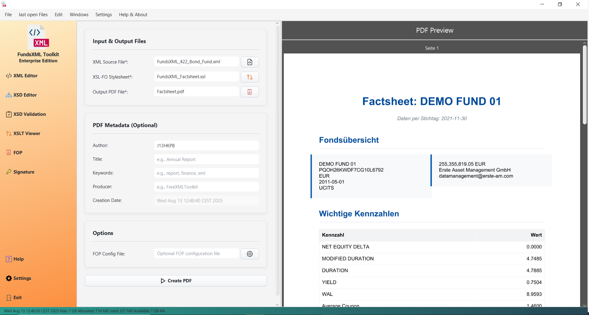

# PDF Generator (FOP)

> **Last Updated:** November 2025 | **Version:** 1.0.0

This tool lets you create professional PDF documents from your XML files.

---

## How It Works

You need two files:
1. **XML File** - Your data (the content you want in the PDF)
2. **XSL-FO Stylesheet** - A template that defines the layout and formatting

The tool combines your data with the template to generate a PDF.

*The PDF Generator interface*

---

## Step-by-Step Guide

### Step 1: Select Your Files

*Screenshot placeholder: File selection area*

1. Click the "..." button or drag-and-drop to select your **XML file**
2. Click the "..." button or drag-and-drop to select your **XSL-FO stylesheet**

### Step 2: Set PDF Properties (Optional)

*Screenshot placeholder: PDF properties panel*

Add metadata to your PDF:
- **Author** - Your name
- **Title** - Document title
- **Subject** - Brief description
- **Keywords** - Search terms

### Step 3: Choose Output Location

Select where to save your PDF and what to name it.

### Step 4: Generate the PDF

Click **"Create PDF"** and wait for the process to complete.

### Step 5: Preview

*Screenshot placeholder: Built-in PDF viewer*

The generated PDF opens automatically in the built-in viewer. You can scroll through pages to review the result.

---

## Features

| Feature | Description |
|---------|-------------|
| **Drag & Drop** | Simply drag files into the application |
| **Built-in Viewer** | Preview PDFs without leaving the app |
| **PDF Metadata** | Add author, title, and keywords |
| **Progress Indicator** | See when generation is in progress |

---

## Tips

- Make sure your XML and XSL-FO files are valid before generating
- If something goes wrong, check the error message for details
- You can create complex layouts with headers, footers, and tables

---

## Navigation

| Previous | Home | Next |
|----------|------|------|
| [XSLT Transformation](xslt-controller.md) | [Home](index.md) | [Digital Signatures](signature-controller.md) |

**All Pages:** [XML Editor](xml-controller.md) | [XML Features](xml-editor-features.md) | [XSD Tools](xsd-controller.md) | [XSD Validation](xsd-validation-controller.md) | [XSLT](xslt-controller.md) | [FOP/PDF](fop-controller.md) | [Signatures](signature-controller.md) | [IntelliSense](context-sensitive-intellisense.md) | [Schematron](schematron-support.md) | [Favorites](favorites-system.md) | [Templates](template-management.md) | [Tech Stack](technology-stack.md) | [Licenses](licenses.md)
