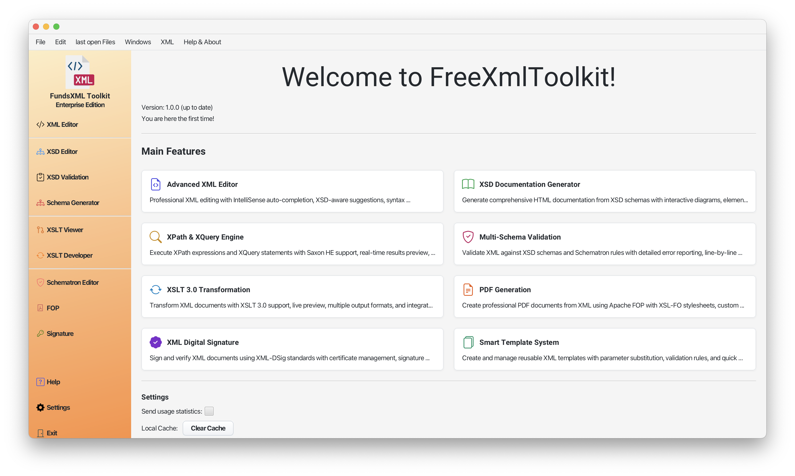

# FreeXmlToolkit Documentation

> **Last Updated:** January 2026 | **Version:** 1.2.3

## Welcome

FreeXmlToolkit is a free desktop application for working with XML files. It helps you edit, validate, transform, and secure your XML documents - all in one place.

***Screenshot: Main application window***

### What Can You Do With FreeXmlToolkit?

- **Edit XML files** with smart auto-completion and syntax highlighting
- **Validate XML** against XSD schemas to check for errors
- **Transform XML** into other formats (HTML, PDF, Text)
- **Sign XML documents** with digital certificates
- **Create business rules** with Schematron validation
- **Generate documentation** from your XSD schemas

### Works On All Platforms

FreeXmlToolkit is available for Windows, macOS, and Linux in multiple formats. Choose the one that works best for you.

#### Windows

| Format | Architecture | Description |
|--------|--------------|-------------|
| `.exe` | x64, ARM64 | **Installer** - Standard setup wizard. No admin rights required. Recommended for most users. |
| `.msi` | x64, ARM64 | **MSI Package** - For enterprise deployment and silent installation via Group Policy. |
| `.zip` | x64, ARM64 | **Portable** - No installation needed. Extract and run. Good for USB drives or restricted systems. |

#### macOS

| Format | Architecture | Description |
|--------|--------------|-------------|
| `.dmg` | Intel (x64), Apple Silicon (ARM64) | **Disk Image** - Standard macOS installation. Drag to Applications folder. |
| `.pkg` | Intel (x64), Apple Silicon (ARM64) | **Package Installer** - Guided installation wizard. Useful for managed deployments. |
| `.zip` | Intel (x64), Apple Silicon (ARM64) | **Portable** - No installation needed. Extract and run the app directly. |

#### Linux

| Format | Architecture | Description |
|--------|--------------|-------------|
| `.deb` | x64, ARM64 | **Debian Package** - For Ubuntu, Debian, Linux Mint. Install with `sudo dpkg -i` or double-click. |
| `.rpm` | x64, ARM64 | **RPM Package** - For Fedora, Red Hat, openSUSE. Install with `sudo rpm -i` or `dnf install`. |
| `.zip` | x64, ARM64 | **Portable** - No installation needed. Extract and run. Works on any Linux distribution. |

> **Note:** Choose the architecture that matches your computer:
> - **x64** - Most computers (Intel/AMD processors)
> - **ARM64** - Newer ARM-based computers (Apple Silicon Macs, Windows on ARM, Raspberry Pi 4/5)

---

## Feature Overview

### XML Editor

Edit your XML files with professional tools:

| Feature | What It Does |
|---------|--------------|
| **Auto-Completion** | Suggests valid elements and attributes as you type |
| **Syntax Highlighting** | Colors your XML for easier reading |
| **Instant Validation** | Shows errors immediately as you edit |
| **Find & Replace** | Search and replace text in your documents |
| **Code Folding** | Collapse sections to focus on what matters |

Learn more: [XML Editor Guide](xml-editor.md) | [Editor Features](xml-editor-features.md)

### JSON Editor

Edit and validate JSON files with multiple format support:

| Feature | What It Does |
|---------|--------------|
| **Multi-Format Support** | Edit JSON, JSONC (with comments), and JSON5 |
| **Tree View** | Navigate JSON structure visually |
| **JSONPath Queries** | Extract data using JSONPath expressions |
| **Schema Validation** | Validate against JSON Schema |
| **Hover Information** | See JSONPath and type info on hover |

Learn more: [JSON Editor Guide](json-editor.md)

### XSD Schema Tools

Work with XML Schema files:

| Feature | What It Does |
|---------|--------------|
| **Visual Schema Viewer** | See your schema as an interactive diagram |
| **Documentation Generator** | Create HTML documentation from schemas |
| **Sample XML Generator** | Generate valid sample XML files |
| **Schema Flattening** | Combine multiple schema files into one |

Learn more: [XSD Tools Guide](xsd-tools.md) | [XSD Validation](xsd-validation.md)

### XSLT Transformation

Convert XML into other formats:

| Feature | What It Does |
|---------|--------------|
| **Multi-Format Output** | Generate XML, HTML, Text, or JSON |
| **Live Preview** | See results as you work |
| **Modern XSLT Support** | Uses the latest XSLT 3.0 standard |
| **Multi-File Batch Processing** | Process multiple XML files with one XQuery using `collection()` |

Learn more: [XSLT Viewer](xslt-viewer.md) | [XSLT Developer](xslt-developer.md)

### PDF Generation

Create professional PDF documents:

| Feature | What It Does |
|---------|--------------|
| **XSL-FO Support** | Use XSL-FO stylesheets for formatting |
| **High-Quality Output** | Professional PDF generation |

Learn more: [PDF Generation Guide](pdf-generator.md)

### Digital Signatures

Sign and verify XML documents:

| Feature | What It Does |
|---------|--------------|
| **Create Certificates** | Generate your own signing certificates |
| **Sign Documents** | Add digital signatures to XML files |
| **Verify Signatures** | Check if signed documents are valid |

Learn more: [Digital Signatures Guide](digital-signatures.md)

### Schematron Validation

Define custom business rules:

| Feature | What It Does |
|---------|--------------|
| **Business Rules** | Validate beyond basic XML structure |
| **Visual Rule Builder** | Create rules without writing code |
| **Detailed Reports** | Get clear validation results |

Learn more: [Schematron Guide](schematron-support.md)

---

## Getting Started

### Installation

1. **Download** the installer for your operating system from the releases page
2. **Run** the installer (no administrator rights required on Windows)
3. **Launch** FreeXmlToolkit from your applications menu

### Your First Steps

1. **Open an XML file**: Use File → Open or drag a file into the window
2. **Load a schema** (optional): Click the folder icon in the XSD Schema section
3. **Start editing**: Type `<` to see auto-completion suggestions
4. **Validate**: Click "Validate" to check your document for errors

### Sample Files

The application includes example files in the `examples/` folder to help you get started:

- **xml/** - Sample XML documents
- **xsd/** - Sample XSD schemas
- **xslt/** - Sample transformation stylesheets
- **schematron/** - Sample business rules

---

## Keyboard Shortcuts

| Shortcut | Action |
|----------|--------|
| `Ctrl+S` | Save file |
| `Ctrl+Z` | Undo |
| `Ctrl+Y` | Redo |
| `Ctrl+F` | Find text |
| `Ctrl+H` | Find and replace |
| `<` | Open auto-completion |
| `Enter` | Accept suggestion |
| `Escape` | Close popup |

---

## Documentation Pages

### Feature Guides

| Page                                          | Description                              |
|-----------------------------------------------|------------------------------------------|
| [XML Editor](xml-editor.md)                   | How to edit XML files                    |
| [XML Editor Features](xml-editor-features.md) | Detailed editor features                 |
| [JSON Editor](json-editor.md)                 | How to edit JSON files                   |
| [XSD Tools](xsd-tools.md)                     | Working with XML schemas                 |
| [XSD Validation](xsd-validation.md)           | Validating XML against schemas           |
| [XSLT Viewer](xslt-viewer.md)                 | Quick XSLT transformations               |
| [XSLT Developer](xslt-developer.md)           | Full XSLT/XQuery development environment |
| [PDF Generator](pdf-generator.md)             | Creating PDF documents                   |
| [Digital Signatures](digital-signatures.md)   | Signing XML documents                    |
| [Schematron Support](schematron-support.md)   | Business rule validation                 |

### Productivity Tools

| Page | Description |
|------|-------------|
| [Auto-Completion (IntelliSense)](context-sensitive-intellisense.md) | Smart suggestions while typing |
| [Favorites System](favorites-system.md) | Quick access to your files |
| [Template Management](template-management.md) | Reusable code snippets |
| [Schema Support](schema-support.md) | Supported schema formats |

### Reference

| Page | Description |
|------|-------------|
| [Security Features](SECURITY.md) | Built-in protections against XML attacks |
| [Technology Stack](technology-stack.md) | Libraries and versions used |
| [Third-Party Licenses](licenses.md) | License information |

---

## Need Help?

- Browse the documentation pages listed above
- Check the example files included with the application
- Report issues on the project's GitHub page

---

## Quick Links

**Editors:** [XML Editor](xml-editor.md) | [XML Features](xml-editor-features.md) | [JSON Editor](json-editor.md) | [XSD Tools](xsd-tools.md) | [XSD Validation](xsd-validation.md) | [XSLT Viewer](xslt-viewer.md) | [XSLT Developer](xslt-developer.md) | [PDF/FOP](pdf-generator.md) | [Signatures](digital-signatures.md)

**Features:** [IntelliSense](context-sensitive-intellisense.md) | [Schematron](schematron-support.md) | [Schema Support](schema-support.md) | [Favorites](favorites-system.md) | [Templates](template-management.md)

**Reference:** [Security](SECURITY.md) | [Tech Stack](technology-stack.md) | [Licenses](licenses.md)
