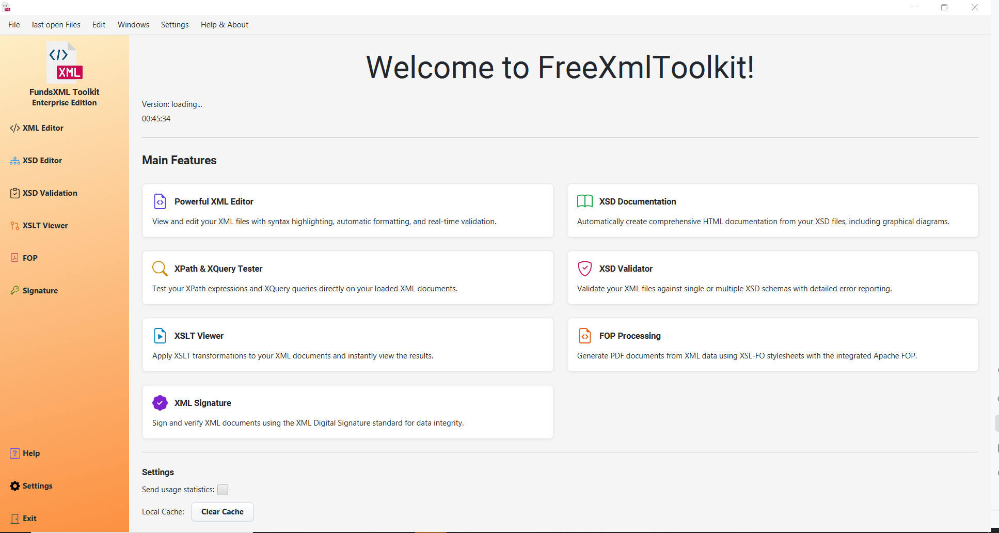

# FreeXmlToolkit Documentation

## Introduction

Welcome to the official documentation for the Free XML Toolkit.

FreeXmlToolkit is a powerful, cross-platform desktop application built with JavaFX, designed to streamline common XML-related tasks. It provides an integrated environment for editing, validating, transforming, and securing XML documents. Whether you are a developer working with complex schemas, a data analyst querying XML sources, or a document specialist generating PDFs, this toolkit offers a comprehensive set of features to boost your productivity.

This guide provides a comprehensive overview of the application's features to help you get the most out of them.

## Installation

FreeXmlToolkit is designed to be easy to install and use:

- **Windows**: No administrator rights required for installation - standard installation process
- **macOS**: Standard installation process, no special permissions needed
- **Linux**: Standard installation process, no system-level privileges required

The application can be installed in any directory on your system.

## Features

Click on any feature below to learn more about it:

-   **[XML Editor](xml-controller.md)**: A powerful editor for viewing, editing, and formatting XML files with syntax highlighting, real-time validation, and more.

-   **[XSD Tools](xsd-controller.md)**: A suite of tools for working with XML Schemas (XSD), including a graphical viewer, documentation generator, and sample XML generator.

-   **[XSD Validation](xsd-validation-controller.md)**: A dedicated tool for validating XML files against XSD schemas with detailed error reporting.

-   **[XSLT Transformation](xslt-controller.md)**: Perform XSLT transformations to convert your XML documents into other formats like HTML or text.

-   **[PDF Generator (FOP)](fop-controller.md)**: Create professional-quality PDF documents from your XML data using XSL-FO stylesheets.

- **[XML Digital Signature](signature-controller.md)**: A complete workflow for creating and validating XML digital
  signatures with both Basic Mode for common use cases and Expert Mode for advanced XML-DSig operations with full W3C
  compliance.

---

[Next: XML Editor](xml-controller.md) | [Licenses](licenses.md)
