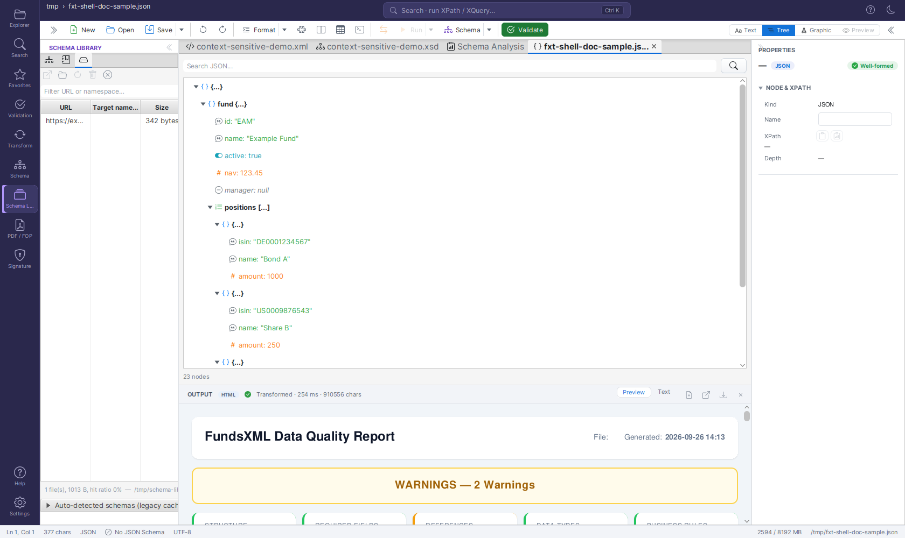

# JSON Editor

The JSON Editor provides a powerful environment for editing, validating, and querying JSON files with support for multiple JSON formats.

> **Last Updated:** August 2026 | **Version:** 2.0.1

> **Note (Phase 10c):** The standalone *JSON Editor* tab has been retired. JSON
> editing — text editing plus the tree view and validation — now lives in the
> **Unified Shell**: open a `.json` file and the JSON editor view (text/tree) is
> available there. The capabilities below are unchanged; they are now part of the
> shell rather than a dedicated sidebar tab.

## Overview

FreeXmlToolkit includes a full-featured JSON Editor that supports:
- **Standard JSON** - RFC 8259 compliant
- **JSONC** - JSON with Comments (single-line `//` and block `/* */`)
- **JSON5** - Extended JSON with trailing commas, unquoted keys, and comments


***JSON editing (text + tree view) in the Unified Shell***

## Features

### Text Editor

| Feature | Description |
|---------|-------------|
| **Syntax Highlighting** | Color-coded JSON for easy reading |
| **Auto Format** | Beautify JSON with proper indentation |
| **Minify** | Compress JSON by removing whitespace |
| **Undo/Redo** | Full undo/redo support |
| **Line Numbers** | Numbered lines for easy navigation |
| **Drag & Drop** | Drop JSON files directly into the editor |

### Tree View

The tree view provides a hierarchical view of your JSON structure:

| Feature | Description |
|---------|-------------|
| **Interactive Navigation** | Click on nodes to jump to that location in the text |
| **Expand/Collapse** | Expand or collapse nodes to focus on specific areas |
| **Search** | Search for keys or values within the tree |
| **Sync with Editor** | Synchronize selection between tree and text |
| **Type Icons** | Visual icons for objects, arrays, strings, numbers, booleans, and null |

### Hover Information

When you hover over any element in the JSON editor, you'll see:
- **JSONPath** - The full path to the current element (e.g., `$.store.book[0].title`)
- **Type** - The JSON type (object, array, string, number, boolean, null)
- **Key** - The property key name
- **Value** - A preview of the value (truncated for long values)

### JSONPath Queries

Execute JSONPath queries to extract data from your JSON documents:

| Query Example | Description |
|---------------|-------------|
| `$.store.book[*].author` | All authors in the store |
| `$..author` | All authors anywhere in the document |
| `$.store.book[?(@.price < 10)]` | Books cheaper than 10 |
| `$.store.book[0,1]` | First two books |
| `$.store.book[-1:]` | Last book |

**To run a query:**
1. Open the **Query Console** (terminal icon in the toolbar, or Ctrl+Shift+X) - with a JSON document active it evaluates JSONPath
2. Enter your JSONPath expression
3. Run it to see the results in the console's result pane

### Validation

#### Syntax Validation
Click **Validate** to check if your JSON is syntactically correct. The editor will report:
- Parse errors with line and column numbers
- Detected format (JSON, JSONC, or JSON5)

#### JSON Schema Validation
Validate your JSON against a JSON Schema:

1. Open the **Validation** activity and pick **JSON Schema…** from the panel's ⋮ (overflow) menu
2. Select your JSON Schema file
3. Run the validation (**Run Validation** in the panel, or the toolbar's **Validate** button / F8)

The validator supports:
- JSON Schema Draft 4, 6, 7
- JSON Schema 2019-09, 2020-12

## Keyboard Shortcuts

| Shortcut | Action |
|----------|--------|
| `Ctrl+N` | New JSON file |
| `Ctrl+O` | Open file |
| `Ctrl+S` | Save file |
| `Ctrl+Shift+S` | Save as |
| `Ctrl+Alt+F` | Format JSON |
| `F8` | Validate JSON |
| `Ctrl+Z` | Undo |
| `Ctrl+Y` | Redo |
| `Ctrl++` | Zoom in |
| `Ctrl+-` | Zoom out |
| `Ctrl+0` | Reset zoom |

## Supported Formats

### JSON (Standard)
```json
{
  "name": "John",
  "age": 30,
  "active": true
}
```

### JSONC (JSON with Comments)
```jsonc
{
  // This is a single-line comment
  "name": "John",
  /* This is a
     multi-line comment */
  "age": 30
}
```

### JSON5
```json5
{
  // Unquoted keys
  name: 'John',
  // Single quotes
  city: 'New York',
  // Trailing commas allowed
  items: [1, 2, 3,],
}
```

## Toolbar

> **Updated in August 2026** - JSON files use the shell's single-row editor toolbar. Related
> actions sit in **split buttons** with a visible **▾** arrow menu; see
> [Unified Shell - Toolbar](unified-shell.md#toolbar) for the full reference.

With a JSON file active, the relevant actions are:

| Button | Description |
|--------|-------------|
| **New** | Open the guided New File dialog (includes JSON) |
| **Open** | Open an existing file |
| **Save ▾** | Save the current document; the arrow menu holds **Save As…** and **Save All** |
| **Undo** / **Redo** | Undo or redo changes (icon buttons) |
| **Format ▾** | Pretty-print the JSON; the arrow menu holds **Minify** (compress by removing whitespace) |
| **Query Console** | Toggle the bottom query console - for JSON documents it runs **JSONPath** queries (icon button, Ctrl+Shift+X) |
| **Validate** | Check the JSON syntax (F8) |

Actions that do not apply to JSON (e.g. **Run** or the XSLT transform) are greyed out. The
**Tree** view is switched with the Text/Tree view switch at the right end of the toolbar.

## Tree View Icons

| Icon | Type |
|------|------|
| `{ }` | Object (blue) |
| `[ ]` | Array (green) |
| `" "` | String (gray) |
| `#` | Number (orange) |
| Toggle | Boolean (cyan) |
| `-` | Null (gray, italic) |
| `//` | Comment (green, italic) |

## Tips and Best Practices

1. **Use the Tree View** for navigating large JSON documents
2. **Enable Auto-Format** after pasting JSON from external sources
3. **Use JSONPath** to quickly extract specific data
4. **Validate against Schema** to ensure data quality
5. **Drag and Drop** files for quick access

## Related

- [XML Editor](xml-editor.md) - Edit XML files with similar features
- [XSLT Developer](xslt-developer.md) - Transform JSON to other formats

---

## Navigation

| Previous | Home | Next |
|----------|------|------|
| [Schematron](schematron-support.md) | [Home](index.md) | [XML Editor](xml-editor.md) |

**All Pages:** [Unified Shell](unified-shell.md) | [XML Editor](xml-editor.md) | [XML Features](xml-editor-features.md) | [JSON Editor](json-editor.md) | [XSD Tools](xsd-tools.md) | [Profiled XML Generation](profiled-xml-generation.md) | [XSD Validation](xsd-validation.md) | [XSLT Viewer](xslt-viewer.md) | [XSLT Developer](xslt-developer.md) | [FOP/PDF](pdf-generator.md) | [Signatures](digital-signatures.md) | [IntelliSense](context-sensitive-intellisense.md) | [Schematron](schematron-support.md) | [FundsXML Extensions](fundsxml-extensions.md) | [Favorites](favorites-system.md) | [Templates](template-management.md) | [Tech Stack](technology-stack.md) | [Security](SECURITY.md) | [Licenses](licenses.md)
