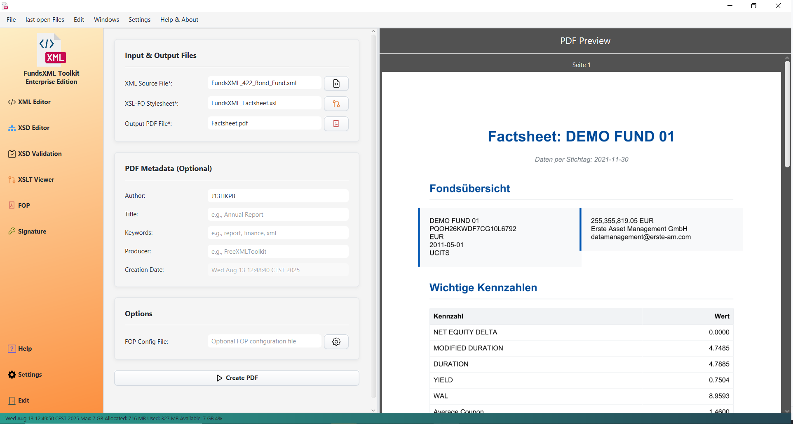

# PDF Generator (FOP)

> **Last Updated:** May 2026 | **Version:** 1.10.0

Create professional PDF documents from your XML files using Apache FOP (Formatting Objects Processor).

---

## Overview

The PDF Generator combines your XML data with an XSL-FO stylesheet to create formatted PDF documents.


*The PDF Generator interface with file selection and preview*

### How It Works

```
XML Data + XSL-FO Stylesheet = PDF Document
```

1. **XML File** - Your data (the content you want in the PDF)
2. **XSL-FO Stylesheet** - A template defining layout and formatting
3. **PDF Output** - The generated document

---

## The PDF / FOP Panel

In the [Unified Shell](unified-shell.md), open the **PDF / FOP** activity from the activity
bar. The panel is organized into three sections plus the primary action:

| Section | Contents |
|---------|----------|
| **INPUT** | The XML (follows the active editor; *Change* fixes it to a file) and the XSL-FO stylesheet |
| **METADATA** | PDF **Title**, **Author** (pre-filled from your user name), **Subject** |
| **OPTIONS** | **PDF/A-1b compliant** toggle and the **Page size** (A4/Letter · Portrait/Landscape) |
| **Generate PDF** | Asks for the output file and renders off the UI thread |

---

## Step-by-Step Guide

### Step 1: Select Your Files

1. Open your XML data file in the editor (or pick one via the INPUT section's *Change*)
2. Click **Change** on the stylesheet row to select your XSL-FO stylesheet

You can also drag and drop files directly into the application.

### Step 2: Set PDF Metadata (Optional)

Add metadata to your PDF document in the **METADATA** section:

| Field | Description |
|-------|-------------|
| **Title** | Document title |
| **Author** | Your name or organization (pre-filled from the configured user name) |
| **Subject** | What the document is about |

### Step 3: Options (Optional)

- **PDF/A-1b compliant** - produces an archival-grade PDF. The stylesheet must use
  embeddable **system fonts** (e.g. `Liberation Sans`); the PDF base-14 fonts
  (Helvetica, Times, Courier) cannot be embedded and FOP will report exactly that.
- **Page size** - passed to the stylesheet as the XSLT parameters `page-size`
  (`A4`/`Letter`) and `page-orientation` (`Portrait`/`Landscape`). Stylesheets that
  declare these parameters can switch their `fo:simple-page-master` accordingly.

### Step 3: Configure Options (Optional)

| Option | Description |
|--------|-------------|
| **FOP Config File** | Custom FOP configuration for fonts, renderers, etc. |

### Step 4: Generate the PDF

Click **Generate** or press **F5** to create the PDF.

### Step 5: Preview

The generated PDF appears in the built-in viewer on the right side. You can:
- Scroll through pages
- Review the layout
- Check formatting

---

## Favorites Integration

Save frequently used XML and XSL-FO files for quick access:

- **Add Favorite** (Ctrl+D) - Save current file to favorites
- **Favorites** (Ctrl+Shift+D) - Show/hide the favorites panel

The favorites panel appears on the right side and provides quick access to your saved files.

---

## Features

| Feature | Description |
|---------|-------------|
| **Drag & Drop** | Drop files directly into the application |
| **Built-in Viewer** | Preview PDFs without leaving the app |
| **PDF Metadata** | Add author, title, and keywords |
| **Progress Indicator** | Shows generation progress |
| **FOP Configuration** | Custom fonts and rendering options |
| **Favorites** | Quick access to frequently used files |

---

## XSL-FO Basics

XSL-FO (Extensible Stylesheet Language Formatting Objects) defines how your XML content should be formatted in the PDF.

### Simple Example

```xml
<?xml version="1.0" encoding="UTF-8"?>
<xsl:stylesheet version="1.0"
    xmlns:xsl="http://www.w3.org/1999/XSL/Transform"
    xmlns:fo="http://www.w3.org/1999/XSL/Format">

  <xsl:template match="/">
    <fo:root>
      <fo:layout-master-set>
        <fo:simple-page-master master-name="A4"
            page-height="29.7cm" page-width="21cm"
            margin="2cm">
          <fo:region-body/>
        </fo:simple-page-master>
      </fo:layout-master-set>

      <fo:page-sequence master-reference="A4">
        <fo:flow flow-name="xsl-region-body">
          <fo:block font-size="24pt" font-weight="bold">
            <xsl:value-of select="/document/title"/>
          </fo:block>
          <fo:block font-size="12pt">
            <xsl:value-of select="/document/content"/>
          </fo:block>
        </fo:flow>
      </fo:page-sequence>
    </fo:root>
  </xsl:template>

</xsl:stylesheet>
```

### Common FO Elements

| Element | Description |
|---------|-------------|
| `fo:block` | Paragraph or block of text |
| `fo:inline` | Inline text formatting |
| `fo:table` | Tables with rows and cells |
| `fo:external-graphic` | Images |
| `fo:page-number` | Current page number |
| `fo:leader` | Dots, lines, or space (for TOC) |

---

## Tips

- **Validate first** - Ensure your XML and XSL-FO files are valid before generating
- **Check error messages** - If generation fails, read the error details
- **Use the preview** - Review the PDF in the built-in viewer
- **Save to favorites** - Quick access to frequently used files
- **FOP configuration** - Use a custom config file for special fonts

---

## Keyboard Shortcuts

| Shortcut | Action |
|----------|--------|
| Ctrl+1 | Open XML file |
| Ctrl+2 | Open XSL-FO file |
| Ctrl+3 | Select output PDF |
| F5 | Generate PDF |
| Ctrl+D | Add to favorites |
| Ctrl+Shift+D | Toggle favorites |
| F1 | Help |

---

## Troubleshooting

| Problem | Solution |
|---------|----------|
| No output | Check that all three files are selected |
| Font issues | Use a custom FOP config with embedded fonts |
| Image not showing | Check image path is correct and accessible |
| Generation fails | Check the error message for details |

---

## Navigation

| Previous | Home | Next |
|----------|------|------|
| [XSLT Developer](xslt-developer.md) | [Home](index.md) | [Digital Signatures](digital-signatures.md) |

**All Pages:** [Unified Shell](unified-shell.md) | [XML Editor](xml-editor.md) | [XML Features](xml-editor-features.md) | [JSON Editor](json-editor.md) | [XSD Tools](xsd-tools.md) | [Profiled XML Generation](profiled-xml-generation.md) | [XSD Validation](xsd-validation.md) | [XSLT Viewer](xslt-viewer.md) | [XSLT Developer](xslt-developer.md) | [FOP/PDF](pdf-generator.md) | [Signatures](digital-signatures.md) | [IntelliSense](context-sensitive-intellisense.md) | [Schematron](schematron-support.md) | [FundsXML Extensions](fundsxml-extensions.md) | [Favorites](favorites-system.md) | [Templates](template-management.md) | [Tech Stack](technology-stack.md) | [Security](SECURITY.md) | [Licenses](licenses.md)
