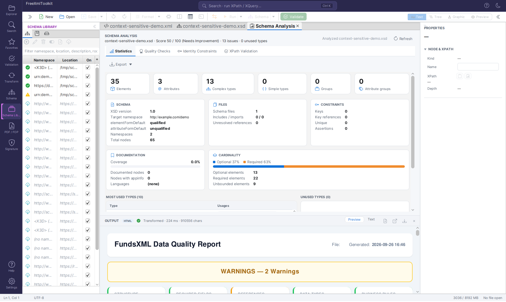
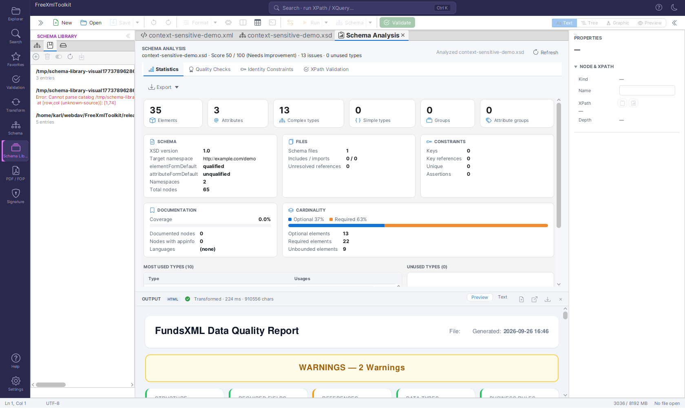
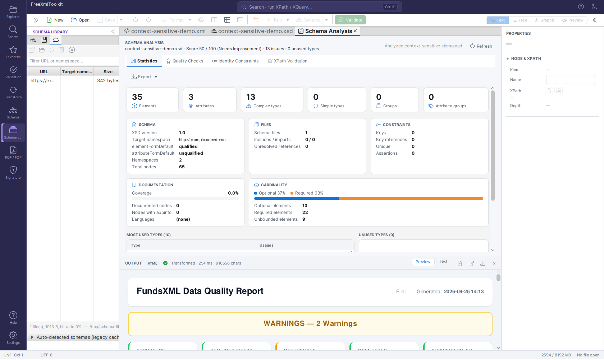

# Schema Library

> **Version:** 2.1.0

The **Schema Library** maps namespaces (and JSON `$schema` URIs) to schema files, so
documents that don't carry an explicit reference to their schema can still be validated
and get IntelliSense automatically.

---

## 1. What the Schema Library is

A **mapping** connects a namespace - or, for no-namespace XSDs, a root element name - to a
schema **location**: a local file path or an `http(s)` URL. The library draws mappings from
three sources, tried in this order:

1. **Your mappings** - entries you added yourself (the Mappings tab, source `USER`).
2. **XML catalogs** - OASIS `catalog.xml` files you registered (the Catalogs tab).
3. **Bundled standards** - 25 well-known W3C/OASIS/industry schemas shipped with the
   application (see [Bundled standards](#5-bundled-standards)).

The first match wins, and a schema you bind **manually** in the Validation panel or status
bar always takes priority over anything the library resolves.

The status bar's schema indicator shows how the active binding was resolved: a plain
`XSD: invoice.xsd` for a schema the document declared itself, `XSD: invoice.xsd (catalog)`
for one an XML catalog entry redirected to, `XSD: invoice.xsd (library)` for one a Schema
Library mapping supplied, and `XSD: invoice.xsd (manual)` for one you picked by hand; hover
the indicator for the resolved location and, for catalog/library bindings, the matched
namespace or catalog target.

The library is consulted whenever a document needs a schema but doesn't say which one:

- **XML auto-binding** - a document without `xsi:schemaLocation` /
  `xsi:noNamespaceSchemaLocation` is looked up by its root element's namespace, or (for
  no-namespace schemas) by the root element's local name.
- **`xs:import` / `xs:include` resolution** - during validation, in the XSD editor, and in
  the legacy schema parser, an import or include that can't be resolved locally is looked
  up by its namespace or system ID.
- **JSON `$schema` URIs** - a JSON document's `$schema` member that isn't a plain local/HTTP
  reference resolves through the library. Meta-schema ids (`json-schema.org/...`) are *not*
  bundled, so a JSON **schema document** still binds nothing - but you can map one yourself
  as a `USER` entry if you want schema documents validated against their dialect.
- **XSLT/XQuery `doc()` / `document()`** - a system ID the engine can't resolve directly
  falls back to the library (and catalogs) the same way.

## 2. Mappings tab


*The Mappings tab: namespace → schema entries with status icons, filter and toolbar.*

The table has one row per mapping: a status icon, **Namespace** (or `<root> (no namespace)`
for root-element mappings), **Location** and an **On** checkbox to enable/disable the row
without deleting it. Two more columns, **Kind** (`XSD` or `JSON_SCHEMA`) and **Source**
(`user`, `catalog` or `bundled`), are hidden by default to keep the table readable in the
narrow side panel - click the small menu button at the table's top-right corner to show
them. The **filter** field searches namespace, location, description and root element.
Bundled rows render in italics and can only be enabled/disabled, never edited or removed.

| Icon | Status | Meaning |
|------|--------|---------|
| ✔ | Available | The schema file exists locally, or its remote copy is already cached |
| ☁ | Not downloaded yet | A remote schema that hasn't been fetched yet |
| ⚠ | File missing | A local path that no longer exists on disk |
| ✖ | Error | The last download/verification attempt failed (hover for the error message) |

Toolbar actions: **Add mapping…** and **Edit…** open the mapping dialog (namespace,
location, kind, description, optional root element); **Remove** deletes a `USER` mapping;
**Enable / disable** toggles the **On** column for the selected row; **Add schema of
current document** prefills a new mapping from the active document's bound schema; and
**Download / verify** materializes a remote entry immediately (also clearing a remembered
failure, see [Troubleshooting](#7-troubleshooting)). **Double-clicking** a row opens the
resolved schema file as an editor tab; the context menu offers the same **Open schema**,
**Edit…**, **Remove** and a **Copy namespace** action.

## 3. XML catalogs


*The Catalogs tab: registered OASIS catalog.xml files with their entry count or error.*

The Catalogs tab registers OASIS `catalog.xml` files and supports the core catalog
elements: `system`, `public`, `uri`, `rewriteSystem`, `rewriteURI`, `nextCatalog` and
`xml:base`. Catalogs are parsed **without any network access** - `nextCatalog` is only
followed for local files, with cycle protection and a depth cap of 10.

During validation a reference is looked up by its **system identifier** first, then by its
**public identifier** (`public` entries), and finally by namespace. `public` entries are
therefore honoured for schema resolution even though they cannot be imported into the
Mappings tab (a public identifier is not a namespace).

- **Add catalog…** registers a `catalog.xml` file; **Remove** unregisters it (the file
  itself is untouched); **Enable / disable** toggles it without removing it; **Reload
  catalogs** re-parses every registered catalog (useful after editing one by hand).
- Each row shows either the parsed **entry count** or, if the file is missing/invalid, a
  red **error** message.
- **Import entries into Mappings…** converts the catalog's `system`/`uri` entries into
  regular Mappings-tab entries: a preview dialog lists what would be imported, with entries
  that already exist (by namespace/kind) shown disabled so you don't create duplicates.
- **Double-click** a catalog row to open the `catalog.xml` file itself as an editor tab.

Example catalog mapping the bundled X3D 4.0 namespace to a local copy:

```xml
<?xml version="1.0"?>
<catalog xmlns="urn:oasis:names:tc:entity:xmlns:xml:catalog">
    <uri name="http://www.web3d.org/specifications/x3d-4.0.xsd"
         uri="schemas/x3d-4.0.xsd"/>
</catalog>
```

### Try it: the shipped catalog example

`release/examples/catalog/` contains a complete, self-contained demo: an invoice schema that
imports shared types from the **non-existent** host `schemas.example.org`, a `catalog.xml`
(with `system`, `rewriteSystem`, `public` and a chained `nextCatalog`) that maps every such
reference to the local `schemas/` folder, and three instance documents — one with an
unreachable `xsi:schemaLocation`, one with only a namespace, one with deliberate errors.
Register `catalog.xml` in the Catalogs tab, open the documents and validate; the folder's
`README.md` walks through each step.

## 4. Schema cache


*The Cache tab: remote schemas downloaded and cached under `~/.freeXmlToolkit/cache/schemas`.*

Every remote schema resolved through the library (or downloaded because a document
referenced it directly) is cached under `~/.freeXmlToolkit/cache/schemas`. The Cache tab
lists **URL**, **Target namespace** and file **Size** by default, with a **filter** over
URL/namespace. Two more columns, **Downloaded** timestamp and **Hits** (access count), are
hidden by default - click the table's menu button to show them. **Open** opens the cached
file as an editor tab; **Reveal** shows the cache folder in the system file manager;
**Refresh** re-downloads the selected entry; **Delete** removes one cached file
(re-downloaded on next use); **Clear** wipes the entire cache. A footer line reports the
total file count, total size and the cache hit ratio.

A collapsible **"Auto-detected schemas (legacy cache)"** group underneath holds the older,
separate cache of schemas auto-downloaded from `xsi:schemaLocation` references (one folder
per schema URL, keyed by an MD5 hash). It is read-only except for a **Clear** button; those
files are simply re-downloaded the next time a document references them.

## 5. Bundled standards

FreeXmlToolkit ships a curated list of 25 well-known namespace → schema mappings so common
standards validate out of the box, without you having to hunt down and register the schema
yourself. Bundled entries are grouped by family:

- **W3C core** - `xml` (XML namespace attributes), `XMLSchema` (schema for schemas),
  `xmldsig-core`, `xmlenc-core`, `XLink` 1.1, `XInclude` 1.0, XSLT 2.0/3.0 stylesheet schema.
- **Markup** - XHTML 1.0 Strict, SVG 1.1, MathML 3.
- **Web services** - SOAP 1.1 and 1.2 envelopes, WSDL 1.1.
- **3D graphics** - X3D 3.0 through 4.0. X3D documents carry **no namespace** (they point at
  their schema with `xsi:noNamespaceSchemaLocation`), so these are no-namespace entries:
  **4.0** and **3.3** additionally declare the root element `X3D` and are found by
  auto-binding (4.0 is listed first and therefore wins); 3.0-3.2 are reached by their
  **location** whenever a document or an `xs:import` names that URL.
- **Finance/industry** - FundsXML 4, XBRL 2.1 (instance + linkbase), UBL 2.1 (Invoice,
  Order, CreditNote), UN/CEFACT Cross Industry Invoice D16B (ZUGFeRD/Factur-X).

The JSON Schema **meta-schemas** are deliberately *not* bundled: `$schema` in a JSON schema
document declares its dialect, not a validation binding, and a bundled meta-schema mapping
would bind every schema document to it. Add one as your own mapping if you want that.

The list itself lives in `src/main/resources/schema-library/bundled.json`. Bundled entries
are **not downloaded at install time** - like any remote mapping, the actual schema file is
fetched into the cache the first time it's needed, so a bundled entry needs network access
once before it shows the ✔ **Available** status.

**Offline rule:** a remote library entry is downloaded on first use only when remote
downloads are permitted. Starting the application with `-Dfxt.schema.namespaceFallback=false`
turns them off (the test suite does this) - resolution then uses **local files and
already-cached copies only**, and every other entry is simply a miss. Local entries and
cached entries always resolve, with or without network access.

## 6. Settings

The **SCHEMA LIBRARY** card in Settings (gear icon at the bottom of the activity bar) holds:

- **"Use the Schema Library to bind schemas automatically"** - controls **automatic binding
  in the editor** only (default **on**): the XML root-namespace / root-element lookup and the
  JSON `$schema` lookup described in [§1](#1-what-the-schema-library-is). Turning it off means
  a document without its own schema reference stays unbound. It does **not** switch the
  library off: the resolver hooks - `xs:import` / `xs:include` resolution, XML catalogs and
  XSLT/XQuery `doc()` / `document()` - keep consulting the library either way, and manual
  bindings are unaffected.
- The **library file** location, `~/.freeXmlToolkit/schema-library.json`, shown for
  reference.
- A **"Manage schema cache…"** link that jumps straight to the Schema Library activity's
  Cache tab. The same link also appears in the **TEMP & CACHE** card.

## 7. Troubleshooting

**A document isn't binding a schema I expect:**

- Check the namespace actually matches - a typo or a trailing slash difference means no
  match. For no-namespace XSDs, the library matches by root element name instead.
- Make sure the mapping's **On** checkbox is checked; a disabled entry (including a
  disabled catalog) is skipped during resolution.
- Confirm the **"Use the Schema Library to bind schemas automatically"** setting is on (it
  gates editor auto-binding only, not `xs:import`/catalog resolution).
- If the document already has a manually bound schema (or an `xsi:schemaLocation`), that
  wins - the library is only consulted when there's no other reference.

**A catalog shows a red error:** the file is missing, unreadable, or not well-formed XML.
Fix the file and click **Reload catalogs**, or check the `nextCatalog` chain - only local
files are followed, and the depth is capped at 10.

**A download keeps failing / the status stays ✖ error:** hover the status icon for the
error message. A failed download is remembered for **10 minutes** to avoid hammering an
unreachable server; use **Download / verify** on the Mappings tab to retry immediately.

**A remote mapping never leaves ☁ "Not downloaded yet":** remote downloads may be turned
off (`-Dfxt.schema.namespaceFallback=false`); with them off only local and already-cached
entries resolve. Use **Download / verify** to fetch one explicitly.

**"URL is not allowed" when adding a mapping:** the location resolves to a private or
internal network address (loopback, link-local, RFC 1918 ranges, etc.) and is rejected as
unsafe - remote schema locations must be reachable public URLs.

---

## Navigation

| Previous | Home | Next |
|----------|------|------|
| [Schema Support](schema-support.md) | [Home](index.md) | [XSLT Viewer](xslt-viewer.md) |

**All Pages:** [Unified Shell](unified-shell.md) | [XML Editor](xml-editor.md) | [XML Features](xml-editor-features.md) | [JSON Editor](json-editor.md) | [XSD Tools](xsd-tools.md) | [Profiled XML Generation](profiled-xml-generation.md) | [XSD Validation](xsd-validation.md) | [Schema Library](schema-library.md) | [XSLT Viewer](xslt-viewer.md) | [XSLT Developer](xslt-developer.md) | [FOP/PDF](pdf-generator.md) | [Signatures](digital-signatures.md) | [IntelliSense](context-sensitive-intellisense.md) | [Schematron](schematron-support.md) | [FundsXML Extensions](fundsxml-extensions.md) | [Favorites](favorites-system.md) | [Templates](template-management.md) | [Tech Stack](technology-stack.md) | [Security](SECURITY.md) | [Licenses](licenses.md)
