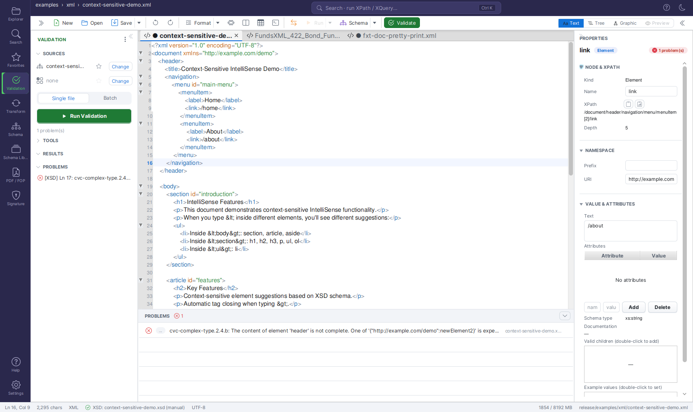
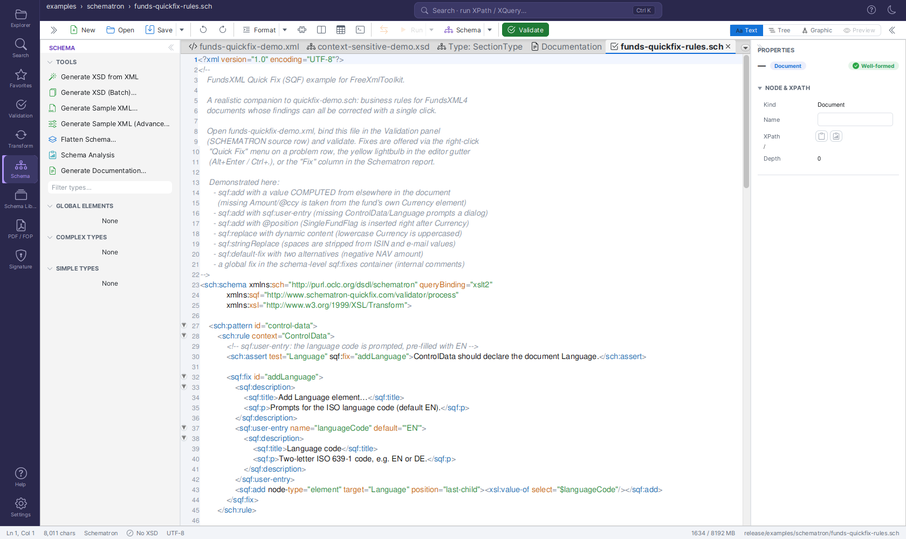

# Schema Support

> **Version:** 2.0.1

FreeXmlToolkit supports different schema formats for validating your XML files. This page explains what's supported and what isn't.

---

## Overview

Schemas define rules for your XML documents - what elements are allowed, what order they should be in, and what values they can contain.

---

## Supported Schema Formats

### XSD (XML Schema Definition)

*The Validation panel - an XML document checked against its bound XSD schema*

**Full Support** - The main schema format used for XML validation.

| Feature | Description |
|---------|-------------|
| **Validation** | Check if XML files follow schema rules |
| **Auto-Completion** | Get suggestions while typing based on schema |
| **Auto-Detection** | Schema is found automatically from XML files |
| **Documentation** | Generate readable documentation from schemas |
| **Sample Data** | Create test XML files from schema definitions |
| **Visual Display** | See schema structure as diagrams |

**What You Can Define:**
- Elements and their order
- Required and optional fields
- Data types (text, numbers, dates)
- Allowed values
- Documentation

### Schematron

*A Schematron rules file (.sch) open as a normal document in the editor*

**Business Rules** - For validation rules that go beyond structure.

| Feature | Description |
|---------|-------------|
| **Custom Rules** | Write your own validation logic |
| **Real-time Checking** | See errors as you edit |
| **Clear Messages** | Define helpful error messages |
| **Flexible Rules** | Apply different rules in different situations |

**Best For:**
- "If field A is filled, then field B must also be filled"
- "The total must equal the sum of all items"
- "Each ID must be unique in the document"

---

## Not Supported

### DTD (Document Type Definition)

**Not Supported** - This older format is not available in FreeXmlToolkit.

| Reason | Alternative |
|--------|-------------|
| Less flexible than XSD | Convert your DTD to XSD |
| Limited features | Use XSD for the same rules |
| No namespace support | XSD handles namespaces |

### RelaxNG

**Not Supported** - This alternative schema format is not available.

| Reason | Alternative |
|--------|-------------|
| Less widely used | Use XSD instead |
| Focus on standards | Schematron for business rules |

---

## How to Use Schemas

### Loading a Schema

1. **Automatic:** Open an XML file that references a schema
   (`xsi:schemaLocation` / `xsi:noNamespaceSchemaLocation`) - it is bound automatically
2. **Manual:** Open the **Validation** panel and click **Change** on the XSD row - or click
   the **XSD indicator** in the status bar and pick an `.xsd` file
3. **Drag & Drop:** Drop an `.xsd` file onto the Validation panel's XSD row or onto the
   status bar's XSD indicator

A **Schematron** rules file binds the same way via the Validation panel's Schematron row.
Schematron files themselves (`.sch`) open as normal documents in the editor.

### Validation Workflow

1. Open your XML file
2. Bind (or auto-detect) the schema
3. Click **Run Validation** in the Validation panel (or press **F8**) - or enable
   **Validate while typing** to check continuously
4. Problems appear in the **PROBLEMS** list, each tagged with its source (XSD, Schematron,
   Well-formed); click one to jump to the problem location
5. Fix issues and re-validate

### Using Both XSD and Schematron

For the best validation coverage:
- Use **XSD** for structure (elements, order, types)
- Use **Schematron** for business rules (relationships, conditions)

---

## Tips

| Tip | Description |
|-----|-------------|
| **Start with XSD** | XSD handles most validation needs |
| **Add Schematron later** | For business rules XSD can't express |
| **Use auto-detection** | Let the app find your schema automatically |
| **Check error messages** | They tell you exactly what's wrong |

---

## Navigation

| Previous | Home | Next |
|----------|------|------|
| [Schematron](schematron-support.md) | [Home](index.md) | [Favorites](favorites-system.md) |

**All Pages:** [Unified Shell](unified-shell.md) | [XML Editor](xml-editor.md) | [XML Features](xml-editor-features.md) | [JSON Editor](json-editor.md) | [XSD Tools](xsd-tools.md) | [Profiled XML Generation](profiled-xml-generation.md) | [XSD Validation](xsd-validation.md) | [XSLT Viewer](xslt-viewer.md) | [XSLT Developer](xslt-developer.md) | [FOP/PDF](pdf-generator.md) | [Signatures](digital-signatures.md) | [IntelliSense](context-sensitive-intellisense.md) | [Schematron](schematron-support.md) | [FundsXML Extensions](fundsxml-extensions.md) | [Favorites](favorites-system.md) | [Templates](template-management.md) | [Tech Stack](technology-stack.md) | [Security](SECURITY.md) | [Licenses](licenses.md)
