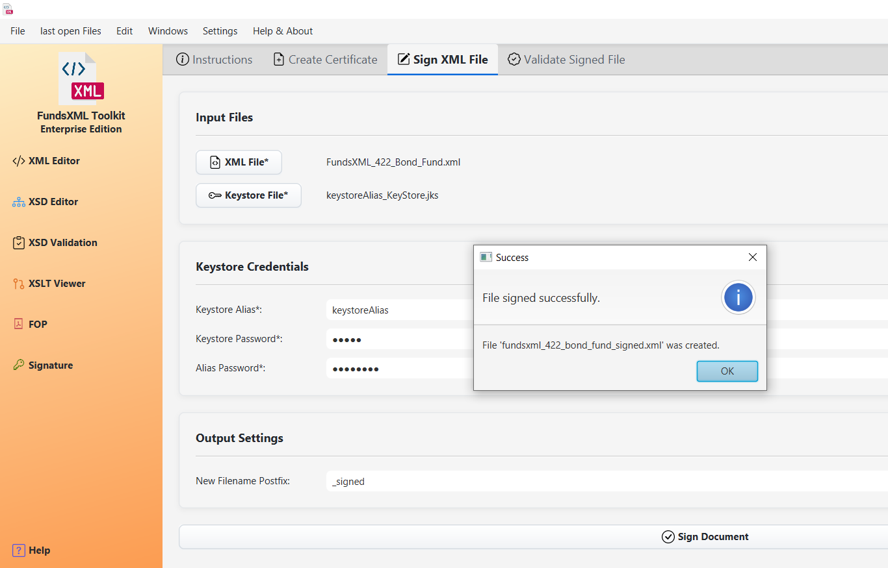

# XML Signature

This part of the application provides tools for creating digital signatures for your XML files. A digital signature acts like a tamper-proof seal, ensuring that the document is authentic and has not been altered since it was signed.

## 1. Create a New Certificate

Before you can sign a document, you need a digital certificate, which is like a digital ID card. This tool helps you create one.

-   **Certificate Details:** You can fill in your personal or organizational details (like name, organization, country) to be included in the certificate.
-   **Keystore:** The certificate is stored in a secure, password-protected file called a Keystore (`.jks` file). You will need to set a password for the keystore itself and another password for your specific certificate (alias) within it.
-   **Save:** The tool will generate and save the keystore file for you to use later.

## 2. Sign an XML Document

This feature applies a digital signature to an XML file.

-   **File Selection:** You need to select two files:
    1.  The **XML file** you want to sign.
    2.  The **Keystore file** (`.jks`) that contains your certificate.
-   **Credentials:** You must provide the passwords for the keystore and the specific certificate (alias) you want to use for signing.
-   **Output File:** The tool will create a new XML file with the digital signature embedded inside it. You can specify a suffix for the new file\\'s name (e.g., `_signed`).

## 3. Validate a Signature

This feature allows you to check if a signed XML document is valid.

-   **Load Signed File:** Simply load the XML file that contains a digital signature.
-   **Validation Check:** The tool will analyze the signature to verify two things:
    1.  **Authenticity:** That the signature was created by the certificate holder.
    2.  **Integrity:** That the document has not been changed in any way since it was signed.
-   **Result:** You will receive a clear message indicating whether the signature is **Valid** or **Invalid**.

### General Features

-   **File Loading:** You can easily load XML and Keystore files using either file dialogs or by dragging and dropping them from your computer onto the application.
-   **User Feedback:** The application provides clear pop-up messages to inform you of success or any errors that occur during the process.

---

[Previous: PDF Generator (FOP)](fop-controller.md) | [Home](index.md)
