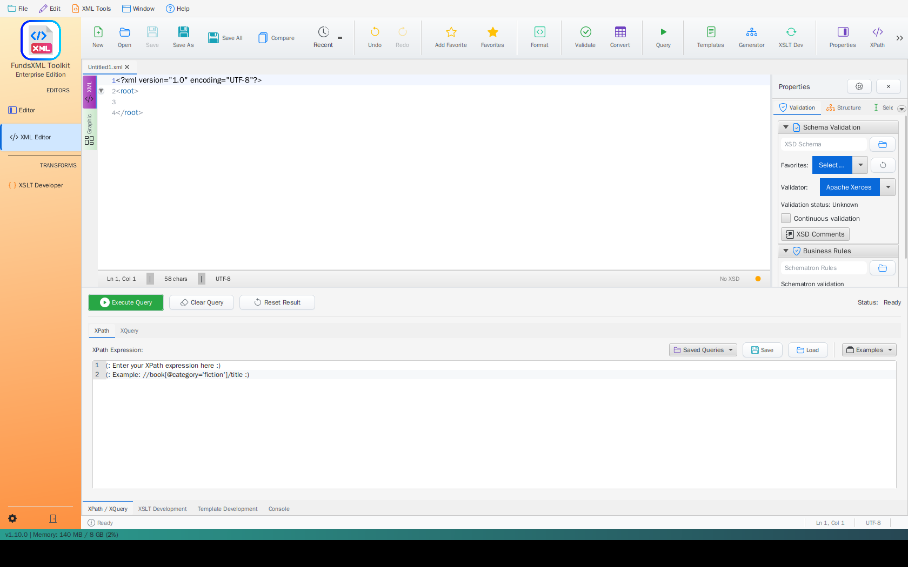

# Template Management

> **Last Updated:** May 2026 | **Version:** 1.10.0

Create and manage reusable XML templates, XPath snippets, and code patterns to speed up your work.

---

## Overview


*The XML Editor with the Template Development panel and the Templates toolbar action*

Templates let you create reusable document structures with placeholders for content that changes. Instead of typing the same XML structure repeatedly, save it as a template and fill in the blanks each time.

---

## Key Features

### Template Creation

| Feature | Description |
|---------|-------------|
| **Visual Editor** | Create templates without writing code |
| **Parameters** | Define placeholders that get filled in later |
| **Preview** | See what your template will produce |
| **Categories** | Organize templates into groups |

### XPath Snippets

Pre-built XPath expressions for common tasks:
- Find elements with specific attributes
- Search for text content
- Select elements by position

---

## Template Types

### XML Document Templates

Create complete document structures with placeholders:

```xml
<?xml version="1.0" encoding="UTF-8"?>
<${rootElement}>
    <header>
        <title>${documentTitle}</title>
        <version>${version}</version>
        <created>${createdDate}</created>
    </header>
    <content>
        ${contentPlaceholder}
    </content>
</${rootElement}>
```

The parts in `${}` are parameters you fill in when using the template.

### Schematron Rule Templates

Ready-to-use validation patterns:

```xml
<rule context="${contextPath}">
    <assert test="${testExpression}">
        ${errorMessage}
    </assert>
</rule>
```

---

## How to Use

### Creating a New Template

1. Open **Template Manager** from the toolbar
2. Click **"New Template"**
3. Choose template type
4. Write your template with `${parameter}` placeholders
5. Define what each parameter means
6. Test with sample values
7. Save with a descriptive name

### Using a Template

1. Open the template library in any editor
2. Browse or search for the template you need
3. Select the template
4. Fill in the parameter values
5. Insert the generated content

### Managing Templates

| Action | Description |
|--------|-------------|
| **Edit** | Modify existing templates |
| **Duplicate** | Copy a template to create a variation |
| **Delete** | Remove templates you no longer need |
| **Export** | Share templates with others |
| **Import** | Add templates from others |

---

## Parameter Types

| Type | Description | Example |
|------|-------------|---------|
| **Text** | Any text value | Document title |
| **Number** | Numeric values | Version number |
| **Date** | Date values | Creation date |
| **Yes/No** | True or false | Include header? |
| **Choice** | Pick from a list | Document type |

---

## Keyboard Shortcuts

| Shortcut | Action |
|----------|--------|
| `Ctrl+T` | Open Template Manager |
| `Ctrl+Shift+T` | Insert Template |
| `F5` | Refresh Template Library |

---

## Tips

### Template Design

| Tip | Description |
|-----|-------------|
| **Keep it simple** | Smaller templates are more reusable |
| **Clear names** | Use descriptive parameter names |
| **Default values** | Provide sensible defaults to speed up usage |
| **Add descriptions** | Help yourself remember what each template does |

### Organization

| Tip | Description |
|-----|-------------|
| **Use categories** | Group related templates together |
| **Consistent naming** | Follow a naming pattern |
| **Document templates** | Add notes about when to use each one |

---

## Navigation

| Previous | Home | Next |
|----------|------|------|
| [Favorites](favorites-system.md) | [Home](index.md) | [Tech Stack](technology-stack.md) |

**All Pages:** [Unified Shell](unified-shell.md) | [XML Editor](xml-editor.md) | [XML Features](xml-editor-features.md) | [JSON Editor](json-editor.md) | [XSD Tools](xsd-tools.md) | [Profiled XML Generation](profiled-xml-generation.md) | [XSD Validation](xsd-validation.md) | [XSLT Viewer](xslt-viewer.md) | [XSLT Developer](xslt-developer.md) | [FOP/PDF](pdf-generator.md) | [Signatures](digital-signatures.md) | [IntelliSense](context-sensitive-intellisense.md) | [Schematron](schematron-support.md) | [FundsXML Extensions](fundsxml-extensions.md) | [Favorites](favorites-system.md) | [Templates](template-management.md) | [Tech Stack](technology-stack.md) | [Security](SECURITY.md) | [Licenses](licenses.md)
