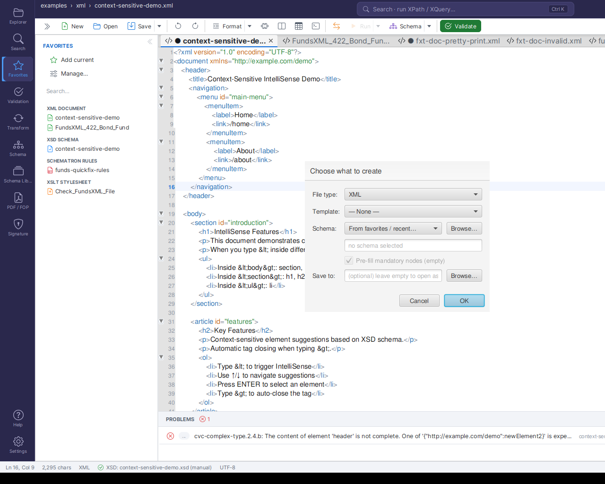

# Template Management

> **Version:** 2.1.0

Reusable XML snippets and document skeletons: insert them into the document you are editing, or
start a new file from one. Templates can carry `${parameter}` placeholders that you fill in when
the template is used.

!!! tip "Templates power the New File dialog"
    Templates also appear in the guided **New File** dialog (filtered to the matching file type),
    so a brand-new document can start from a template instead of a blank page. You manage your
    own templates in the **Settings → TEMPLATES** card. See
    [Creating templates for the New File dialog](#creating-templates-for-the-new-file-dialog).

---

## Overview


*Templates in the Unified Shell: the Insert Template dialog and the TEMPLATES settings card*

Templates let you keep document structures you type again and again - a SOAP envelope, a
Maven POM, a CDATA section, a Schematron rule - and drop them into the editor with a few clicks.
The parts written as `${name}` are parameters: when you use a template that has parameters,
FreeXmlToolkit asks for their values first and then inserts the finished text.

There are two places where templates are used:

| Where | What it does |
|-------|--------------|
| **Insert Template** (toolbar button or **Ctrl+T**) | Inserts a template at the caret of the active document |
| **New File** dialog (toolbar **New** or **Ctrl+N**) | Creates a new document from a template of the selected file type |

---

## Inserting a Template

1. Open (or create) the document you want to edit and place the caret where the snippet should go.
2. Press **Ctrl+T** or click **Insert Template** on the editor toolbar.
3. The **Insert Template** dialog lists all templates as *name — category*; select one to see its
   content in the **Preview** box. **OK** is enabled once a template is selected.
4. If the template has parameters, a second dialog asks for each value (defaults are pre-filled
   where the template defines them). Cancelling this dialog inserts nothing.
5. The rendered text is inserted at the caret. Undo (**Ctrl+Z**) removes it again in one step.

The dialog is only available while a document is open; with no active document the shortcut does
nothing.

---

## Built-in Templates

FreeXmlToolkit ships with a set of ready-made templates, grouped by category, for example:

| Category | Examples |
|----------|----------|
| **Basic** | `simple-element`, `element-with-attributes`, `cdata-section`, `xml-comment` |
| Web services | `soap-envelope`, `rest-response`, `wsdl-service` |
| Build & configuration | `spring-config`, `maven-pom`, `api-documentation` |
| Industry | `financial-transaction`, `patient-record`, `vehicle-information`, `government-form` |
| Schema | `xsd-schema` |

Built-in templates cannot be edited, but you can create your own with the same content and change
it freely.

---

## Managing Your Own Templates

Your templates are managed in **Settings** (gear icon at the bottom of the activity bar), in the
**TEMPLATES** card.

### Set the templates folder

1. In the **TEMPLATES** card, use **Browse…** next to **Templates directory** to choose the folder
   where your templates are kept (leave it empty for the default location,
   `~/.freeXmlToolkit/templates`, or the bundled `examples/templates` folder when it exists).
2. The change takes effect right away - no restart needed.

### Add or change a template

Below the folder you find the list **Your templates** with three buttons:

| Button | Action |
|--------|--------|
| **New** | Opens the **New Template** dialog. Fill in **Name**, **Category**, **Description**, **File type** and **Content**. |
| **Edit** | Opens the selected template in the **Edit Template** dialog to change any of its fields. |
| **Delete** | Removes the selected template. |

Each template is saved as a `.template` file in the templates folder, so you can copy those files
to another machine or share them with colleagues. The **File type** you pick decides where the
template shows up in the New File dialog: it appears only when that same file type is selected.

---

## Creating templates for the New File dialog

1. Click **New** on the toolbar (**Ctrl+N**), or **New file** in the Explorer panel.
2. Choose the **File type** that matches your template.
3. Open the **Template** list - your templates appear alongside the built-in ones.
4. Select it; if it has parameters, you are prompted to fill them in.
5. Optionally choose a **Save to** location, then confirm to create the document.

See [New File dialog](unified-shell.md#new-file-dialog) for the other options of that dialog.

---

## Placeholders and Parameters

Write placeholders as `${name}` anywhere in the template content:

```xml
<?xml version="1.0" encoding="UTF-8"?>
<${rootElement}>
    <header>
        <title>${documentTitle}</title>
        <version>${version}</version>
    </header>
</${rootElement}>
```

When the template is used, every `${name}` is replaced by the value you enter. A placeholder can
be used several times (`${rootElement}` above appears twice and is filled in once).

Templates created with the built-in library or programmatically can declare typed parameters
(string, integer, decimal, boolean, date, email, URL, or a list of allowed values); the parameter
dialog validates the input accordingly and offers default values where defined.

---

## Keyboard Shortcuts

| Shortcut | Action |
|----------|--------|
| `Ctrl+T` | Insert Template into the active document |
| `Ctrl+N` | New File dialog (choose a template there) |

---

## Tips

| Tip | Description |
|-----|-------------|
| **Keep it simple** | Smaller templates are more reusable |
| **Clear names** | Use descriptive parameter names such as `${customerId}` instead of `${x}` |
| **Use categories** | The Insert Template dialog shows *name — category*, so consistent categories make long lists scannable |
| **One file type per template** | Pick the File type carefully - it controls where the template is offered in the New File dialog |

---

## Navigation

| Previous | Home | Next |
|----------|------|------|
| [Favorites](favorites-system.md) | [Home](index.md) | [Tech Stack](technology-stack.md) |

**All Pages:** [Unified Shell](unified-shell.md) | [XML Editor](xml-editor.md) | [XML Features](xml-editor-features.md) | [JSON Editor](json-editor.md) | [XSD Tools](xsd-tools.md) | [Profiled XML Generation](profiled-xml-generation.md) | [XSD Validation](xsd-validation.md) | [XSLT Viewer](xslt-viewer.md) | [XSLT Developer](xslt-developer.md) | [FOP/PDF](pdf-generator.md) | [Signatures](digital-signatures.md) | [IntelliSense](context-sensitive-intellisense.md) | [Schematron](schematron-support.md) | [FundsXML Extensions](fundsxml-extensions.md) | [Favorites](favorites-system.md) | [Templates](template-management.md) | [Tech Stack](technology-stack.md) | [Security](SECURITY.md) | [Licenses](licenses.md)
