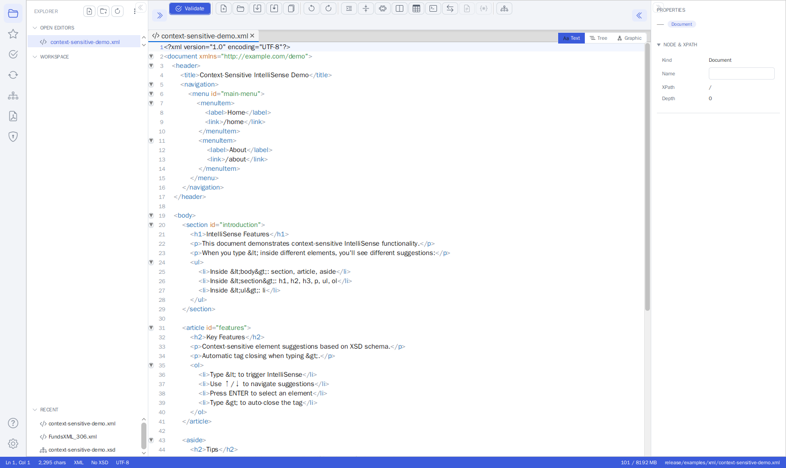
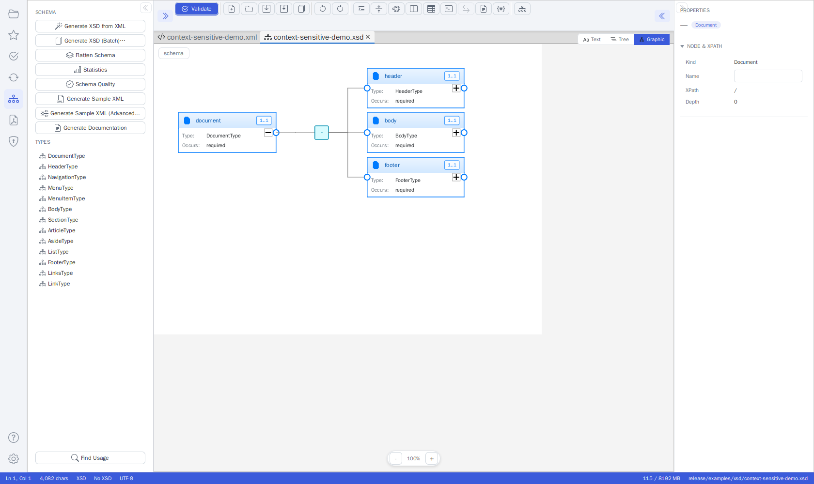
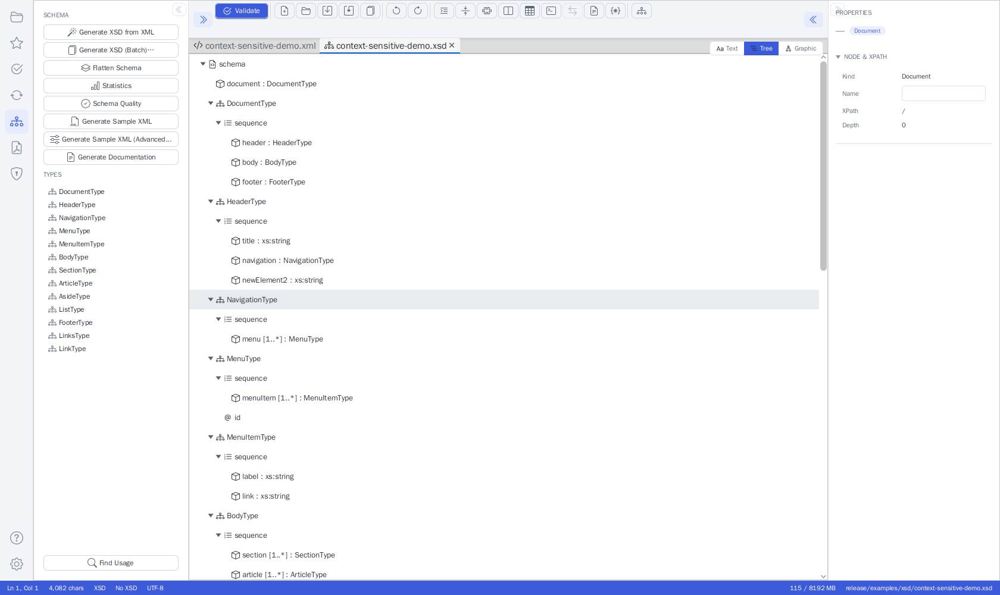
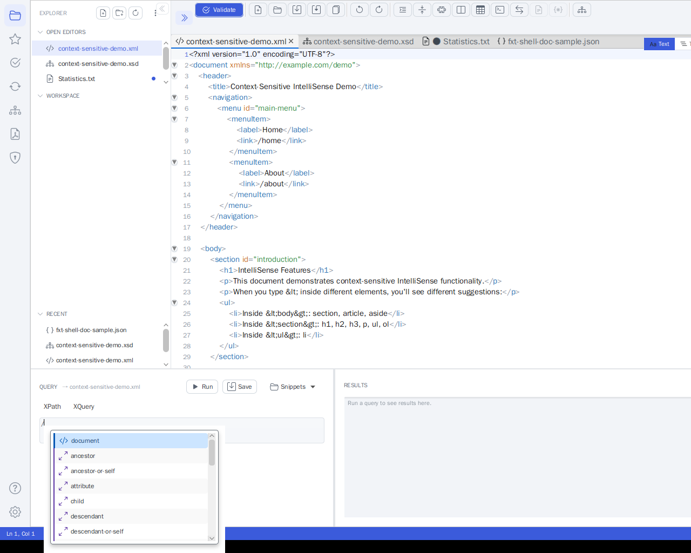

# Unified Shell

> The application opens directly into the **Unified Shell** - one workspace that
> combines XML, XSD, XSLT, Schematron and JSON editing with all the validation,
> transformation, signing and documentation tools. The separate legacy tabs have
> been consolidated here.

## Overview

The Unified Shell is the single workspace for everything FreeXmlToolkit does. Instead of
switching between separate editor pages, you open files as tabs in the central **editor
host** and reach every tool through the **activity bar** on the left. You can work with an
XML file next to its XSD schema, XSLT stylesheets and Schematron rules at the same time.

*The Unified Shell: activity bar (left), Explorer side panel, editor host with an XML file
(Text/Tree/Graphic view toggle), the Properties inspector (right) and the status bar.*

### Layout

| Area | Purpose |
|------|---------|
| **Activity bar** (far left) | Switch tools / side panels: Explorer, Transform, Validation, Signature, Type Library, FOP/PDF, Favorites, Settings, Help. **Always visible** - it cannot be collapsed. (Settings opens as a full page in the editor area - see [Settings Page](#settings-page).) |
| **Side panel** | The panel for the selected activity (e.g. the Transform panel, the Validation panel). **Collapsible** (see [Collapsing the side panels](#collapsing-the-side-panels)). |
| **Editor host** (center) | Tabs of open documents, each with three view modes - Text, Tree, Graphic (see [View Modes](#view-modes)). |
| **Inspector** (right) | View **and edit** the selected node's properties from any view. **Collapsible** (see [Collapsing the side panels](#collapsing-the-side-panels)). |
| **Status bar** (bottom) | Caret position, validation status and a memory indicator. |

#### Collapsing the side panels

Both the **left side panel** and the **right Properties inspector** can be collapsed to give the
editor more room - the activity bar always stays visible.

- **Collapse**: click the discreet double-chevron at the panel's inner edge (`<<` on the left
  panel, `>>` on the inspector). The panel is hidden completely.
- **Re-open**: click the matching toggle button in the editor toolbar (left-most toggle for the
  side panel, right-most for the inspector) - the same mechanism on both sides. Selecting any
  activity from the activity bar also re-opens the left side panel.
- The collapsed/expanded state is **remembered across restarts** and can also be changed under
  **Settings → General** ("Show left side panel" / "Show Properties (inspector) panel").

### Key Features

- **Multi-tab editing** - Open multiple files of different types in one view
- **Automatic file type detection** - Files are recognized by extension (.xml, .xsd, .xsl, .sch, .json)
- **View modes per document** - Text, Tree and Graphic, all over one shared model (see [View Modes](#view-modes))
- **Inspector editing everywhere** - edit node properties from the Text, Tree and Graphic views, not just one
- **Integrated XPath/XQuery** - a bottom [Query Console](#query-console) queries the active
  XML/JSON file right from the editor (Ctrl+Shift+X)
- **Editor toolbar actions** - run [Validate, Transform, Generate Documentation and Open Type
  Editor](#editor-toolbar-document-actions) for the active document without switching activities
- **Search & Replace** - Ctrl+F / Ctrl+H across the editor
- **Favorites** - Quick access to frequently used files

## Getting Started

1. The Unified Shell opens automatically on startup.
2. Use the **Explorer** activity (or **File → Open**) to open files; **File → New** creates a new file.
3. Files open as tabs in the editor host - switch tabs by clicking their headers, and switch view modes (Text / Tree / Graphic) with the segmented view switch.

## View Modes

> **Updated in June 2026** - There are now exactly **three** view modes - **Text**, **Tree**, and
> **Graphic** - each with its own icon in the segmented view switch. The former separate **Grid**
> mode has been merged into **Graphic**.

Every document tab offers the same three view modes:

| Mode | What it shows |
|------|---------------|
| **Text** | Source code editing with syntax highlighting |
| **Tree** | The document as a hierarchical tree |
| **Graphic** | A visual editor that depends on the document type: for **XML**, **XSLT**, and **Schematron** files it shows the editable XMLSpy-style **grid**; for **XSD** files it shows the **schema diagram** |

All views share one in-memory model per document, so edits and Undo/Redo history are preserved
when you switch views.

### The Grid (Graphic view for XML)

When an XML-instance document (XML, XSLT, or Schematron) is in the **Graphic** view, the editor
shows the editable grid:

- A **header strip** at the top reads *"Grid view · nested · repeating elements as embedded
  grids"* and offers a **Collapse all** button that folds every container at once.
- Rows with a simple value are marked with a **`{}`** marker so you can tell value rows from
  containers at a glance.
- Collapsed containers show a **"collapsed"** hint, so you always know there is hidden content.
- Repeating elements are rendered as **embedded grids** (tables inside the row).

## Supported File Types

| Type | Extensions | Features |
|------|-----------|----------|
| **XML** | .xml | Text + graphic view, XSD/Schematron linking, IntelliSense, continuous validation |
| **XSD** | .xsd | Text + graphic view, Type Library, Type Editor, Schema Analysis, Documentation, Sample Data, Flatten |
| **XSLT** | .xsl, .xslt | XSLT editor + XML input + output preview, live transform, parameters, performance metrics |
| **Schematron** | .sch | Code editor + Visual Builder + Tester + Documentation Generator |
| **JSON** | .json, .jsonc, .json5 | Text + tree view, JSONPath queries, JSON Schema validation |

## Toolbar

The toolbar provides common operations and context-sensitive buttons. The action icons wrap
onto a second row when the editor area is narrow, so **every action stays visible and clickable**
(there is no hidden "overflow" menu).

### Always Visible
- **New** - Create XML, XSD, XSLT, Schematron, or JSON files
- **Open** (Ctrl+O) - Open one or more files
- **Save** (Ctrl+S) - Save the current tab
- **Save As** - Save the current tab under a new name (a file chooser opens, pre-set to the tab's file type)
- **Save All** (Ctrl+Shift+S) - Save every open tab at once
- **Recent** (Ctrl+Shift+R) - Recently opened files
- **Close** (Ctrl+W) - Close current tab
- **Validate** (F5) - Validate current document
- **Format** (Ctrl+Shift+F) - Pretty-print current document
- **Undo** (Ctrl+Z) / **Redo** (Ctrl+Y)
- **View** - Switch between Tabs, Side-by-Side, or Top-Bottom split views
- **Convert** - XML to/from Excel/CSV (Ctrl+E)
- **Templates** (Ctrl+T) - XML template system
- **Generator** (Ctrl+G) - Generate XSD from XML
- **Tools** - Open FOP (PDF Generation) or Digital Signatures as tool tabs
- **Query Console** (Ctrl+Shift+X) - Toggle the bottom XPath/XQuery console (terminal icon)

### Document Actions (type-gated)

> **New in June 2026** - Run the most common per-document operations straight from the editor
> toolbar, without switching the left activity bar.

These toolbar buttons act on the **active document** and only light up when they apply to its
type. Each one opens its result as a tool tab. See
[Editor Toolbar Document Actions](#editor-toolbar-document-actions) below.

- **Validate** - Validate the active document (XML, XSD, XSLT, Schematron, JSON).
- **Transform with XSLT…** - Pick a stylesheet and transform the active **XML** document.
- **Generate Documentation…** - Generate HTML/PDF/Word documentation for the active **XSD**.
- **Open Type Editor…** - Pick a named type from the active **XSD** and edit it in a focused tab.

### Shown for XML Files
- **Console** - Toggle log output panel
- **XSLT** - Toggle embedded XSLT development panel
- **Template** - Toggle template development panel

### Shown for JSON Files
- **Minify** - Remove all whitespace from JSON
- **Schema** - Load/clear JSON Schema, validate against schema

### Shown for Schematron Files
- **Insert** - Quick-insert Pattern, Rule, Assert, or Report elements

## Panel Toggles

- **Linked** (Ctrl+L) - Show/hide linked files panel
- **Query Console** (Ctrl+Shift+X) - Show/hide the bottom XPath/XQuery query console (terminal
  icon in the editor toolbar). See [Query Console](#query-console) below.
- **Properties** (Ctrl+Shift+P) - Show/hide properties and validation sidebar. For XML files,
  the properties inspector lets you view **and edit** a node's properties (element name,
  namespace, attributes, and text content) from **all three** views - Text, Tree, and Graphic
  (the grid). For XSD files, the same inspector lets you edit a schema node's
  properties from **all three** XSD views - Text, Tree, and Graphic. See
  [Properties Inspector](#properties-inspector) below.
- **Favorites** (Ctrl+Shift+B) - Show/hide favorites panel

## XSD Views & Tools

When editing an XSD file, the editor host and the **Schema** activity provide:

*An XSD open in the Graphic view, with the Schema activity panel (Type Library, Flatten,
Statistics, Schema Quality, Generate Sample XML / Documentation) on the left.*

*The same schema in the Tree view - select a node to edit its properties in the inspector.*

- **Text** - Source code editing with syntax highlighting; moving the caret into a schema construct also lets you edit its properties in the Properties pane (see [Properties Inspector](#properties-inspector))
- **Graphic** - Visual XMLSpy-style schema diagram
- **Type Library** - Browse all types with filtering, search, and usage counts
- **Type Editor** - Edit ComplexTypes graphically, SimpleTypes with form editor
- **Analysis** - Schema statistics, identity constraints, quality checks
- **Documentation** - Generate HTML/Word/PDF documentation
- **Sample Data** - Generate sample XML from the schema
- **Flatten** - Merge included/imported schemas into a single file

## XSLT Features

When editing an XSLT file:

- **Transform** - Run XSLT transformation with XML input
- **Live Transform** - Auto-execute on changes
- **Parameters** - Define XSLT parameters (name/value pairs)
- **Output Format** - Choose XML, HTML, or Text output
- **Performance** tab - Execution time, throughput, star rating
- **Debug** tab - Messages, warnings, template execution trace
- **Open in Browser** - View HTML output in default browser

## Transform Panel

> **New in June 2026** - Transform results now open as **regular editor tabs**, the
> output format is **auto-detected** from the stylesheet, and HTML results get a
> **rendered preview tab**. Also: recent-stylesheet history, a watch-and-rerun option,
> result timing, and an XQuery result table.

The **Transform** panel (open it from the **Transform** icon in the activity bar on the
left) runs XSLT transformations and XQuery expressions against the active XML document.
On short windows the panel's controls scroll, while the RESULT area stays pinned at the
bottom.

### Choosing a Stylesheet

- **Set XSLT…** - Pick the XSLT stylesheet to apply.
- **Recent** - A drop-down menu listing the XSLT stylesheets you used most recently, so you
  can reapply one in a single click. The menu also offers **Clear recent** to empty the list.
- **Watch file** - When checked, the transform re-runs automatically whenever the chosen
  stylesheet changes on disk. This is handy while you edit a stylesheet in another tool and
  want to see the effect immediately.

### Running and Viewing Results

1. Set an XSLT stylesheet (or type an XQuery, see below).
2. Click **Transform** (XSLT) or **Run XQuery** (XQuery).
3. An XSLT result opens as a **regular editor tab** (`Transform-Result.xml` / `.html` /
   `.json` / `.txt`) that you can edit and save like any other document. Re-running the
   transformation updates the same tab — even while the result tab is active, the original
   source document is transformed again. XQuery/XPath results appear in the **RESULT** area.
4. For **HTML/XHTML** output, an additional **HTML Preview** tool tab shows the result
   rendered as a web page; it refreshes on every re-run.

The **OUTPUT** combo defaults to **Auto**: the output format is detected from the
stylesheet's `xsl:output` declaration (XML, HTML, XHTML, Text, or JSON). Choose a concrete
format to override the detection.

The RESULT header shows a compact **timing stat** in the form `N ms · M chars` so you can
see how long the run took and how large the output is.

- **Editor** - Opens the current RESULT text as a new editor tab.
- **Browser** - Opens the result (typically HTML) in your system web browser.

### XQuery Result Table

The RESULT area has a **Text / Table** toggle:

- **Text** - Shows the raw result as text (the default).
- **Table** - When an XQuery returns a **sequence** of items, the result is shown as a table.
  Each item becomes a row, and the columns are taken from each item's child elements (or, if
  an item has no child elements, its attributes). A sequence of plain values is shown in a
  single **value** column.

To use it, write an XQuery that returns a sequence (for example
`for $x in /root/item return $x`), click **Run XQuery**, then switch the toggle to **Table**.

### Advanced XSLT tools

The Transform side panel's **Advanced** section adds:

- **Debug** - opens the stylesheet as a document with a breakpoint gutter and a
  Debug tool tab (step into/over/out, continue, stop; variables, call stack,
  breakpoints, and XPath watches).
- **Batch…** - runs the active stylesheet/XQuery over many XML files, with
  per-file results and "Save All".
- **Profile** / **Trace** - when checked, a transform also opens a read-only
  Profile (timings + per-template execution times) or Trace (template matches +
  `xsl:message` output) tool tab.

The XQuery console offers built-in **Examples** (simple, FLWOR, HTML report,
data-quality check).

> XSLT version selection (1.0/2.0/3.0) is intentionally not offered: Saxon HE
> auto-detects the version from the stylesheet's `version` attribute, so an
> explicit selector would be cosmetic.

## Explorer Panel

Open the **Explorer** panel from the activity bar to manage files.

> **Redesigned in June 2026** - the panel now follows the application's modern design with
> flat header actions and full-width sections.

- **Header actions** (top right): New file, Open folder, Refresh workspace, and a ⋮ menu
  with **Open file…** and **Clear recent**.
- **OPEN EDITORS** - one row per open document. The **active document is highlighted**
  (blue, bold) and unsaved documents show a **dot** on the right. Click a row to switch to
  that document.
- **Workspace** - the file tree of the opened folder; the section is titled after the
  folder's name. Folders expand with their chevron; double-click (or Enter) opens a file.
  Only XML-family and JSON files are shown.
- **RECENT** - recently opened files; click to reopen.
- **Collapsible sections** *(new in June 2026)* - the **OPEN EDITORS**, workspace, and
  **RECENT** section headers are clickable: click a header to collapse or expand its section
  (the chevron next to the title flips accordingly). Use this to give the file tree more room
  when you have many open editors or recent files.

## Favorites Panel

Open the **Favorites** panel from the star icon in the activity bar for one-click access to
your saved files.

> **Updated in June 2026** - Favorites are now **grouped by file type** (XML Document,
> XSD Schema, Schematron Rules, XSLT Stylesheet, …), and every entry shows a **colored type
> icon** so you can tell the file kinds apart at a glance.

Click a favorite to open it as an editor tab. See [Favorites System](favorites-system.md) for
adding, naming, and organizing favorites.

## Validation Panel

Open the **Validation** panel from the activity bar to validate the active document.

> **Redesigned in June 2026** - the panel now follows the application's modern design:
> a SOURCES section, a Single file / Batch mode toggle, a primary **Run Validation**
> button, and a color-coded RESULTS list.

### Sources

The **SOURCES** section shows the XSD and Schematron files bound to the active document.
Click **Change** next to a source to pick a different file. The star button on the XSD row
opens a quick-select menu of your favorited XSD schemas - pick one to bind it in a single
click, without browsing the file system. (See [Favorites](favorites-system.md).)

!!! tip
    You can also bind an XSD **without opening the Validation panel**: click the
    **"No XSD" / "XSD: name"** indicator in the status bar (or use the editor toolbar's
    **Set XSD Schema…** action) and pick an `.xsd` file. The binding drives both
    **IntelliSense** and **schema validation**.

### Running a Validation

1. Pick a mode with the **Single file | Batch** toggle.
2. Click **Run Validation**.

- **Single file** validates the active document against the bound XSD and/or Schematron.
- **Batch** validates a whole set of XML files. In Batch mode, **Run Validation** opens a
  small menu with two ways to pick the files *(new in June 2026)*:
    - **Select XML files…** - a file chooser where you pick one or more XML files.
    - **Select folder…** - a folder chooser; every `*.xml` file in the folder **and all of
      its subfolders** is validated.

  The **RESULTS** list then shows one row per file with a status icon (red ✕ = errors,
  orange ⚠ = warnings only, green ✓ = valid) and a badge with the problem count. Select a
  row to see that file's problems; double-click to open the file. The plain-text batch
  report is available via the ⋮ menu (**Open last batch report**).

### Problems

Problems appear in two places:

- The **PROBLEMS** list at the bottom of the side panel.
- The **PROBLEMS panel below the editor** (new in June 2026): it appears automatically when
  validation finds problems, shows error/warning counts in its header, and can be collapsed
  to just the header. Each row shows the message and the file/line in a monospaced label.

Selecting a problem in either list jumps to its line in the editor.

### The ⋮ Menu

Secondary tools live in the panel header's ⋮ (overflow) menu:

| Entry | What It Does |
|------|--------------|
| **Schematron Tools → Rule Templates** | Insert ready-made Schematron rule patterns |
| **Schematron Tools → Tester** | Run the Schematron rules against an XML file |
| **Schematron Tools → Rule Builder** | Build rules visually |
| **Schematron Tools → Check Rules** | Run an error detector over the Schematron itself and show a categorised issue table |
| **Schematron Tools → Documentation** | Open the Schematron documentation generator |
| **JSON Schema…** | Pick a JSON Schema for validating JSON documents |
| **Validate against FundsXML** | (When the FundsXML extension is enabled) validate against the FundsXML schema |
| **Validate while typing** | Toggle continuous (debounced) validation |
| **Open last batch report** | Open the plain-text report of the last batch run |

> **Check Rules** inspects the Schematron file for problems and lists them
> by category - XML syntax, structural, XPath, semantic, and best-practice issues - so you can
> fix mistakes in the rules before you rely on them. See
> [Schematron Validation](schematron-support.md) for details.

## Schema Panel: Sample-Data Generation

Open the **Schema** panel from the activity bar while an XSD file is active. Alongside type
browsing, the panel offers actions to generate sample XML from the schema:

- **Generate Sample XML** - The simple generator. It builds one sample document using
  mandatory-only / maximum-occurrence options and realistic example values.
- **Generate Sample XML (Advanced)…** - Opens a dialog for full control over how the sample
  data is built (see below).

### Advanced Sample-Data Generation

> **New in June 2026** - A rule-based generator with per-XPath strategies, batch output, and
> reusable profiles.

The advanced dialog turns the schema's XPaths into an editable table. For each XPath you
choose a generation **Strategy** plus a value or pattern:

| Strategy | What It Produces |
|----------|------------------|
| **Auto** | Type-based automatic value (the default) |
| **Fixed Value** | A fixed literal you type |
| **Sequence** | An auto-incrementing value from a pattern (for example `ORD-{seq:4}`) |
| **Enum Cycle** | Cycles through the allowed enumeration values |
| **Template** | A string built from a template with placeholders |
| **Random from List** | A random pick from a comma-separated list |
| **XPath Reference** | Copies the value from another XPath |
| **XSD Example** | An example value taken from the schema's annotations |
| **Omit / Empty / Null** | Skip the node, leave it empty, or set `xsi:nil` |

You can also set **batch options** - a **count** and a **file-name pattern** (for example
`order_001.xml`, `order_002.xml`) - and **Save** / **Load** named **profiles** so you can reuse
a configuration later.

The dialog can either generate a **single document** (which opens in a new tab) or a **batch**
of files written to a folder you choose. For a full walkthrough, see
[Profiled XML Generation](profiled-xml-generation.md) and the
[Sample XML Generator](xsd-tools.md#7-sample-xml-generator) section of the XSD Tools guide.

## Inspector (XSD Properties)

> **New in June 2026** - The XSD Properties inspector gained app-info editing, multi-language
> documentation, comment editing, and constraint deletion.

When an XSD file is open, the **Properties** inspector (Ctrl+Shift+P) shows the selected schema
node. In addition to name, type, cardinality, facets, and constraints, you can now:

- **Edit the node's `xs:appinfo`** - The machine-readable metadata attached to the node.
- **Edit multi-language `xs:documentation`** - One row per language. Use **Add language** to add
  a translation and the **✕** button to remove one.
- **Edit comments** - Select an XSD comment in the tree to edit its text. To add a new comment,
  use **Add Comment…** in a node's right-click context menu.
- **Delete a constraint** - In the **CONSTRAINTS** section, select a `key`, `keyref`, `unique`,
  or `assert` constraint and click **Delete constraint** to remove it.

## Signature Panel: Trust Validation

> **New in June 2026** - Real trust-chain validation against a trust store.

The **Signature** panel (open it from the activity bar) signs and validates XML signatures.
Alongside **Sign**, the basic **Validate**, the detailed **Validate (Details)**, and
**Create Certificate**, it now offers:

- **Validate (Trust)** - Performs full PKIX validation of the signing certificate chain against
  a **trust store**, producing a trust report (trusted / trust anchor / revocation / timestamp).
- **Trust store…** - Choose the trust store to validate against. It defaults to the JVM's
  built-in `cacerts` store.
- **Check revocation (OCSP/CRL)** - When checked, the validation also checks whether the
  certificate has been revoked, using OCSP or CRL.

See [XML Digital Signatures](digital-signatures.md) for full details.

## Settings Page

> **Updated in June 2026** - Settings now open as a **full page** (a tab in the main editor
> area) instead of being squeezed into the narrow left side panel. The sections are presented
> as **color-coded cards**, and a **Clear Cache Folder** button was added.

Click the gear icon at the bottom of the activity bar: the **Settings page opens as a tab in
the main editor area**, where there is room for all options (the left side panel just shows a
short note that settings are edited in the main window). Change any option and click
**Save Settings** to apply (theme changes apply immediately).

| Section | Options |
|---------|---------|
| **Theme** | Switch between **Light** and **Dark**. |
| **Editor** | XML indent and JSON indent (spaces); **Auto-format after loading**; **Pretty-print XSD on save**; **Pretty-print Schematron on load**. |
| **XSD** | **Auto-save** (with an interval in minutes); **Create backups on save** (with the number of versions to keep, and an optional **separate backup directory**). |
| **Parser** | **XML parser** engine (Xerces or Saxon); **Allow XSLT extension functions**. |
| **Temp & Cache** | **Use system temp folder** or a custom temp folder; **Clear Temp Folder** to free disk space; **Clear Cache Folder** to delete cached files (downloaded schemas etc.). |
| **General** | **Check for updates on startup**; **Use small icons**. |
| **HTTP Proxy** | **Use system proxy**, or enter a proxy host and port. |

### Clearing the Cache Folder

The **Clear Cache Folder** button in the **TEMP & CACHE** section deletes the contents of the
application's local cache folder (`~/.freeXmlToolkit/cache`) - for example downloaded schemas.
A confirmation dialog is shown first, because the action cannot be undone. The cache folder
itself is kept; only its contents are removed.

## Welcome / Dashboard

> **New in June 2026** - The welcome screen now shows live statistics and quick tips, and the
> Tools grid covers **every** page - including the new **Explorer** and **Settings** cards.

When no document is open, the editor shows a welcome dashboard with:

- **Stat cards** - At-a-glance counts of your **Recent files**, **Favorites**, **Templates**,
  and **Saved queries**.
- **Tips banner** - A short hint banner with handy shortcuts (for example, drag a file onto the
  window to open it, or use Ctrl+F / Ctrl+H to find and replace).
- **Recent files** list - Click an entry to reopen it.
- **Tools grid** - One card per tool; clicking a card opens the matching activity. Alongside
  **Validate**, **Transform**, **Schema**, **PDF / FOP**, **Signature**, and **Favorites**,
  two cards are new in June 2026: **Explorer** (files & workspace) and **Settings**
  (application preferences) - so every page can be opened directly from the start screen.

## Status Bar

> **New in June 2026** - A memory monitor and a clickable XSD indicator were added to the
> status bar.

The status bar at the bottom of the window includes:

- An **XSD indicator** showing the schema bound to the active document - **"No XSD"** when none
  is bound, or **"XSD: name"** otherwise. **Click it** to choose an `.xsd` file and bind it to
  the active document; the binding drives both **IntelliSense** and **schema validation**. (The
  editor toolbar's **Set XSD Schema…** action does the same.)
- A **memory monitor** showing the JVM heap usage as **used / max MB**. **Click it** to run
  garbage collection, which can free memory after working with large files.

## Keyboard Shortcuts

| Shortcut | Action |
|----------|--------|
| Ctrl+O | Open file |
| Ctrl+S | Save current tab |
| Ctrl+Shift+S | Save all tabs |
| Ctrl+W | Close tab |
| Ctrl+Z / Ctrl+Y | Undo / Redo |
| Ctrl+F | Find |
| Ctrl+H | Find and Replace |
| F5 | Validate |
| Ctrl+Shift+F | Format |
| Ctrl+D | Add to favorites |
| Ctrl+L | Toggle linked files |
| Ctrl+Shift+X | Toggle Query Console (XPath/XQuery) |
| Ctrl+Shift+P | Toggle properties |
| Ctrl+E | XML to Spreadsheet |
| Ctrl+T | Templates |
| Ctrl+G | Generate XSD |

> **Search in XML files (updated in v1.10):** Pressing **Ctrl+F** opens an inline search bar with up/down chevron arrows for Find Previous / Find Next. The search works in both the **Text** and **Graphic** views of an XML file. In the Graphic view it searches element names, attribute names, and values across the whole document, auto-expands collapsed nodes to reach a match, selects the matching row, and scrolls it into view; matches wrap around when you reach the end. Switching between the Text and Graphic sub-tabs while the bar is open re-targets the search to the active view. **Replace** is available in the Text view only. See [XML Editor Features](xml-editor-features.md#search-find) for details.

## Compare & Merge

Both the XML and XSD editors include a **Compare** toolbar button (tooltip *"Compare with file..."*)
for side-by-side diffing and merging.

1. Click **Compare** and pick a file to compare against the current document.
2. A new tab opens titled `Compare: <left> ↔ <right>` with synchronized scrolling and live re-diff.
3. Changed lines are highlighted, with intra-line word-level coloring.

Merge controls let you reconcile the two files:

| Control | Shortcut | Action |
|---------|----------|--------|
| **Prev** / **Next** | Alt+Up / Alt+Down | Jump between changed chunks |
| Per-chunk arrows | - | Apply a single change left→right or right→left |
| **All →** / **All ←** | - | Apply every change in one direction |
| **Re-compute** | - | Recompute the diff manually |
| **Save Left** / **Save Right** | - | Write a pane back to its file |

The diff recomputes automatically about 300 ms after you stop typing.

## Jump to Validation Errors

Validation errors appear in the **Properties / Validation** sidebar (Ctrl+Shift+P). **Double-click**
any error to jump straight to its location:

- In the **Text** view the caret moves to the exact line and column, with the offending text highlighted.
- In the **Graphic** view the matching element is selected, flashed, and scrolled into view.
- In split mode both views navigate at once.

## Properties Inspector

> **Updated in v1.10** - For XML files, property editing works in **all** XML views (Text, Tree,
> and Graphic). Previously it was available only in the grid.
>
> **Updated June 2026** - For XSD files, property editing now works in the **Text** view too,
> matching the Tree and Graphic views. See [XSD Files](#xsd-files) below.

### XML Files

When an XML file is open, the Properties sidebar (Ctrl+Shift+P) shows the selected node and
lets you edit it from whichever view you are in:

- **Text view** - Move the text caret into an element to select it. The inspector shows the
  element's name, namespace, attributes, and text as editable fields, plus read-only,
  schema-derived hints (type, documentation, valid child elements, and example values) when a
  schema is bound. Edits round-trip into the source as a minimal change that preserves your
  caret and scroll position. If the caret is not inside a well-formed element, the inspector
  falls back to a read-only name/XPath view.
- **Tree view** - Click any node (element, text, comment, CDATA, or processing instruction) to
  edit its properties.
- **Graphic view** (the grid) - Select a row to edit its properties. The grid also handles
  structural editing (adding, deleting, and moving nodes) through its right-click context menu.

All three views share one in-memory model per open document, so your edits and Undo/Redo
history are preserved when you switch between Text, Tree, and Graphic.

### XSD Files

When an XSD (schema) file is open, the Properties sidebar shows the selected schema node and
lets you edit it from whichever view you are in. XSD files have the same three views - **Text**,
**Tree**, and **Graphic** (for XSD, the Graphic view shows the schema diagram):

- **Tree** and **Graphic** views - Select a schema node to edit its name, type,
  cardinality/occurrence, use, form, constraints, documentation, and facets. (Unchanged.)
- **Text** view - Move the text caret into an XSD construct (such as an `xs:element`,
  `xs:complexType`, `xs:simpleType`, `xs:attribute`, a compositor, or a facet) to select the
  matching schema node and edit the same properties you would in the Tree and Graphic views -
  without leaving the source editor. Edits round-trip into the schema text as a minimal change
  that preserves your caret and scroll position. If the caret is not inside a recognizable
  construct (for example inside an `xs:annotation`, a comment, or blank space), the pane falls
  back to a read-only caret/XPath view.

All three XSD views share one in-memory schema model, so your edits and Undo/Redo history are
preserved when you switch between Text, Tree, and Graphic. Structural editing (adding, deleting,
and moving nodes) remains a Tree/Graphic capability through the right-click context menu.

## Editor Toolbar Document Actions

> **New in June 2026** - Trigger per-document operations from the editor toolbar without leaving
> the editor or switching the left activity bar.

The editor toolbar includes a group of **document-action** buttons that act on the **active
document**. Each button is **type-gated**: it is enabled only when the action applies to the
active document's type, and disabled (greyed out) otherwise. Each action's output opens as a
**tool tab**.

| Action | Applies to | What it does |
|--------|-----------|--------------|
| **Validate** | XML, XSD, XSLT, Schematron, JSON | Validates the active document and lists any problems (or reports it is valid / well-formed). For an XML document this uses the bound XSD/Schematron if one is set; JSON is checked for well-formedness. |
| **Transform with XSLT…** | XML | Prompts you to pick an XSLT stylesheet, then transforms the active XML with it and shows the output. |
| **Generate Documentation…** | XSD | Lets you choose a format - **HTML**, **PDF**, or **Word** - and an output location, then generates the schema documentation there. |
| **Open Type Editor…** | XSD | Lets you pick one of the schema's named types and opens it in a focused Type Editor tab. |

These actions reuse the same engines as the corresponding activity-bar panels - they are simply a
faster way to reach them. In this version, **Transform with XSLT…** produces **XML** output with no
parameters; for output-format options, parameters, recent stylesheets, and watch-and-rerun, use the
[Transform Panel](#transform-panel).

!!! tip
    Generate Documentation works from the schema's **last-saved** version on disk so that relative
    `xs:include` / `xs:import` references resolve correctly. **Save** the XSD first to document your
    latest edits.

## Query Console

> **New in June 2026** - Run XPath and XQuery against the open document right from the editor,
> without switching to the Transform activity.

The **Query Console** is a panel that opens along the **bottom of the editor**. Toggle it with the
**terminal icon** in the editor toolbar or with **Ctrl+Shift+X**. It runs against whichever
document is currently active, so it is the fastest way to probe an XML or JSON file while you work.

*The Query Console with IntelliSense: typing `/` in the XPath input opens the completion popup
(document elements and axes). The mode toggle and Run are on the left, the results pane with
Copy on the right.*

### Layout

- **Left - the query:**
  - An **XPath / XQuery** mode toggle.
  - The query input **with IntelliSense** (autocomplete): suggestions pop up as you type after
    `/`, `//`, `@`, `[`, `(`, `$` and `::`, or on demand with **Ctrl+Space**. It suggests element
    and attribute names from the active document, XPath/XQuery functions, axes, operators and
    (in XQuery mode) FLWOR keywords. Use ↑/↓ to navigate and **Enter**/**Tab** to accept.
  - To run: in **XPath** mode press **Enter**; in **XQuery** mode press **Ctrl+Enter** (Enter
    inserts a newline). The **Run** button works in both modes.
  - **Run** - Execute the query against the active document.
  - **Save** - Save the current expression as a reusable snippet (see below).
  - **Snippets** - A menu of your saved XPath and XQuery snippets; pick one to load it (the console
    switches to the matching mode automatically).
- **Right - the results:**
  - A read-only, selectable text area showing the query result.
  - **Copy** - Copy the full result to the clipboard.

### Running a Query

1. Open the console (terminal icon or **Ctrl+Shift+X**) - it opens focused on the query input.
2. Choose **XPath** or **XQuery** with the mode toggle.
3. Type your expression, then click **Run** (in XPath mode, **Enter** also runs).
4. The result appears on the right. Use **Copy** to put it on the clipboard.

The console always runs against the **active** document. For an **XML** document it evaluates the
expression directly; for a **JSON** document the XPath input is evaluated as a **JSONPath**
expression. When no document is open, **Run** is disabled and the results pane shows
*"No document open."*

!!! note
    The Query Console is an additional, faster access point - it does not replace the **Transform**
    activity. For recent-stylesheet history, watch-and-rerun, result timing, and the XQuery result
    table, use the [Transform Panel](#transform-panel).

### Saving and Loading Snippets

Reusable XPath **and** XQuery expressions are saved as **snippets**:

- **Save** - Prompts for a name and stores the current expression. XPath snippets are saved as
  `.xpath` files and XQuery snippets as `.xquery` files.
- **Snippets** - Lists every saved snippet, prefixed with its kind (*XPath* / *XQuery*). Selecting
  one loads it into the console and switches to the matching mode.

Snippets are kept in the shared query folder, so anything saved here is also available from the XML
Editor's XPath/XQuery panel and vice versa.

## XPath / XQuery Autocomplete

The XPath/XQuery inputs (in the Query Console and in the Transform panel) offer context-aware
autocomplete in both the XPath and
XQuery input fields. Suggestions appear automatically after trigger characters (`/`, `[`, `@`, `(`,
`$`, `::`) or on demand with **Ctrl+Space**. Depending on context it suggests element names, attribute
names, XPath axes, functions, and (in XQuery) variables. Navigate with the arrow keys and press
**Enter** or **Tab** to insert; **Escape** dismisses the popup. Functions and axes are inserted with
their parentheses / `::` automatically.

### Saving, Loading and Examples

The Transform panel's XPath/XQuery toolbar provides the same query management as the XML Editor,
acting on whichever tab (XPath or XQuery) is currently active. (The bottom
[Query Console](#query-console) offers a lighter Save / Snippets pair instead.)

- **Saved Queries** - dropdown of previously saved queries of the active type. It also offers
  *Add Current Query to Favorites…* and *Open Queries Folder…*.
- **Save** - store the current expression under a name (kept alongside the XML Editor's queries).
- **Load** - open a saved query file (`*.xpath` / `*.xquery` / `*.xq`) into the active tab.
- **Examples** - insert ready-made sample expressions for the active query type.

Queries are stored in the shared query folder, so anything saved here is also available from the XML
Editor's XPath/XQuery panel and vice versa.

## Drag and Drop

Drag files from your file manager directly into the editor to open them. Multiple files can be dropped at once.

## Where the former tabs went

The Unified Shell consolidates what used to be separate sidebar tabs. The earlier
standalone editors - XSD Editor, XSD Validation, JSON Editor, XSLT Viewer, Schematron,
Schema Generator, Digital Signatures and FOP/PDF - have been **retired** and their
functionality now lives in the shell:

| Former tab | Now in the shell |
|------------|------------------|
| XSD Editor / Tools | Open an `.xsd`: Text/Tree/Graphic views + inspector; **Type Library** activity for type editing, documentation, flatten and schema analysis |
| XSD Validation | **Validation** activity (single + batch, XSD & Schematron) |
| JSON Editor | Open a `.json`: Text + Tree views |
| XSLT Viewer | **Transform** panel (set stylesheet, transform, preview, browser) |
| Schematron | **Validation** activity: check rules, templates, tester, builder, documentation, CSV/JSON export |
| Schema Generator | **Type Library** / Generate XSD from XML |
| Digital Signatures | **Signature** activity (sign, validate, trust validation, certificate creation) |
| FOP / PDF | **FOP** activity (XSL-FO → PDF + preview) |

The **XSLT Developer** (advanced IDE with debugger, profiler and batch processing) and the
**XML Editor** (XML Ultimate, with IntelliSense) remain as dedicated sidebar tools for their
full feature sets.
