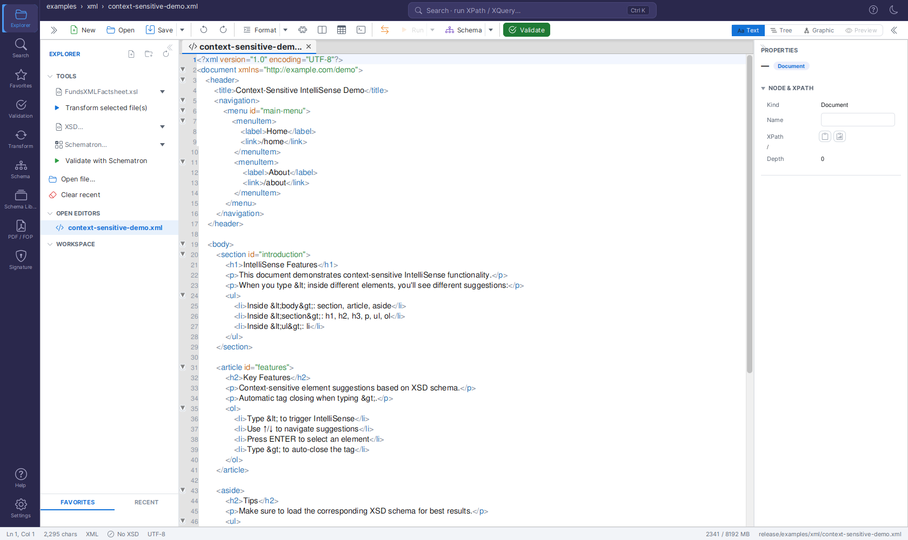
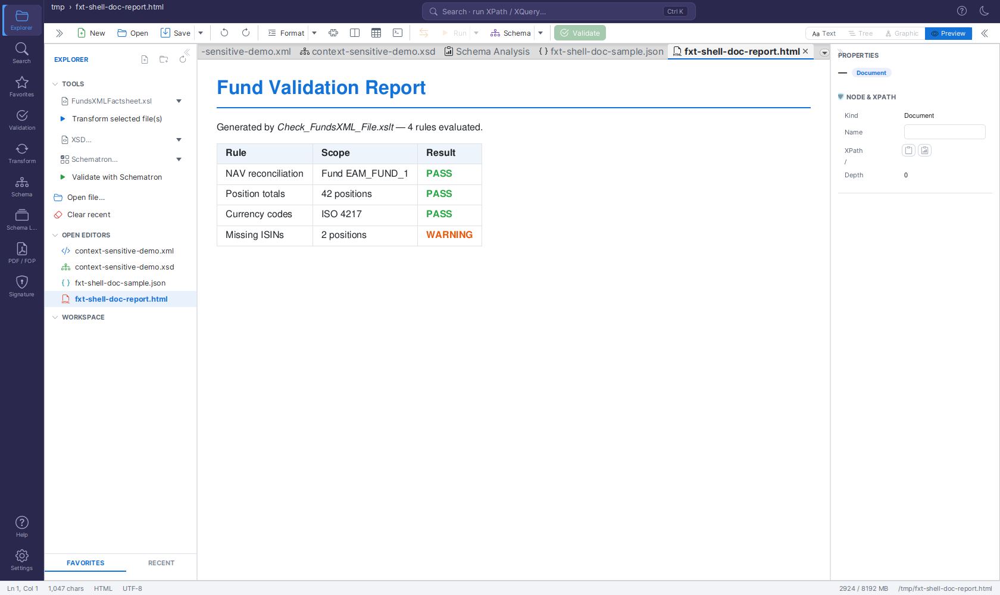
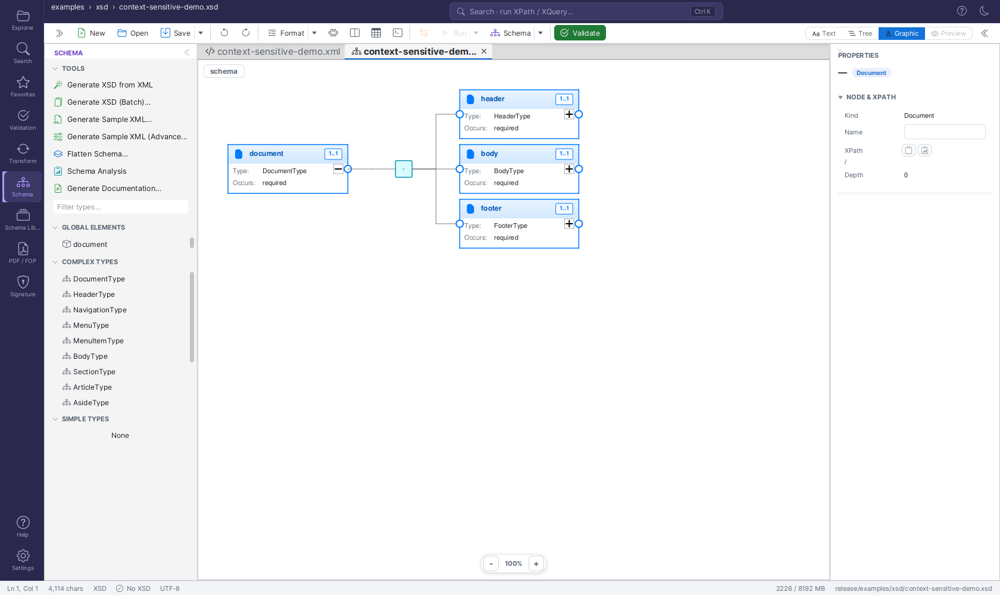
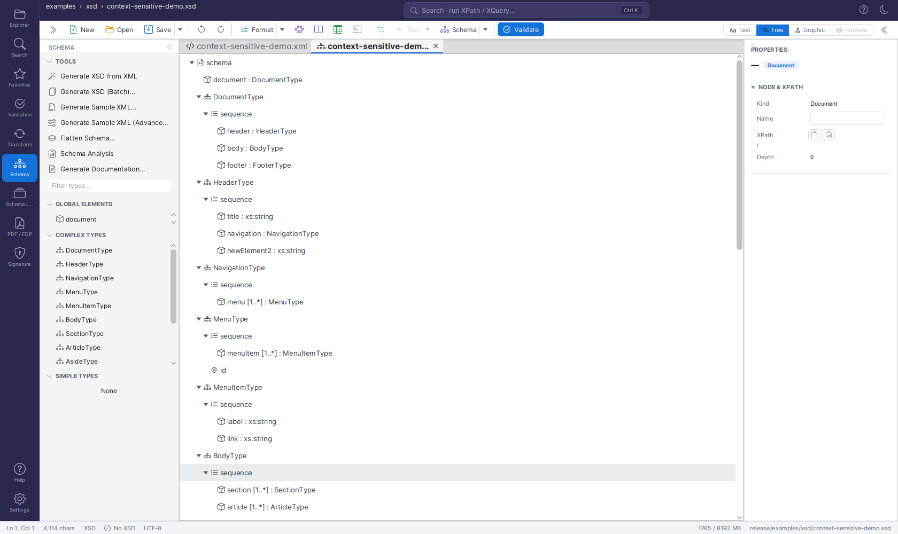
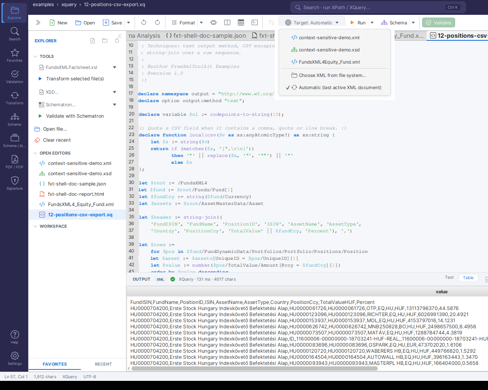
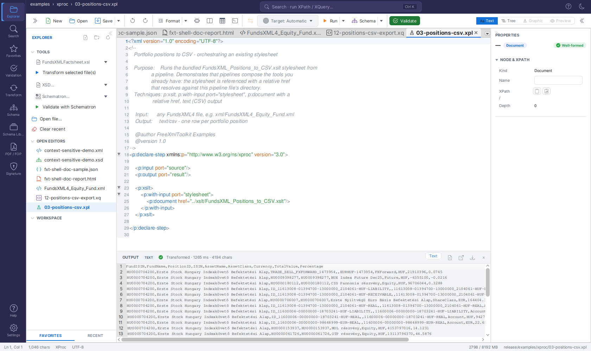
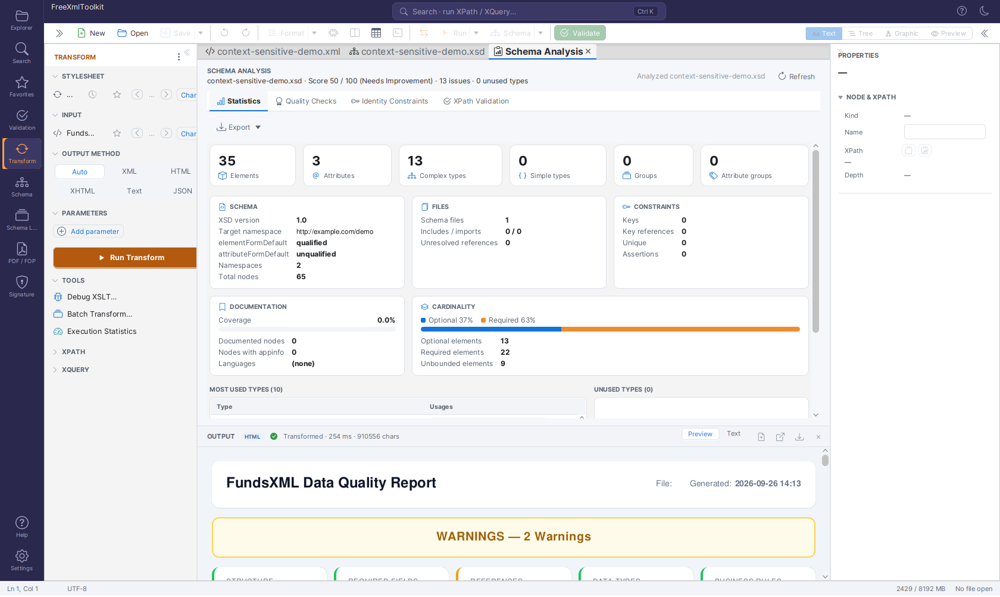
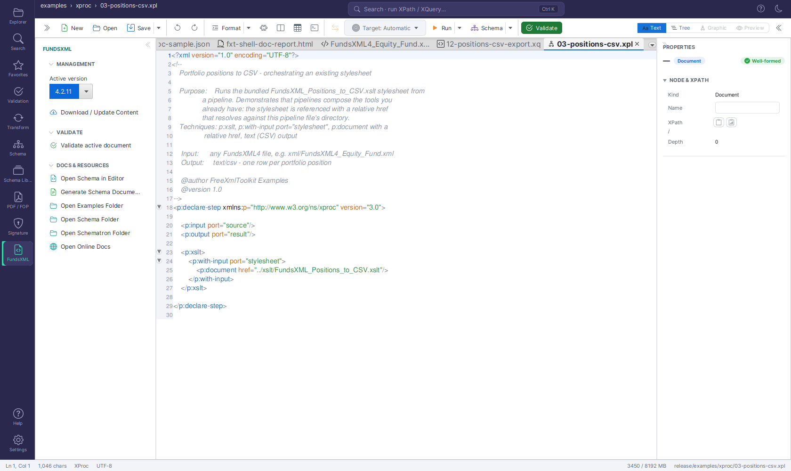
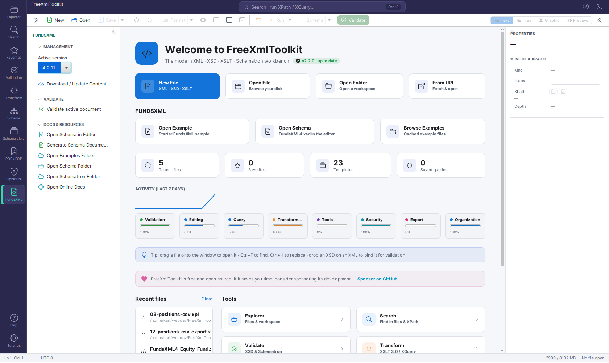
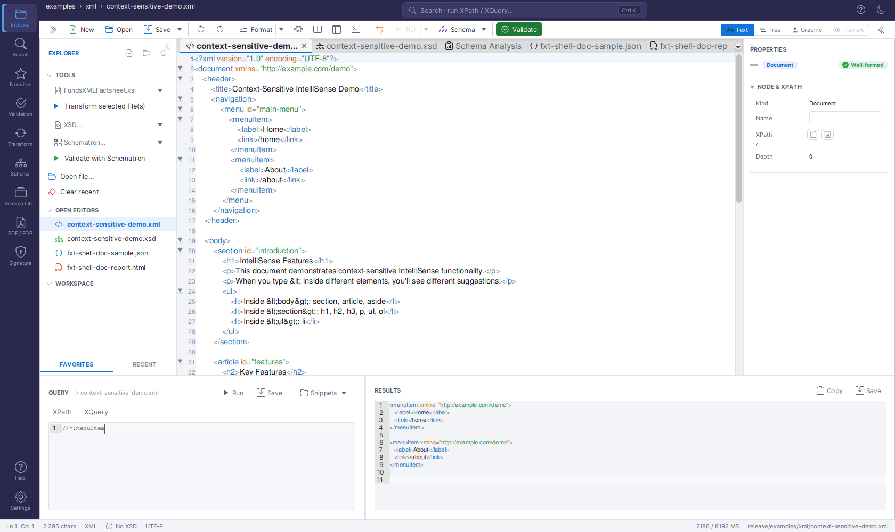

# Unified Shell

> The application opens directly into the **Unified Shell** - one workspace that
> combines XML, XSD, XSLT, XProc, Schematron and JSON editing with all the validation,
> transformation, signing and documentation tools. The separate legacy tabs have
> been consolidated here.

## Overview

The Unified Shell is the single workspace for everything FreeXmlToolkit does. Instead of
switching between separate editor pages, you open files as tabs in the central **editor
host** and reach every tool through the **activity bar** on the left. You can work with an
XML file next to its XSD schema, XSLT stylesheets and Schematron rules at the same time.

*The Unified Shell: activity bar (left), Explorer side panel, editor host with an XML file
(Text/Tree/Graphic view toggle), the Properties inspector (right) and the status bar.*

### Layout

| Area | Purpose |
|------|---------|
| **Activity bar** (far left) | Switch tools / side panels: Explorer, Search, Favorites, Validation, Transform, Schema, Schema Library, PDF/FOP, Signature, Help, Settings - plus a **FundsXML** activity when the optional [FundsXML extension](fundsxml-extensions.md) is enabled (see [FundsXML Panel](#fundsxml-panel)). **Always visible** - it cannot be collapsed. (Settings opens as a full page in the editor area - see [Settings Page](#settings-page).) |
| **Header bar** (top) | The breadcrumb (application / active file), a centered **search pill** (*"Search · run XPath / XQuery…"*, shortcut **Ctrl+K**) that opens the bottom [Query Console](#query-console) when clicked, and the Help and Theme buttons. |
| **Side panel** | The panel for the selected activity (e.g. the Transform panel, the Validation panel). **Resizable and collapsible** (see [Resizing and collapsing the side panels](#collapsing-the-side-panels)). |
| **Editor host** (center) | Tabs of open documents, each with the Text, Tree and Graphic view modes - plus a rendered **Preview** for HTML documents (see [View Modes](#view-modes)). |
| **Inspector** (right) | View **and edit** the selected node's properties from any view. **Resizable and collapsible** (see [Resizing and collapsing the side panels](#collapsing-the-side-panels)). |
| **Status bar** (bottom) | Caret position (Ln/Col), character count, file type, the XSD / IntelliSense indicator, the encoding label (UTF-8), the last recorded run (Developer feature), a memory indicator and the active file's path (see [Status Bar](#status-bar)). |

#### Resizing and collapsing the side panels {#collapsing-the-side-panels}

Both the **left side panel** and the **right Properties inspector** can be resized and
collapsed to give the editor more room - the activity bar always stays visible.

**Resizing** - the panels are not fixed-width:

- **Drag the thin divider line** between a panel and the editor to make the panel wider or
  narrower (the mouse pointer turns into a horizontal resize arrow over the divider). Widen
  the panel when file names, validation messages, or property values get truncated.
- Each panel keeps a **minimum width of 200 px**, and the editor in the middle always keeps
  at least **320 px** - you cannot drag a panel so far that the editor disappears.
- The chosen widths are **remembered across restarts** (per user).
- When you **resize the window**, the panels keep their pixel width - only the editor column
  grows or shrinks (the same behavior as VS Code).

**Collapsing** - each panel can also be hidden completely:

- **Collapse**: click the discreet double-chevron at the panel's inner edge (`<<` on the left
  panel, `>>` on the inspector). The panel is hidden completely.
- **Re-open**: click the matching toggle button in the editor toolbar (left-most toggle for the
  side panel, right-most for the inspector) - the same mechanism on both sides. Selecting any
  activity from the activity bar also re-opens the left side panel. A re-opened panel comes
  back at its **last dragged width**.
- The collapsed/expanded state is **remembered across restarts** and can also be changed under
  **Settings → General** ("Show left side panel" / "Show Properties (inspector) panel").

### Key Features

- **Multi-tab editing** - Open multiple files of different types in one view
- **Automatic file type detection** - Files are recognized by extension (.xml, .xsd, .xsl/.xslt, .xpl/.xproc, .xq/.xquery/.xqm/.xqy, .xpath, .sch/.schematron, .json, .html/.htm/.xhtml); anything else opens as plain text
- **View modes per document** - Text, Tree and Graphic, all over one shared model, plus a rendered **Preview** for HTML documents (see [View Modes](#view-modes))
- **Inspector editing everywhere** - edit node properties from the Text, Tree and Graphic views, not just one
- **Integrated XPath/XQuery** - a bottom [Query Console](#query-console) queries the active
  XML/JSON file right from the editor (Ctrl+Shift+X)
- **Editor toolbar actions** - run [Validate, Transform, Run, Generate Documentation and the Type
  Editor](#editor-toolbar-document-actions) for the active document without switching activities
- **Search & Replace** - Ctrl+F / Ctrl+H across the editor, in **every view mode**: the Text
  view searches the raw text, the Tree and Graphic views search the nodes themselves (names,
  documentation, attributes, enumeration and facet values, comments)
- **Find in Files & XPath search** - the **Search** activity
  (Ctrl+Shift+F) searches and replaces across **all files of a folder**, by plain text or
  by XPath expression (see [Search Panel](#search-panel))
- **Resizable side panels** - drag the divider lines to give the side
  panel or the Properties inspector more room; the widths are remembered across restarts
  (see [Resizing and collapsing the side panels](#collapsing-the-side-panels))
- **Favorites** - Quick access to frequently used files

## Getting Started

1. The Unified Shell opens automatically on startup.
2. Use the **Explorer** activity (or **File → Open**) to open files; **File → New** (Ctrl+N) opens the guided [New File dialog](#new-file-dialog) to create a new file from a template or schema.
3. Files open as tabs in the editor host - switch tabs by clicking their headers, and switch view modes (Text / Tree / Graphic - plus **Preview** for HTML files) with the segmented view switch.

## New File Dialog

> Creating a new file opens a guided dialog instead of silently
> opening an empty, untitled document. You can pick a starting template or an XSD schema, so
> a new file already has a sensible structure.

The **New File** dialog opens whenever you create a new document - from the toolbar **New**
button (Ctrl+N), the **Explorer** panel's **New file** action, or the **New File** card on the
Welcome screen. It walks you through a few simple choices and then opens (and optionally saves)
the new document.

| Field | What it does |
|-------|--------------|
| **File type** | Choose **XML**, **XSD**, **XSLT**, **Schematron**, **JSON**, **XProc**, **XQuery**, **XPath**, or **HTML**. The rest of the dialog adapts to your choice. |
| **Template** | A list of available templates - the built-in library plus your own templates from Settings - **automatically filtered to the selected file type**. The default is **"— None —"** (start blank). Picking a parameterized template prompts you for its values when the file is created. |
| **Schema** | *(plain XML only, and only when no template is chosen.)* Pick an XSD to base the document on - from your **Favorites**, your **Recent files**, or **Browse…** to select a file. The chosen schema is also bound to the new document, so it appears in the Validation panel and drives IntelliSense. |
| **Pre-fill mandatory nodes (empty)** | *(shown with the Schema option, on by default.)* When a schema is selected, the new document is pre-populated with all required elements and attributes (left empty) generated from that schema, giving you a ready-to-fill skeleton. |
| **Save to** | *(optional.)* Choose a location with **Browse…** to write the file to disk immediately and open it. Leave it empty to open the document as an **untitled** tab - you will be asked for a location the first time you Save. |

### What you get

- **A template** is rendered into the new document (prompting for any parameters first).
- **XML with a schema and "Pre-fill mandatory nodes"** produces a skeleton containing every
  mandatory element and attribute from that schema.
- **Otherwise** you get a minimal, valid starting point for the chosen type: an XML declaration
  for XML, an `xs:schema` skeleton for XSD, an `xsl:stylesheet` (version 3.0) skeleton for
  XSLT, an ISO-Schematron skeleton for Schematron, `{}` for JSON, a `p:declare-step`
  skeleton (with `source`/`result` ports and `p:identity`) for XProc, an
  `xquery version "3.1";` prolog for XQuery, and a minimal HTML5 page skeleton for HTML.

## View Modes

> The segmented view switch offers the **Text**, **Tree**, and **Graphic** view
> modes - each with its own icon - plus, for **HTML documents only**, a rendered read-only
> **Preview** (eye icon). There is no separate **Grid** mode - the grid is part of
> **Graphic**.

Every document tab offers the same view modes:

| Mode | What it shows |
|------|---------------|
| **Text** | Source code editing with syntax highlighting |
| **Tree** | The document as a hierarchical tree |
| **Graphic** | A visual editor that depends on the document type: for **XML**, **XSLT**, and **Schematron** files it shows the editable XMLSpy-style **grid**; for **XSD** files it shows the **schema diagram** |
| **Preview** | *(HTML documents only.)* The page rendered read-only in an embedded web view - see [HTML Preview](#html-preview) |

All views share one in-memory model per document, so edits and Undo/Redo history are preserved
when you switch views.

### The Grid (Graphic view for XML)

When an XML-instance document (XML, XSLT, or Schematron) is in the **Graphic** view, the editor
shows the editable grid:

- A **header strip** at the top reads *"Grid view · nested · repeating elements as embedded
  grids"* and offers a **Collapse all** button that folds every container at once.
- Rows with a simple value are marked with a **`{}`** marker so you can tell value rows from
  containers at a glance.
- **Attributes always show** as `@name` rows directly beneath their element - also while the
  element itself is collapsed.
- Collapsed containers show a **"collapsed"** hint, so you always know there is hidden content.
- Repeating elements are rendered as **embedded grids** (tables inside the row).
- **Keyboard navigation** works as soon as the view opens (no click needed):
  **↑/↓** walk the rows, **→** expands a collapsed element, **←** collapses it (or jumps to
  the parent), **Enter** toggles a container / starts editing a value, **Home/End** jump to
  the first/last row, **F2** renames, and the usual **Ctrl+C/X/V**, **Ctrl+D** (duplicate)
  and **Delete** act on the selected node.
- **Copy XPath / Copy Node**: the grid's context menu offers **Copy XPath** (**Ctrl+Shift+X**),
  **Copy Cell Content** (**Ctrl+Shift+C**) and **Copy Node (XML)** (**Ctrl+Alt+C**). Note that
  **inside the grid Ctrl+Shift+X is Copy XPath**, so the shell-level Query Console toggle
  needs the terminal-icon toolbar button while the grid has focus.

### HTML Preview (Preview view for HTML) {#html-preview}

HTML documents (`.html`, `.htm`, `.xhtml`) get their own **Preview** view mode - the eye
icon in the segmented view switch - that renders the page read-only, the way a browser
would show it:

- **HTML files open in Preview by default.** Whether you open them from the Explorer, by
  drag & drop, or via the Open dialog, you see the rendered page first.
- **Editing happens in the Text view.** Switch to **Text** to change the markup, then
  switch back to **Preview** - it re-renders your current editor text, including unsaved
  changes.
- **Tree and Graphic are disabled for HTML documents**, because HTML output is often not
  well-formed XML.
- **Transform results render here too.** The OUTPUT panel's **Open result as editor tab**
  opens an HTML/XHTML transform result as an HTML document showing its Preview, and
  re-running the transform updates the open result tab live - see
  [The OUTPUT Panel](#the-output-panel-results).

!!! note "Preview limitations"
    - The page is rendered **without a base URL**, so **relative references** - external
      CSS files, images - do not resolve. **Inline styles render fine.** To view a
      transform result together with its external assets, use the OUTPUT panel's
      **Open in browser** action instead.
    - **Ctrl+F** in the Preview searches the document's underlying **markup text**, not
      the rendered page.
    - The Preview is **read-only** - all editing happens in the Text view.

## Supported File Types

| Type | Extensions | Features |
|------|-----------|----------|
| **XML** | .xml | Text + graphic view, XSD/Schematron linking, IntelliSense, continuous validation |
| **XSD** | .xsd | Text + graphic view, Type Library, Type Editor, Schema Analysis, Documentation, Sample Data, Flatten |
| **XSLT** | .xsl, .xslt | XSLT editor + XML input + output preview, live transform, parameters, performance metrics |
| **XProc** | .xpl, .xproc | Pipeline editor (Text + Tree view), Run Pipeline via the embedded XML Calabash engine - see [XProc Pipelines](#xproc-pipelines) |
| **XQuery** | .xq, .xquery, .xqm, .xqy | Query editor with highlighting + IntelliSense, Run Query against a selectable target - see [Query Documents](#query-documents-the-target-selector) |
| **XPath** | .xpath | Single-expression query editor, Run Query against a selectable target - see [Query Documents](#query-documents-the-target-selector) |
| **Schematron** | .sch, .schematron | Code editor + Visual Builder + Tester + Documentation Generator |
| **JSON** | .json | Text + tree view, JSONPath queries, JSON Schema validation. Only `.json` is registered - `.jsonc` / `.json5` files open as plain text - but JSONC/JSON5 syntax (comments, trailing commas) *inside* a `.json` file is tolerated by the editor. |
| **HTML** | .html, .htm, .xhtml | Rendered read-only **Preview** (the default view) + Text editing; also the format of HTML/XHTML transform results opened as editor tabs - see [HTML Preview](#html-preview) |

## Toolbar

> The editor toolbar is a **single slim row**. Related actions sit in **split buttons**
> with a visible **▾** arrow menu: **Save As / Save All** live under **Save ▾**, **Minify**
> under **Format ▾**, **Run Query / Run Transform / Run Pipeline** under **Run ▾**, and
> **Set XSD Schema… / Generate Documentation… / Type Editor…** under **Schema ▾**.

Every function is still reachable through a visible button - there is no hidden "overflow"
menu. Only when the window gets very narrow does the row wrap onto a second line as a
fallback. The toolbar groups its actions three ways:

### Labeled buttons (frequent actions)

- **New** (Ctrl+N) - Open the guided [New File dialog](#new-file-dialog) to create an XML, XSD, XSLT, Schematron, JSON, XProc, XQuery, XPath, or HTML file from a template or schema
- **Open** (Ctrl+O) - Open one or more files
- **Validate** (F8) - Validate the active document; this is the toolbar's primary action and keeps the filled accent color. XML validates against the bound XSD/Schematron if one is set, otherwise for well-formedness.

### Split buttons (click the ▾ arrow for related actions)

Clicking the button itself runs the main action; clicking the small **▾ arrow** opens a menu
with the closely related actions:

| Split button | Primary click | Arrow (▾) menu |
|--------------|---------------|----------------|
| **Save** | Save the current tab (Ctrl+S) | **Save As…** (Ctrl+Shift+S) - save under a new name (the file chooser is pre-set to the tab's file type) · **Save All** - save every open tab at once |
| **Format** | Pretty-print the active document (Shift+Alt+F; note: **Ctrl+Shift+F** opens the [Search panel](#search-panel), not document search) | **Minify** - remove all insignificant whitespace |
| **Run** | Run the active document against the selected **Target** (Ctrl+Enter) - the primary click automatically runs whichever action the active file type supports | **Run Query** (XPath/XQuery) · **Run Transform** (XSLT) · **Run Pipeline** (XProc) |
| **Schema** | **Set XSD Schema…** - bind an XSD to the active document for IntelliSense and validation | **Set XSD Schema…** · **Generate Documentation…** (HTML/PDF/Word for the active XSD) · **Type Editor…** (edit a named type of the active XSD) |

### Icon-only buttons (hover for the tooltip)

- **Undo** (Ctrl+Z) / **Redo** (Ctrl+Y)
- **Insert Template…** (Ctrl+T) - Insert a snippet from the template system
- **Compare with File…** - Side-by-side diff and merge (see [Compare & Merge](#compare-merge))
- **Spreadsheet Converter…** (Ctrl+E) - Excel / CSV ↔ XML conversion
- **Query Console** (Ctrl+Shift+X) - Toggle the bottom XPath/XQuery console (terminal icon)
- **Transform with XSLT…** - Pick a stylesheet and transform the active XML document

### Type-gating and the Target dropdown

The document actions act on the **active document** and are **enabled only when they apply to
its type** (greyed out otherwise) - this covers **Validate**, **Transform with XSLT…**, the
**Run** button and its menu entries, and the Schema menu's **Generate Documentation…** /
**Type Editor…**. The **Target** dropdown appears next to **Run** only while a query, XSLT, or
XProc document is active and selects the XML document the run works on. See
[Editor Toolbar Document Actions](#editor-toolbar-document-actions) and
[Query Documents & the Target Selector](#query-documents-the-target-selector) below.

## Panel Toggles

- **Side panel** (Ctrl+L) - Show/hide the left side panel (the active activity's Explorer,
  Validation, Transform, Schema, … panel); the same as the **«** button in the panel header
- **Query Console** (Ctrl+Shift+X) - Show/hide the bottom XPath/XQuery query console (terminal
  icon in the editor toolbar). See [Query Console](#query-console) below.
- **Properties** (Ctrl+Shift+P) - Show/hide properties and validation sidebar. For XML files,
  the properties inspector lets you view **and edit** a node's properties (element name,
  namespace, attributes, and text content) from **all three** views - Text, Tree, and Graphic
  (the grid). For XSD files, the same inspector lets you edit a schema node's
  properties from **all three** XSD views - Text, Tree, and Graphic. See
  [Properties Inspector](#properties-inspector) below.
- **Favorites** (Ctrl+Shift+D) - Show/hide the favorites panel (Ctrl+D adds the active document to favorites)

## XSD Views & Tools

When editing an XSD file, the editor host and the **Schema** activity provide:

*An XSD open in the Graphic view, with the Schema activity panel (Type Library, Flatten,
Schema Analysis, Generate Sample XML / Documentation) on the left.*

*The same schema in the Tree view - select a node to edit its properties in the inspector.*

- **Text** - Source code editing with syntax highlighting; moving the caret into a schema construct also lets you edit its properties in the Properties pane (see [Properties Inspector](#properties-inspector))
- **Graphic** - Visual XMLSpy-style schema diagram
- **Type Editor** - Edit ComplexTypes graphically, SimpleTypes with form editor
- **Analysis** - The **Schema Analysis** tool tab: statistics incl. unused types, quality checks with score, identity constraints, XPath validation - every finding reveals its node in the Tree view (see [Schema Analysis](xsd-tools.md#5-schema-analysis))
- **Documentation** - Generate HTML/Word/PDF documentation (see below)
- **Sample Data** - Generate sample XML from the schema
- **Flatten** - Merge included schemas into a single standalone file. The **Flatten Schema…** button opens an options dialog first: strip annotations, strip XML comments, remove unused global types and groups, and minify the output — all checked by default for a minimal schema suited to server-side validation; uncheck everything for a plain flatten that keeps documentation. Imports (`xs:import`, different namespaces) are never merged. See [XSD Flattener](xsd-tools.md#8-xsd-flattener) for details.

!!! note "Missing imported schemas resolve automatically"
    If a schema's `xs:import` points to a file that is not found next to the schema, the
    toolkit looks it up in the Schema Library and your XML catalogs, then in the schema
    cache, and finally downloads it from the declared or namespace URL into the cache -
    so the imported types still appear in the Tree and Graphic views, even offline on
    later loads. Nested imports inside imported schemas are followed too, and your own
    schema files are never modified. See
    [Automatic Resolution of Imported Schemas](xsd-tools.md#automatic-resolution-of-imported-schemas).

### The Schema Panel

The **Schema** activity's side panel lists the active schema's top-level declarations,
grouped into **GLOBAL ELEMENTS**, **COMPLEX TYPES**, and **SIMPLE TYPES** (collapsible
sections), with a **filter field** on top. Click a declaration to reveal it in the Tree
view; double-click a type to open it in its dedicated **Type Editor** tab; right-click for
**Reveal in Tree / Open Type Editor / Find Usage**. The schema tools (Generate XSD from
XML / batch, Sample XML plain/advanced, Flatten, Schema Analysis,
Documentation) sit as a **strip of icon buttons directly above the filter** - hover for
the tool's name.

The **whole panel is a drop zone**: drop an `.xsd` file from your
file manager anywhere on it to **open that schema as a document** - the panel then shows
its declarations. Unlike the picker drop targets elsewhere in the shell, this drop
*opens* the file rather than binding or selecting anything. While dragging, the panel
shows a **dashed green border** with a soft tint for an `.xsd` file and a **dashed red
border** for any other extension - a red drop is rejected and does not open the file.

### Documentation Generator (editor area)

**Generate Documentation…** (Schema panel ⋮ or the editor toolbar's **Schema ▾** menu) opens the generator as
a tab in the main editor area with the full option set:

- **SOURCE & OUTPUT** - the XSD (the active schema is pre-filled) and the output folder
  (HTML) or file (PDF/Word).
- **FORMAT** - HTML, PDF, or Word.
- **OPTIONS** - Markdown renderer, type definitions in source code, documentation in
  diagrams, SVG overview page, metadata, the diagram image format (SVG/PNG/JPG), and a
  **favicon** (.ico/.png/.svg) embedded into the generated HTML site.
- **PDF/WORD OPTIONS** *(shown for those formats)* - page size (A4/Letter/Legal, PDF also
  A3), orientation, and the content building blocks (cover page, table of contents, data
  dictionary, schema/element diagrams). PDF additionally offers the **color scheme**
  (Blue/Green/Purple/Grayscale/Professional), a **watermark** (Draft/Confidential/Internal
  Use Only), page numbers, and PDF bookmarks.
- **LANGUAGES** - **Scan languages** discovers the `xml:lang` documentation languages in
  the schema; pick which to include and the fallback language.
- **PROGRESS** - the right-hand log streams the pipeline's task messages live while
  generating; the run can be **cancelled**, and the result can open automatically.

## Query Documents & the Target Selector

> XPath and XQuery files are first-class editor documents: open a
> `.xq` or `.xpath` file (or any file from `examples/xpath/` and `examples/xquery/`),
> press **Run Query**, and read the result in the OUTPUT panel - no console or panel
> switching required.

*An XQuery document from `examples/xquery/` with the **Target** dropdown open: pick an
open XML-family document, a file from disk, or Automatic (the most recently active XML
document, here checked). Below, the OUTPUT panel shows the query's CSV result.*

### Query documents

`.xq`, `.xquery`, `.xqm`, `.xqy` (XQuery) and `.xpath` (XPath) files open in a dedicated
query editor with XPath/XQuery syntax highlighting and the same context-aware
[autocomplete](#xpath-xquery-autocomplete) as the Query Console. They appear in the
Explorer workspace tree, the file choosers and drag & drop like every other supported
type.

### Running

- **Run Query** (the toolbar's **Run** button, or `Ctrl+Enter`) runs the active
  XPath/XQuery document. The **Run ▾** arrow menu lists all three run actions explicitly.
- **Run Transform** does the same for an active **XSLT** stylesheet - output format
  auto-detected from its `xsl:output` declaration.
- **Run Pipeline** covers **XProc** documents (see [XProc Pipelines](#xproc-pipelines)).

Results appear in the **[OUTPUT panel](#the-output-panel-results)** docked below the
editor, with execution time and result size in the status line. A tabular XQuery result
(a sequence of similar elements) additionally offers a **Table** view; HTML results get
a preview, and everything can be opened as an editor tab, opened in the browser, or
saved from the panel's header buttons.

### The Target dropdown

The query, stylesheet or pipeline runs against an **XML target document**. The
**Target** dropdown in the editor toolbar (shown only for query/XSLT/XProc documents)
controls which one:

- **Automatic (last active XML document)** - the default: the most recently active
  XML-family document (XML, XSD, XSLT, Schematron, XProc). The active document itself is
  never chosen - an XSLT stylesheet does not transform itself.
- **An open document** - pick any other open XML-family tab. The run uses the tab's
  **live editor text**, including unsaved changes.
- **Choose XML from file system…** - pick a file without opening it; it is read fresh
  on every run.

The choice is remembered **per document** for the session. If a chosen target tab is
closed, the run falls back to Automatic. With no XML-family document available at all,
Run Query/Run Transform show a short guard message instead of failing.

!!! tip
    Ready-made queries ship in `examples/xpath/` (32 expressions) and `examples/xquery/`
    (17 scripts) - open any of them and press `Ctrl+Enter` against a FundsXML sample from
    `examples/xml/`. See [Bundled Example Collections](xml-editor.md#bundled-example-collections).

## XSLT Features

XSLT work happens in the [Transform Panel](#transform-panel) (Activity Bar → **Transform**):

- **Run Transform** - Run an XSLT transformation against the chosen input
- **Live preview** (⋮ menu) - Re-run automatically while you edit
- **Parameters** - Define XSLT parameters (name = value rows)
- **Output method** - Auto-detect or choose XML, HTML, XHTML, Text, or JSON output
- **Timing** - The OUTPUT panel status shows execution time and output size
- **Profile / Trace / Debug** (⋮ menu) - Per-template timings, template-match trace with
  `xsl:message` output, and the interactive debugger
- **Open in browser** - View HTML output in your default browser from the OUTPUT panel

## XProc Pipelines

XProc 3.0 pipelines (`.xpl`, `.xproc`) are first-class editor
documents, executed with the embedded **XML Calabash 3** engine:

*The bundled `03-positions-csv.xpl` example after **Run Pipeline**: the pipeline runs
the CSV export stylesheet (referenced with a relative href) against the Automatic
target and streams the result into the OUTPUT panel.*

- **Run Pipeline** (the toolbar's **Run** button or its ▾ menu, or `Ctrl+Enter`) runs the active pipeline. The
  primary input (`source` port) is the document chosen in the **Target** dropdown —
  by default the most recently active XML document, exactly like
  [Run Query and Run Transform](#query-documents-the-target-selector).
- Relative `href`s in the pipeline (`p:document`, `p:xslt` stylesheets, Schematron
  schemas) resolve against the pipeline file's directory.
- Results appear in the **OUTPUT panel**; XML, HTML, text/CSV and JSON outputs are
  routed to the matching view automatically.
- Self-contained pipelines (no input ports, or ports with default bindings) run
  without a target.
- **File → New** offers an XProc skeleton (`p:declare-step` with `source`/`result`
  ports and `p:identity`).
- Ready-to-run examples ship in `examples/xproc/` — see
  [Bundled Example Collections](xml-editor.md#bundled-example-collections).

!!! note "Saxon-HE limitations"
    `p:validate-with-xml-schema` and `p:xsl-formatter` require Saxon-EE and are not
    available; use the Validation activity (Xerces, full XSD 1.1) and the PDF/FOP
    activity instead. `p:validate-with-json-schema` is not supported in this bundle.

## Transform Panel

> The panel is organized into **collapsible sections**
> (STYLESHEET, INPUT, OUTPUT METHOD, PARAMETERS, XPATH, XQUERY) with a single primary
> **Run Transform** button. Results do not open as an editor tab -
> they appear in the **[OUTPUT panel](#the-output-panel-results)** docked below the
> editor. All secondary toggles and tools sit in the panel header's ⋮ (overflow) menu.

The **Transform** panel (open it from the **Transform** icon in the activity bar on the
left) runs XSLT transformations, XPath/JSONPath queries, and XQuery expressions. The panel
header reads **TRANSFORM** and carries a **⋮ (overflow) menu** with the secondary options
(see [The ⋮ Menu](#the-transform-menu) below). Each section header is clickable to collapse
or expand that section.

!!! tip
    For a quick, one-click transform without opening this panel, use the
    **[Transform bar](#transform-bar-one-click-xslt-from-the-explorer)** in the Explorer. It shares
    the same recent-stylesheet list and shows its result in the same OUTPUT panel.

### STYLESHEET

- Shows the **name of the chosen XSLT stylesheet** (or *none* if no stylesheet is set yet).
- **Change** - pick an `.xsl` / `.xslt` file from disk.
- The **clock icon** opens the **recent stylesheets** menu: reapply a recently used
  stylesheet in a single click, or choose **Clear recent** to empty the list.
- The **star icon** opens your **XSLT favorites** - see
  [Browsing favorites with ◀ / ▶](#browsing-favorites) below.
- **Drag & drop**: drop an `.xsl` / `.xslt` file from your file
  manager straight onto the STYLESHEET row - it becomes the current stylesheet, exactly
  as if you had picked it via **Change** or a favorite. While dragging, the row glows
  **green** when the file can be loaded and **red** when it has the wrong extension (a
  red drop is rejected). As with favorites, the transform **runs automatically** as soon
  as both a stylesheet and an input are ready.

### INPUT

The INPUT section shows which document the transform will use as its input:

- By default the input **follows the active editor document**: switch to another tab and
  the next run transforms that document (the shown input name updates live).
- **Change** opens a small menu with two options:
    - **Select XML file…** - transform a fixed XML file from disk instead, regardless of
      which editor tab is active.
    - **Use active editor** - go back to following the active tab.
- The **star icon** opens your **XML favorites** - see
  [Browsing favorites with ◀ / ▶](#browsing-favorites) below.
- **Drag & drop**: drop an `.xml` file from your file manager
  straight onto the INPUT row to transform that file - exactly like **Select XML file…**
  or picking a favorite. The same **green** (loadable) / **red** (rejected) drag-over
  feedback applies, and the transform **runs automatically** as soon as both a stylesheet
  and an input are ready.

### Browsing favorites with ◀ / ▶ {#browsing-favorites}

> Pick stylesheets and input files straight from your
> [Favorites](favorites-system.md) and page through them, so you can run the same
> stylesheet over many files, or many stylesheets over one file, without ever opening a
> file chooser.

Both the **STYLESHEET** and the **INPUT** rows carry a **star icon**, a pair of
**◀ / ▶ navigation buttons**, and a small **"i / n" position label**.

- The **star menu** lists the favorites of the matching type - **XSLT** favorites for
  STYLESHEET, **XML** favorites for INPUT - grouped by their folder (category). An
  **"All … favorites"** entry at the top selects the whole list at once.
- **Picking a favorite** (or an "All"/folder entry) does two things: it sets the current
  file, and it builds a **browse list** from that selection.
- The **◀ / ▶ buttons** then step backward and forward through that browse list. Browsing
  is **cyclic**: pressing ▶ on the last entry wraps to the first, and ◀ on the first wraps
  to the last. The **"i / n" label** shows your position (for example, *3 / 12*).
- Each ◀ / ▶ step **runs the transformation automatically** - but only once **both** sides
  are ready: a stylesheet is selected **and** an input is available (either a chosen input
  file or the active editor document). Until both are present, stepping just loads the file
  without transforming.

This supports two common workflows:

1. **Fix the input, step through stylesheets.** Keep one XML file as input, then page
   through several data-quality or reporting stylesheets with ▶ to see each result in turn.
2. **Fix the stylesheet, step through inputs.** Choose one XSLT stylesheet, then page
   through many XML input files with ▶ to apply the same transformation to each.

The existing **Change** file chooser, the **clock** (recent stylesheets) menu, and **Use
active editor** all keep working exactly as before.

### OUTPUT METHOD

A segmented control with **Auto · XML · HTML · XHTML · Text · JSON**. **Auto** (the
default) detects the output format from the stylesheet's `xsl:output` declaration; pick a
concrete format to override the detection.

### PARAMETERS

Define XSLT parameters as **name = value** rows:

- **Add parameter** adds a new row.
- Each row has its own **remove** button.
- The values are passed to the stylesheet on every run.

### Running a Transformation

1. Choose a stylesheet (**STYLESHEET → Change**, or pick one from the recent menu).
2. Check the **INPUT** section shows the document you want to transform.
3. Click **Run Transform**.

The result appears in the **OUTPUT panel** below the editor - see
[The OUTPUT Panel](#the-output-panel-results) below.

### XPATH and XQUERY

Two further sections, **collapsed by default**, run queries against the transform input:

- **XPATH** - a query field with **Run**, **Save Query** (store the current expression
  under a name), and a **Saved** menu listing your saved queries (pick one to load it).
  When the active document is **JSON**, the section is titled **JSONPATH** and the field
  evaluates a JSONPath expression instead.
- **XQUERY** - a multi-line query area with **Run XQuery** and an **Examples** menu
  (Simple, FLWOR, HTML report, Data-quality check).

Both inputs offer context-aware [autocomplete](#xpath-xquery-autocomplete). Query results
appear in the same OUTPUT panel below the editor.

### The Transform ⋮ Menu

The secondary toggles and tools (the former **Advanced** section) live in the panel
header's ⋮ (overflow) menu:

| Entry | What it does |
|-------|--------------|
| **Live preview** | Re-runs the transform automatically (debounced) while you edit the input document. |
| **Watch stylesheet file** | Re-runs the transform whenever the chosen stylesheet changes on disk - handy while editing the stylesheet in another tool. |
| **Profile run** | A transform also opens a read-only **Profile** tool tab (timings + per-template execution times). |
| **Trace run** | A transform also opens a **Trace** tool tab (template matches + `xsl:message` output). |
| **Auto-open result tab** | Additionally opens every successful result as a regular editor tab (HTML/XHTML results open rendered in the [Preview](#html-preview) view). **Off by default.** |
| **Debug XSLT…** | Opens the stylesheet as a document with a breakpoint gutter and a Debug tool tab (step into/over/out, continue, stop; variables, call stack, breakpoints, and XPath watches). |
| **Batch Transform…** | Runs the active stylesheet/XQuery over many XML files, with per-file results and "Save All". |
| **Execution Statistics** | Opens the **Execution Statistics** tool tab (duration, CPU and memory per XSLT/XQuery/validation run). Runs are only recorded while **Record execution statistics** is enabled in the Settings page's **DEVELOPER** card. |

> XSLT version selection (1.0/2.0/3.0) is intentionally not offered: Saxon HE
> auto-detects the version from the stylesheet's `version` attribute, so an
> explicit selector would be cosmetic.

### The OUTPUT Panel (Results)

> Transform and query results appear in an **OUTPUT panel
> docked below the editor** instead of opening editor tabs and a separate
> HTML-preview tool tab.

All Transform-panel results - XSLT transforms, XPath/JSONPath queries, and XQuery runs -
appear in an **OUTPUT panel** that docks **below the editor**: the source document stays
on top and the result shows underneath, while the Properties inspector keeps its full
height. The panel **persists across activity switches**, so the last result stays visible
while you work elsewhere.

The OUTPUT panel header shows:

- A **format badge** (XML, HTML, …) for the result.
- A **status**: a green check with `Transformed · N ms · M chars` on success (how long the
  run took and how large the output is), or a red error icon with the error message on
  failure.
- **View toggles** - **Preview | Text | Table**:
    - **Text** - the result in a **read-only code editor** (the default):
      line numbers, syntax highlighting matching the result format (XML or JSON;
      plain text otherwise), and font zoom with **Ctrl+mouse wheel** (**Ctrl+0** resets).
    - **Preview** - the result rendered as a web page; available for **HTML/XHTML**
      results only.
    - **Table** - available for **XQuery** results that return a **sequence** of items
      (auto-selected when applicable). Each item becomes a row, and the columns are taken
      from each item's child elements (or, if an item has no child elements, its
      attributes). A sequence of plain values is shown in a single **value** column.
- **Actions**:
    - **Open result as editor tab** - opens the result as a regular document
      (`Transform-Result.xml` / `.html` / `.json` / `.txt`) that you can edit and save.
      An **HTML/XHTML result** opens as an HTML document rendered in the
      [Preview](#html-preview) view (switch to Text to see the markup); re-running the
      transform updates the open result tab, re-rendering the preview if it is showing.
    - **Open in browser** - opens the result (typically HTML) in your system web browser.
    - **Save result…** - writes the result straight to a file.
    - **✕** - hides the OUTPUT panel; it reappears automatically on the next run.

!!! note
    In earlier versions, every transform opened a `Transform-Result.*` editor tab, and HTML
    output additionally opened an "HTML Preview" tool tab. Both were replaced by the OUTPUT
    panel: an editor tab now opens only via the panel's **Open result as editor tab** action
    or the **Auto-open result tab** toggle in the ⋮ menu, and HTML is rendered inline via
    the panel's **Preview** view.

## Explorer Panel

Open the **Explorer** panel from the activity bar to manage files.

- **Header actions** (top right): New file, Open folder, Refresh workspace, and a ⋮ menu
  with **Open file…** and **Clear recent**. **New file** opens the same guided
  [New File dialog](#new-file-dialog) as the toolbar's **New** button.
- **OPEN EDITORS** - one row per open document. The **active document is highlighted**
  (blue, bold) and unsaved documents show a **dot** on the right. Click a row to switch to
  that document.
- **Workspace** - the file tree of the opened folder; the section is titled after the
  folder's name. Folders expand with their chevron; double-click (or Enter) opens a file.
  Only XML-family and JSON files are shown.
- **RECENT** - recently opened files; click to reopen.
- **FAVORITES** - your favorited files with their type-colored icons; click one to open it
  directly, without switching to the Favorites activity. Right-click an entry and choose
  **Remove from favorites** to drop it from the list - the file itself is not touched.
- **Collapsible sections** - the **OPEN EDITORS**, workspace,
  **RECENT**, and **FAVORITES** section headers are clickable: click a header to collapse or
  expand its section (the chevron next to the title flips accordingly). Use this to give the
  file tree more room when you have many open editors or recent files.

### Transform Bar (one-click XSLT from the Explorer)

> Run an XSLT stylesheet against XML files straight from the Explorer,
> without switching to the Transform activity.

A small **Transform bar** sits directly below the **EXPLORER** header. It lets you keep a
stylesheet fixed and apply it to whichever XML file you pick in the tree - ideal for repeatedly
running the same evaluation, dashboard, or data-quality stylesheet across many files.

The bar has two controls:

- **Stylesheet picker** - a dropdown (file-code icon) labelled **"Stylesheet…"** until you choose
  one, then showing the chosen stylesheet's file name. Click it to:
    - reapply one of your **recently used stylesheets** (listed at the top),
    - **Choose stylesheet…** - pick an `.xsl` / `.xslt` file from disk, or
    - **Clear recent** - empty the recent list.

    You can also **drop** an `.xsl` / `.xslt` file from your file
    manager directly onto the picker - it becomes the current stylesheet and joins the
    recent list, just like choosing it from the menu. The picker glows **green** while a
    loadable file hovers over it and **red** for a wrong file type (which is rejected).
- **Transform** button (play icon) - runs the chosen stylesheet against your selected XML file(s).
  Tooltip: *"Transform selected XML file(s) with the current stylesheet"*.

The chosen stylesheet is **sticky** and is **shared with the [Transform panel](#transform-panel)**:
both places draw from the same recent-stylesheet list, so a stylesheet you pick here also appears
there (and vice versa).

The workspace file tree supports **multi-selection** - hold **Ctrl** or **Shift** while clicking to
select several files at once.

**What Transform does** depends on how many XML files are selected:

- **One XML file selected** (or, if nothing is selected in the tree, the **active editor document**
  when it is XML): the stylesheet runs and the result appears in the docked
  **[Transform OUTPUT panel](#the-output-panel-results)** below the editor. HTML dashboards render
  in the **Preview** (WebView). The output format is auto-detected from the stylesheet's
  `xsl:output` declaration.
- **Several XML files selected**: the **Batch Transform** tool tab opens, pre-loaded with those
  files, and the run starts automatically. Save the results with **Save All…**.

!!! tip
    Primary workflow: choose your stylesheet once, then just switch the selected XML file in the
    tree and click **Transform** again - the stylesheet stays put. For output-format overrides,
    parameters, watch-and-rerun, and the result table, use the full
    [Transform panel](#transform-panel).

### XSD Bar (the active document's schema)

> See - and change - the XSD schema bound to the active document without leaving
> the Explorer; switching the schema re-validates immediately.

An **XSD bar** sits between the Transform bar and the Schematron bar. Unlike the two
sticky pickers around it, the **XSD picker** (file-code icon) always mirrors the
**active document**: it shows the name of the schema currently bound to it - whether
that binding came from an `xsi:schemaLocation` declaration, the Schema Library, or a
manual choice - and reads **"XSD…"** while the document has no schema. Switching tabs
updates the label. Click it to:

- rebind one of your **recently used XSDs** (listed at the top),
- pick one of your **Favorites** (the XSD favorites the
  [Validation panel](#validation-panel) offers too),
- **Choose XSD…** - pick an `.xsd` file from disk,
- **Unbind schema** - remove the document's schema binding (disabled when none is bound), or
- **Clear recent** - empty the recent list.

You can also **drop** an `.xsd` file from your file manager onto the picker.

Choosing, dropping, or unbinding a schema **binds it to the active document as a manual
binding** (the status-bar XSD indicator and the Validation panel's SOURCES row follow) and
**runs validation right away** - the PROBLEMS list and the status bar refresh without
pressing **F8**. The recent-XSD list is shared across documents and sessions.

### Schematron Bar (one-click validation from the Explorer)

> Validate XML files against a Schematron straight from the
> Explorer, without switching to the Validation activity first.

A **Schematron bar** sits directly below the XSD bar. It keeps one Schematron
fixed and validates whichever XML file(s) you pick in the tree - ideal for repeatedly
checking many files against the same rule set.

The bar has two controls:

- **Schematron picker** - a dropdown (checks-grid icon) labelled **"Schematron…"** until you
  choose one, then showing the chosen file's name. Click it to:
    - reapply one of your **recently used Schematrons** (listed at the top),
    - pick one of your **Favorites** (the same Schematron favorites the
      [Validation panel](#validation-panel) offers),
    - **Choose Schematron…** - pick a `.sch` / `.schematron` file from disk, or
    - **Clear recent** - empty the recent list.

    You can also **drop** a `.sch` / `.schematron` file from your
    file manager directly onto the picker - it becomes the current Schematron and joins
    the recent list, just like choosing it from the menu. The picker glows **green**
    while a loadable file hovers over it and **red** for a wrong file type (which is
    rejected).
- **Validate** button (play icon) - validates your selected XML file(s) against the chosen
  Schematron. Tooltip: *"Validate selected XML file(s) with the current Schematron"*.

Picking a Schematron also **binds it to the active document**, so the
[Validation panel](#validation-panel) and live validation use it too. Clicking
**Validate** switches to the **Validation** activity and shows the result there:
a single active document runs through the normal single-file flow (problems list,
detailed Schematron report), a multi-file tree selection through the **batch** flow
with one RESULTS row per file. With no tree selection, the active editor document
is validated. Batch runs additionally check each file against the **active
document's bound XSD** (if any) - bind or clear the XSD in the Validation panel's
SOURCES section to control that.

## Search Panel

> A dedicated **Search** activity brings VS-Code-style
> **Find in Files** with Replace, plus an **XPath search & replace** that works across
> whole folders. **Heads-up:** its shortcut is **Ctrl+Shift+F** - formatting
> lives on **Shift+Alt+F** (see
> [Keyboard Shortcuts](#keyboard-shortcuts)).

Open the **Search** panel from the magnifying-glass icon in the activity bar (directly
below Explorer), or press **Ctrl+Shift+F** - any text selected in the editor is
prefilled as the search term - or **Ctrl+Shift+H**, which opens the same panel with the
replace row already expanded. A **Text | XPath** toggle at the top switches between the
panel's two modes.

### Text mode (Find in Files)

Searches all files of a folder for plain text. Results appear **as you type** - the
search re-runs automatically after a short pause.

- **Where it searches** - by default the folder opened in the **Explorer** workspace
  (falling back to the last-used directory); the **Browse** button picks any other
  folder. The **file globs** field filters which files are searched - it defaults to the
  XML-family extensions
  (`*.xml,*.xsd,*.xsl,*.xslt,*.sch,*.schematron,*.json,*.xq,*.xquery,*.xqm,*.xqy,*.xpath,*.xpl,*.xproc`).
- **Options** - three toggles next to the search field: **Aa** (match case), **W**
  (whole word), and **.\*** (regular expression).
- **Results** - matches are grouped **file → matches** in a tree with checkboxes. Click
  a match to open the file and select the exact match in the Text view. All matches in
  the active document are also **highlighted in the editor** (translucent amber).
- **Limits** - files larger than 20 MB and binary files are skipped, and at most 1000
  matches are listed per file (the file then shows a *"More matches not shown"* note).
  Open documents with **unsaved changes** are searched via their live editor content, so
  what you see in the editor is what is found.

#### Replace in Files

Click the **⇄** toggle (or open the panel with **Ctrl+Shift+H**) to reveal the replace
row:

1. Type the replacement text. In regular-expression mode, **$1**-style group references
   in the replacement insert the matched groups.
2. **Untick** any matches you want to keep - only the **checked** matches are replaced.
3. Click **Replace…** and confirm the summary dialog.

Replacements are applied safely:

- **Open documents** are edited **in the editor**, as exactly **one undo step per
  document** - press Ctrl+Z to revert everything at once, then save normally.
- **Files not open in the editor** are written to disk atomically, preserving their
  encoding (BOM, ISO-8859-1, …) and line endings.
- A file that **changed on disk after the search ran** is skipped and reported - it is
  never overwritten with stale results. Re-run the search and replace again.

### XPath mode

Evaluates an **XPath 3.1** expression (Saxon; the `map`, `array`, `math`, `fn` and `xs`
prefixes are pre-declared) and lists the matching nodes:

- **Scope** - a **Document | Folder** toggle: evaluate against the **active document**,
  or against every file of a **folder** (with its own file-glob filter, default
  `*.xml`).
- **Namespaces** - enter bindings as `prefix=uri` lines (an empty prefix sets the
  default element namespace). The **Detect** button reads the bindings from the active
  document's root element, so you rarely have to type them.
- **Find matches** lists the matched **elements, attributes and text nodes** with line
  numbers and a short preview. Click a result to navigate to the exact node; matches are
  highlighted in the editor. Nodes that cannot be mapped to a text position (comments,
  processing instructions) are excluded and reported as a count.

#### Replacing via XPath

Pick a **Replace** mode, then click **Replace checked…** and confirm - as in Text mode,
only the **checked** matches are changed:

| Mode | What it does |
|------|--------------|
| **Set value** | Sets the matched element's text (or the matched attribute's value) to a literal you type. |
| **Compute value (XPath)** | Computes the new value **per match**, with the matched node as the context - for example `concat(., '-suffix')` or `string(number(.) * 2)`. |
| **Delete nodes** | Removes the matched nodes: elements (including the whole line when the element sits alone on it), attributes (with the surrounding whitespace), or text. |
| **Replace with XML** | Replaces matched **elements** with an XML fragment you enter. The fragment is checked for well-formedness, and multi-line fragments are re-indented to fit their new location. |

All XPath replacements are **formatting-preserving text edits** - outside the replaced
ranges the document stays byte-for-byte identical. In the active document the whole
replacement is **one undo step** (Ctrl+Z reverts it). In folder mode, open files are
edited via the editor and all other files are written to disk atomically, with the same
changed-on-disk staleness check as Text mode.

## Favorites Panel

Open the **Favorites** panel from the star icon in the activity bar for one-click access to
your saved files.

- Favorites are grouped by their **folder** as soon as you use folders (the rest gathers
  under *Uncategorized*); without folders they group by **file type**. Every entry shows a
  **colored type icon**.
- The **search field** filters the list by name or path as you type.
- Click a favorite to open it as an editor tab. Right-click for **Open**, **Rename…**,
  **Move to folder** (existing folders, *(No folder)*, or **New folder…**), and **Remove**.
- **Add current** stars the active document.

### Manage Favorites (editor area)

Click **Manage…** to open the full management view as a tab in the main editor area:

- A **FOLDERS** list on the left filters the table (*All*, the smart collections,
  *Uncategorized*, your folders) and offers **New…**, **Rename…**, and **Delete** (deleting
  a folder moves its favorites to *Uncategorized* - nothing is lost).
- **Smart collections**: **Recently Used** (favorites you actually opened, latest first)
  and **Most Popular** (most-opened first) - opening a favorite anywhere in the app feeds
  them automatically.
- The **table** lists Name / Type / Folder / Path: double-click the **Name** cell to rename
  inline, pick a different **Folder** directly in the cell, double-click a row to open the
  file, right-click to **Open** or **Remove from favorites**.
- The **DETAILS** pane (right) shows the selected favorite's path, type, added date and
  usage, plus an editable **NOTES** field (saved when you leave it).
- The **search field** (top right) filters across all favorites by name or path;
  **Clean up** removes favorites whose files no longer exist.
- **Drag & drop**: drop files onto the Favorites side panel to add them as favorites.

See [Favorites System](favorites-system.md) for more.

## Validation Panel

Open the **Validation** panel from the activity bar to validate the active document.

> The panel offers a SOURCES section, a Single file / Batch mode toggle, a primary
> **Run Validation** button, and a color-coded RESULTS list.

### Sources

The **SOURCES** section shows the schemas bound to the active document, and its rows
follow the document's type: for XML-family documents it shows the **XSD** and
**Schematron** rows, for JSON documents a single **JSON Schema** row.
Click **Change** next to a source to pick a different file. **Every**
row carries a **star button** next to its *Change* link: on the XSD row it opens a
quick-select menu of your favorited XSD schemas, on the Schematron row a menu of your
favorited Schematron files, and on the JSON Schema row a menu of your favorited JSON
files - pick one to bind it in a single click, without browsing the
file system. The menus group entries by favorites folder when you use more than one, and
are grayed out while you have no matching favorites. (See
[Favorites](favorites-system.md).)

**All source rows are drop targets**: drop an `.xsd` file from
your file manager onto the XSD row, a `.sch` / `.schematron` file onto the Schematron
row, or a `.json` schema onto the JSON Schema row, to bind it to the active document in
one move - the row glows **green** while a
loadable file hovers over it and **red** for a wrong file type (which is rejected). The
dropped file behaves exactly like one picked via **Change** or a favorite, including
appearing in the recent list.

- **The referenced XSD binds automatically.** When the XML declares its schema
  (`xsi:schemaLocation` / `xsi:noNamespaceSchemaLocation` - local or remote), that XSD is
  bound when the file is opened, so the declared schema is the default. The
  declaration is also re-checked against the **current editor content before
  every validation run** (Run Validation, the toolbar's Validate, and live validation):
  a schema reference you add or change in the editor is picked up immediately - even in
  unsaved or untitled documents - and a removed reference downgrades validation to a
  well-formedness check (the status bar shows **"No XSD"**). A declared location is first
  looked up in your XML catalogs and Schema Library mappings; remote `https` schema URLs
  that no catalog redirects are downloaded to the schema cache, and if the download fails,
  a Schema Library mapping for the document's namespace is used instead. The status bar
  shows how the schema was found - plain **"XSD: name"** for a declared location,
  **"(catalog)"**, **"(library)"** or **"(manual)"** otherwise (see
  [Status Bar](#status-bar)). A schema you picked yourself (via **Change**, a favorite, or
  the status bar) is never overridden.
- **JSON documents work the same way**: a top-level `"$schema"` member pointing at a
  schema file or URL auto-binds that **JSON Schema** on open, is re-checked before every
  validation run, and a manual choice always wins. (Values pointing at `json-schema.org`
  meta-schemas are dialect declarations, not bindings, and are ignored.) See
  [JSON Editor](json-editor.md) for details and the supported drafts.
- **Click a bound source name to open the file in the editor** - one click on the XSD or
  Schematron name opens it as a tab for direct editing.

!!! tip
    You can also bind a schema **without opening the Validation panel**: click the
    **schema indicator** in the status bar (for XML it reads **"No XSD"**, **"XSD: name"**,
    **"Detecting XSD…"** or **"XSD error"**; for JSON documents the same states read
    **"No JSON Schema"**, **"JSON Schema: name"**, and so on; see
    [Status Bar](#status-bar)) or click the editor toolbar's **Schema** button
    (**Set XSD Schema…**) and pick a schema file. For XML the binding drives both
    **IntelliSense** and **schema validation**; for JSON it drives **validation**.

### Running a Validation

1. Pick a mode with the **Single file | Batch** toggle.
2. Click **Run Validation**.

- **Single file** validates the active document against the bound XSD and/or Schematron.
- **Batch** validates a whole set of XML files. In Batch mode, **Run Validation** opens a
  small menu with two ways to pick the files:
    - **Select XML files…** - a file chooser where you pick one or more XML files.
    - **Select folder…** - a folder chooser; every `*.xml` file in the folder **and all of
      its subfolders** is validated.

  The **RESULTS** list then shows one row per file with a status icon (red ✕ = errors,
  orange ⚠ = warnings only, green ✓ = valid) and a badge with the problem count. Select a
  row to see that file's problems; double-click to open the file. The plain-text batch
  report is available via the ⋮ menu (**Open last batch report**).

### Problems

Problems appear in two places:

- The **PROBLEMS** list at the bottom of the side panel. Its section header carries an
  **Export problems to Excel** button (spreadsheet icon, enabled once there are problems)
  that saves the current list as an `.xlsx` workbook, plus the Schematron report button
  described below.
- The **PROBLEMS panel below the editor**: it appears automatically when
  validation finds problems, shows error/warning counts in its header, and can be collapsed
  to just the header. Each row shows the message and the file/line in a monospaced label.

Every row in the PROBLEMS panel below the editor carries a
**source badge** - **XSD**, **Schematron**, **Well-formed**, or **JSON Schema** - so when a
run combines several checks you can tell at a glance where each problem comes from.
Hovering a **Schematron** row shows a **tooltip** with the full message, the failed
rule/test expression, and the XPath of the failing node.

Selecting a problem in either list jumps to its line in the editor. This works for
**Schematron problems too**: the failing rule's context node is resolved back to its
line in the XML, so a click navigates straight to the offending element.

Schematron problems whose rules define **quick fixes** (SQF)
can be corrected in place: right-click the problem row in either list and pick a fix
from the **Quick Fix** submenu, or use the **yellow lightbulb** that appears in the
editor gutter on lines with fixable problems (click it, or press **Alt+Enter** /
**Ctrl+.** on the line). See [Schematron Quick Fixes](schematron-quick-fixes.md).

### Detailed Schematron Report

> A full report of the last Schematron run, opened as a tool tab
> and saveable as HTML or SVRL.

After validating a document that has a Schematron file bound, open the report in
either of two ways:

- Click the **report button** (journal icon, tooltip *"Open detailed Schematron report"*)
  in the header of the Validation panel's **PROBLEMS** section.
- Pick **Schematron Tools → Validation Report** from the ⋮ menu.

The report opens as a **Schematron Report** tool tab showing the document name, the
Schematron file, a severity summary (errors / warnings), and a table with one row per
finding:

| Column | Content |
|--------|---------|
| **Severity** | Error or Warning |
| **Line** | Line in the XML document |
| **Message** | The rule's message text |
| **Rule / Test** | The Schematron test expression that failed |
| **Context (XPath)** | The XPath of the failing node |
| **Fix** | A lightbulb button on findings that offer [Schematron Quick Fixes](schematron-quick-fixes.md) — click it to apply a fix directly from the report |

**Click a row** to jump straight to that line in the editor. Two buttons export the
report:

- **Save Report (HTML)** - a self-contained HTML file you can archive or share.
- **Save SVRL (XML)** - the raw SVRL output (Schematron Validation Report Language)
  of the run, for further processing by other tools.

### The ⋮ Menu

Secondary tools live in the panel header's ⋮ (overflow) menu:

| Entry | What It Does |
|------|--------------|
| **Schematron Tools → Rule Templates** | Insert ready-made Schematron rule patterns |
| **Schematron Tools → Tester** | Run the Schematron rules against an XML file |
| **Schematron Tools → Rule Builder** | Build rules visually |
| **Schematron Tools → Check Rules** | Run an error detector over the Schematron itself and show a categorised issue table |
| **Schematron Tools → Documentation** | Open the Schematron documentation generator |
| **Schematron Tools → Validation Report** | Open the [detailed Schematron report](#detailed-schematron-report) of the last validation run |
| **Validate against FundsXML** | (When the FundsXML extension is enabled) validate against the FundsXML schema |
| **Validate while typing** | Toggle continuous (debounced) validation |
| **Open last batch report** | Open the plain-text report of the last batch run |

> **Check Rules** inspects the Schematron file for problems and lists them
> by category - XML syntax, structural, XPath, semantic, and best-practice issues - so you can
> fix mistakes in the rules before you rely on them. See
> [Schematron Validation](schematron-support.md) for details.

## Schema Panel: Sample-Data Generation

Open the **Schema** panel from the activity bar while an XSD file is active. Alongside type
browsing, the panel offers actions to generate sample XML from the schema:

- **Generate Sample XML** - The simple generator. It builds one sample document using
  mandatory-only / maximum-occurrence options and realistic example values.
- **Generate Sample XML (Advanced)…** - Opens a dialog for full control over how the sample
  data is built (see below).

### Advanced Sample-Data Generation

> A rule-based generator with per-XPath strategies, batch output, and
> reusable profiles.

The advanced dialog turns the schema's XPaths into an editable table. For each XPath you
choose a generation **Strategy** plus a value or pattern:

| Strategy | What It Produces |
|----------|------------------|
| **Auto** | Type-based automatic value (the default) |
| **Fixed Value** | A fixed literal you type |
| **Sequence** | An auto-incrementing value from a pattern (for example `ORD-{seq:4}`) |
| **Enum Cycle** | Cycles through the allowed enumeration values |
| **Template** | A string built from a template with placeholders |
| **Random from List** | A random pick from a comma-separated list |
| **XPath Reference** | Copies the value from another XPath |
| **XSD Example** | An example value taken from the schema's annotations |
| **Omit / Empty / Null** | Skip the node, leave it empty, or set `xsi:nil` |

You can also set **batch options** - a **count** and a **file-name pattern** (for example
`order_001.xml`, `order_002.xml`) - and **Save** / **Load** named **profiles** so you can reuse
a configuration later.

The dialog can either generate a **single document** (which opens in a new tab) or a **batch**
of files written to a folder you choose. For a full walkthrough, see
[Profiled XML Generation](profiled-xml-generation.md) and the
[Sample XML Generator](xsd-tools.md#7-sample-xml-generator) section of the XSD Tools guide.

## Inspector (XSD Properties)

When an XSD file is open, the **Properties** inspector (Ctrl+Shift+P) shows the selected schema
node. In addition to name, type, cardinality, facets, and constraints, you can now:

- **Edit the node's `xs:appinfo`** - The machine-readable metadata attached to the node.
- **Edit multi-language `xs:documentation`** - One row per language. Use **Add language** to add
  a translation and the **✕** button to remove one.
- **Edit comments** - Select an XSD comment in the tree to edit its text. To add a new comment,
  use **Add Comment…** in a node's right-click context menu.
- **Delete a constraint** - In the **CONSTRAINTS** section, select a `key`, `keyref`, `unique`,
  or `assert` constraint and click **Delete constraint** to remove it.

## Signature Panel

The **Signature** panel (open it from the activity bar) signs and validates XML signatures.
Its top is an **action nav** of four buttons - the actions render as
raised, bordered buttons, and **Validate (Details)** as an outlined secondary button -
selecting one shows the matching form below it, next to the shared **KEYSTORE** section
(keystore file with a *Change* link, alias, and the two passwords).
The keystore row also carries a **star menu** that lists your favorited keystores -
keystore files (`.jks`, `.p12`, `.pfx`, `.keystore`) are now their own **Keystore**
favorite type with a lock icon (see [Favorites](favorites-system.md)):

- **Sign XML File** *(default)* - Opens the **Sign XML Document card in the editor area**:
  the document to sign (the active document, changeable via *Browse*), the keystore alias
  and password (shared with the KEYSTORE section), the signature type (enveloped XML-DSig)
  and algorithm (RSA-SHA256 · C14N exclusive), and a **Sign Document** button. The signed
  copy is written next to the original (`name.signed.xml`) and opened.
  **Show certificate details** loads the keystore's certificate and shows the mockup's
  certificate inspector: subject (CN/O/C) with a self-signed/CA badge, the validity window
  with a *"Valid · N days remaining"* banner (red when expired), serial, signature
  algorithm, key usage, and the **SHA-256 fingerprint** with a copy button.
- **Validate Signature** - **Validate Signature** checks the active document's signature;
  **Validate (Details)** opens a detailed report (validity + signing-certificate details).
  The result is explained in plain language: a valid signature
  shows a green status; a document without a signature shows a red hint suggesting you sign
  it first; an invalid signature opens an error dialog that explains the document was
  modified after signing and names what failed (the signature value or a specific
  reference); a signature whose certificate cannot be used (not embedded, only referenced,
  or an unsupported algorithm) opens a dialog telling you to ask the sender for a signature
  that embeds an RSA X.509 certificate - or use **Validate (Details)**; signatures using
  the weak SHA-1 algorithm are rejected for security (re-sign with SHA-256 or SHA-512).
  Any other error shows a dialog with collapsible technical details.
- **Create Certificate** - Creates a self-signed certificate / keystore from the DN fields,
  using the alias and passwords from the KEYSTORE section. The new keystore is selected
  automatically so you can sign immediately.
- **Expert Mode** - Full PKIX trust validation: choose a **trust store** (defaults to the
  JVM's built-in `cacerts`; the trust store row also has a **star
  menu** with your favorited keystores), optionally **Check revocation (OCSP/CRL)**, then
  **Validate (Trust)** produces a trust report (trusted / trust anchor / revocation /
  timestamp).

The **KEYSTORE row** and Expert Mode's **trust store row** are also
**drop targets**: drop a keystore file (`.jks`, `.keystore`, `.p12`, `.pfx`) from your
file manager onto either row to select it - the row glows **green** while a loadable file
hovers over it and **red** for a wrong file type (which is rejected), and the drop
behaves exactly like choosing the file via **Change** or a favorite.

Missing inputs are highlighted: signing without a keystore marks the
keystore entry in red, and a blank alias or password is marked in red when you sign or
create a certificate. The highlight disappears as soon as you start typing in the field.

See [XML Digital Signatures](digital-signatures.md) for full details.

## PDF / FOP Panel

The **PDF / FOP** panel renders the XML to PDF with an XSL-FO stylesheet (Apache FOP):

- **INPUT** - The XML (follows the active editor; *Change* can fix it to a file) and the
  **XSL-FO stylesheet** (*Change*). Both rows also carry a **star
  menu** next to their *Change* link - **XML** favorites for the input, **XSLT** favorites
  for the stylesheet - so you can pick a favorited file in one click (see
  [Favorites](favorites-system.md)). Both rows are also **drop
  targets**: drop an `.xml` file onto the XML row or an `.xsl` / `.xslt` file onto the
  stylesheet row - the row glows **green** while a loadable file hovers over it and
  **red** for a wrong file type (which is rejected), and the drop behaves exactly like
  **Change** or a favorite.
- **METADATA** - PDF document **Title**, **Author** (pre-filled from your configured user
  name) and **Subject**, embedded into the generated PDF.
- **OPTIONS** - **PDF/A-1b compliant** renders an archival-grade PDF (requires the
  stylesheet to use embeddable system fonts - the built-in base-14 fonts like Helvetica
  cannot be embedded, and the error message will say so). **Page size** (A4/Letter,
  Portrait/Landscape) is passed to the stylesheet as the XSLT parameters `page-size` and
  `page-orientation` for stylesheets that support them.
- **Generate PDF** asks for the output file, renders off the UI thread, and opens the
  result in the in-app **PDF preview**; **Preview** and **Open PDF** re-open it any time.

See [PDF Generator](pdf-generator.md) for stylesheet guidance.

## FundsXML Panel

> Content downloads and updates **automatically** in the
> background; the panel gained a **progress bar** with stage text and an
> **Open Schema in Editor** button.

The **FundsXML** activity appears in the activity bar only when the optional
[FundsXML extension](fundsxml-extensions.md) is enabled (Settings → FUNDSXML card).
Enabling it is enough - the official FundsXML schema, examples, Schematron rules and query
snippets download automatically in the background, and a toast notification appears when
they are ready.

The panel offers:

- **MANAGEMENT** - Pick the **Active version** among the downloaded schema releases, or
  click **Download / Update Content** to force a manual refresh. A **progress bar with
  stage text** at the bottom tracks any running download - including the automatic
  background ones triggered at startup or by the daily update check.
- **VALIDATE** - **Validate active document** checks the open XML against the active
  FundsXML schema.
- **DOCS & RESOURCES** - **Open Schema in Editor** opens the active version's
  `FundsXML4.xsd` as a normal editor tab (Text or Graphic/diagram view);
  **Generate Schema Documentation** produces browsable HTML docs; the **Open … Folder**
  buttons show the cached examples, schema and Schematron files; **Open Online Docs**
  opens fundsxml.org.

See the [FundsXML Extensions guide](fundsxml-extensions.md) for the full feature
description, cache locations and troubleshooting.

## Schema Library Panel

The **Schema Library** activity (icon: collection) manages namespace → schema mappings used
to auto-bind XML, XSD and JSON documents that don't carry an explicit schema reference. It
has three tabs - **Mappings**, **Catalogs** and **Cache** - and a shared status line at the
bottom. See the [Schema Library guide](schema-library.md) for the full reference, including
the resolution order, the bundled standards list and troubleshooting.

## Settings Page

> Settings open as a **full page** (a tab in the main editor
> area) rather than in the narrow left side panel. The sections are presented
> as **color-coded cards**.

Click the gear icon at the bottom of the activity bar: the **Settings page opens as a tab in
the main editor area**, where there is room for all options (the left side panel just shows a
short note that settings are edited in the main window). Change any option and click
**Save Settings** to apply (theme changes apply immediately).

| Section | Options |
|---------|---------|
| **Theme** | Switch between **Light** and **Dark**. |
| **Editor** | XML indent and JSON indent (spaces); **Auto-format after loading**; **Pretty-print XSD on save**; **Pretty-print Schematron on load**. |
| **XSD** | **Auto-save** (with an interval in minutes); **Create backups on save** (with the number of versions to keep, and an optional **separate backup directory**). |
| **Schema Library** | **Use the Schema Library to bind schemas automatically**; shows the library file's location and a **Manage schema cache…** link. See [Schema Library](schema-library.md). |
| **Parser** | **XML parser** engine (Xerces or Saxon); **Allow XSLT extension functions**. |
| **Rendering** | JavaFX graphics pipeline: **Auto** / **Hardware** / **Software** (takes effect after restart), with the active pipeline and GPU status. See [Rendering mode (hardware vs. software)](#rendering-mode) below. |
| **Temp & Cache** | **Use system temp folder** or a custom temp folder; **Clear Temp Folder** to free disk space; **Clear Cache Folder** to delete cached files (downloaded schemas etc.); **Manage schema cache…**. |
| **General** | **Check for updates on startup**; **Use small icons**; **Show toolbar button labels**; **Show activity bar labels**; toolbar icon size (**Small** / **Large**); **Show left side panel**; **Show Properties (inspector) panel**. |
| **File Associations** | Make FreeXmlToolkit the **default application** for XML, XSD, XSLT, Schematron and JSON files (per user, no admin rights). See [File Associations](file-associations.md). |
| **User Info** | **Name**, **Email** and **Company** - used, for example, when generating documentation or signing. |
| **Security** | **Trust all certificates** - accept any TLS certificate for HTTPS downloads (schemas, updates). Use with care. |
| **Usage Statistics** | **Enable usage tracking** (local, anonymous feature-usage counters shown on the Welcome page) and **Clear statistics**. |
| **Developer** | **Record execution statistics** - collects duration, CPU and memory per XSLT/XQuery/validation run; view them in the **Execution Statistics** tool tab or via the "last run" item in the status bar. |
| **FundsXML** | **Enable FundsXML extensions** - adds the [FundsXML activity](fundsxml-extensions.md) to the activity bar. |
| **Templates** | A configurable **templates directory**, plus a **New / Edit / Delete** list of your own templates. See [Managing your templates](#managing-your-templates) below. |
| **HTTP Proxy** | **Use system proxy**, or enter a proxy host and port. |

### Clearing the Cache Folder

The **Clear Cache Folder** button in the **TEMP & CACHE** section deletes the contents of the
application's local cache folder (`~/.freeXmlToolkit/cache`) - for example downloaded schemas,
including schemas fetched automatically for missing `xs:import` references. Clearing is safe:
such schemas are simply re-downloaded the next time they are needed. A confirmation dialog is
shown first, because the action cannot be undone. The cache folder itself is kept; only its
contents are removed.

### Rendering mode (hardware vs. software) {#rendering-mode}

> The **RENDERING** card lets you choose how JavaFX draws the UI,
> per machine, without relying on a fixed JVM flag.

JavaFX can render either on the **GPU** (hardware-accelerated, faster) or purely in
**software**. On machines with only an integrated GPU, hardware rendering can become
unstable on very large diagrams/grids, while machines with a dedicated GPU benefit from it.
The **Mode** dropdown controls this:

| Mode | Behaviour |
|------|-----------|
| **Auto** *(default)* | The application detects the graphics adapter at startup and picks **hardware** rendering on a dedicated GPU (and on macOS), or **software** rendering on integrated/unknown adapters. The detection result is cached. |
| **Hardware** | Always prefer GPU rendering (with an automatic software fallback if the GPU pipeline cannot start). Use this if **Auto** does not recognize your dedicated GPU. |
| **Software** | Always use software rendering. Use this if hardware rendering causes display glitches or crashes on your machine. |

Below the dropdown the card shows the **current run's** rendering status:

- **Active pipeline** - what JavaFX is *actually* using right now: *Hardware — Direct3D*,
  *Hardware — OpenGL ES2*, *Hardware — Metal*, or *Software*. This is read from the live
  graphics pipeline, so with **Auto** you can see at a glance whether you ended up on
  hardware or software rendering.
- **Detected GPU** - the graphics adapter(s) the application found on this machine.

Notes:

- **A restart is required** for a change to take effect - the graphics pipeline is chosen
  once when the application starts. The **Active pipeline** line always reflects the
  pipeline of the *running* session, not an unsaved dropdown change.
- An explicit `-Dprism.order=...` JVM flag (command line) still **overrides** this setting,
  so power users can force a specific pipeline for troubleshooting.
- **Auto** is intentionally conservative: any adapter it cannot confidently identify as a
  dedicated GPU falls back to software rendering. If your dedicated GPU is not detected,
  switch the mode to **Hardware**.

### Managing your templates

> The **TEMPLATES** card lets you keep your own starting templates,
> which then show up (filtered by file type) in the [New File dialog](#new-file-dialog).

- **Templates directory** - Use **Browse…** to point the application at the folder where your
  templates live. Leave it empty to use the default location. Changing the directory takes
  effect immediately, **without restarting** the application.
- **Your templates** - The card lists your own (non-built-in) templates. Use:
    - **New** - Create a template. A dialog asks for its **Name**, **Category**,
      **Description**, **File type**, and **Content**.
    - **Edit** - Change the selected template.
    - **Delete** - Remove the selected template.

Each template is stored as a `.template` file in the templates directory. Once saved, your
templates appear in the **New File** dialog whenever their file type is selected. For the wider
template and XPath-snippet system, see [Template Management](template-management.md).

## Welcome / Dashboard

> The welcome screen shows live statistics and quick tips, and the
> Tools grid covers **every** page - including **Explorer** and **Settings** cards.

When no document is open, the editor shows a welcome dashboard with:

- **Stat cards** - At-a-glance counts of your **Recent files**, **Favorites**, **Templates**,
  and **Saved queries**.
- **Tips banner** - A short hint banner with handy shortcuts (for example, drag a file onto the
  window to open it, or use Ctrl+F / Ctrl+H to find and replace).
- **Recent files** list - Click an entry to reopen it.
- **Tools grid** - One card per tool; clicking a card opens the matching activity:
  **Validate**, **Transform**, **Schema**, **PDF / FOP**, **Signature**, **Favorites**,
  **Explorer** (files & workspace), and **Settings** (application preferences) - so every
  page can be opened directly from the start screen.
  A **Search** card (*Find in files & XPath*) opens the
  [Search panel](#search-panel).
- **FUNDSXML quick access** - When the optional
  [FundsXML extension](fundsxml-extensions.md) is enabled and its content is cached, an
  extra row with three cards appears: **Open Example** (opens a compact starter sample),
  **Open Schema** (opens `FundsXML4.xsd` in the editor) and **Browse Examples** (opens the
  cached examples folder). The row shows up live as soon as the automatic background
  download finishes.

## Status Bar

> The schema indicator shows the schema *loading lifecycle*, so you can
> tell exactly when IntelliSense (XML) or schema validation (JSON) becomes available.

The status bar at the bottom of the window includes (left to right):

- The **caret position** (`Ln 1, Col 1`), the **character count** of the active document and
  its **file type** label (XML, XSD, XSLT, …).
- A **schema indicator** showing the schema-binding state of the active document — an
  **XSD** for XML-family documents, a **JSON Schema** for JSON documents:

    | State | Meaning |
    |-------|---------|
    | **Detecting XSD…** (hourglass) | The linked schema is being detected and parsed in the background - IntelliSense is not available *yet*. |
    | **XSD: name** (green check) | The schema is loaded - **IntelliSense and schema validation are available**. |
    | **No XSD** | The document references no schema - IntelliSense is limited. |
    | **XSD error** (amber warning) | The document references a schema that could not be found or parsed - IntelliSense is unavailable. Bind one manually to fix it. |

    For JSON documents the same four states read **"Detecting JSON Schema…"**,
    **"JSON Schema: name"**, **"No JSON Schema"** and **"JSON Schema error"**, and refer
    to schema *validation* (JSON has no schema-driven IntelliSense).

    A loaded schema's label also shows *how* it was bound: a plain **"XSD: name"** when the
    document declared the location itself, **"XSD: name (catalog)"** when an XML catalog
    entry resolved it (bookmark icon), **"XSD: name (library)"** when a Schema Library
    mapping resolved it (collection icon), and **"XSD: name (manual)"** when you picked it
    by hand — the tooltip adds the resolved catalog target or matched namespace/root
    element plus the schema's absolute path.

    **Click the indicator** in any state to choose a schema file (`.xsd`, or `.json` for
    JSON documents) and bind it to the active
    document; for XML the binding drives both **IntelliSense** and **schema validation**,
    for JSON it drives **validation**. (The editor
    toolbar's **Schema** button - **Set XSD Schema…** - does the same.) Hovering shows a tooltip explaining
    what the binding currently provides.

    The indicator is also a **drop target**: drop an `.xsd` file (or a `.json` schema,
    for JSON documents) from
    your file manager onto it to bind the schema to the active document in one move - it
    glows **green** while a loadable file hovers over it and **red** for a wrong file type
    (which is rejected).
- An **encoding label** (**UTF-8**).
- A **last run** item (right-hand side) showing the last recorded XSLT/XQuery/validation run -
  it appears only while **Record execution statistics** (Settings → **DEVELOPER**) is on;
  **click it** to open the **Execution Statistics** tool tab.
- A **memory monitor** showing the JVM heap usage as **used / max MB**. **Click it** to run
  garbage collection, which can free memory after working with large files.
- The **file path** of the active document (or *No file open*).

## Keyboard Shortcuts

| Shortcut | Action |
|----------|--------|
| Ctrl+N | New file (opens the guided New File dialog) |
| Ctrl+O | Open file |
| Ctrl+S | Save current tab |
| Ctrl+Shift+S | Save As (the Save ▾ menu also offers Save All) |
| Ctrl+Z / Ctrl+Y (or Ctrl+Shift+Z) | Undo / Redo (works from the Text, Tree and Graphic views) |
| Ctrl+F | Find (in the active document) |
| Ctrl+H | Find and Replace (in the active document) |
| Ctrl+Shift+F | **Find in Files** - opens the [Search panel](#search-panel), prefilled with the editor selection |
| Ctrl+Shift+H | **Replace in Files** - opens the Search panel with the replace row expanded |
| F8 | Validate |
| Shift+Alt+F | Format (pretty-print) the active document |
| Ctrl+D | Add the active document to favorites |
| Ctrl+Shift+D | Show the Favorites panel (press again to collapse the side panel) |
| Ctrl+Shift+X | Toggle Query Console (XPath/XQuery) |
| Ctrl+K | Open the Query Console and focus its input (same as the header search pill) |
| Ctrl+Enter | Run the active XPath/XQuery, XSLT or XProc document (Run Query / Run Transform / Run Pipeline) |
| F5 | Execute: runs the active XPath/XQuery, XSLT or XProc document, validates any other document |
| F1 | Open the Help panel |
| F11 | Toggle full screen |
| Ctrl+L | Show/hide the left side panel |
| Ctrl+Shift+P | Show/hide the Properties inspector |
| Ctrl+E | Spreadsheet Converter… (Excel / CSV ↔ XML) |
| Ctrl+T | Insert Template… (needs an open document) |
| Alt+Enter / Ctrl+. | Quick Fix - apply a [Schematron Quick Fix](schematron-quick-fixes.md) on the caret line |

!!! warning "Changed shortcut"
    **Ctrl+Shift+F no longer formats the document.** Following the VS Code convention, it
    now opens **Search (Find in Files)**, and **Ctrl+Shift+H** opens **Replace in Files**.
    **Format Document moved to Shift+Alt+F** - the toolbar's **Format** button works
    unchanged. The in-editor find/replace stays on **Ctrl+F / Ctrl+H**.

> **Search in all view modes:** Pressing **Ctrl+F** opens an inline search bar with up/down chevron arrows for Find Previous / Find Next (Enter / Shift+Enter work too). The search works in the **Text**, **Tree** and **Graphic** views. In the structured views it searches the nodes themselves — for XSD schemas that is element/attribute/type names, documentation and appinfo, type references, fixed/default values, enumeration and facet values, and comments; for XML instances in the Graphic grid it is element names, attribute names, and values. A match hidden inside a collapsed branch is revealed automatically (ancestors expand), selected, and scrolled into view; matches wrap around when you reach the end. Switching the view mode or tab while the bar is open re-targets the search to the active view. **Replace** is available in the Text view only — in Tree/Graphic views the replace toggle is disabled. In an HTML document's **Preview**, Ctrl+F searches the underlying markup text, not the rendered page. See [XML Editor Features](xml-editor-features.md#search-find) for details.

## Compare & Merge

Both the XML and XSD editors include a **Compare** toolbar button (tooltip *"Compare with file..."*)
for side-by-side diffing and merging.

1. Click **Compare** and pick a file to compare against the current document.
2. A new tab opens titled `Compare: <left> ↔ <right>` with synchronized scrolling and live re-diff.
3. Changed lines are highlighted, with intra-line word-level coloring.

Merge controls let you reconcile the two files:

| Control | Shortcut | Action |
|---------|----------|--------|
| **Prev** / **Next** | Alt+Up / Alt+Down | Jump between changed chunks |
| Per-chunk arrows | - | Apply a single change left→right or right→left |
| **All →** / **All ←** | - | Apply every change in one direction |
| **Re-compute** | - | Recompute the diff manually |
| **Save Left** / **Save Right** | - | Write a pane back to its file |

The diff recomputes automatically about 300 ms after you stop typing.

## Jump to Validation Errors

Validation errors appear in the **Properties / Validation** sidebar (Ctrl+Shift+P). **Double-click**
any error to jump straight to its location:

- In the **Text** view the caret moves to the exact line and column, with the offending text highlighted.
- In the **Graphic** view the matching element is selected, flashed, and scrolled into view.
- In split mode both views navigate at once.

## Properties Inspector

> Property editing works in **all** views - for XML files in Text, Tree, and
> Graphic, and for XSD files in the **Text** view as well as the Tree and Graphic views
> (see [XSD Files](#xsd-files) below).
>
> The **NODE & XPATH** section shows the XPath on its own full-width
> line below the "XPath" header, so long paths do not get squeezed by the icon column.
>
> The inspector is not fixed-width: drag the divider line
> between the editor and the inspector to make it wider (handy for long XPaths, attribute
> values, or documentation). The width is remembered across restarts - see
> [Resizing and collapsing the side panels](#collapsing-the-side-panels).

### Copying the XPath or the node

The **NODE & XPATH** section at the top of the inspector shows the selected node's XPath.
Next to the "XPath" header sit two copy buttons:

- **Copy XPath** - copies the positional XPath (e.g. `/root/item[2]`) to the clipboard.
- **Copy Node (XML)** - copies the selected node's XML serialization.

You can also simply **click the XPath value itself** to copy it. In the Text view both actions
act on the element enclosing the caret; in the Tree/Graphic views they act on the selected node.

### XML Files

When an XML file is open, the Properties sidebar (Ctrl+Shift+P) shows the selected node and
lets you edit it from whichever view you are in:

- **Text view** - Move the text caret into an element to select it. The inspector shows the
  element's name, namespace, attributes, and text as editable fields, plus read-only,
  schema-derived hints (type, documentation, valid child elements, and example values) when a
  schema is bound. Edits round-trip into the source as a minimal change that preserves your
  caret and scroll position. If the caret is not inside a well-formed element, the inspector
  falls back to a read-only name/XPath view.
- **Tree view** - Click any node (element, text, comment, CDATA, or processing instruction) to
  edit its properties.
- **Graphic view** (the grid) - Select a row to edit its properties. The grid also handles
  structural editing (adding, deleting, and moving nodes) through its right-click context menu.

All three views share one in-memory model per open document, so your edits and Undo/Redo
history are preserved when you switch between Text, Tree, and Graphic.

### XSD Files

When an XSD (schema) file is open, the Properties sidebar shows the selected schema node and
lets you edit it from whichever view you are in. XSD files have the same three views - **Text**,
**Tree**, and **Graphic** (for XSD, the Graphic view shows the schema diagram):

- **Tree** and **Graphic** views - Select a schema node to edit its name, type,
  cardinality/occurrence, use, form, constraints, documentation, and facets. (Unchanged.)
- **Text** view - Move the text caret into an XSD construct (such as an `xs:element`,
  `xs:complexType`, `xs:simpleType`, `xs:attribute`, a compositor, or a facet) to select the
  matching schema node and edit the same properties you would in the Tree and Graphic views -
  without leaving the source editor. Edits round-trip into the schema text as a minimal change
  that preserves your caret and scroll position. If the caret is not inside a recognizable
  construct (for example inside an `xs:annotation`, a comment, or blank space), the pane falls
  back to a read-only caret/XPath view.

All three XSD views share one in-memory schema model, so your edits and Undo/Redo history are
preserved when you switch between Text, Tree, and Graphic. Structural editing (adding, deleting,
and moving nodes) remains a Tree/Graphic capability through the right-click context menu.

## Editor Toolbar Document Actions

> Trigger per-document operations from the editor toolbar without leaving
> the editor or switching the left activity bar.

The editor toolbar includes a group of **document actions** that act on the **active
document**. They are arranged as follows: **Validate**
and **Transform with XSLT…** are their own buttons; **Run Query / Run Transform / Run Pipeline**
are the **Run ▾** split button (the primary click runs whichever of the three the active file
type supports); **Generate Documentation…** and **Type Editor…** sit in the **Schema ▾** split
button's menu next to **Set XSD Schema…**. Each action is **type-gated**: it is enabled only
when it applies to the active document's type, and disabled (greyed out) otherwise. Each
action's output opens as a **tool tab**.

| Action | Applies to | What it does |
|--------|-----------|--------------|
| **Validate** | XML, XSD, XSLT, Schematron, JSON | Validates the active document and lists any problems (or reports it is valid / well-formed). For an XML document this uses the bound XSD/Schematron if one is set; a JSON document uses its bound JSON Schema if one is set, otherwise it is checked for syntax only. |
| **Transform with XSLT…** | XML | Prompts you to pick an XSLT stylesheet, then transforms the active XML with it and shows the output. |
| **Generate Documentation…** (Schema ▾ menu) | XSD | Lets you choose a format - **HTML**, **PDF**, or **Word** - and an output location, then generates the schema documentation there. |
| **Type Editor…** (Schema ▾ menu) | XSD | Lets you pick one of the schema's named types and opens it in a focused Type Editor tab. |
| **Target** (dropdown) | XQuery, XPath, XSLT, XProc | Selects the XML document the next run works on: Automatic (last active XML document), any open XML-family tab, or a file chosen from disk. Remembered per document. |
| **Run Query** (Run ▾) | XQuery, XPath | Runs the active query against the selected target and shows the result in the [OUTPUT panel](#the-output-panel-results) (`Ctrl+Enter`). |
| **Run Transform** (Run ▾) | XSLT | Runs the active stylesheet against the selected target, output format auto-detected from `xsl:output` (`Ctrl+Enter`). |
| **Run Pipeline** (Run ▾) | XProc | Runs the active pipeline with XML Calabash, the selected target feeding the `source` port (`Ctrl+Enter`). |

These actions reuse the same engines as the corresponding activity-bar panels - they are simply a
faster way to reach them. In this version, **Transform with XSLT…** produces **XML** output with no
parameters; for output-format options, parameters, recent stylesheets, and watch-and-rerun, use the
[Transform Panel](#transform-panel).

!!! tip
    Generate Documentation works from the schema's **last-saved** version on disk so that relative
    `xs:include` / `xs:import` references resolve correctly. **Save** the XSD first to document your
    latest edits.

## Query Console

> Run XPath and XQuery against the open document right from the editor,
> without switching to the Transform activity.

The **Query Console** is a panel that opens along the **bottom of the editor**. Toggle it with the
**terminal icon** in the editor toolbar or with **Ctrl+Shift+X**; **Ctrl+K** (or a click on the
header search pill) opens it and focuses the query input. It runs against whichever
document is currently active, so it is the fastest way to probe an XML or JSON file while you work.

*The Query Console with IntelliSense: typing `/` in the XPath input opens the completion popup
(document elements and axes). The mode toggle and Run are on the left; on the right, the results
pane shows the previous run's XML result with syntax highlighting.*

### Layout

- **Left - the query:**
  - An **XPath / XQuery** mode toggle.
  - The query input **with IntelliSense** (autocomplete): suggestions pop up as you type after
    `/`, `//`, `@`, `[`, `(`, `$` and `::`, or on demand with **Ctrl+Space**. It suggests element
    and attribute names from the active document, XPath/XQuery functions, axes, operators and
    (in XQuery mode) FLWOR keywords. Use ↑/↓ to navigate and **Enter**/**Tab** to accept.
  - The query is **syntax-highlighted** as you type: keywords, functions, axes, variables,
    strings, numbers and comments each get their own color.
  - To run: in **XPath** mode press **Enter**; in **XQuery** mode press **Ctrl+Enter** (Enter
    inserts a newline). The **Run** button works in both modes.
  - **Run** - Execute the query against the active document.
  - **Save** - Save the current expression as a reusable snippet (see below).
  - **Snippets** - A menu of your saved XPath and XQuery snippets; pick one to load it (the console
    switches to the matching mode automatically).
- **Right - the results:**
  - A read-only, selectable results editor with **line numbers** showing the query
    result. **XML results are
    syntax-highlighted** (tags, attributes, values, comments), and **JSON results** (e.g. from
    JSONPath queries) get JSON highlighting; scalar results and messages stay plain.
  - **Copy** - Copy the full result to the clipboard.

Like the text editor, every console area zooms with the mouse: hold **Ctrl** and scroll the
**mouse wheel** over the query input or the results to change that area's font size
(**Ctrl+0** resets it).

### Running a Query

1. Open the console (**Ctrl+K**, the header search pill, the terminal icon, or **Ctrl+Shift+X**) - it opens focused on the query input.
2. Choose **XPath** or **XQuery** with the mode toggle.
3. Type your expression, then click **Run** (in XPath mode, **Enter** also runs).
4. The result appears on the right. Use **Copy** to put it on the clipboard.

The console always runs against the **active** document. For an **XML** document it evaluates the
expression directly; for a **JSON** document the XPath input is evaluated as a **JSONPath**
expression. When no document is open, **Run** is disabled and the results pane shows
*"No document open."*

The `map:`, `array:` and `math:` function namespaces are
**pre-declared** in the console, so XPath 3.1 expressions using `map:merge()`,
`array:size()`, `math:pow()` etc. run directly - no namespace prolog needed.

!!! note
    The Query Console is an additional, faster access point - it does not replace the **Transform**
    activity. For XSLT transformations, parameters, recent-stylesheet history, watch-and-rerun, and
    the OUTPUT panel's result table and HTML preview, use the [Transform Panel](#transform-panel).

### Saving and Loading Snippets

Reusable XPath **and** XQuery expressions are saved as **snippets**:

- **Save** - Prompts for a name and stores the current expression. XPath snippets are saved as
  `.xpath` files and XQuery snippets as `.xquery` files.
- **Snippets** - Lists every saved snippet, prefixed with its kind (*XPath* / *XQuery*). Selecting
  one loads it into the console and switches to the matching mode.

Snippets are kept in the shared query folder, so anything saved here is also available from the XML
Editor's XPath/XQuery panel and vice versa.

Saved snippets can be **managed** directly from the menu. Each snippet's
submenu offers, next to *Load into console* and *Open in editor*:

- **Overwrite with current query** - Replaces the saved expression with the console's current
  input of the snippet's kind (an `.xpath` snippet always takes the XPath input, an `.xquery`
  snippet the XQuery input), after a confirmation.
- **Rename…** - Prompts for a new name (pre-filled with the current one). Names already in use
  are refused.
- **Delete…** - Deletes the snippet file, after a confirmation.

The entries in the **FUNDSXML** section (see below) are read-only - they are re-registered from
the FundsXML content cache on every start and therefore offer no management actions.

Looking for ready-made queries? The installation's `examples/xpath/` folder contains
**32 XPath 3.1 examples** and `examples/xquery/` contains **17 XQuery 3.1 scripts**
(data-quality checks plus a reporting series producing CSV, ASCII tables/charts,
Markdown and JSON), all written for the FundsXML4 sample files in `examples/xml/`.
Paste them into the console, or copy the `.xpath` files into your query folder to have
them appear in the **Snippets** menu. See the `README.md` in each folder for details.

When the optional [FundsXML extension](fundsxml-extensions.md) is
enabled, the **Snippets** menu also shows a **FUNDSXML** section with the XPath/XQuery
example queries shipped with the FundsXML examples (for example *fund-summary*,
*top-holdings*, *look-through*, *aggregate-by-assettype*). Selecting one loads it into the
console and switches the XPath/XQuery mode to match. These entries come from the FundsXML
content cache and are re-registered automatically on every start.

## XPath / XQuery Autocomplete

The XPath/XQuery inputs (in the Query Console and in the Transform panel) offer context-aware
autocomplete in both the XPath and
XQuery input fields. Suggestions appear automatically after trigger characters (`/`, `[`, `@`, `(`,
`$`, `::`) or on demand with **Ctrl+Space**. Depending on context it suggests element names, attribute
names, XPath axes, functions, and (in XQuery) variables. Navigate with the arrow keys and press
**Enter** or **Tab** to insert; **Escape** dismisses the popup. Functions and axes are inserted with
their parentheses / `::` automatically.

### Saving, Loading and Examples

The Transform panel's query sections provide query management (the bottom
[Query Console](#query-console) offers a lighter Save / Snippets pair instead):

- **XPATH section** - **Save Query** stores the current expression under a name, and the
  **Saved** menu lists every saved query. Each entry is a submenu
  offering the same management actions as the Query Console's Snippets menu: **Load into
  query field**, **Open in editor**, **Overwrite with current query**, **Rename…** and
  **Delete…** (the latter three with the same confirmation/collision rules).
- **XQUERY section** - the **Examples** menu inserts ready-made sample expressions
  (Simple, FLWOR, HTML report, Data-quality check).

Queries are stored in the shared query folder, so anything saved here is also available from the XML
Editor's XPath/XQuery panel and vice versa.

## Drag and Drop

Drag files from your file manager directly into the editor to open them. Multiple files can be dropped at once.

The file **pickers and source rows** across the shell are **drop
targets too**:

- Drop an `.xsl` / `.xslt` file onto the Explorer's
  **[Stylesheet picker](#transform-bar-one-click-xslt-from-the-explorer)** or the Transform
  panel's **[STYLESHEET](#stylesheet)** row to make it the current stylesheet.
- Drop an `.xml` file onto the Transform panel's **[INPUT](#input)** row to make it the
  transform's input file. On both Transform panel rows a drop behaves like picking a
  favorite: the transform **runs automatically** once both a stylesheet and an input are
  ready.
- Drop a `.sch` / `.schematron` file onto the Explorer's
  **[Schematron picker](#schematron-bar-one-click-validation-from-the-explorer)** or the
  Validation panel's **[SCHEMATRON source row](#sources)** to make it the current
  Schematron (and bind it to the active document).
- Drop an `.xsd` file onto the Validation panel's **[XSD source row](#sources)** or onto
  the **[schema indicator in the status bar](#status-bar)** (shown for XML-family documents)
  to bind that schema to the active document.
- Drop a `.json` schema onto the Validation panel's **[JSON Schema source row](#sources)**
  or onto the **[schema indicator in the status bar](#status-bar)** (while a JSON document
  is active) to bind it for JSON validation.
- Drop an `.xml` file onto the **[PDF / FOP panel](#pdf-fop-panel)**'s XML input row, or
  an `.xsl` / `.xslt` file onto its XSL-FO stylesheet row, to set the PDF rendering
  sources.
- Drop a keystore file (`.jks`, `.keystore`, `.p12`, `.pfx`) onto the
  **[Signature panel](#signature-panel)**'s KEYSTORE row or Expert Mode's trust store row.
- Drop an `.xsd` file anywhere on the **[Schema panel](#the-schema-panel)** (Type
  Library) to **open it as a document** - unlike the targets above, this drop *opens* the
  file instead of binding or selecting it; the panel shows a **dashed** green/red border
  while you drag.

While you drag, the target shows **green** feedback when the file can be loaded there and
**red** feedback when the extension does not match - a red drop is rejected and does
**not** open the file in the editor. On the picker and source-row targets, a valid drop
behaves exactly like choosing the file via **Change** or a favorite: it is recorded in
the recent list (where the target has one) and shared between the Explorer bars and the
panels. The feedback colors follow the light and dark theme.

## Where the former tabs went

The Unified Shell consolidates what used to be separate sidebar tabs. The earlier
standalone editors - XSD Editor, XSD Validation, JSON Editor, XSLT Viewer, Schematron,
Schema Generator, Digital Signatures and FOP/PDF - have been **retired** and their
functionality now lives in the shell:

| Former tab | Now in the shell |
|------------|------------------|
| XSD Editor / Tools | Open an `.xsd`: Text/Tree/Graphic views + inspector; **Schema** activity (Type Library panel) for type editing, documentation, flatten and schema analysis |
| XSD Validation | **Validation** activity (single + batch, XSD & Schematron) |
| JSON Editor | Open a `.json`: Text + Tree views |
| XSLT Viewer | **Transform** panel (set stylesheet, transform, preview, browser) |
| Schematron | **Validation** activity: check rules, templates, tester, builder, documentation, CSV/JSON export |
| Schema Generator | **Schema** activity / Generate XSD from XML |
| Digital Signatures | **Signature** activity (sign, validate, trust validation, certificate creation) |
| FOP / PDF | **FOP** activity (XSL-FO → PDF + preview) |
| XSLT Developer | **Transform** panel + editor: run/live transform, parameters, and the ⋮ tools (batch, profile, trace, debugger) — see [XSLT Developer](xslt-developer.md) |
| XML Editor | The shell's editor itself: every XML document opens with IntelliSense, Text/Tree/Graphic views and the Properties inspector |
