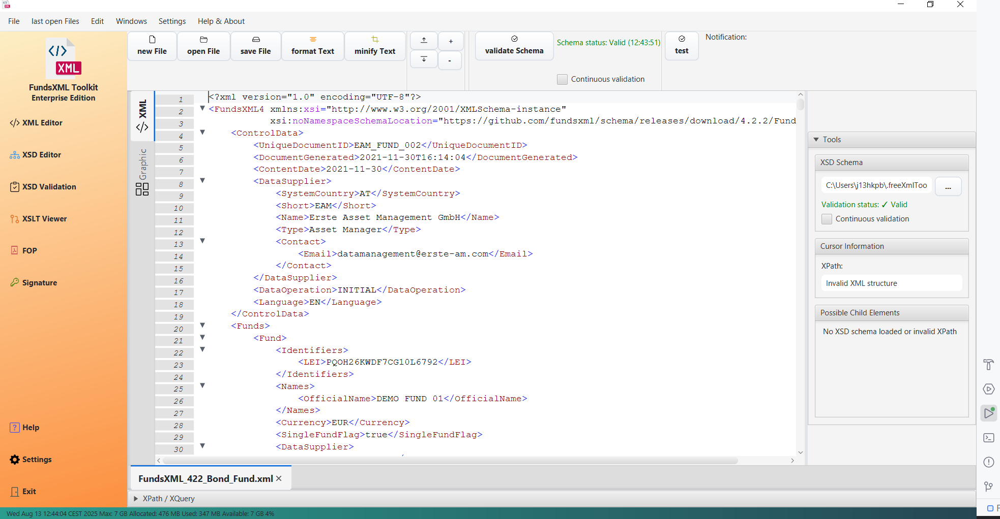
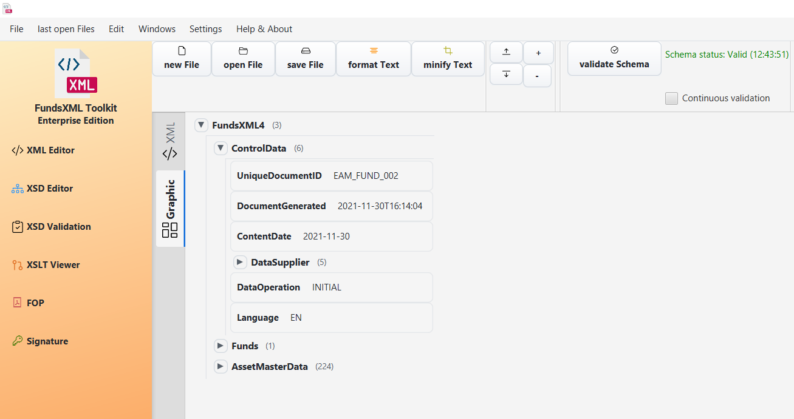

# XML Editor

The XML Editor is the core feature of the Free XML Toolkit. It provides a powerful and user-friendly interface for working with XML files.

## Key Features

### File Management
- **Open & Save:** Easily open existing XML files from your computer or save your work. The application remembers the last directory you used, making it convenient to access your files.
- **New Files:** Create new, empty XML documents from scratch.
- **Drag & Drop:** Simply drag and drop XML files from your file explorer directly into the editor to open them.

### Editing Experience

- **Dual-Mode Editing:** Switch between text editor and grid editor modes for different editing styles
    - **Text Mode:** Traditional code editor with syntax highlighting and advanced features
    - **Grid Mode:** Table-like interface for structured data editing
- **Graphical Tree View:** Visual representation of XML structure with interactive editing capabilities
- **Syntax Highlighting:** The editor automatically colors different parts of your XML, making it easier to read and
  understand the structure
- **Code Folding:** Collapse and expand XML sections to better navigate large files
- **IntelliSense/Auto-Completion:** Smart code completion that suggests only valid XML elements based on your loaded XSD
  schema
- **Line Numbers:** Each line is numbered, which is helpful for navigating large files and identifying specific
  locations
- **Font Size Control:** You can increase or decrease the font size for better readability

### Formatting Tools
- **Pretty Print:** With a single click, you can format your XML into a clean, indented structure. This is useful for making messy or unformatted XML readable.
- **Minify:** This tool compresses your XML into a single line by removing all whitespace. This is useful for reducing file size for transmission or storage.

### Validation
- **Well-Formedness Check:** The editor automatically checks if your XML is "well-formed," meaning it follows the basic syntax rules of XML.
- **Schema Validation:** Support for multiple validation methods:
    - **XSD (XML Schema Definition):** Validate against W3C XML Schema files for structure and data type validation
    - **Schematron:** Validate against business rules and custom constraints
- **Schema Features:**
    - **Automatic Schema Detection:** The tool can often find the schema reference within the XML file
    - **Manual Schema Selection:** You can manually select schema files from your computer to validate against
    - **Continuous Validation:** Get real-time feedback on your XML's validity as you type. The validation status is
      always visible
- **Supported Schema Formats:**
    - ✅ XSD (XML Schema Definition)
    - ✅ Schematron
    - ❌ DTD (Document Type Definition) - not supported
    - ❌ RelaxNG - not supported

### Querying
- **XPath & XQuery:** The editor includes dedicated tabs for running XPath and XQuery expressions. This allows you to search, filter, and extract specific data from your XML documents.

---

[Home](index.md) | [Next: XSD Tools](xsd-controller.md)
