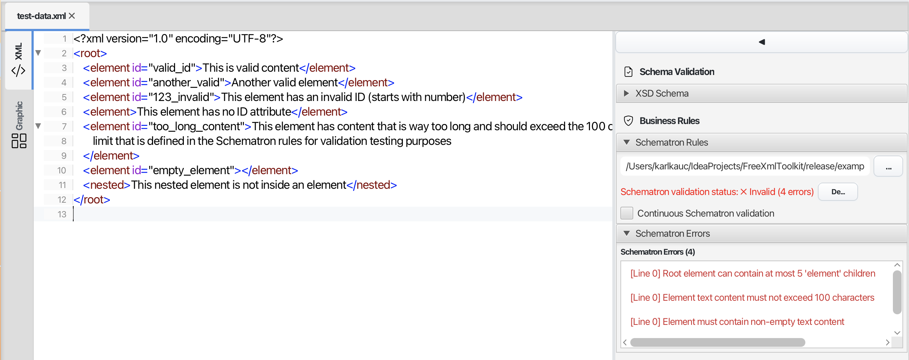
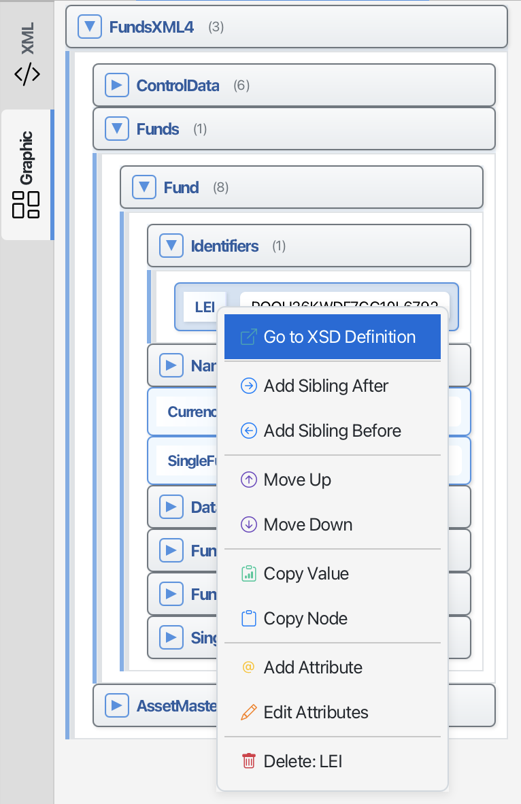

# XML Editor Features

> **Last Updated:** November 2025 | **Version:** 1.0.0

This page describes the advanced features available in the XML Editor.

---

## Schematron Integration

*Screenshot placeholder: Schematron validation panel*

### What is Schematron?

Schematron lets you create custom validation rules for your XML documents. While XSD schemas validate the structure, Schematron validates business rules - for example, "if field A contains X, then field B must not be empty."

### How to Use Schematron

1. Open an XML file in the XML Editor
2. In the sidebar, find the "Schematron Rules" section
3. Click the "..." button to select a Schematron file (.sch)
4. The validation results appear in the sidebar
5. Enable "Continuous Schematron validation" to check as you type

### Saving Schematron Files as Favorites

Save frequently used Schematron files for quick access:
- Click the star icon to add to favorites
- Organize files in custom categories like "Business Rules"
- Access saved rules from any editor via the Favorites dropdown

Learn more: [Schematron Support](schematron-support.md) | [Favorites System](favorites-system.md)

---

## Auto-Completion (IntelliSense)

*Screenshot placeholder: Auto-completion suggestions popup*

### Smart Element Suggestions

When you type `<` in the editor, a popup shows only the elements that are valid at your current position based on your XSD schema.

### How It Works

1. **Type `<`** - A popup appears with valid element options
2. **Use arrow keys** - Navigate through the suggestions
3. **Press Enter** - Insert the selected element
4. **Press Escape** - Close the popup

### Auto-Closing Tags

When you type an opening tag like `<element>`, the editor automatically adds the closing tag `</element>` and places your cursor between them.

Learn more: [Auto-Completion Guide](context-sensitive-intellisense.md)

---

## Grid Editor Mode

*Screenshot placeholder: Grid editor with data cells*

### Edit XML Like a Spreadsheet

The grid editor displays your XML data in a table format, making it easy to edit structured data.

### How to Use

1. Open an XML file in the XML Editor
2. Switch to the "Grid" tab
3. Click cells to edit values directly
4. Switch back to "XML" tab to see the updated code

Changes made in either mode are synchronized automatically.

---

## Code Folding

*Screenshot placeholder: Collapsed XML sections*

### Hide Sections for Better Navigation

For large XML files, you can collapse sections to focus on what you're working on:

- **Collapse**: Click the minus (-) icon next to an element
- **Expand**: Click the plus (+) icon to show the content again
- **Nested Folding**: Collapse parent elements to hide all children

---

## Tree View

*Screenshot placeholder: Tree view sidebar*

### Visual Document Structure

The tree view shows your XML document as a hierarchical structure:

- **Navigate**: Click on tree nodes to jump to that location in the text
- **Understand Structure**: Quickly see how your document is organized
- **Expand/Collapse**: Click arrows to show or hide child elements

---

## Supported Schema Formats

| Format | Support |
|--------|---------|
| XSD (XML Schema) | Full support with IntelliSense |
| Schematron | Business rules validation |
| DTD | Not supported |
| RelaxNG | Not supported |

---

## Navigation

| Previous | Home | Next |
|----------|------|------|
| [XML Editor](xml-controller.md) | [Home](index.md) | [XSD Tools](xsd-controller.md) |

**All Pages:** [XML Editor](xml-controller.md) | [XML Features](xml-editor-features.md) | [XSD Tools](xsd-controller.md) | [XSD Validation](xsd-validation-controller.md) | [XSLT](xslt-controller.md) | [FOP/PDF](fop-controller.md) | [Signatures](signature-controller.md) | [IntelliSense](context-sensitive-intellisense.md) | [Schematron](schematron-support.md) | [Favorites](favorites-system.md) | [Templates](template-management.md) | [Tech Stack](technology-stack.md) | [Licenses](licenses.md)
