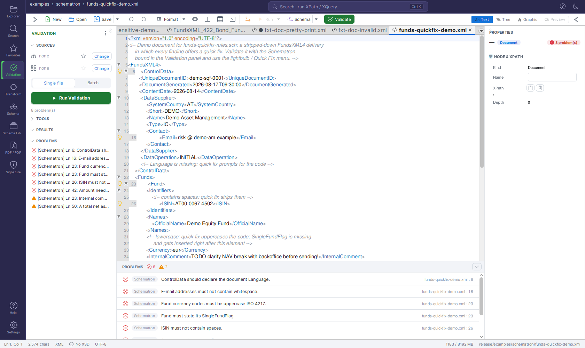
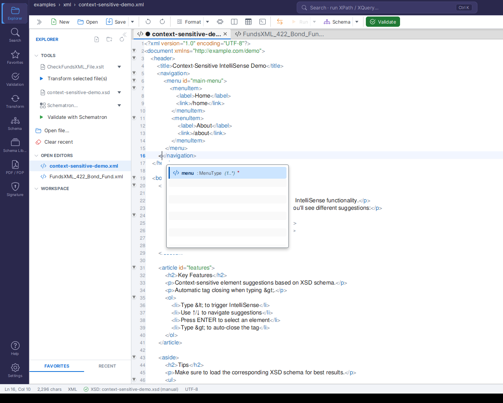
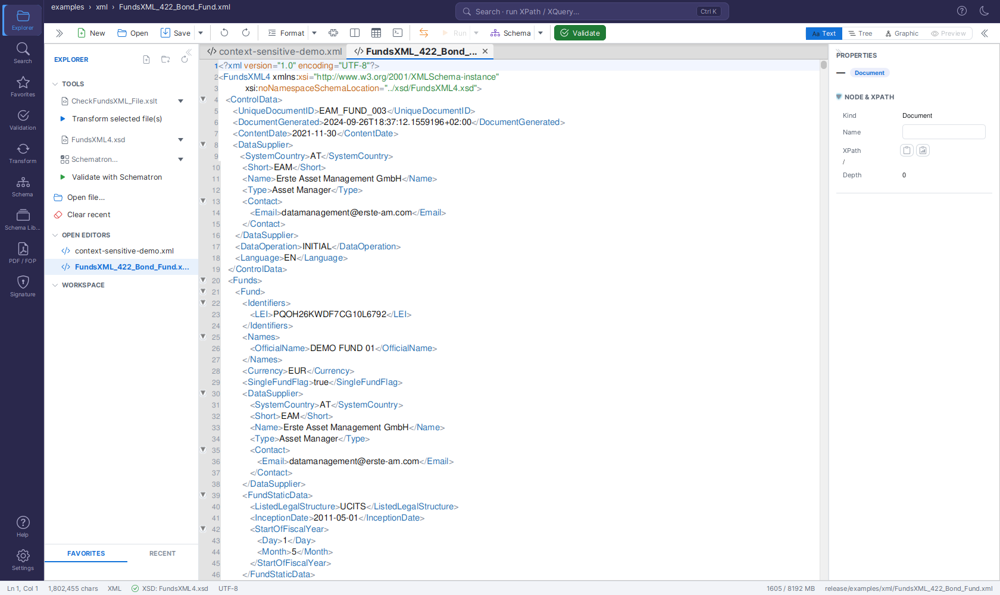

# XML Editor Features

> **Version:** 2.1.0

This page describes the advanced features available in the XML Editor.

---

## Search (Find)

> Search works in **every view mode** — Text, Tree and Graphic — for both XML documents and XSD schemas.

### Finding Text in Your Document

Press **Ctrl+F** to open the Find feature and type the text you are looking for. Use the up and down arrows (**Find Previous** / **Find Next**, or Enter / Shift+Enter) to move between matches. When you reach the last match, the search wraps around and continues from the beginning.

### Search Works in All Views

You can search in the **Text**, **Tree** or **Graphic** view of a document:

- **Text view** - Matches are highlighted in the source code. **Replace** is available here.
- **Graphic view (XML instances)** - The search looks through element names, attribute names, and values across the whole document. When you press the up/down arrows, the editor jumps directly to the matching node: if the match is inside a collapsed node, its parent nodes are expanded automatically, the matching row is selected, and it is scrolled into view.
- **Tree and Graphic views (XSD schemas)** - The search looks through the schema nodes themselves: element/attribute/type names, documentation and appinfo, type references, fixed/default values, enumeration and facet values, and comments. Matching nodes are revealed (collapsed branches expand), selected, and scrolled into view — in the Graphic diagram this includes loading lazily rendered subtrees.

Searching is **case-insensitive** in all views.

### Switching Views While Searching

If you switch the view mode (Text / Tree / Graphic) or the file tab while the search bar is open, the search automatically re-targets the view you switched to, so you can keep navigating without retyping your search term.

### Where Search Is Available

Pressing **Ctrl+F** opens an **inline search bar** at the top of the editor, with up/down
chevron arrows for Find Previous / Find Next and a replace toggle (Text view only). The same
bar works in every view mode and every XML-family document type.

> **Note:** In the **Tree** and **Graphic** views, search is for finding and navigating only - **Replace** is not available there (the replace toggle is disabled). To replace text, use the **Text** view.

> **Note:** HTML documents have a rendered, read-only **Preview** view instead of Tree/Graphic (see [HTML Preview](unified-shell.md#html-preview)). Pressing **Ctrl+F** there searches the document's underlying markup text, not the rendered page.

### Searching Across Many Files

Ctrl+F searches the **active document**. To search - and replace -
across **all files of a folder**, by plain text or by an XPath expression, use the
**Search** activity in the Unified Shell: press **Ctrl+Shift+F** (Find in Files) or
**Ctrl+Shift+H** (Replace in Files), or click the magnifying-glass icon in the activity
bar. See the [Search Panel](unified-shell.md#search-panel) guide.

> **Changed shortcut:** Ctrl+Shift+F used to format the document - **Format Document is
> now Shift+Alt+F**.

---

## Schematron Integration

*Schematron validation in the Validation panel - the bound rules file in SOURCES, the
findings in the PROBLEMS list*

### What is Schematron?

Schematron lets you create custom validation rules for your XML documents. While XSD schemas validate the structure, Schematron validates business rules - for example, "if field A contains X, then field B must not be empty."

### How to Use Schematron

1. Open an XML file in the editor
2. Open the **Validation** panel from the activity bar
3. In the **SOURCES** section, click **Change** on the Schematron row and pick a `.sch`
   file - or pick a favorited Schematron from the row's **star** menu, or simply drop a
   `.sch` file onto the row
4. Click **Run Validation** - the findings appear in the **PROBLEMS** list (each row tagged
   with a **Schematron** badge); click a problem to jump to the offending element
5. Enable **Validate while typing** (the panel's ⋮ menu) to check as you type

Problems whose rules define **quick fixes** can be corrected in place: click the yellow
lightbulb in the editor gutter (or press **Alt+Enter** / **Ctrl+.**), or right-click the
problem row and pick a fix from the **Quick Fix** submenu. See
[Schematron Quick Fixes](schematron-quick-fixes.md).

### Saving Schematron Files as Favorites

Save frequently used Schematron files for quick access:
- Add them to your [Favorites](favorites-system.md) (for example with **Add current** in the
  Favorites panel while the `.sch` file is open)
- Organize them in favorites folders like "Business Rules"
- Bind a saved rules file in one click via the **star** menu on the Validation panel's
  Schematron row - or from the Explorer's Schematron bar

Learn more: [Schematron Support](schematron-support.md) | [Favorites System](favorites-system.md)

---

## Auto-Completion (IntelliSense)

*Auto-completion suggestions popup*

### Smart Element Suggestions

When you type `<` in the editor, a popup shows only the elements that are valid at your current position based on your XSD schema.

### How It Works

1. **Type `<`** - A popup appears with valid element options
2. **Use arrow keys** - Navigate through the suggestions
3. **Press Enter** - Insert the selected element
4. **Press Escape** - Close the popup

### Auto-Closing Tags

When you type an opening tag like `<element>`, the editor automatically adds the closing tag `</element>` and places your cursor between them.

Learn more: [Auto-Completion Guide](context-sensitive-intellisense.md)

---

## Grid Editor (Graphic View)

> For XML (and XSLT/Schematron) documents, switching to the **Graphic**
> view opens the editable XMLSpy-style grid.

*The grid in the Unified Shell's Graphic view — table-like editing with the inspector*

### Edit XML Like a Spreadsheet

The grid displays your XML data in a table format, making it easy to edit structured data.

### How to Use

1. Open an XML file in the editor
2. Switch to the **Graphic** view with the segmented view switch
3. Click cells to edit values directly
4. Add, delete, or move nodes using the right-click context menu
5. Select a row to view and edit its properties in the Properties inspector
6. Switch back to the **Text** view to see the updated code

Changes made in any view are synchronized automatically.

### Reading the Grid

- The **header strip** at the top reads *"Grid view · nested · repeating elements as embedded
  grids"* and offers a **Collapse all** button that folds every container at once.
- Rows holding a simple value are marked with **`{}`**.
- Collapsed containers show a **"collapsed"** hint so you know there is hidden content.
- Repeating elements appear as **embedded grids** - small tables nested inside the row.

---

## Properties Inspector

> You can view **and edit** a node's properties from **all three**
> XML views (Text, Tree, and Graphic).

The Properties inspector shows the details of the selected node and lets you edit them. Toggle
it with the panel toggle at the right end of the editor toolbar.

- **Select a node** by moving the text caret into an element (Text view), clicking a node
  (Tree view), or selecting a row in the grid (Graphic view).
- **Edit** the element name, namespace (prefix/URI), attributes (add/rename/remove), leaf text,
  and the text of comments, CDATA, and processing instructions.
- Edits are written straight back to the document text, keeping everything in sync.
- When a schema is bound, the inspector also shows read-only hints: the schema-derived type,
  documentation, and lists of valid child elements and example values.
- All views share one in-memory model, so edits and Undo/Redo history carry over when you
  switch views.

See the [Properties Inspector](xml-editor.md#properties-inspector) section for full details.

---

## Code Folding

*Code folding - collapse XML sections to focus on the parts that matter*

### Hide Sections for Better Navigation

For large XML files, you can collapse sections to focus on what you're working on:

- **Collapse**: Click the minus (-) icon next to an element
- **Expand**: Click the plus (+) icon to show the content again
- **Nested Folding**: Collapse parent elements to hide all children

---

## Tree View

*An XML document in the Tree view*

### Visual Document Structure

The tree view shows your XML document as a hierarchical structure:

- **Navigate**: Click on tree nodes to jump to that location in the text
- **Understand Structure**: Quickly see how your document is organized
- **Expand/Collapse**: Click arrows to show or hide child elements
- **Edit Properties**: Click a node to select it and edit its properties in the
  [Properties Inspector](#properties-inspector)

---

## Supported Schema Formats

| Format | Support |
|--------|---------|
| XSD (XML Schema) | Full support with IntelliSense |
| Schematron | Business rules validation |
| DTD | Not supported |
| RelaxNG | Not supported |

---

## Navigation

| Previous                    | Home             | Next                      |
|-----------------------------|------------------|---------------------------|
| [XML Editor](xml-editor.md) | [Home](index.md) | [XSD Tools](xsd-tools.md) |

**All Pages:** [Unified Shell](unified-shell.md) | [XML Editor](xml-editor.md) | [XML Features](xml-editor-features.md) | [JSON Editor](json-editor.md) | [XSD Tools](xsd-tools.md) | [Profiled XML Generation](profiled-xml-generation.md) | [XSD Validation](xsd-validation.md) | [XSLT Viewer](xslt-viewer.md) | [XSLT Developer](xslt-developer.md) | [FOP/PDF](pdf-generator.md) | [Signatures](digital-signatures.md) | [IntelliSense](context-sensitive-intellisense.md) | [Schematron](schematron-support.md) | [FundsXML Extensions](fundsxml-extensions.md) | [Favorites](favorites-system.md) | [Templates](template-management.md) | [Tech Stack](technology-stack.md) | [Security](SECURITY.md) | [Licenses](licenses.md)
