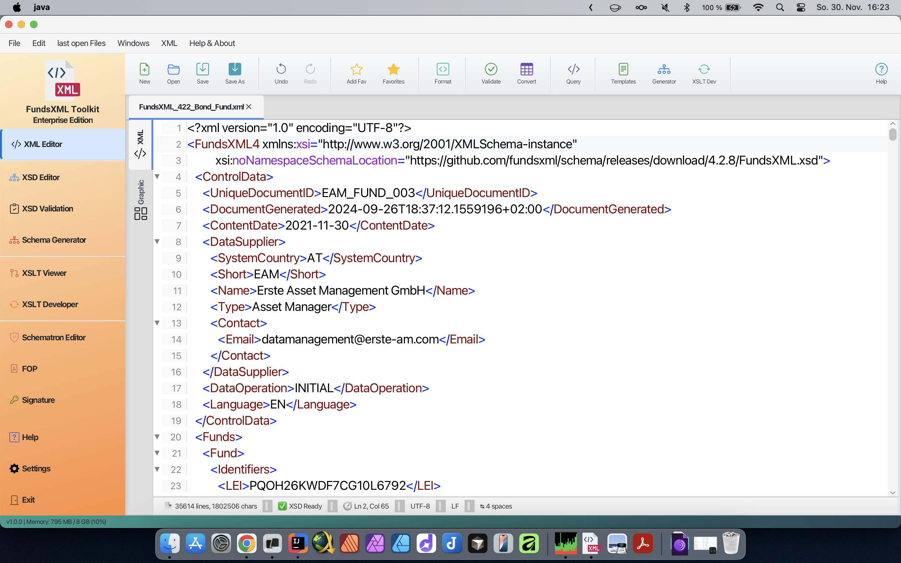
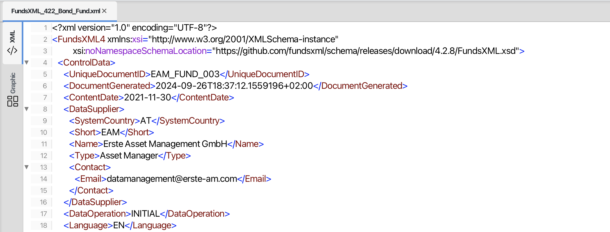
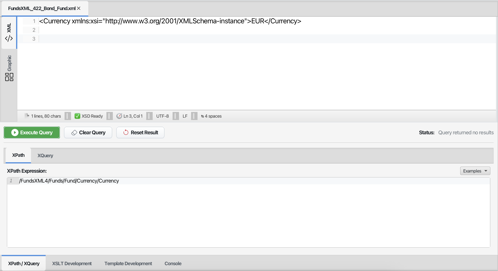

# XML Editor

> **Last Updated:** December 2025 | **Version:** 1.1.0

The XML Editor is the main feature of FreeXmlToolkit. It provides a powerful and easy-to-use interface for working with XML files.

---

## Overview

*The XML Editor in text mode with syntax highlighting*

*The XML Editor in grid mode for structured editing*

---

## Toolbar

| Button | Shortcut | Description |
|--------|----------|-------------|
| **New** | Ctrl+N | Create new XML document |
| **Open** | Ctrl+O | Open XML file |
| **Save** | Ctrl+S | Save current file |
| **Save As** | Ctrl+Shift+S | Save with new name |
| **Recent** | Ctrl+Shift+R | Open recent files menu |
| **Undo** | Ctrl+Z | Undo last change |
| **Redo** | Ctrl+Y | Redo undone change |
| **Add Favorite** | Ctrl+D | Add file to favorites |
| **Favorites** | Ctrl+Shift+D | Toggle favorites panel |
| **Format** | Ctrl+Alt+F | Pretty print XML |
| **Validate** | F5 | Validate XML |
| **Convert** | Ctrl+E | XML/Excel/CSV converter |
| **Query** | Ctrl+Q | Run XPath/XQuery |
| **Templates** | Ctrl+T | Open template manager |
| **Generator** | Ctrl+G | Schema generator |
| **XSLT Dev** | Ctrl+Shift+T | XSLT development panel |
| **Properties** | Ctrl+P | Toggle properties panel |
| **XPath** | Ctrl+Q | Toggle XPath panel |
| **Help** | F1 | Show help |

---

## Working with Files

### Opening and Saving Files

*File toolbar with Open, Save, and New buttons*

- **Open Files**: Click "Open" or use `Ctrl+O` to browse for XML files
- **Save Files**: Click "Save" or use `Ctrl+S` to save changes
- **Save As**: Use `Ctrl+Shift+S` to save with a new name
- **Create New**: Click "New" to start with an empty XML document
- **Drag & Drop**: Drag files from your file explorer into the editor
- **Recent Files**: Quick access to recently opened files

### Multiple Files

Open multiple XML files in separate tabs. Each tab shows the file name and indicates unsaved changes with an asterisk (*).

---

## Editing Modes

### Text Mode

*Text editor with syntax highlighting*

The text editor provides:

- **Syntax Highlighting**: XML elements, attributes, and values are color-coded
- **Line Numbers**: Every line is numbered for easy reference
- **Code Folding**: Click arrows to collapse or expand sections
- **Auto-Completion**: Type `<` to see suggestions for valid elements
- **Error Highlighting**: Invalid XML is highlighted in red

### Tree View

*Tree view showing XML structure*

- See your XML document as a hierarchical tree
- Drag and drop elements to reorganize structure
- Right-click for context menu options
- Double-click to edit element values

### Grid Mode

*Grid editor showing table-like XML editing*

The grid editor provides:

- **Table View**: Edit XML data in a spreadsheet-like interface
- **Direct Cell Editing**: Click cells to edit values directly
- **Easy Navigation**: Move through the document using arrow keys
- **Sorting**: Sort data by clicking column headers

---

## Auto-Completion (IntelliSense)

*Auto-completion popup showing element suggestions*

The editor automatically suggests valid elements and attributes based on your XSD schema:

1. **Type `<`** to see a list of valid child elements
2. **Navigate** through suggestions with arrow keys
3. **Press Enter** to insert the selected element
4. **Press Escape** to close the suggestions

The suggestions are context-sensitive - only elements valid at your current position are shown.

Learn more: [Auto-Completion Guide](context-sensitive-intellisense.md)

---

## Formatting Tools

### Pretty Print

*Before pretty print*

Click **Format** or use `Ctrl+Alt+F` to format your XML with proper indentation.

*After pretty print*

---

## Validation

*Validation panel showing errors and warnings*

### How to Validate

1. Click **Validate** or press **F5**
2. If your XML references a schema, it's loaded automatically
3. Errors and warnings appear in the validation panel
4. Click an error to jump to the problem location

### Supported Validation Methods

| Method | Description |
|--------|-------------|
| **Well-Formed Check** | Ensures basic XML syntax is correct |
| **XSD Validation** | Validates against XML Schema files |
| **Schematron** | Validates against business rules |

### Supported Schema Formats

| Format | Support |
|--------|---------|
| XSD (XML Schema) | Full support (1.0 and 1.1) |
| Schematron | Full support |
| DTD | Not supported |
| RelaxNG | Not supported |

---

## XPath and XQuery

*XPath panel with query input and results*

Use XPath and XQuery to find and extract data from your XML documents.

### Using the XPath/XQuery Panel

1. Toggle the panel with **Ctrl+Q** or click the **XPath** button
2. Choose **XPath** or **XQuery** tab
3. Enter your expression
4. Click **Execute Query**
5. View results in the editor (matching nodes are highlighted)

### XPath Examples

| Expression | Description |
|------------|-------------|
| `//element` | Find all elements named "element" |
| `//element/@attr` | Find all "attr" attributes on "element" |
| `/root/child[1]` | Find the first child of root |
| `count(//item)` | Count all item elements |
| `//text()` | Find all text nodes |

### XQuery Examples

| Expression | Description |
|------------|-------------|
| `for $x in //item return $x` | Return all items |
| `for $x in //item where $x/@id='1' return $x/name` | Filter and return |

Use the **Examples** menu for quick insertion of common expressions.

---

## XML/Excel/CSV Converter

Click **Convert** (Ctrl+E) to open the converter dialog:

- **XML to Excel**: Export XML data to Excel spreadsheet
- **XML to CSV**: Export XML data to CSV file
- **Excel to XML**: Import Excel data as XML
- **CSV to XML**: Import CSV data as XML

---

## Templates

Click **Templates** (Ctrl+T) to access the template manager:

- Insert pre-defined XML snippets
- Create your own templates
- Organize templates by category

Learn more: [Template Management](template-management.md)

---

## Schema Generator

Click **Generator** (Ctrl+G) to generate an XSD schema from your XML:

- Analyze XML structure
- Generate matching XSD schema
- Customize type detection

---

## Favorites

Save frequently used files for quick access:

- **Add Favorite** (Ctrl+D) - Save current file to favorites
- **Favorites** (Ctrl+Shift+D) - Show/hide favorites panel

The favorites panel appears on the right side.

Learn more: [Favorites System](favorites-system.md)

---

## Keyboard Shortcuts

| Shortcut | Action |
|----------|--------|
| Ctrl+N | New file |
| Ctrl+O | Open file |
| Ctrl+S | Save file |
| Ctrl+Shift+S | Save As |
| Ctrl+W | Close tab |
| Ctrl+Z | Undo |
| Ctrl+Y | Redo |
| Ctrl+F | Find |
| Ctrl+H | Replace |
| Ctrl+G | Go to line |
| Ctrl+D | Add to favorites |
| Ctrl+Shift+D | Toggle favorites |
| Ctrl+Alt+F | Format/Pretty Print |
| Ctrl+Q | Toggle XPath panel |
| Ctrl+E | XML/Excel converter |
| Ctrl+T | Templates |
| Ctrl++ | Zoom in |
| Ctrl+- | Zoom out |
| F5 | Validate |
| F1 | Help |
| `<` | Open auto-completion |

---

## Tips

- **Multiple Files**: Open multiple XML files in different tabs
- **Remember Location**: The editor remembers the last folder you used
- **Font Size**: Use `Ctrl++` and `Ctrl+-` to adjust font size
- **Quick Validation**: Errors are highlighted as you type
- **Drag & Drop**: Drag files directly into the editor window
- **Recent Files**: Use the Recent menu for quick access

---

## Navigation

| Previous | Home | Next |
|----------|------|------|
| [Home](index.md) | [Home](index.md) | [XML Editor Features](xml-editor-features.md) |

**All Pages:** [XML Editor](xml-editor.md) | [XML Features](xml-editor-features.md) | [XSD Tools](xsd-tools.md) | [XSD Validation](xsd-validation.md) | [XSLT Viewer](xslt-viewer.md) | [XSLT Developer](xslt-developer.md) | [FOP/PDF](pdf-generator.md) | [Signatures](digital-signatures.md) | [IntelliSense](context-sensitive-intellisense.md) | [Schematron](schematron-support.md) | [Favorites](favorites-system.md) | [Templates](template-management.md) | [Tech Stack](technology-stack.md) | [Licenses](licenses.md)
