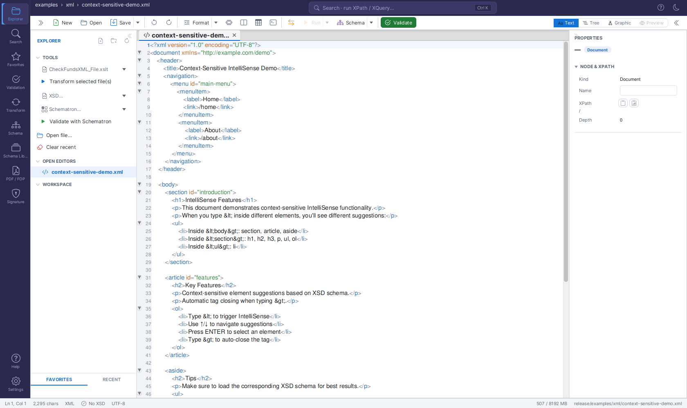
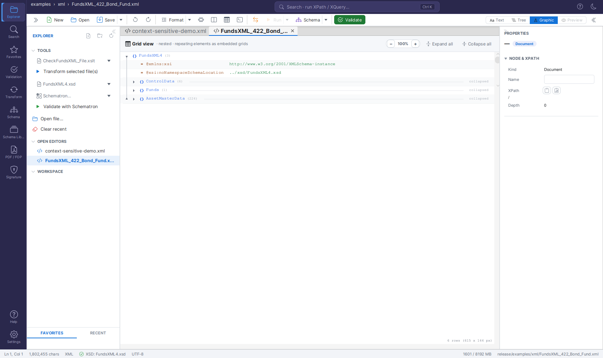
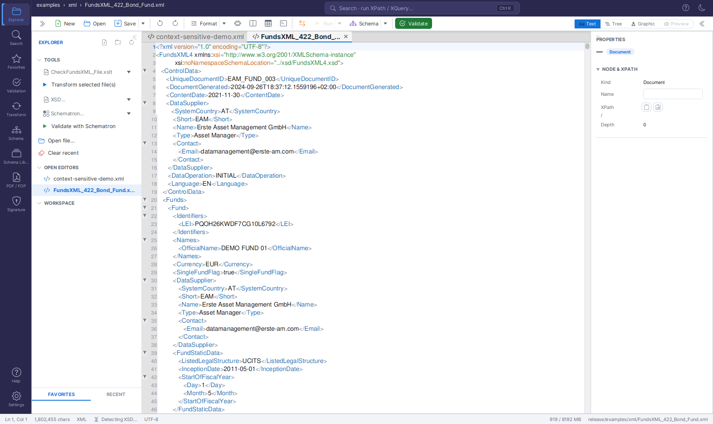
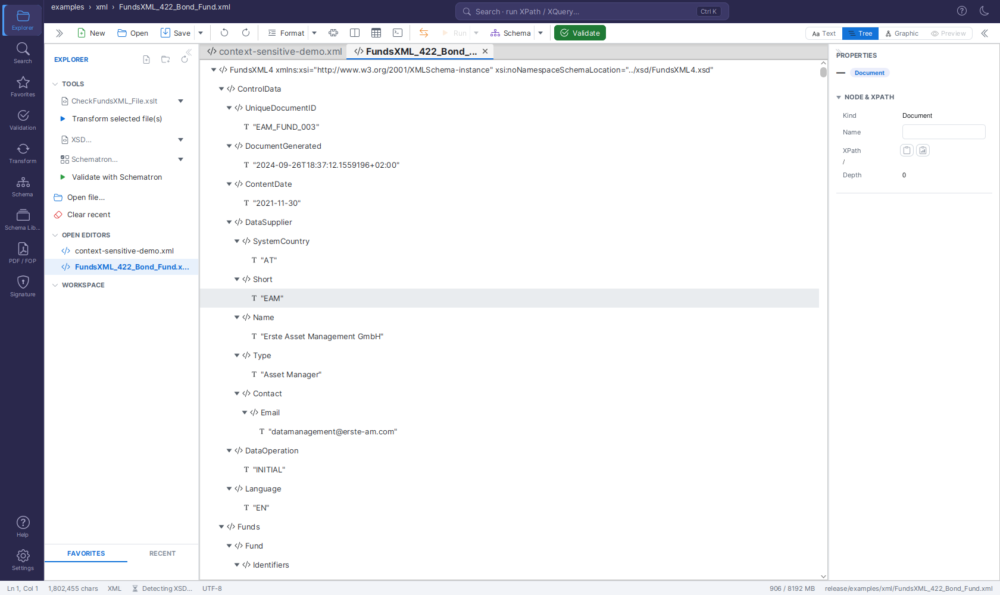
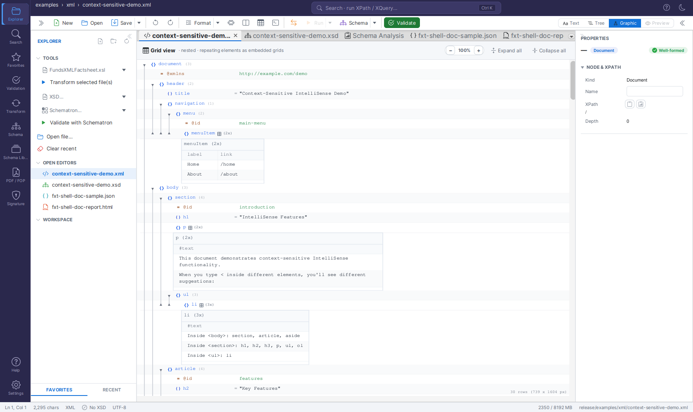
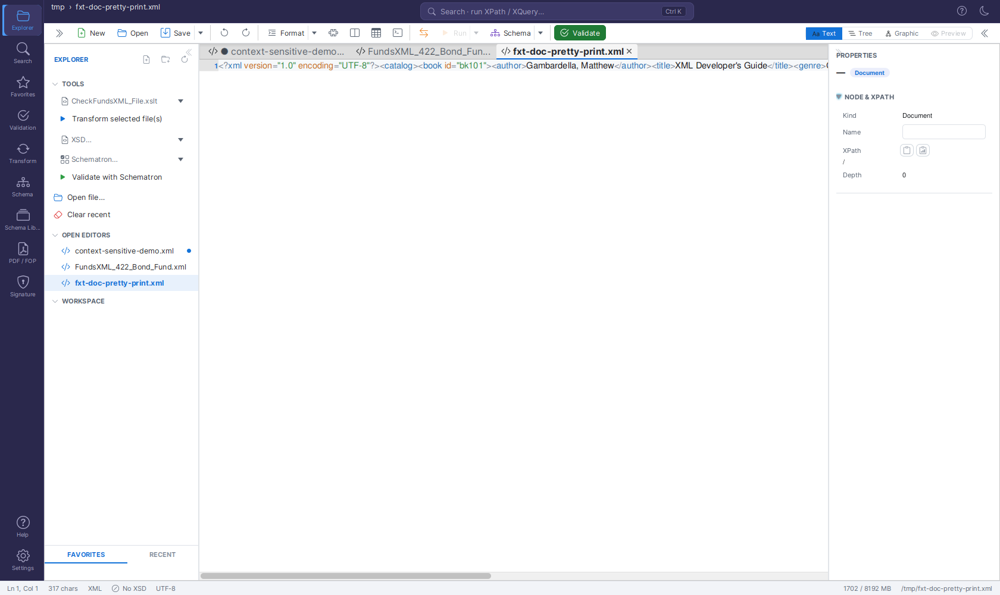
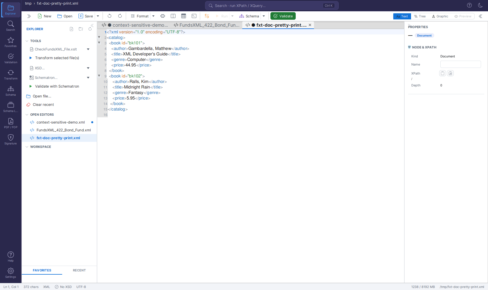
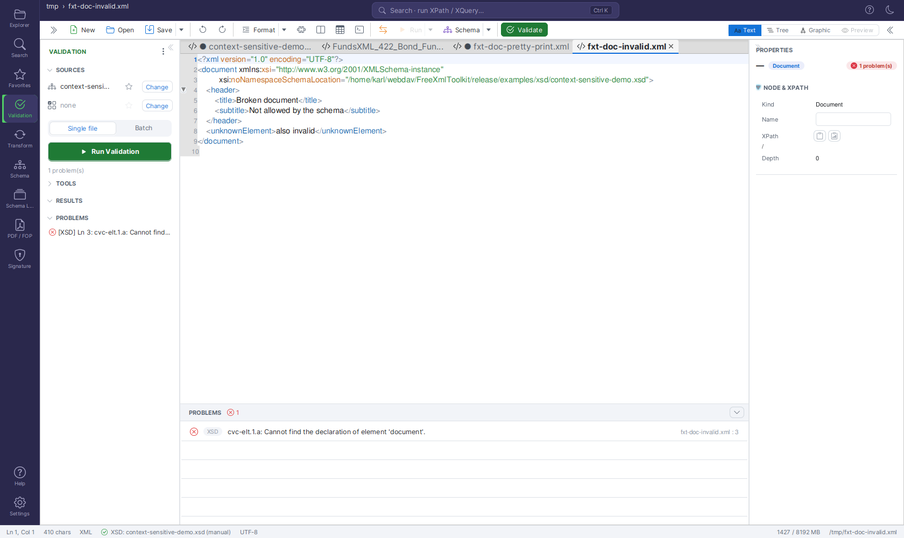
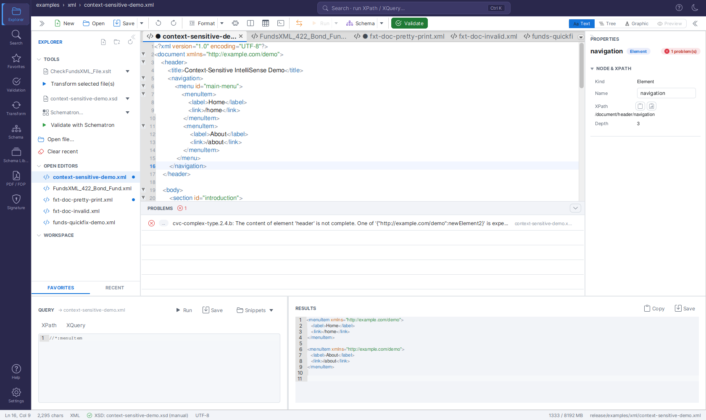

# XML Editor

> **Version:** 2.0.1

The XML Editor is the main feature of FreeXmlToolkit. It provides a powerful and easy-to-use interface for working with XML files.

---

## Overview

*The XML Editor in text mode with syntax highlighting*

*The XML Editor in the Graphic view (grid) for structured editing*

---

## Toolbar

> The editor toolbar is a single slim row. Related actions sit in
> **split buttons** with a visible **▾** arrow menu (e.g. **Save As / Save All** under
> **Save ▾**, **Minify** under **Format ▾**); secondary tools are icon-only buttons with
> tooltips. See [Unified Shell - Toolbar](unified-shell.md#toolbar) for the full reference.

With an XML file active, the toolbar offers:

| Button | Shortcut | Description |
|--------|----------|-------------|
| **New** | Ctrl+N | Open the guided New File dialog |
| **Open** | Ctrl+O | Open one or more files |
| **Save ▾** | Ctrl+S | Save the current file; the arrow menu holds **Save As…** (Ctrl+Shift+S) and **Save All** |
| **Undo** / **Redo** | Ctrl+Z / Ctrl+Y | Undo / redo the last change (icon buttons) |
| **Format ▾** | Shift+Alt+F | Pretty-print the document; the arrow menu holds **Minify**. (Note: Ctrl+Shift+F opens [Find in Files](unified-shell.md#search-panel), not document search.) |
| **Insert Template** | - | Insert a snippet from the template system (icon button) |
| **Compare** | - | Compare the document with another file, side by side (icon button) |
| **Spreadsheet** | - | Excel / CSV ↔ XML converter (icon button) |
| **Query Console** | Ctrl+Shift+X | Toggle the bottom XPath/XQuery console (icon button) |
| **Transform XSLT** | - | Pick a stylesheet and transform the active XML (icon button) |
| **Schema ▾** | - | **Set XSD Schema…** for IntelliSense and validation; the arrow menu also holds **Generate Documentation…** and **Type Editor…** (enabled for XSD files) |
| **Validate** | F8 | Validate the document (accent-colored primary action) |

The **Run ▾** button and the **Target** dropdown appear when a query, XSLT, or XProc document
is active - see [Query Documents](unified-shell.md#query-documents-the-target-selector).

---

## Working with Files

### Opening and Saving Files

*The shell header and the editor toolbar with the New, Open, Save ▾, and Format ▾ buttons*

- **Open Files**: Click "Open" or use `Ctrl+O` to browse for XML files
- **Save Files**: Click "Save" or use `Ctrl+S` to save changes to the current file
- **Save As**: Use `Ctrl+Shift+S` (or the **Save ▾** arrow menu) to save the current file with a new name
- **Save All**: Pick **Save All** from the **Save ▾** arrow menu to save every open document tab at once (untitled tabs prompt you for a file name)
- **Create New**: Click "New" (Ctrl+N) to open the guided [New File dialog](unified-shell.md#new-file-dialog) - pick a file type, an optional template or schema, and start editing
- **Drag & Drop**: Drag files from your file explorer into the editor
- **Recent Files**: Reopen recently used files from the Explorer panel's **RECENT** section or the Welcome page

### Multiple Files

Open multiple XML files in separate tabs. Each tab shows the file name and indicates unsaved changes with an asterisk (*).

---

## Editing Modes

### Text Mode

*Text editor with syntax highlighting*

The text editor provides:

- **Syntax Highlighting**: XML elements, attributes, and values are color-coded
- **Line Numbers**: Every line is numbered for easy reference
- **Code Folding**: Click arrows to collapse or expand sections
- **Auto-Completion**: Type `<` to see suggestions for valid elements
- **Error Highlighting**: Invalid XML is highlighted in red
- **Edit Properties**: Move the text cursor into an element and edit its properties in the
  Properties inspector - see [Properties Inspector](#properties-inspector)

### Tree View

*Tree view showing XML structure*

- See your XML document as a hierarchical tree
- Click any node (element, text, comment, CDATA, or processing instruction) to select it
- Edit the selected node's properties in the Properties inspector - see
  [Properties Inspector](#properties-inspector)
- Right-click for context menu options

### Graphic Mode (Grid)

> For XML documents, the **Graphic** view shows the editable XMLSpy-style grid.

*An XML document in the Graphic view (XMLSpy-style grid editing)*

The grid provides:

- **Table View**: Edit XML data in a spreadsheet-like interface
- **Header Strip**: A header at the top ("Grid view · nested · repeating elements as embedded
  grids") with a **Collapse all** button that folds every container at once
- **Value Markers**: Rows with a simple value are marked with `{}`; collapsed containers show a
  "collapsed" hint
- **Direct Cell Editing**: Click cells to edit values directly
- **Easy Navigation**: Move through the document using arrow keys
- **Sorting**: Sort data by clicking column headers
- **Structural Editing**: Add, delete, and move nodes through the right-click context menu
- **Edit Properties**: Select a row to edit its properties in the Properties inspector -
  see [Properties Inspector](#properties-inspector)

---

## Properties Inspector

> The Properties inspector lets you view **and edit** a node's
> properties in **all three** XML views - Text, Tree, and Graphic.

The Properties inspector shows the details of the currently selected node and lets you change
them. Toggle the panel with the toggle at the right end of the editor toolbar; it appears on
the right side of the editor.

### Selecting a Node

How you select a node depends on the active view:

- **Text view** - Move the text caret into an element. That element is selected automatically
  and shown in the inspector. If the caret is not inside a well-formed element, the inspector
  shows a read-only view with the node's name and XPath.
- **Tree view** - Click a node in the tree (element, text, comment, CDATA, or processing
  instruction).
- **Graphic view** - Select a row in the grid.

### What You Can Edit

Depending on the node type, the inspector lets you edit:

- **Element name** and its **namespace** (prefix and URI)
- **Attributes** - add, rename, and remove them
- **Text content** of leaf elements
- **Text** of comments, CDATA sections, and processing instructions

Your edits are written straight back to the document, so the source text always stays in sync.
In the Text view, edits are applied as a minimal change that keeps your caret and scroll
position in place.

### Read-Only Schema Hints

When the XML file is bound to an XSD schema, the inspector also shows helpful, read-only
information for the selected element:

- The **schema type** derived from the XSD
- The element's **documentation**
- Lists of **valid child elements** and **example values**

These hints help you fill in correct content but cannot be edited from the inspector.

### Shared Across Views

All three views share a single in-memory model for each open document. This means your edits -
and your full **Undo / Redo** history - are preserved when you switch between the Text, Tree,
and Graphic views.

> **Note:** Adding, deleting, or moving whole nodes (structural editing) is done in the
> **Graphic** view (the grid) via its right-click context menu. The Text and Tree views provide
> property editing through the inspector.

---

## Search (Find)

> Search works in **every view mode** - Text, Tree, and Graphic.

Press **Ctrl+F** to find text in your document. An inline search bar opens where you type your search term and use the up and down arrows (**Find Previous** / **Find Next**, or Enter / Shift+Enter) to move between matches; the search wraps around at the end.

Search works in all views (case-insensitive):

- **Text view** - Matches are highlighted in the source. **Replace** is available here.
- **Tree and Graphic views** - The search looks through element names, attribute names, and values across the whole document. The editor jumps to each matching node, auto-expanding collapsed parent nodes, selecting the matching row, and scrolling it into view. (**Replace** is not available here.)

If you switch the view mode (Text / Tree / Graphic) or the file tab while the search bar is open, the search re-targets the active view automatically.

Learn more: [Search (Find)](xml-editor-features.md#search-find)

---

## Auto-Completion (IntelliSense)

*Auto-completion popup showing element suggestions*

The editor automatically suggests valid elements and attributes based on your XSD schema:

1. **Type `<`** to see a list of valid child elements
2. **Navigate** through suggestions with arrow keys
3. **Press Enter** to insert the selected element
4. **Press Escape** to close the suggestions

The suggestions are context-sensitive - only elements valid at your current position are shown.

Learn more: [Auto-Completion Guide](context-sensitive-intellisense.md)

---

## Binding an XSD Schema

> Bind an XSD to the active document directly from the editor.

If your XML does not reference its schema (or you want to use a different one), you can bind an
XSD by hand:

1. Click the **"No XSD"** indicator in the **status bar** (it shows **"XSD: name"** once a
   schema is bound), or click the toolbar's **Schema** button (**Set XSD Schema…**).
2. Choose an `.xsd` file.

The binding applies to the active document and drives **both** features at once:

- **IntelliSense** - auto-completion suggests the elements and attributes the schema allows.
- **Schema validation** - Validate (F8) and continuous validation check against the bound XSD.

---

## Formatting Tools

### Pretty Print

*Before pretty print*

Click **Format** or use `Shift+Alt+F` to format your XML with proper indentation. (The
**Format ▾** arrow menu also offers **Minify** to strip all insignificant whitespace.)

*After pretty print*

---

## Validation

*Validation panel showing errors and warnings*

### How to Validate

1. Click **Validate** or press **F8**
2. If your XML references a schema, it's loaded automatically - or bind one yourself, see
   [Binding an XSD Schema](#binding-an-xsd-schema)
3. Errors and warnings appear in the **PROBLEMS** panel below the editor (and in the
   Validation activity's PROBLEMS list)
4. Click an error to jump to the problem location

### Supported Validation Methods

| Method | Description |
|--------|-------------|
| **Well-Formed Check** | Ensures basic XML syntax is correct |
| **XSD Validation** | Validates against XML Schema files |
| **Schematron** | Validates against business rules |

### Supported Schema Formats

| Format | Support |
|--------|---------|
| XSD (XML Schema) | Full support (1.0 and 1.1) |
| Schematron | Full support |
| DTD | Not supported |
| RelaxNG | Not supported |

---

## XPath and XQuery

*The Query Console docked below the editor - XPath query on the left, the result on the right*

Use XPath and XQuery to find and extract data from your XML documents. The fastest way is
the **Query Console**, a panel that docks along the bottom of the editor and always runs
against the **active** document.

### Using the Query Console

1. Toggle the console with **Ctrl+Shift+X** or the toolbar's terminal icon
2. Choose **XPath** or **XQuery** with the mode toggle
3. Enter your expression - it is syntax-highlighted, and IntelliSense suggests element
   names, functions, and axes as you type (or on **Ctrl+Space**)
4. Click **Run** (in XPath mode, **Enter** also runs; in XQuery mode use **Ctrl+Enter**)
5. The result appears in the read-only results pane on the right, with syntax highlighting;
   **Copy** puts it on the clipboard

**Save** stores the current expression as a named snippet, and the **Snippets** menu loads
any saved XPath or XQuery snippet back into the console. See
[Query Console](unified-shell.md#query-console) for the full reference.

### XPath Examples

| Expression | Description |
|------------|-------------|
| `//element` | Find all elements named "element" |
| `//element/@attr` | Find all "attr" attributes on "element" |
| `/root/child[1]` | Find the first child of root |
| `count(//item)` | Count all item elements |
| `//text()` | Find all text nodes |

### XQuery Examples

| Expression | Description |
|------------|-------------|
| `for $x in //item return $x` | Return all items |
| `for $x in //item where $x/@id='1' return $x/name` | Filter and return |

Use the **Examples** menu for quick insertion of common expressions.

### Bundled Example Collections

Your FreeXmlToolkit installation ships ready-to-run query
collections in the `examples` folder next to the application:

- **`examples/xpath/`** - 32 XPath 3.1 expressions (one per file, each with a comment
  header). Files 01-20 cover the basics; files 21-32 are a **reporting series** that
  joins positions, asset master data and transactions and outputs CSV, ASCII
  tables/charts, Markdown tables or JSON.
- **`examples/xquery/`** - 17 XQuery 3.1 scripts. Files 01-11 are data-quality checks
  with HTML reports; files 12-17 are **reporting/export examples** (CSV export, ASCII
  dashboard, Markdown fund report, JSON export, pivot table, two-fund comparison).
- **`examples/xproc/`** - 8 XProc 3.0 pipelines, from a minimal identity pipeline to
  multi-step chains: slimming with `p:delete`, CSV/JSON export by orchestrating the
  bundled stylesheets, metadata stamping, `p:for-each` iteration, `p:choose`
  branching and a Schematron SVRL report. See the folder's `README.md`.

All examples target the FundsXML4 sample documents in `examples/xml/`. The simplest way
to run one: **open the file directly** and press the toolbar's **Run** button
(`Ctrl+Enter`) - query, XSLT and XProc files are first-class editor documents that run
against the [Target dropdown](unified-shell.md#query-documents-the-target-selector)'s
selection (by default the most recently active XML document). Alternatively paste a query
into the query panel or the [Query Console](unified-shell.md#query-console) - the
`map:`, `array:` and `math:` function namespaces are pre-declared, so expressions using
`map:merge()`, `array:size()` etc. run without any prolog. Each folder contains a
`README.md` describing every example.

---

## XML/Excel/CSV Converter

Click the **Spreadsheet Converter** toolbar button (Ctrl+E) to open the converter dialog:

- **XML to Excel**: Export XML data to Excel spreadsheet
- **XML to CSV**: Export XML data to CSV file
- **Excel to XML**: Import Excel data as XML
- **CSV to XML**: Import CSV data as XML

---

## Templates

Click the **Insert Template** toolbar button (Ctrl+T) to insert a snippet:

- Insert pre-defined XML snippets
- Create your own templates (Settings → Templates)
- Organize templates by category

Learn more: [Template Management](template-management.md)

---

## Schema Generator

Press **Ctrl+G** (or use the Schema panel's **Generate XSD from XML** tool) to generate an
XSD schema from your XML:

- Analyze XML structure
- Generate matching XSD schema
- Customize type detection

---

## Favorites

Save frequently used files for quick access:

- **Add Favorite** (Ctrl+D) - Save the current file to favorites
- **Favorites activity** - Click the star icon in the activity bar to open the Favorites
  panel; click any entry to open it as a tab
- Your favorites also appear in the Explorer panel's **FAVORITES** section and as **star
  menus** next to the file rows of the Transform, Validation, PDF/FOP, and Signature panels

Learn more: [Favorites System](favorites-system.md)

---

## Keyboard Shortcuts

| Shortcut | Action |
|----------|--------|
| Ctrl+N | New file |
| Ctrl+O | Open file |
| Ctrl+S | Save file |
| Ctrl+Shift+S | Save As |
| Ctrl+W | Close tab |
| Ctrl+Z | Undo |
| Ctrl+Y | Redo |
| Ctrl+F | Find |
| Ctrl+H | Replace |
| Ctrl+G | Generate XSD from the XML |
| Ctrl+D | Add to favorites |
| Shift+Alt+F | Format/Pretty Print |
| Ctrl+Shift+X | Toggle the Query Console |
| Ctrl+E | XML/Excel converter |
| Ctrl+T | Templates |
| Ctrl+mouse wheel | Zoom the editor font (Ctrl+0 resets) |
| F8 | Validate |
| `<` | Open auto-completion |

---

## Tips

- **Multiple Files**: Open multiple XML files in different tabs
- **Remember Location**: The editor remembers the last folder you used
- **Font Size**: Hold `Ctrl` and scroll the mouse wheel to adjust the font size (`Ctrl+0` resets)
- **Quick Validation**: Errors are highlighted as you type
- **Drag & Drop**: Drag files directly into the editor window
- **Recent Files**: Use the Recent menu for quick access

---

## Navigation

| Previous | Home | Next |
|----------|------|------|
| [Home](index.md) | [Home](index.md) | [XML Editor Features](xml-editor-features.md) |

**All Pages:** [Unified Shell](unified-shell.md) | [XML Editor](xml-editor.md) | [XML Features](xml-editor-features.md) | [JSON Editor](json-editor.md) | [XSD Tools](xsd-tools.md) | [Profiled XML Generation](profiled-xml-generation.md) | [XSD Validation](xsd-validation.md) | [XSLT Viewer](xslt-viewer.md) | [XSLT Developer](xslt-developer.md) | [FOP/PDF](pdf-generator.md) | [Signatures](digital-signatures.md) | [IntelliSense](context-sensitive-intellisense.md) | [Schematron](schematron-support.md) | [FundsXML Extensions](fundsxml-extensions.md) | [Favorites](favorites-system.md) | [Templates](template-management.md) | [Tech Stack](technology-stack.md) | [Security](SECURITY.md) | [Licenses](licenses.md)
