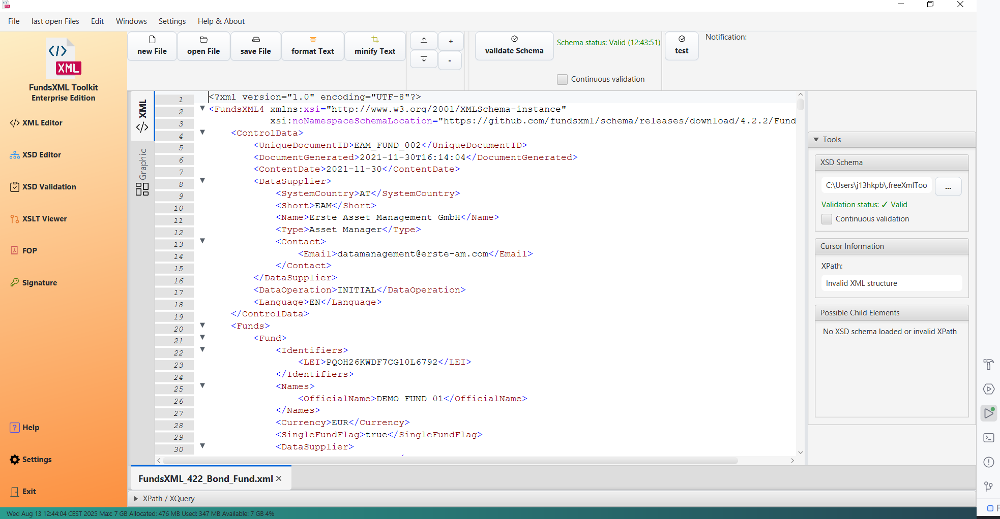

# XML Editor

> **Last Updated:** November 2025 | **Version:** 1.0.0

The XML Editor is the main feature of FreeXmlToolkit. It provides a powerful and easy-to-use interface for working with
XML files.

## Overview

*The XML Editor in text mode with syntax highlighting*

*The XML Editor in grid mode for structured editing*

---

## Working with Files

### Opening and Saving Files

* File toolbar with Open, Save, and New buttons*

- **Open Files**: Click the "Open" button or use `Ctrl+O` to browse for XML files
- **Save Files**: Click "Save" or use `Ctrl+S` to save your changes
- **Create New Files**: Click "New" to start with an empty XML document
- **Drag & Drop**: Simply drag files from your file explorer into the editor window

### Favorites

Save your frequently used files for quick access:

- Click the star icon to add a file to favorites
- Organize favorites into custom categories
- Access favorites from the sidebar panel

Learn more: [Favorites System](favorites-system.md)

---

## Editing Modes

### Text Mode

*Screenshot placeholder: Text editor with syntax highlighting*

The text editor provides:

- **Syntax Highlighting**: XML elements, attributes, and values are color-coded for easy reading
- **Line Numbers**: Every line is numbered for easy reference
- **Code Folding**: Click the arrows next to elements to collapse or expand sections
- **Auto-Completion**: Type `<` to see suggestions for valid elements

### Tree View

*Tree view showing XML structure*

- See your XML document as a hierarchical tree
- Drag and drop elements to reorganize the structure
- Right-click for context menu options

### Grid Mode

*Grid editor showing table-like XML editing*

The grid editor provides:

- **Table View**: Edit XML data in a spreadsheet-like interface
- **Direct Cell Editing**: Click cells to edit values directly
- **Easy Navigation**: Move through the document using arrow keys

---

## Auto-Completion (IntelliSense)

*Auto-completion popup showing element suggestions*

The editor automatically suggests valid elements and attributes based on your XSD schema:

1. **Type `<`** to see a list of valid child elements
2. **Navigate** through suggestions with arrow keys
3. **Press Enter** to insert the selected element
4. **Press Escape** to close the suggestions

The suggestions are context-sensitive - only elements that are valid at your current position will be shown.

Learn more: [Auto-Completion Guide](context-sensitive-intellisense.md)

---

## Formatting Tools

### Pretty Print

*Before pretty print*

Click "Pretty Print" to format your XML with proper indentation. This makes messy or compressed XML easy to read.

*After pretty print*

---

## Validation

*Validation panel showing errors and warnings*

### How to Validate

1. **Load a Schema**: Click the folder icon in the XSD Schema section to select your schema file
2. **Automatic Detection**: If your XML references a schema, it will be loaded automatically
3. **View Results**: Errors and warnings appear in the validation panel
4. **Navigate to Errors**: Click on an error to jump to the problem location

### Supported Validation Methods

| Method                | Description                         |
|-----------------------|-------------------------------------|
| **Well-Formed Check** | Ensures basic XML syntax is correct |
| **XSD Validation**    | Validates against XML Schema files  |
| **Schematron**        | Validates against business rules    |

### Supported Schema Formats

| Format           | Support       |
|------------------|---------------|
| XSD (XML Schema) | Full support  |
| Schematron       | Full support  |
| DTD              | Not supported |
| RelaxNG          | Not supported |

---

## XPath and XQuery

*Screenshot placeholder: XPath tab with query input and results*

Use XPath and XQuery to find and extract data from your XML documents:

1. **Switch to the XPath/XQuery tab** at the bottom of the editor
2. **Enter your query** in the input field
3. **Click Execute** to run the query
4. **View Results** in the results panel

### Example Queries

- `//element` - Find all elements named "element"
- `//element/@attribute` - Find all attributes named "attribute" on "element"
- `/root/child[1]` - Find the first child of root

---

## Keyboard Shortcuts

| Shortcut | Action               |
|----------|----------------------|
| `Ctrl+O` | Open file            |
| `Ctrl+S` | Save file            |
| `Ctrl+Z` | Undo                 |
| `Ctrl+Y` | Redo                 |
| `Ctrl+F` | Find                 |
| `Ctrl+H` | Replace              |
| `Ctrl++` | Zoom in              |
| `Ctrl+-` | Zoom out             |
| `<`      | Open auto-completion |

---

## Tips

- **Multiple Files**: You can open multiple XML files in different tabs
- **Remember Location**: The editor remembers the last folder you used
- **Font Size**: Use `Ctrl++` and `Ctrl+-` to adjust the font size
- **Quick Validation**: Errors are highlighted as you type

---

## Navigation

| Previous         | Home             | Next                                          |
|------------------|------------------|-----------------------------------------------|
| [Home](index.md) | [Home](index.md) | [XML Editor Features](xml-editor-features.md) |

**All Pages:
** [XML Editor](xml-editor.md) | [XML Features](xml-editor-features.md) | [XSD Tools](xsd-tools.md) | [XSD Validation](xsd-validation.md) | [XSLT](xslt-viewer.md) | [FOP/PDF](pdf-generator.md) | [Signatures](digital-signatures.md) | [IntelliSense](context-sensitive-intellisense.md) | [Schematron](schematron-support.md) | [Favorites](favorites-system.md) | [Templates](template-management.md) | [Tech Stack](technology-stack.md) | [Licenses](licenses.md)
