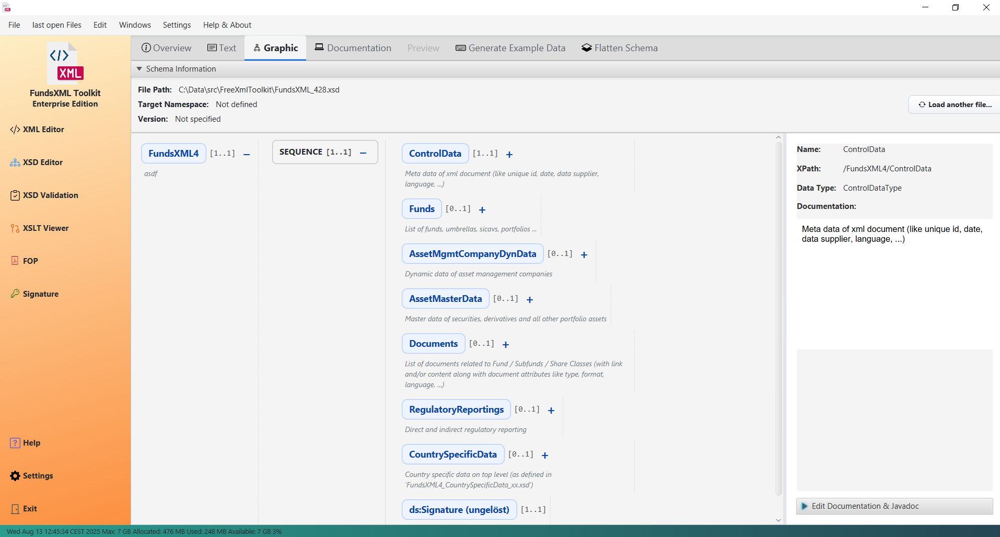
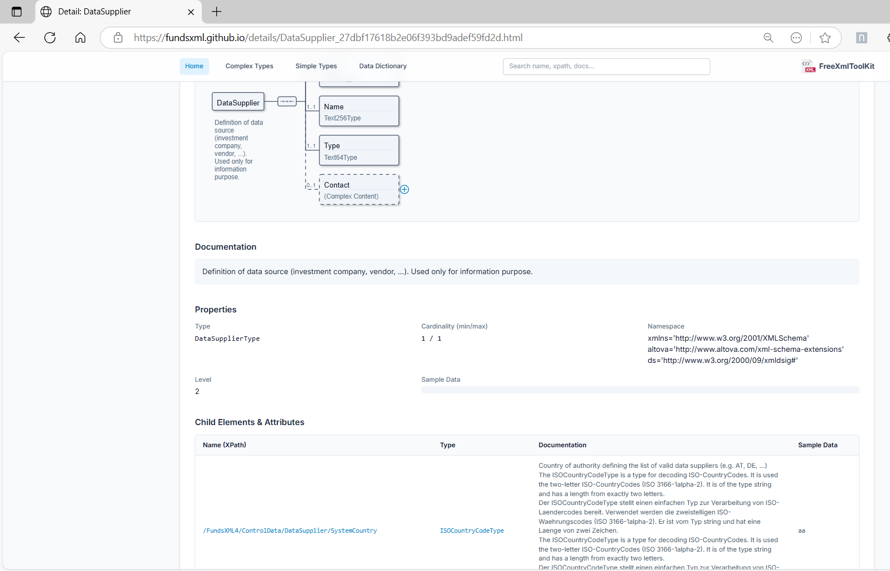
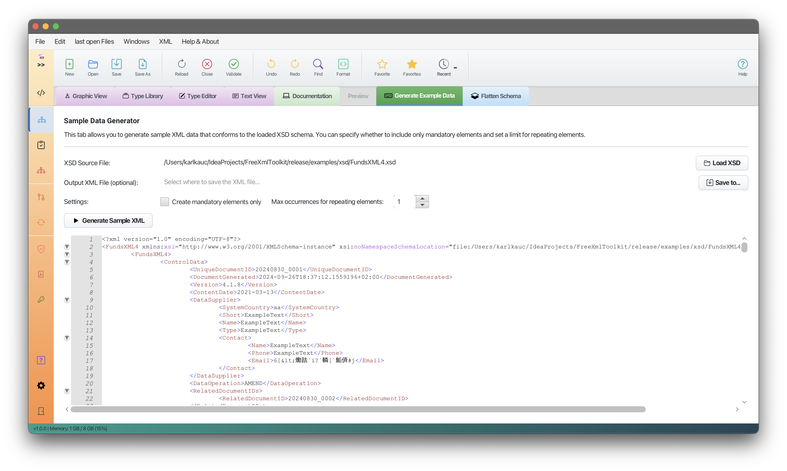
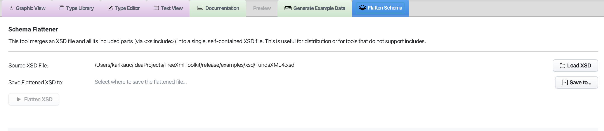

# XSD Tools

> **Last Updated:** November 2025 | **Version:** 1.0.0

This part of the application provides tools for working with XML Schemas (XSD). These tools help you understand, document, and use XSD files effectively.

---

## 1. XSD Viewer & Editor

The XSD Viewer lets you explore and edit your schemas. It has two main views:

### Graphical View


*The XSD schema displayed as an interactive tree*

- **Visual Tree**: See your XSD as an interactive, hierarchical tree
- **Easy Navigation**: Click on elements to explore their structure
- **Edit Documentation**: Add or edit documentation for schema elements
- **Add Examples**: Include example values for elements

### Text View


***Screenshot: XSD code editor with syntax highlighting***

- **Full Code Editor**: View and edit the raw XSD source code
- **Syntax Highlighting**: Color-coded code for easy reading
- **Search and Replace**: Find and change text quickly
- **Save as Favorite**: Quick access to frequently used schemas

---

## 2. Visual Schema Editor


***Screenshot: XSD Editor V2 graphical interface***

The Visual Schema Editor is an advanced graphical editor for working with XSD files. It provides a complete visual editing experience.

### Key Features

| Feature | Description |
|---------|-------------|
| **Visual Editing** | See your schema as an interactive tree |
| **Full Undo/Redo** | Go back and forward through your changes |
| **Type Editing** | Edit SimpleTypes and ComplexTypes graphically |
| **Drag & Drop** | Reorganize elements by dragging them |
| **XSD 1.0 and 1.1** | All XSD features are supported |

### Edit Schema Structure


***Screenshot: Schema tree with elements and types***

- Add, remove, and move elements
- Edit element names, types, and properties
- Set cardinality (minOccurs, maxOccurs)
- Drag and drop to reorganize

### Edit Types


***Screenshot: Type editor panel***

- Create and edit SimpleTypes with facets (patterns, enumerations, etc.)
- Create and edit ComplexTypes with sequences, choices, and attributes
- See the type hierarchy

### Work with Properties


***Screenshot: Properties panel***

- View and edit all properties of selected elements
- Edit facets like patterns, lengths, and enumerations
- Add documentation to your schema

### How to Use the Visual Editor

1. Go to the **XSD** tab
2. Open your XSD file
3. The schema appears as an interactive tree
4. **Select** an element by clicking on it
5. **Edit properties** in the panel on the right
6. **Add children** using the context menu (right-click)
7. **Drag** elements to move them

### Supported XSD Features

| Category | Features |
|----------|----------|
| **Elements** | Elements, Attributes, Groups |
| **Types** | ComplexTypes, SimpleTypes |
| **Compositors** | Sequence, Choice, All |
| **Constraints** | Patterns, Enumerations, Length limits |
| **References** | Import, Include |
| **XSD 1.1** | Assertions, Alternatives |

### Tips

- **Double-click** an element to edit its name
- **Right-click** for a context menu with common actions
- **Ctrl+Z** to undo, **Ctrl+Y** to redo
- **Ctrl+S** to save (a backup is created automatically)

---

## 3. Documentation Generator


*Generated HTML documentation from an XSD schema*

Create professional HTML documentation from your XSD file automatically.

### How to Generate Documentation

1. Load your XSD file in the XSD Viewer
2. Click on the "Documentation" tab
3. Choose your options (image format, etc.)
4. Click "Generate"
5. Preview the documentation in the built-in viewer

### Options

| Option | Description |
|--------|-------------|
| **Image Format** | Choose PNG or SVG for diagrams |
| **Markdown Support** | Render Markdown formatting in documentation |
| **Live Preview** | View the documentation immediately |
| **Open Folder** | Access the generated files directly |

### Adding Technical Notes to Your Schema

You can add structured technical information directly in your XSD files. This information appears in a separate section of the generated documentation.

**Supported tags:**
- `@since` - When a feature was introduced
- `@see` - References to other elements
- `@deprecated` - Mark elements as deprecated
- `{@link /path/to/element}` - Create clickable links

**Example in your XSD:**

```xml
<xs:element name="Transaction">
  <xs:annotation>
    <!-- User-friendly documentation -->
    <xs:documentation>
      Represents a single financial transaction.
    </xs:documentation>

    <!-- Technical notes for developers -->
    <xs:appinfo source="@since 4.0.0"/>
    <xs:appinfo source="@see {@link /FundsXML4/ControlData}"/>
    <xs:appinfo source="@deprecated Use NewTransaction instead."/>
  </xs:annotation>
</xs:element>
```

---

## 4. Sample XML Generator


***Screenshot: Sample XML generator panel***

Create sample XML files based on your XSD schema. This is useful for testing or as a template.

### How to Use

1. Load your XSD file
2. Go to the "Sample Data" section
3. Choose your options:
   - **Mandatory Only**: Include only required elements
   - **Max Occurrences**: Limit repeating elements
4. Click "Generate"
5. Save or copy the generated XML

---

## 5. XSD Flattener


***Screenshot: Flattener tool with before/after view***

Combine multiple XSD files into a single file. Useful when your schema imports other schemas.

### How to Use

1. Select your main XSD file
2. Choose where to save the new file
3. Click "Flatten"
4. The tool merges all imported schemas into one file

---

## Keyboard Shortcuts

| Shortcut | Action |
|----------|--------|
| `Ctrl+S` | Save file |
| `Ctrl+Z` | Undo |
| `Ctrl+Y` | Redo |
| `Delete` | Delete selected element |
| `F2` | Rename element |

---

## Navigation

| Previous | Home | Next |
|----------|------|------|
| [XML Editor Features](xml-editor-features.md) | [Home](index.md) | [XSD Validation](xsd-validation-controller.md) |

**All Pages:** [XML Editor](xml-controller.md) | [XML Features](xml-editor-features.md) | [XSD Tools](xsd-controller.md) | [XSD Validation](xsd-validation-controller.md) | [XSLT](xslt-controller.md) | [FOP/PDF](fop-controller.md) | [Signatures](signature-controller.md) | [IntelliSense](context-sensitive-intellisense.md) | [Schematron](schematron-support.md) | [Favorites](favorites-system.md) | [Templates](template-management.md) | [Tech Stack](technology-stack.md) | [Licenses](licenses.md)
