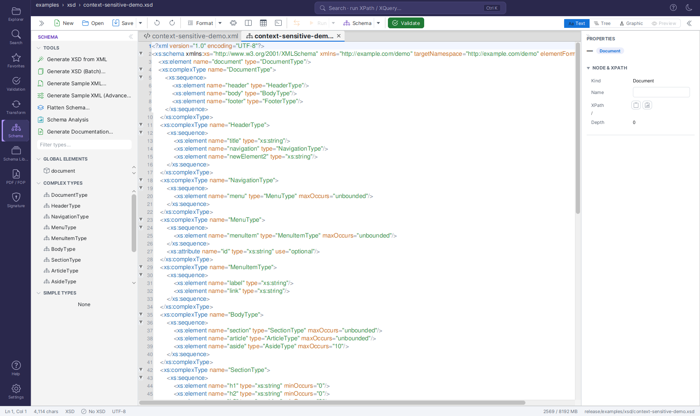
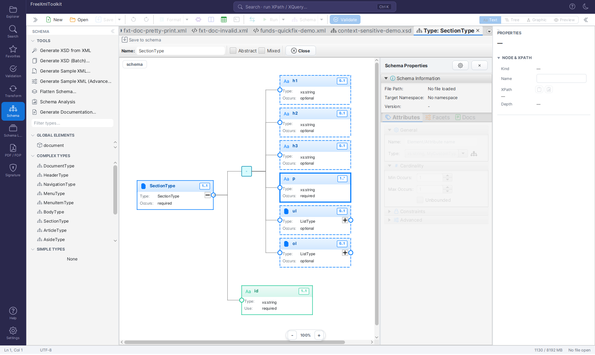
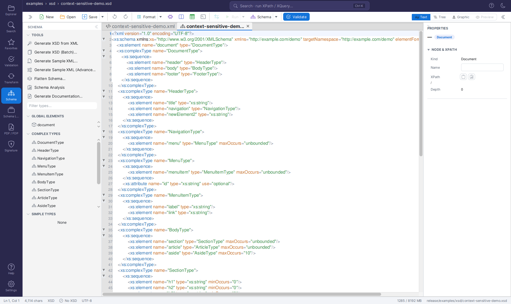
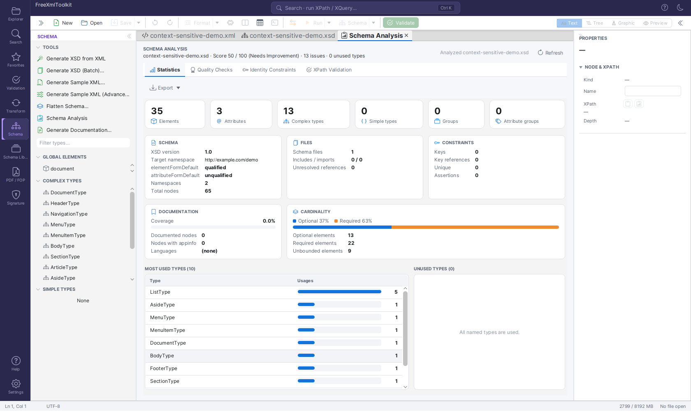
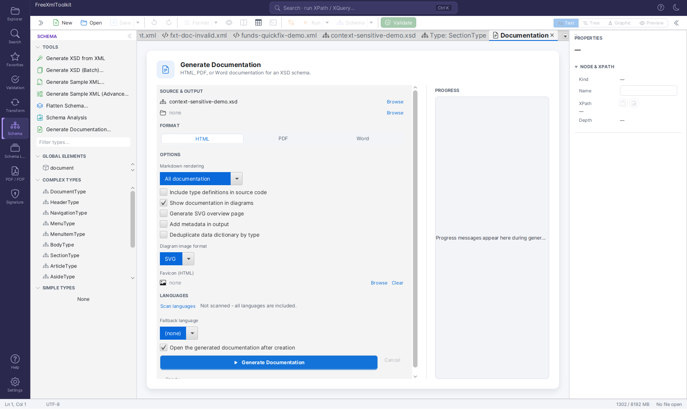
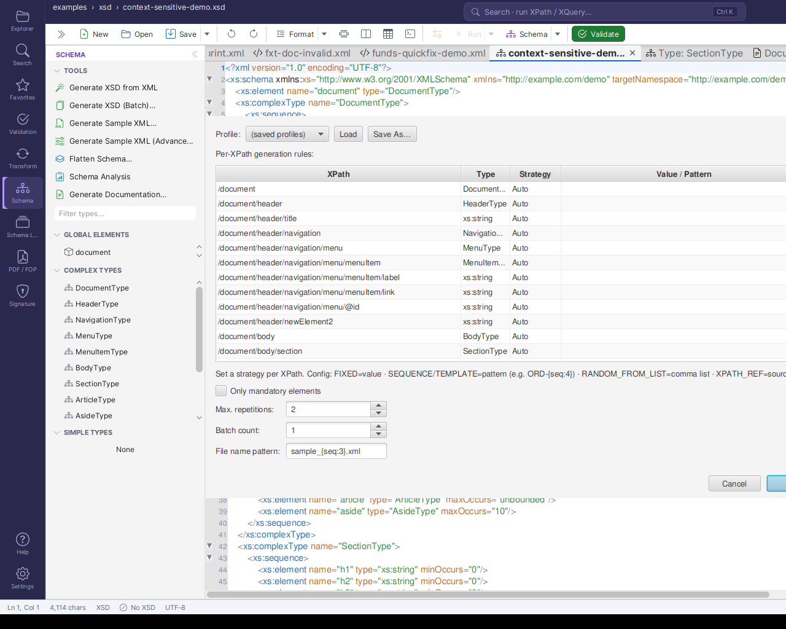
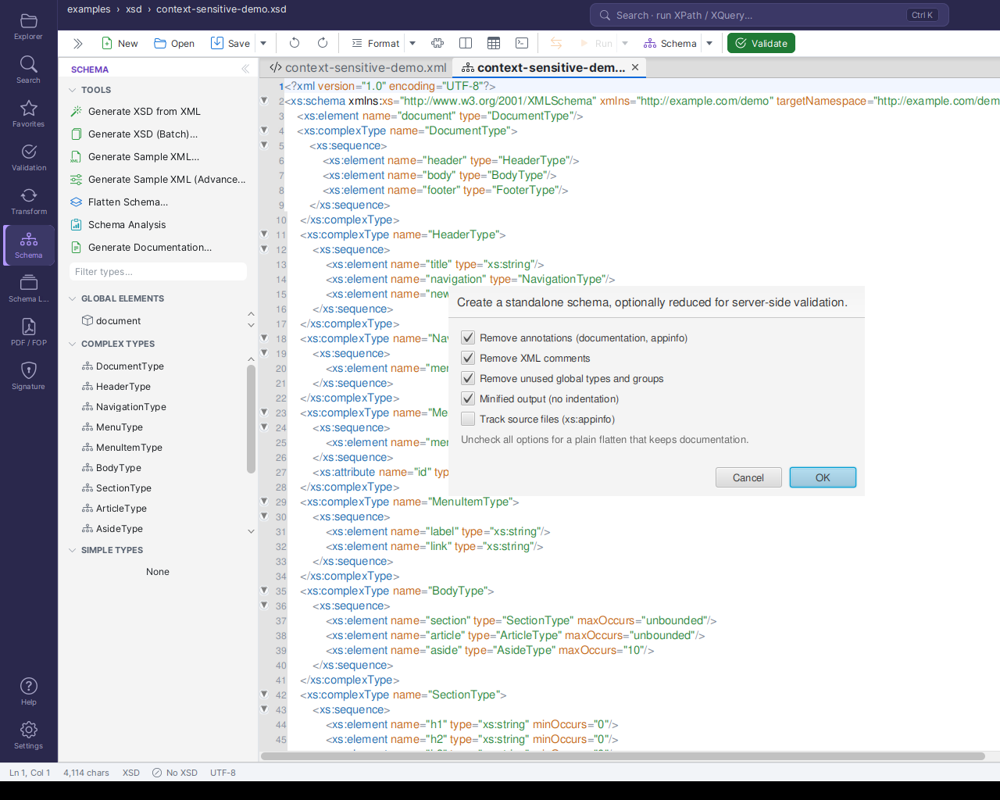

# XSD Tools

> **Version:** 2.1.0

> **Note:** The standalone *XSD Editor* tab has been retired. XSD
> editing — the Text/Tree/Graphic views, the inspector, the Type Library, type
> editing, documentation generation, schema flattening and schema analysis —
> now lives in the **Unified Shell** (open an `.xsd` file; "go to schema
> definition" from the XML editor opens the schema's graphic view at the
> element). The capabilities below are unchanged; they are reached through the
> shell rather than a dedicated sidebar tab.

This part of the application provides tools for working with XML Schemas (XSD). These tools help you understand,
document, and use XSD files effectively.

---

## Overview

When you open an `.xsd` file in the [Unified Shell](unified-shell.md), the editor host and the
**Schema** activity provide several capabilities, each with a specific purpose:

| Capability                | Description                                             |
|---------------------------|---------------------------------------------------------|
| **Graphic View**          | Visual schema editor with interactive tree              |
| **Type Library**          | Browse and analyze all types in your schema             |
| **Type Editor**           | Edit ComplexTypes and SimpleTypes graphically           |
| **Text View**             | Raw XSD source code editor                              |
| **Schema Analysis**       | Statistics, constraints, validation, and quality checks |
| **Documentation**         | Generate HTML, Word, or PDF documentation               |
| **Preview**               | Preview generated documentation                         |
| **Generate Example Data** | Create sample XML from schema with customizable rules and profiles |
| **Flatten Schema**        | Merge includes into one standalone file, with optional reduction for server-side validation |

---

## 1. Graphic View

The Graphic View lets you explore and edit your schemas visually.


*An XSD open in the Unified Shell's Graphic view, with the Schema activity panel on the left*

### Features

- **Visual Tree**: See your XSD as an interactive, hierarchical tree
- **Easy Navigation**: Click on elements to explore their structure
- **Edit Documentation**: Add or edit documentation for schema elements using the inline tab-based editor (no modal dialogs)
- **Add Examples**: Include example values for elements
- **Drag & Drop**: Reorganize elements by dragging them
- **Full Undo/Redo**: Go back and forward through your changes

### How to Use

1. Open your XSD file in the editor host and switch to the **Graphic** view
2. The schema appears as an interactive tree
3. **Select** an element by clicking on it
4. **Edit properties** in the panel on the right (name, type, cardinality/occurrence, use, form, constraints, documentation, and facets)
5. **Add children** using the context menu (right-click)
6. **Drag** elements to move them

> **Editing properties from any view:** The same Properties pane is
> available in the **Text** view as well as the Graphic and Tree views. See
> [Editing Schema Properties from Any View](#editing-schema-properties-from-any-view) below.

### Tips

- **Double-click** an element to edit its name
- **Right-click** for a context menu with common actions
- **Ctrl+Z** to undo, **Ctrl+Y** to redo
- **Ctrl+S** to save (a backup is created automatically)
- The toolbar's **Save ▾** split button saves the schema; its arrow menu offers **Save As…** (save under a new name) and **Save All** (saves every open tab)

### Automatic Resolution of Imported Schemas

Some schemas import other schemas that are not shipped alongside them.
For example, many financial schemas contain:

```xml
<xs:import namespace="http://www.w3.org/2000/09/xmldsig#"
           schemaLocation="xmldsig-core-schema.xsd"/>
```

If `xmldsig-core-schema.xsd` is not next to your schema, FreeXmlToolkit resolves the
import automatically, trying these sources in order:

1. **Next to the declaring file** - a relative `schemaLocation` is resolved against the
   folder of the schema that declares the import (also for imports declared inside an
   imported or included file).
2. **The [Schema Library](schema-library.md)** - your own mappings, registered XML
   catalogs and the bundled standards, matched by the declared location (system ID) first
   and then by the import's namespace. A hit here loads **without any network access**.
3. **The schema cache** - a previously downloaded copy under
   `~/.freeXmlToolkit/cache/schemas/`, again without network access.
4. **The declared URL** - an `http(s)` `schemaLocation` is downloaded (following redirects,
   using your proxy settings).
5. **The namespace URL** - as a last resort the schema is fetched from the import's
   namespace URL, which is how the W3C hosts the XML signature schema, for instance.

Downloaded content is verified to be a real XML Schema, then stored in the cache so future
loads work offline. Imports are resolved **transitively**: an imported schema's own
`xs:import` and `xs:include` declarations (and imports declared inside an included file)
are followed too, with circular imports detected and a nesting depth cap of 10.

A few things to know:

- **Your files are never touched.** Resolved and downloaded schemas go to the shared cache
  only - nothing is written into your schema's folder, and the schema itself is never
  rewritten. This applies everywhere imports are resolved: the schema views, validation,
  the Type Library, Schema Analysis and documentation generation.
- Only imports whose namespace is an `http://` or `https://` URL are looked up by
  namespace (step 5).
- `xs:include` references are resolved relative to the including file, or through an XML
  catalog / Schema Library entry for their location - they are not looked up by namespace.
- Internal and private network addresses are never contacted - see
  [Security Features](SECURITY.md#ssrf-server-side-request-forgery-protection).
- Clearing the cache (Settings → Temp & Cache, or the Schema Library's Cache tab) is safe:
  missing schemas are simply re-downloaded the next time they are needed.
- *Advanced:* to turn remote downloads off entirely (for example in fully offline
  environments), start the application with the system property
  `-Dfxt.schema.namespaceFallback=false` - local files, catalog hits and already-cached
  copies still resolve.

---

## 2. Type Library

The Schema activity's side panel is your type library: it lists the active schema's
top-level declarations so you can browse, find, and open every type in the schema.


*The Schema activity's Type Library, with the schema diagram in the editor host*


### Features

| Feature               | Description                                                          |
|-----------------------|----------------------------------------------------------------------|
| **Grouped lists**     | Declarations grouped into **GLOBAL ELEMENTS**, **COMPLEX TYPES**, and **SIMPLE TYPES** (collapsible sections) |
| **Filter**            | A filter field on top narrows all three lists by name as you type    |
| **Reveal in Tree**    | Click a declaration to reveal it in the schema's Tree view           |
| **Open Type Editor**  | Double-click a type to open it in its own [Type Editor](#3-type-editor) tab |
| **Find Usage**        | Right-click a type to find the places where it is used              |
| **Schema tools**      | A strip of icon buttons above the filter: Generate XSD from XML (single/batch), Generate Sample XML (plain/advanced), Flatten Schema, Schema Analysis, and Generate Documentation - hover a button for its name |

### How to Use

1. Open your XSD file
2. Open the **Schema** activity from the activity bar
3. Browse the grouped lists, or type in the filter field to narrow them
4. **Click** a declaration to reveal it in the Tree view
5. **Double-click** a type - or right-click and choose **Open Type Editor** - to edit it;
   right-click also offers **Reveal in Tree** and **Find Usage**

!!! tip
    The whole panel is a drop zone: drop an `.xsd` file from your file manager anywhere on
    it to open that schema as a document.

---

## 3. Type Editor

The Type Editor provides dedicated editing for ComplexTypes and SimpleTypes.


*A named type opened in its own Type Editor tab in the editor area*


### Features

| Feature                | Description                                         |
|------------------------|-----------------------------------------------------|
| **Tab-Based Editing**  | Each type opens in its own tab in the editor area   |
| **ComplexType Editor** | Graphical editing with element tree                 |
| **SimpleType Editor**  | Form-based editing with facet panels                |

### ComplexType Editor

For ComplexTypes, you get a graphical editor similar to the main schema view:

- Type name appears as the root node
- Add, delete, modify elements graphically
- Supports Sequence, Choice, and All compositors
- Save/Discard with dirty tracking

### SimpleType Editor

For SimpleTypes, you get a 5-panel form editor:

| Panel           | Description               |
|-----------------|---------------------------|
| **General**     | Name and Final attribute  |
| **Restriction** | Base type and facets      |
| **List**        | ItemType selection        |
| **Union**       | MemberTypes management    |
| **Annotation**  | Documentation and AppInfo |

### How to Use

1. In the Schema panel's Type Library, find the type (use the filter field for large schemas)
2. **Double-click** it - or right-click and choose **Open Type Editor**. Alternatively, pick
   **Type Editor…** from the editor toolbar's **Schema ▾** menu and choose a type by name.
3. The type opens in its own Type Editor tab in the editor area
4. Make your changes
5. Click Save or use Ctrl+S

---

## 4. Text View

The Text View provides raw XSD source code editing.


*The XSD in the Unified Shell's Text view (Schema activity panel on the left, inspector on the right)*

### Features

- **Full Code Editor**: View and edit the raw XSD source code
- **Syntax Highlighting**: Color-coded code for easy reading
- **Search and Replace**: Find and change text quickly
- **Query Console**: Query the schema with XPath/XQuery (Ctrl+Shift+X)
- **Save as Favorite**: Quick access to frequently used schemas
- **Editable Properties pane**: Move the text caret into a schema construct to select it and edit its properties without leaving the text editor (see below)

### Editing Schema Properties from Any View

> You can edit a schema node's properties directly from the
> **Text** view, the same way as in the **Tree** and **Graphic** views.

The XSD editor has three views - **Text**, **Tree**, and **Graphic** - and all three share one
in-memory schema model. The Properties pane works in every view:

- **Tree** and **Graphic** views: Select a node to edit its name, type, cardinality/occurrence,
  use, form, constraints, documentation, and facets.
- **Text** view: Move the text caret into an XSD construct - such as an `xs:element`,
  `xs:complexType`, `xs:simpleType`, `xs:attribute`, a compositor (`xs:sequence`, `xs:choice`,
  `xs:all`), or a facet - and the Properties pane selects the matching schema node and shows it
  **editable**. You get the same property editing as in the Tree and Graphic views, without
  leaving the source editor. Your edits round-trip back into the schema text as a minimal change
  that preserves your caret and scroll position.

If the caret is not inside a recognizable construct - for example inside an `xs:annotation`, a
comment, or blank space - the pane falls back to a read-only caret/XPath view.

Because all three views share one model, your edits and your **Undo/Redo** history are preserved
when you switch between Text, Tree, and Graphic.

### What You Can Edit in the Properties Pane

For the selected schema node you can edit:

- **Name, type, cardinality/occurrence, use, form** - The core properties of the node.
- **Facets** - Add, edit, and remove facets such as patterns, enumerations, and length limits.
- **App info (`xs:appinfo`)** - The machine-readable metadata attached to the node (for example
  the technical tags described in [Documentation Generator](#6-documentation-generator)).
- **Multi-language documentation (`xs:documentation`)** - One row per language. Use **Add
  language** to add a translation and the **✕** button to remove one.
- **Comments** - Select an XSD comment in the tree to edit its text. To add a comment, choose
  **Add Comment…** from a node's right-click context menu.
- **Constraints** - In the **CONSTRAINTS** section, select a `key`, `keyref`, `unique`, or
  `assert` constraint and click **Delete constraint** to remove it.

> **Note:** Structural editing (adding, deleting, and moving nodes) remains a **Tree** and
> **Graphic** capability via the right-click context menu. The **Text** view provides
> *property* editing through the Properties pane.

---

## 5. Schema Analysis

The **Schema Analysis** button in the **Schema** activity's tool strip analyzes the active XSD
and opens the report as a tool tab in the editor area. The analysis runs in the background on
the current editor text (unsaved changes included); imports and includes are resolved relative
to the file. The header shows the document, the quality score, the number of issues and the
number of unused types; **Refresh** re-runs the analysis, and opening the tool again while the
tab is already open re-analyzes the active document instead of adding a second tab.


*The Schema Analysis tool tab with its four sub-tabs, opened from the Schema activity*

Every finding is a link into the schema: selecting a row, an unused type or an affected element
switches the document to the **Tree** view and reveals the node.

### Statistics

The **Statistics** tab opens with a row of tiles for the declaration counts (elements,
attributes, complex and simple types, groups, attribute groups), followed by detail cards:

| Card                 | Metrics                                                                  |
|----------------------|--------------------------------------------------------------------------|
| **Schema**           | XSD version (1.0/1.1), target namespace, form defaults, namespaces, total nodes |
| **Files**            | Schema files, includes / imports, unresolved references, and node counts per file for multi-file schemas |
| **Constraints**      | Counts of `xs:key`, `xs:keyref`, `xs:unique`, and assertions             |
| **Documentation**    | Coverage bar (green ≥ 75 %, yellow ≥ 40 %, red below), documented nodes, appinfo nodes, documentation languages |
| **Cardinality**      | Optional vs. required elements as a two-segment bar, plus the unbounded element count |
| **Most used types**  | The named types with the most references; the usage bar is relative to the most used type |
| **Unused types**     | Every named type that is never referenced, listed by name - click one to reveal it |

**Export** writes the statistics as CSV, JSON, HTML, PDF, or Excel.

### Quality Checks

The **Quality Checks** tab shows a score (0-100) with its rating, the number of checks passed,
the dominant naming convention, and the issues found. The count chips next to the score
(by severity and by category) are clickable filters - click one to show only those issues,
click it again to clear. The filter bar offers the same severity and category selection plus a
free-text search and reports how many issues are currently shown. Every row carries a severity
icon; the location column shows the XPath (full text in the tooltip). Select an issue to read
its suggestion and location and to jump to the affected elements.

| Check                              | Description                                                        |
|------------------------------------|--------------------------------------------------------------------|
| **Naming Convention**              | Element/type names that deviate from the schema's dominant convention (UpperCamelCase, lowerCamelCase, snake_case, kebab-case) |
| **Best Practice**                  | `xs:any` / `xs:anyAttribute` wildcards, unbounded content without limits, deep nesting, anonymous complex types |
| **Deprecated**                     | Components marked as deprecated in `xs:appinfo`                     |
| **Constraint Conflict**            | Enumeration values that conflict with length facets                |
| **Inconsistent Definition**        | The same name defined with different content in several places    |
| **Duplicate Definition**           | Different names with identical structure                            |
| **Duplicate Element in Container** | The same element declared twice in one sequence, choice, or all (ambiguity error) |

**Export** writes the quality report as CSV, JSON, HTML, PDF, or Excel.

### Identity Constraints

The **Identity Constraints** tab lists every `xs:key`, `xs:keyref`, `xs:unique`, and
`xs:assert` with its parent element, selector, fields, referenced key or test expression, and a
validation status - for example a `keyref` whose `refer` points to a key that does not exist.
The count chips above the table filter by kind (key, keyref, unique, assert) and by status
(errors, warnings); click a chip again to clear the filter. Selecting a row reveals the
constraint in the Tree view and fills the details pane with the validation message, the parent
element (a link), selector and fields, and - for a keyref - a link that selects the referenced
key.

### XPath Validation

The **XPath Validation** tab checks the XPath expressions used by identity constraints and
assertions: syntax, element names that do not occur in the schema, and constructs that are not
allowed in selectors and fields. The expressions are checked statically against the schema;
they are not evaluated against a sample XML document.

!!! note
    Identity constraints (`xs:key`, `xs:keyref`, `xs:unique`, `xs:assert`) can also be
    inspected and deleted per node in the Properties inspector's **CONSTRAINTS** section -
    see [What You Can Edit in the Properties Pane](#what-you-can-edit-in-the-properties-pane).

---

## 6. Documentation Generator

Create professional documentation from your XSD file automatically.


*The Documentation generator open as a tab in the editor area, with source, format, and options*

### Output Formats

| Format   | Description                                   |
|----------|-----------------------------------------------|
| **HTML** | Interactive web documentation with navigation |
| **Word** | Microsoft Word (.docx) document               |
| **PDF**  | PDF document using Apache FOP                 |

### How to Generate Documentation

1. Open your XSD file in the editor host
2. Click **Generate Documentation…** in the **Schema** panel's tool strip (or pick it from
   the editor toolbar's **Schema ▾** menu) - the generator opens as a tab in the editor area
3. Check **SOURCE & OUTPUT**: the active schema is pre-filled; choose the output folder
   (HTML) or file (PDF/Word)
4. Select your output format (HTML, PDF, or Word) and the diagram format (SVG, PNG, or JPG)
5. Configure options (PDF and Word add page-layout and content options)
6. Click **Generate** - the PROGRESS log streams the pipeline's messages live, and the run
   can be cancelled
7. Open the result automatically or from the output location

!!! tip
    Generation works from the schema's **last-saved** version on disk so that relative
    `xs:include` / `xs:import` references resolve correctly - save the XSD first to document
    your latest edits. Remote imports are resolved through the Schema Library, XML catalogs
    and the schema cache (see
    [Automatic Resolution of Imported Schemas](#automatic-resolution-of-imported-schemas));
    the generator never modifies your schema file or writes into its folder.

### Generation Options

| Option                             | Description                                 |
|------------------------------------|---------------------------------------------|
| **Image Format**                   | Choose PNG or SVG for diagrams              |
| **Use Markdown Renderer**          | Render Markdown formatting in documentation |
| **Open file after creation**       | Automatically open the generated file       |
| **Create example data if missing** | Generate sample values                      |
| **Include type definitions**       | Show type source code                       |
| **Generate SVG overview page**     | Interactive full-schema SVG                 |

### Language Settings

For multi-language schemas, you can:

1. Click **Scan languages** to detect the `xml:lang` values used in the schema
2. Untick the languages you do not want in the output
3. Choose a fallback language for missing translations

De-selected languages are dropped everywhere: element detail pages, type pages, attribute and
enumeration documentation, the Data Dictionary (HTML and Excel), the search index, the SVG
diagrams and the *Source Code* snippets on the detail pages. Documentation without an `xml:lang`
attribute ("default") is always kept as a fallback. The schema files copied next to the
documentation are left untouched. Leaving every language ticked (or not scanning at all) includes
all of them.

### Adding Technical Notes to Your Schema

You can add structured technical information directly in your XSD files:

**Supported tags:**

- `@since` - When a feature was introduced
- `@see` - References to other elements
- `@deprecated` - Mark elements as deprecated
- `{@link /path/to/element}` - Create clickable links

**Example in your XSD:**

```xml

<xs:element name="Transaction">
    <xs:annotation>
        <!-- User-friendly documentation -->
        <xs:documentation>
            Represents a single financial transaction.
        </xs:documentation>

        <!-- Technical notes for developers -->
        <xs:appinfo source="@since 4.0.0"/>
        <xs:appinfo source="@see {@link /FundsXML4/ControlData}"/>
        <xs:appinfo source="@deprecated Use NewTransaction instead."/>
    </xs:annotation>
</xs:element>
```

---

## 7. Sample XML Generator

Create sample XML files based on your XSD schema. This is useful for testing, data migration, or as a starting template.


*The advanced sample generator dialog with its per-XPath rules table*

> **Unified Shell:** In the [Unified Shell](unified-shell.md), sample-data
> generation lives in the **Schema** panel. It offers two actions: **Generate Sample XML** for
> the basic generation described below, and **Generate Sample XML (Advanced)…** for the
> rule-based, batch-capable generation shown above.

### Quick Start (Basic Generation)

For simple use cases, you can generate sample XML in seconds:

1. Load your XSD file
2. Open the **Schema** panel from the activity bar and click **Generate Sample XML**
3. Choose your options:
    - **Mandatory Only**: Include only required elements
    - **Max Occurrences**: Limit repeating elements
4. Click **Generate**
5. **Validate** the generated XML against the schema
6. Save or copy the generated XML

### Profiled Generation (Advanced)

For more control, you can define rules that specify exactly how each element or attribute gets
its value. Open it from **Generate Sample XML (Advanced)…** in the Schema panel. It includes:

| Feature | Description |
|---------|-------------|
| **XPath-Based Rules** | Set a generation strategy for each element or attribute by its XPath |
| **11 Strategies** | Auto, Fixed Value, Omit, Empty, XSD Example, Enum Cycle, Sequence, XPath Reference, Random from List, Template, and Null |
| **Auto-Fill XPaths** | Automatically extract all XPaths from your schema to populate the rules table |
| **Saveable Profiles** | Save your generation configuration and reload it later |
| **Profile Sharing** | Export and import profiles to share with colleagues |
| **Batch Generation** | Generate multiple files at once with configurable file naming (for example, `order_001.xml`, `order_002.xml`) |

For a complete guide with step-by-step instructions and examples, see **[Profiled XML Generation](profiled-xml-generation.md)**.

### Validation

The generated sample opens as a normal editor tab (`Sample.xml`), so you can validate it
like any other document:

1. Bind the schema if it is not picked up automatically (Validation panel → SOURCES, or the
   status bar's XSD indicator)
2. Click **Validate** (F8)
3. Problems appear in the PROBLEMS list - click one to jump to its line

---

## 8. XSD Flattener

Combine multiple XSD files into a single, standalone file. Useful when your schema is split across several files via `<xs:include>`, or when you want a minimal schema for a validation server.


*The Flatten Schema options dialog over an open schema — all reductions enabled by default*

### How to Use

1. Open your main XSD file in the editor
2. In the **Schema** activity's side panel, click the **Flatten Schema…** tool button
3. The **Flatten Schema** options dialog opens — pick which reductions you want (see below)
4. Click **OK**
5. The flattened schema opens as a new editor tab (`Flattened.xsd`), ready for you to review and save

### Flatten Options

Before flattening, a dialog lets you reduce the output. All four options are **checked by default**, which produces the smallest possible schema — ideal for deploying to a validation server:

| Option | What it does |
|--------|--------------|
| **Remove annotations (documentation, appinfo)** | Strips all `xs:documentation` and `xs:appinfo` content — the human-readable descriptions a validator does not need |
| **Remove XML comments** | Strips all XML comments, including comments at the top of the file |
| **Remove unused global types and groups** | Removes global types, groups and attribute groups that are not reachable from any global element or attribute — dead weight in large schema libraries. (Skipped automatically if the schema uses `xs:redefine` or `xs:override`.) |
| **Minified output (no indentation)** | Collapses the whitespace between tags for the smallest file size |

**Uncheck all four options** for a plain flatten that keeps documentation, comments and formatting — the previous behavior.

The reduced schema is verified to still compile as a valid schema before it is shown, so you can deploy it with confidence.

### What Happens to Includes and Imports

- **`xs:include`** — Included schemas (same namespace) are merged into the output, and the resolved include directives are removed: the flattened schema is standalone. If an include cannot be resolved, its directive is kept in the output so you can see what is missing.
- **`xs:import`** — Imported schemas (different namespaces) are **not** merged; the import declarations stay untouched.

When saving schemas from the graphical editor, `xs:include` and `xs:import` declarations are preserved. The flattener only merges included content when you explicitly flatten — it does not alter your original schema structure.

### When to Use

- Deploying a minimal, resource-efficient schema to a validation server
- Distributing schemas to partners
- Tools that don't support includes
- Simplifying complex schema sets
- Creating self-contained schemas

---

## Supported XSD Features

| Category        | Features                               |
|-----------------|----------------------------------------|
| **Elements**    | Elements, Attributes, Groups           |
| **Types**       | ComplexTypes, SimpleTypes              |
| **Compositors** | Sequence, Choice, All                  |
| **Constraints** | Patterns, Enumerations, Length limits  |
| **References**  | Import, Include, Redefine              |
| **XSD 1.1**     | Assertions, Alternatives, Open Content |
| **Identity**    | Key, KeyRef, Unique                    |

---

## Keyboard Shortcuts

| Shortcut | Action                  |
|----------|-------------------------|
| `Ctrl+S` | Save file               |
| `Ctrl+Z` | Undo                    |
| `Ctrl+Y` | Redo                    |
| `Ctrl+F` | Find/Replace            |
| `Ctrl+Shift+X` | Toggle the Query Console |
| `Ctrl+D` | Add to favorites        |
| `Delete` | Delete selected element |
| `F2`     | Rename element          |
| `F8`     | Validate schema         |

---

## Navigation

| Previous                                      | Home             | Next                                |
|-----------------------------------------------|------------------|-------------------------------------|
| [XML Editor Features](xml-editor-features.md) | [Home](index.md) | [Profiled XML Generation](profiled-xml-generation.md) |

**All Pages:** [Unified Shell](unified-shell.md) | [XML Editor](xml-editor.md) | [XML Features](xml-editor-features.md) | [JSON Editor](json-editor.md) | [XSD Tools](xsd-tools.md) | [Profiled XML Generation](profiled-xml-generation.md) | [XSD Validation](xsd-validation.md) | [XSLT Viewer](xslt-viewer.md) | [XSLT Developer](xslt-developer.md) | [FOP/PDF](pdf-generator.md) | [Signatures](digital-signatures.md) | [IntelliSense](context-sensitive-intellisense.md) | [Schematron](schematron-support.md) | [FundsXML Extensions](fundsxml-extensions.md) | [Favorites](favorites-system.md) | [Templates](template-management.md) | [Tech Stack](technology-stack.md) | [Security](SECURITY.md) | [Licenses](licenses.md)
