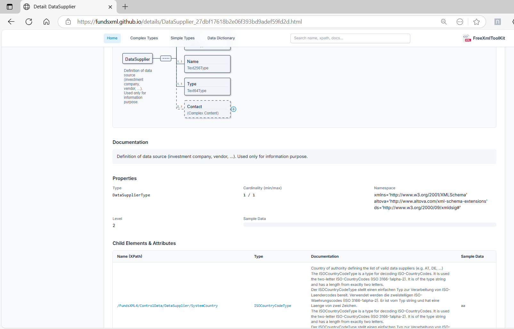

# XSD Tools

> **Last Updated:** December 2025 | **Version:** 1.1.0

This part of the application provides tools for working with XML Schemas (XSD). These tools help you understand,
document, and use XSD files effectively.

---

## Tab Overview

The XSD Tools section contains several tabs, each with a specific purpose:

| Tab                       | Description                                             |
|---------------------------|---------------------------------------------------------|
| **Graphic View**          | Visual schema editor with interactive tree              |
| **Type Library**          | Browse and analyze all types in your schema             |
| **Type Editor**           | Edit ComplexTypes and SimpleTypes graphically           |
| **Text View**             | Raw XSD source code editor                              |
| **Schema Analysis**       | Statistics, constraints, validation, and quality checks |
| **Documentation**         | Generate HTML, Word, or PDF documentation               |
| **Preview**               | Preview generated documentation                         |
| **Generate Example Data** | Create sample XML from schema                           |
| **Flatten Schema**        | Merge includes into one file                            |

---

## 1. Graphic View

The Graphic View lets you explore and edit your schemas visually.


*The XSD schema displayed as an interactive tree*

### Features

- **Visual Tree**: See your XSD as an interactive, hierarchical tree
- **Easy Navigation**: Click on elements to explore their structure
- **Edit Documentation**: Add or edit documentation for schema elements
- **Add Examples**: Include example values for elements
- **Drag & Drop**: Reorganize elements by dragging them
- **Full Undo/Redo**: Go back and forward through your changes

### How to Use

1. Go to the **XSD** tab
2. Open your XSD file
3. The schema appears as an interactive tree
4. **Select** an element by clicking on it
5. **Edit properties** in the panel on the right
6. **Add children** using the context menu (right-click)
7. **Drag** elements to move them

### Tips

- **Double-click** an element to edit its name
- **Right-click** for a context menu with common actions
- **Ctrl+Z** to undo, **Ctrl+Y** to redo
- **Ctrl+S** to save (a backup is created automatically)

---

## 2. Type Library

The Type Library provides a comprehensive view of all types defined in your schema.


*Type Library showing all SimpleTypes and ComplexTypes*

<!-- TODO: Screenshot needed - Show Type Library tab with filter dropdown set to "All Types", search field, and type table with columns: Name, Kind, Base Type, Usage Count -->

### Features

| Feature               | Description                                     |
|-----------------------|-------------------------------------------------|
| **All Types List**    | View all SimpleTypes and ComplexTypes           |
| **Usage Information** | See XPath locations where each type is used     |
| **Unused Types**      | Highlight types that are not referenced         |
| **Filter Options**    | Filter by All, Simple, Complex, or Unused types |
| **Search**            | Find types by name                              |
| **Documentation**     | View documentation for each type                |
| **Export**            | Export type list to file                        |

### How to Use

1. Open your XSD file
2. Go to the **Type Library** tab
3. Browse or search for types
4. Click on a type to see its details
5. Use the filter dropdown to narrow results

### Filter Options

| Filter            | Shows                           |
|-------------------|---------------------------------|
| **All Types**     | Every type in the schema        |
| **Simple Types**  | Only xs:simpleType definitions  |
| **Complex Types** | Only xs:complexType definitions |
| **Unused Types**  | Types not referenced anywhere   |

---

## 3. Type Editor

The Type Editor provides dedicated editing for ComplexTypes and SimpleTypes.


*Type Editor with graphical editing for ComplexTypes*

<!-- TODO: Screenshot needed - Show Type Editor tab with a ComplexType open, showing the graphical tree view and properties panel -->

### Features

| Feature                | Description                          |
|------------------------|--------------------------------------|
| **Tab-Based Editing**  | Each type opens in its own tab       |
| **ComplexType Editor** | Graphical editing with element tree  |
| **SimpleType Editor**  | Form-based editing with facet panels |
| **SimpleTypes List**   | Overview of all SimpleTypes          |

### ComplexType Editor

For ComplexTypes, you get a graphical editor similar to the main schema view:

- Type name appears as the root node
- Add, delete, modify elements graphically
- Supports Sequence, Choice, and All compositors
- Save/Discard with dirty tracking

### SimpleType Editor

For SimpleTypes, you get a 5-panel form editor:

| Panel           | Description               |
|-----------------|---------------------------|
| **General**     | Name and Final attribute  |
| **Restriction** | Base type and facets      |
| **List**        | ItemType selection        |
| **Union**       | MemberTypes management    |
| **Annotation**  | Documentation and AppInfo |

### How to Use

1. In the Type Library or Graphic View, find a type
2. Double-click or right-click and select "Edit Type"
3. The type opens in the Type Editor tab
4. Make your changes
5. Click Save or use Ctrl+S

---

## 4. Text View

The Text View provides raw XSD source code editing.


*XSD code editor with syntax highlighting*

### Features

- **Full Code Editor**: View and edit the raw XSD source code
- **Syntax Highlighting**: Color-coded code for easy reading
- **Search and Replace**: Find and change text quickly
- **XPath/XQuery Panel**: Query the schema with XPath
- **Save as Favorite**: Quick access to frequently used schemas

---

## 5. Schema Analysis

The Schema Analysis tab provides comprehensive analysis tools for your XSD.


*Schema Analysis with statistics and quality checks*

<!-- TODO: Screenshot needed - Show Schema Analysis tab with Statistics sub-tab visible, showing element counts, type counts, and namespace info -->

### Sub-Tabs

The Schema Analysis tab contains four sub-tabs:

#### Statistics

View schema metrics at a glance:

| Metric              | Description                            |
|---------------------|----------------------------------------|
| **Element Count**   | Total number of elements               |
| **Type Count**      | Number of SimpleTypes and ComplexTypes |
| **Attribute Count** | Total attributes defined               |
| **Group Count**     | Model groups and attribute groups      |
| **Namespace Info**  | Target namespace and prefixes          |
| **XSD Version**     | 1.0 or 1.1 features detected           |

#### Identity Constraints

View and analyze identity constraints:

| Constraint Type | Description              |
|-----------------|--------------------------|
| **xs:key**      | Unique key definitions   |
| **xs:keyref**   | Foreign key references   |
| **xs:unique**   | Unique value constraints |

For each constraint, you can see:

- Selector XPath expression
- Field XPath expressions
- Referenced elements

#### XPath Validation

Test XPath expressions against sample XML:

1. Load or generate sample XML
2. Enter an XPath expression
3. See matching nodes highlighted
4. Validate constraints against real data

#### Quality Checks

Automated quality checks for your schema:

| Check                      | Description                       |
|----------------------------|-----------------------------------|
| **Naming Conventions**     | Consistent element/type naming    |
| **Documentation Coverage** | Percentage of documented elements |
| **Unused Types**           | Types defined but never used      |
| **Circular References**    | Detect circular type references   |
| **Best Practices**         | Common XSD best practices         |

---

## 6. Documentation Generator

Create professional documentation from your XSD file automatically.


*Generated HTML documentation from an XSD schema*

### Output Formats

| Format   | Description                                   |
|----------|-----------------------------------------------|
| **HTML** | Interactive web documentation with navigation |
| **Word** | Microsoft Word (.docx) document               |
| **PDF**  | PDF document using Apache FOP                 |

### How to Generate Documentation

1. Load your XSD file in the XSD Tools
2. Click on the **Documentation** tab
3. Select your output format (HTML, Word, or PDF)
4. Choose diagram format (PNG or SVG)
5. Configure options
6. Click **Generate**
7. Preview the documentation or open the folder

### Generation Options

| Option                             | Description                                 |
|------------------------------------|---------------------------------------------|
| **Image Format**                   | Choose PNG or SVG for diagrams              |
| **Use Markdown Renderer**          | Render Markdown formatting in documentation |
| **Open file after creation**       | Automatically open the generated file       |
| **Create example data if missing** | Generate sample values                      |
| **Include type definitions**       | Show type source code                       |
| **Generate SVG overview page**     | Interactive full-schema SVG                 |

### Language Settings

For multi-language schemas, you can:

1. Click **Scan Languages** to detect available languages
2. Select which languages to include
3. Choose a fallback language for missing translations
4. Use "Select All" or "Deselect All" for quick selection

### Adding Technical Notes to Your Schema

You can add structured technical information directly in your XSD files:

**Supported tags:**

- `@since` - When a feature was introduced
- `@see` - References to other elements
- `@deprecated` - Mark elements as deprecated
- `{@link /path/to/element}` - Create clickable links

**Example in your XSD:**

```xml

<xs:element name="Transaction">
    <xs:annotation>
        <!-- User-friendly documentation -->
        <xs:documentation>
            Represents a single financial transaction.
        </xs:documentation>

        <!-- Technical notes for developers -->
        <xs:appinfo source="@since 4.0.0"/>
        <xs:appinfo source="@see {@link /FundsXML4/ControlData}"/>
        <xs:appinfo source="@deprecated Use NewTransaction instead."/>
    </xs:annotation>
</xs:element>
```

---

## 7. Sample XML Generator

Create sample XML files based on your XSD schema. This is useful for testing or as a template.


*Sample XML generator panel*

### How to Use

1. Load your XSD file
2. Go to the **Generate Example Data** tab
3. Choose your options:
    - **Mandatory Only**: Include only required elements
    - **Max Occurrences**: Limit repeating elements
4. Click **Generate**
5. **Validate** the generated XML against the schema
6. Save or copy the generated XML

### Options

| Option                             | Description                           |
|------------------------------------|---------------------------------------|
| **Create mandatory elements only** | Only generate required elements       |
| **Max occurrences**                | Limit repeating elements (default: 2) |

### Validation

After generating sample XML, you can validate it:

1. Click **Validate XML**
2. See validation results in the panel
3. Click on errors to see details
4. Export errors to file if needed

---

## 8. XSD Flattener

Combine multiple XSD files into a single file. Useful when your schema imports other schemas.


*Flattener tool with before/after view*

### How to Use

1. Select your main XSD file
2. Choose where to save the new file
3. Click **Flatten**
4. The tool merges all `<xs:include>` schemas into one file

### When to Use

- Distributing schemas to partners
- Tools that don't support includes
- Simplifying complex schema sets
- Creating self-contained schemas

---

## Supported XSD Features

| Category        | Features                               |
|-----------------|----------------------------------------|
| **Elements**    | Elements, Attributes, Groups           |
| **Types**       | ComplexTypes, SimpleTypes              |
| **Compositors** | Sequence, Choice, All                  |
| **Constraints** | Patterns, Enumerations, Length limits  |
| **References**  | Import, Include, Redefine              |
| **XSD 1.1**     | Assertions, Alternatives, Open Content |
| **Identity**    | Key, KeyRef, Unique                    |

---

## Keyboard Shortcuts

| Shortcut | Action                  |
|----------|-------------------------|
| `Ctrl+S` | Save file               |
| `Ctrl+Z` | Undo                    |
| `Ctrl+Y` | Redo                    |
| `Ctrl+F` | Find/Replace            |
| `Ctrl+Q` | Toggle XPath panel      |
| `Ctrl+D` | Add to favorites        |
| `Delete` | Delete selected element |
| `F2`     | Rename element          |
| `F5`     | Validate schema         |

---

## Navigation

| Previous                                      | Home             | Next                                |
|-----------------------------------------------|------------------|-------------------------------------|
| [XML Editor Features](xml-editor-features.md) | [Home](index.md) | [XSD Validation](xsd-validation.md) |

**All Pages:
** [XML Editor](xml-editor.md) | [XML Features](xml-editor-features.md) | [XSD Tools](xsd-tools.md) | [XSD Validation](xsd-validation.md) | [XSLT Viewer](xslt-viewer.md) | [XSLT Developer](xslt-developer.md) | [FOP/PDF](pdf-generator.md) | [Signatures](digital-signatures.md) | [IntelliSense](context-sensitive-intellisense.md) | [Schematron](schematron-support.md) | [Favorites](favorites-system.md) | [Templates](template-management.md) | [Tech Stack](technology-stack.md) | [Licenses](licenses.md)
