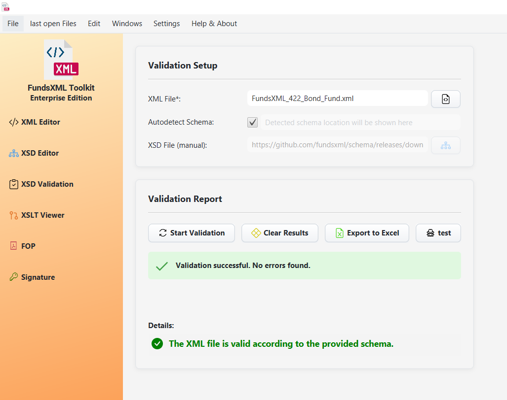

# XSD Validation

> **Last Updated:** November 2025 | **Version:** 1.0.0

This tool validates your XML files against an XSD schema to check if the document follows the rules defined in the schema.

---

## Overview

*The XSD Validation interface*

### What Does It Check?

| Check | Description |
|-------|-------------|
| **Structure** | Are elements in the right order? |
| **Required Fields** | Are all mandatory elements present? |
| **Data Types** | Are values the correct type (text, number, date)? |
| **Constraints** | Do values meet length, range, or pattern requirements? |

---

## How to Use

### Step 1: Load Your Files

*Screenshot placeholder: File selection area*

1. **Load XML File**: Click the button or drag-and-drop your XML file
2. **Load XSD Schema**: Click the button or drag-and-drop your schema file
3. Or use **"Autodetect"** if your XML references its schema

### Step 2: View Results

*Screenshot placeholder: Validation results panel*

Results appear immediately:

| Status | Meaning |
|--------|---------|
| **Green checkmark** | Your XML is valid! |
| **Red X** | Errors were found |

### Step 3: Fix Errors

If validation fails, you'll see a list of errors:
- **Error message** - What's wrong
- **Line number** - Where the problem is
- **Code snippet** - The XML around the error

Click an error to see more details.

---

## Features

| Feature | Description |
|---------|-------------|
| **Instant Validation** | Results appear as soon as files are loaded |
| **Auto-Detection** | Automatically finds schema references in XML |
| **Detailed Errors** | Line numbers and code snippets for each error |
| **Export to Excel** | Save error reports for sharing |

---

## Exporting Results

*Screenshot placeholder: Export button*

Click **"Export to Excel"** to save all validation errors to a spreadsheet. This is useful for:
- Sharing with team members
- Tracking issues over time
- Documentation

---

## Supported Standards

| Standard | Support |
|----------|---------|
| XSD 1.0 | Full support |
| XSD 1.1 (with assertions) | Full support |

---

## Tips

- Use Auto-Detection when your XML already references its schema
- Export errors to Excel when working with large documents
- Click "Clear Results" to start fresh with new files

---

## Navigation

| Previous | Home | Next |
|----------|------|------|
| [XSD Tools](xsd-controller.md) | [Home](index.md) | [XSLT Transformation](xslt-controller.md) |

**All Pages:** [XML Editor](xml-controller.md) | [XML Features](xml-editor-features.md) | [XSD Tools](xsd-controller.md) | [XSD Validation](xsd-validation-controller.md) | [XSLT](xslt-controller.md) | [FOP/PDF](fop-controller.md) | [Signatures](signature-controller.md) | [IntelliSense](context-sensitive-intellisense.md) | [Schematron](schematron-support.md) | [Favorites](favorites-system.md) | [Templates](template-management.md) | [Tech Stack](technology-stack.md) | [Licenses](licenses.md)
