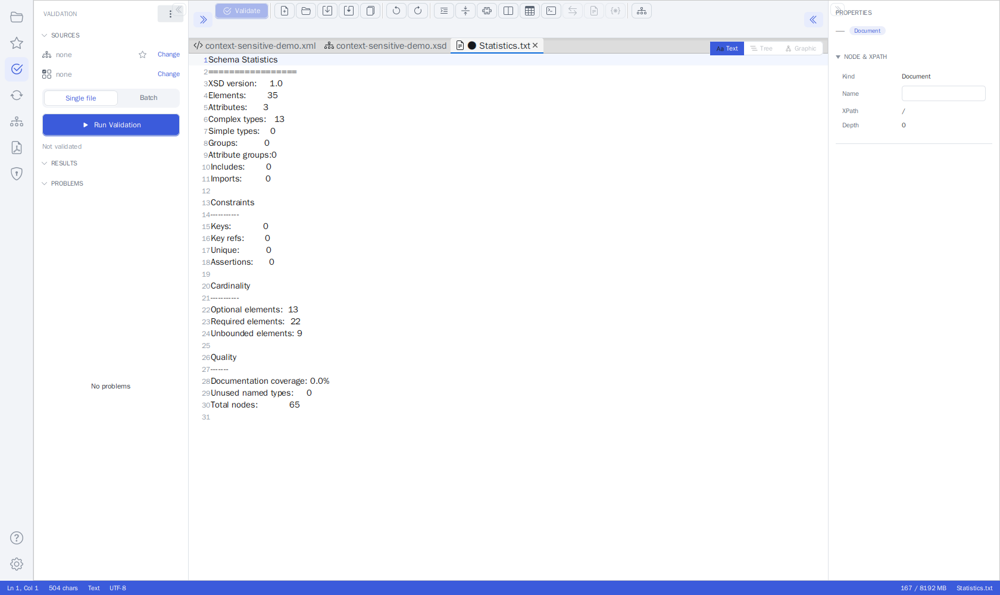
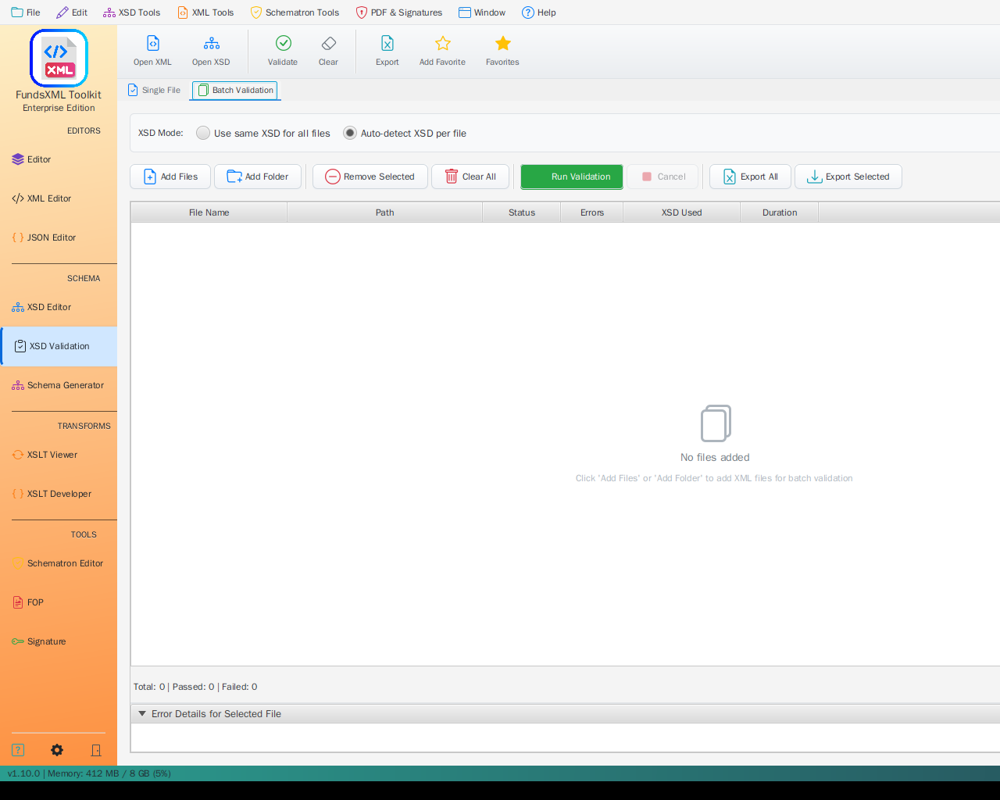

# XSD Validation

> **Last Updated:** June 2026 | **Version:** 1.10.0

> **Note (Phase 10c):** The standalone *XSD Validation* tab has been retired.
> Validation — XSD and Schematron, single-file and batch — now lives in the
> **Unified Shell's Validation activity panel**. The capabilities below are
> unchanged; they are reached through the shell's Validation panel rather than a
> dedicated sidebar tab.

Validate your XML files against XSD schemas to check if documents follow the rules defined in the schema. Supports both single file and batch validation.

---

## Overview

The XSD Validation tool provides two modes:

| Mode | Description |
|------|-------------|
| **Single File** | Validate one XML file at a time |
| **Batch Validation** | Validate multiple XML files at once |


*XSD and Schematron validation now live in the Unified Shell's Validation activity panel*

### What Does It Check?

| Check | Description |
|-------|-------------|
| **Structure** | Are elements in the right order? |
| **Required Fields** | Are all mandatory elements present? |
| **Data Types** | Are values the correct type (text, number, date)? |
| **Constraints** | Do values meet length, range, or pattern requirements? |
| **XSD 1.1 Assertions** | Do values pass custom assertion rules? |

---

## Single File Validation

Use this mode to validate one XML file against a schema.

### Step 1: Load Your Files

1. **Open the XML file** in the editor (Ctrl+O, the Explorer, or drag & drop).
2. **Schema selection**:
   - **Automatic**: Schema references inside the XML (`xsi:schemaLocation`) are found automatically.
   - **Manual**: Bind an XSD yourself - click the **"No XSD"** indicator in the status bar (or
     use the toolbar's **Set XSD Schema…** action), or pick a schema in the Validation panel's
     **SOURCES** section. The binding drives both validation and IntelliSense.

### Step 2: Validate

Click **Validate** or press **F5** to start validation.

### Step 3: View Results

Results appear immediately:

| Status | Meaning |
|--------|---------|
| **Green checkmark** | Your XML is valid |
| **Red X** | Errors were found |

If validation fails, you'll see a list of errors with:
- **Error message** - What's wrong
- **Line number** - Where the problem is
- **Severity** - Error, Warning, or Info

Click an error to see more details. When validating inside the [Unified Shell](unified-shell.md#jump-to-validation-errors), **double-click** an error to jump straight to its line in the Text view and the matching element in the Graphic view.

---

## Batch Validation

Validate multiple XML files at once. Useful for testing entire folders of XML documents.


*Batch validation with multiple files*


### XSD Mode Selection

Choose how schemas are determined for each file:

| Mode | Description |
|------|-------------|
| **Auto-detect XSD per file** | Each XML file uses its own referenced schema |
| **Use same XSD for all files** | All files are validated against a single schema you select |

### Running Batch Validation

> **Updated in June 2026** - In the Validation panel's **Batch** mode, **Run Validation** now
> opens a small menu so you can pick files or a whole folder in one step.

1. Open the **Validation** panel and switch the mode toggle to **Batch**.
2. Click **Run Validation** and choose how to pick the files:
   - **Select XML files…** - a file chooser where you select one or more XML files.
   - **Select folder…** - a folder chooser; every `*.xml` file in the folder **and all of its
     subfolders** is validated.
3. Watch progress while the files are validated.

### Results

The **RESULTS** list shows one row per file:

| Indicator | Description |
|-----------|-------------|
| **Status icon** | Red ✕ = errors, orange ⚠ = warnings only, green ✓ = valid |
| **File name** | Name of the XML file |
| **Badge** | Number of problems found in that file |

Select a row to see that file's problems; **double-click** a row to open the file in the
editor. A plain-text report of the run is available via the panel's ⋮ menu
(**Open last batch report**).

### Summary

The RESULTS header shows a summary of the run, for example:

```
RESULTS · 2 OF 25 FAILED
```

and the panel's status line repeats it ("2 of 25 file(s) failed").

---

## Exporting Results

### Single File Export

Click **Export** in the toolbar to save errors to Excel.

### Batch Export

| Button | Description |
|--------|-------------|
| **Export All** | Export all validation results to Excel |
| **Export Selected** | Export only the selected file's errors |

The Excel export includes:
- File name and path
- Error messages with line numbers
- Schema used
- Validation timestamp

---

## Favorites Integration

Save frequently used XML and XSD files to favorites for quick access:

- **Add Favorite** (Ctrl+D) - Add current file to favorites
- **Favorites** (Ctrl+Shift+D) - Show/hide favorites panel

---

## Toolbar Reference

| Button | Shortcut | Description |
|--------|----------|-------------|
| **Open XML** | - | Load XML file to validate |
| **Open XSD** | - | Load XSD schema manually |
| **Validate** | F5 | Start validation |
| **Clear** | - | Clear results |
| **Export** | - | Export to Excel |
| **Add Favorite** | Ctrl+D | Add to favorites |
| **Favorites** | Ctrl+Shift+D | Toggle favorites panel |
| **Help** | F1 | Show help |

---

## Supported Standards

| Standard | Support |
|----------|---------|
| XSD 1.0 | Full support |
| XSD 1.1 (with assertions) | Full support |

The validation engine uses Xerces 2.12.2 with full XSD 1.1 support.

---

## Tips

- Use **Autodetect** when your XML already references its schema via `xsi:schemaLocation`
- Use **Batch Validation** for testing multiple files efficiently
- **Export to Excel** when working with large documents or sharing results
- The **Filter** dropdown helps focus on files that need attention
- Double-click a file in the batch table to open it in the XML Editor

---

## Keyboard Shortcuts

| Shortcut | Action |
|----------|--------|
| F5 | Start validation |
| Ctrl+D | Add to favorites |
| Ctrl+Shift+D | Toggle favorites |
| F1 | Help |

---

## Navigation

| Previous | Home | Next |
|----------|------|------|
| [Profiled XML Generation](profiled-xml-generation.md) | [Home](index.md) | [XSLT Viewer](xslt-viewer.md) |

**All Pages:** [Unified Shell](unified-shell.md) | [XML Editor](xml-editor.md) | [XML Features](xml-editor-features.md) | [JSON Editor](json-editor.md) | [XSD Tools](xsd-tools.md) | [Profiled XML Generation](profiled-xml-generation.md) | [XSD Validation](xsd-validation.md) | [XSLT Viewer](xslt-viewer.md) | [XSLT Developer](xslt-developer.md) | [FOP/PDF](pdf-generator.md) | [Signatures](digital-signatures.md) | [IntelliSense](context-sensitive-intellisense.md) | [Schematron](schematron-support.md) | [FundsXML Extensions](fundsxml-extensions.md) | [Favorites](favorites-system.md) | [Templates](template-management.md) | [Tech Stack](technology-stack.md) | [Security](SECURITY.md) | [Licenses](licenses.md)
