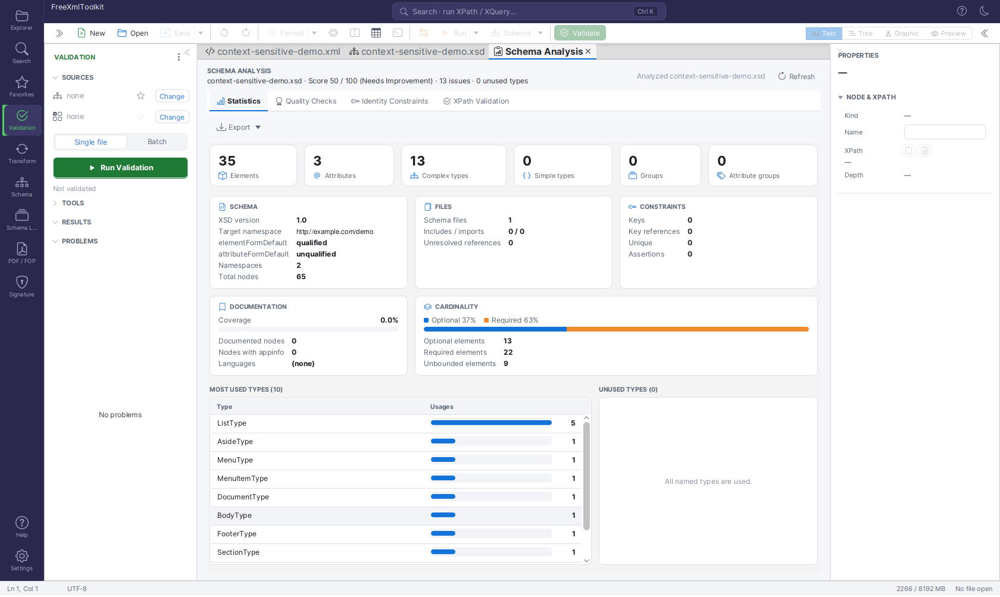
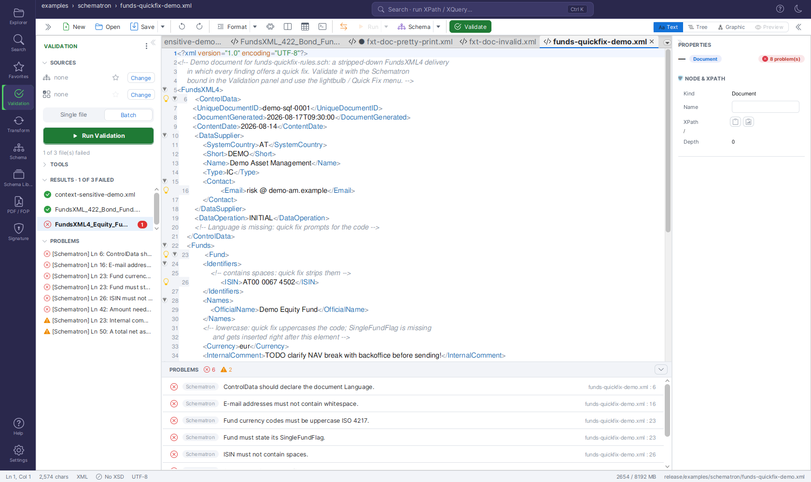

# XSD Validation

> **Version:** 2.1.0

> **Note:** The standalone *XSD Validation* tab has been retired.
> Validation — XSD and Schematron, single-file and batch — now lives in the
> **Unified Shell's Validation activity panel**. The capabilities below are
> unchanged; they are reached through the shell's Validation panel rather than a
> dedicated sidebar tab.

Validate your XML files against XSD schemas to check if documents follow the rules defined in the schema. Supports both single file and batch validation.

---

## Overview

The XSD Validation tool provides two modes:

| Mode | Description |
|------|-------------|
| **Single File** | Validate one XML file at a time |
| **Batch Validation** | Validate multiple XML files at once |


*XSD and Schematron validation now live in the Unified Shell's Validation activity panel*

### What Does It Check?

| Check | Description |
|-------|-------------|
| **Structure** | Are elements in the right order? |
| **Required Fields** | Are all mandatory elements present? |
| **Data Types** | Are values the correct type (text, number, date)? |
| **Constraints** | Do values meet length, range, or pattern requirements? |
| **XSD 1.1 Assertions** | Do values pass custom assertion rules? |

---

## Single File Validation

Use this mode to validate one XML file against a schema.

### Step 1: Load Your Files

1. **Open the XML file** in the editor (Ctrl+O, the Explorer, or drag & drop).
2. **Schema selection**:
   - **Automatic**: Schema references inside the XML (`xsi:schemaLocation` /
     `xsi:noNamespaceSchemaLocation`) are found automatically. The
     reference is re-read from the editor content before every validation run, so adding,
     changing, or removing it takes effect immediately - no save needed, and untitled
     documents work too. If you remove the reference, validation falls back to a
     well-formedness check and the status bar shows **"No XSD"**. A schema you bound
     manually is never overridden by this automatic detection. If the document has no
     `xsi:schemaLocation`, the Schema Library is consulted by root namespace (or root
     element) - see [Schema Library](schema-library.md). A declared location is also
     checked against your XML catalogs and library mappings before anything is downloaded,
     and the status bar indicator shows how the schema was found: **"XSD: name"** (declared),
     **"(catalog)"**, **"(library)"** or **"(manual)"**.
   - **Manual**: Bind an XSD yourself - click the **"No XSD"** indicator in the status bar (or
     click the toolbar's **Schema** button - **Set XSD Schema…**), pick a schema in the Validation panel's
     **SOURCES** section, or simply **drop** an `.xsd` file from your file manager onto the
     panel's XSD source row or onto the status bar's XSD indicator.
     The binding drives both validation and IntelliSense.

### Step 2: Validate

Click the toolbar's **Validate** button or press **F8** to start validation.

### Step 3: View Results

The panel's status line reports the outcome right away:

| Status line | Meaning |
|-------------|---------|
| **Valid** | The document conforms to the bound XSD (and Schematron, if one is bound) |
| **Well-formed** | No schema is bound - only the well-formedness check ran and it passed |
| **N problem(s)** | Problems were found; they are listed in the **PROBLEMS** section |

Each entry in the **PROBLEMS** list reads `[source] Ln N: message`:

- **Source** - `XSD`, `Well-formed`, or `Schematron`, so you can tell which check reported it
- **Line number** - where the problem is
- **Severity icon** - red ✕ for errors, orange ⚠ for warnings

Selecting a problem jumps to its line in the editor. The same problems are mirrored in the
**PROBLEMS** panel below the editor, whose header shows error and warning counters; see
[Jump to Validation Errors](unified-shell.md#jump-to-validation-errors) for navigation details.

> **Validate while typing** (on by default, toggle in the panel's ⋮ menu) re-runs validation
> shortly after every edit, tab switch, or schema change, so the list stays current without
> pressing F8.

---

## Batch Validation

Validate multiple XML files at once. Useful for testing entire folders of XML documents.


*Batch validation with multiple files*


### Which Schema Is Used

There is no per-run schema picker. A batch run validates **every selected file against the
XSD (and Schematron) currently bound to the active document** - the ones shown in the
Validation panel's **SOURCES** section and in the status bar's XSD indicator:

| Bound in SOURCES | What the batch run does |
|------------------|-------------------------|
| **XSD** | Every file is validated against that one schema |
| **Schematron** | Every file is additionally checked against that Schematron |
| **none** | Every file gets a well-formedness check only |

The files' own `xsi:schemaLocation` references are **not** consulted during a batch run.
To validate a folder against a particular schema, open any XML document, bind the XSD
(**Change** in the SOURCES row, the ★ favorites menu, drag & drop, or the toolbar's
**Schema** button), then start the batch.

### Running Batch Validation

> In the Validation panel's **Batch** mode, **Run Validation**
> opens a small menu so you can pick files or a whole folder in one step.

1. Open the **Validation** panel and switch the mode toggle to **Batch**.
2. Click **Run Validation** and choose how to pick the files:
   - **Select XML files…** - a file chooser where you select one or more XML files.
   - **Select folder…** - a folder chooser; every `*.xml` file in the folder **and all of its
     subfolders** is validated.
3. Watch progress while the files are validated.

### Results

The **RESULTS** list shows one row per file:

| Indicator | Description |
|-----------|-------------|
| **Status icon** | Red ✕ = errors, orange ⚠ = warnings only, green ✓ = valid |
| **File name** | Name of the XML file |
| **Badge** | Number of problems found in that file |

Select a row to see that file's problems in the **PROBLEMS** section; **double-click** a row
to open the file in the editor. A plain-text report of the run (schema names plus one
`file: valid / N problem(s)` line per file) opens as a document via the panel's ⋮ menu
(**Open last batch report**). A running batch can be cancelled from the progress bar; the
results collected so far are kept.

### Summary

The RESULTS header shows a summary of the run, for example:

```
RESULTS · 2 OF 25 FAILED
```

and the panel's status line repeats it ("2 of 25 file(s) failed").

---

## Exporting Results

There is one export: the **Export problems to Excel** button (Excel icon) in the header of
the **PROBLEMS** section. It is enabled whenever the list contains problems and writes
**exactly the problems currently shown**:

- after a single-file run, the active document's problems;
- after a batch run, the problems of the file selected in **RESULTS** - pick a row first,
  then export. There is no all-files export; use **Open last batch report** (⋮ menu) for a
  per-file overview of the whole run.

The suggested file name is `<document>-problems.xlsx`. The workbook contains:

| Sheet | Content |
|-------|---------|
| **Summary** | Source file, generation timestamp, and counts (total, errors, warnings) |
| **Problems** | One row per problem: `#`, `Source`, `Severity`, `Line`, `Message` - with a frozen header row and an auto-filter |

---

## Favorites Integration

Save frequently used XML and XSD files to favorites for quick access:

- **Ctrl+D** - add the active document to favorites
- **Ctrl+Shift+D** - show the Favorites side panel (or collapse it when it is already shown)
- The **★** menu on each SOURCES row lists your favorites of that type (XSD, Schematron, or
  JSON) - one click binds the schema without a file chooser.

---

## Controls Reference

### Validation panel

| Control | Description |
|---------|-------------|
| **SOURCES · XSD row** | The bound XSD (or *none*). Click the name to open the schema in the editor, **★** to pick a favorite, **Change** to browse; drop an `.xsd` onto the row to bind it. |
| **SOURCES · Schematron row** | The bound Schematron (`.sch`), with the same name / ★ / Change / drop behavior. |
| **SOURCES · JSON Schema row** | Shown instead of the two rows above while a JSON document is active. |
| **Single file / Batch** | Segmented toggle that decides what **Run Validation** does. |
| **Run Validation** | Single file: validates the active document. Batch: opens the **Select XML files…** / **Select folder…** menu. |
| **Status line** | *Valid*, *Well-formed*, *N problem(s)*, batch summaries, or a precondition hint (e.g. *No document open*). |
| **RESULTS** | Per-file rows of the last batch run (collapsible section). |
| **PROBLEMS** | The problem list (collapsible), with two header buttons: **Open detailed Schematron report** (enabled after a run with a bound Schematron) and **Export problems to Excel**. |
| **⋮ menu** | **Schematron Tools** (Rule Templates, Tester, Rule Builder, Check Rules, Validation Report, Documentation), **Validate against FundsXML** (only when the FundsXML extension is enabled in Settings), **Validate while typing**, **Open last batch report**. |

### Editor toolbar and status bar

| Control | Shortcut | Description |
|---------|----------|-------------|
| **Validate** | F8 | Validates the active document - well-formedness, or against the bound XSD / Schematron |
| **Schema** (primary click) | - | **Set XSD Schema…** - bind an XSD (or a JSON Schema for JSON documents) to the active document |
| **Schema ▾** menu | - | **Set XSD Schema…**, **Generate Documentation…**, **Type Editor…** |
| **XSD indicator** (status bar) | - | Shows *No XSD*, *Detecting XSD…*, *XSD: name* (with *(catalog)* / *(library)* / *(manual)*), or *XSD error*; click it to bind a schema, or drop an `.xsd` onto it |

---

## Supported Standards

| Standard | Support |
|----------|---------|
| XSD 1.0 | Full support |
| XSD 1.1 (with assertions) | Full support |

The validation engine uses Xerces 2.12.2 with full XSD 1.1 support.

---

## Tips

- If your XML already references its schema via `xsi:schemaLocation`, just open it - the
  schema is bound automatically and the status bar shows how it was found
- Use **Batch Validation** for testing multiple files efficiently - remember that all files
  are checked against the XSD bound to the active document
- **Export to Excel** when working with large documents or sharing results; the Problems
  sheet has an auto-filter, so you can narrow it by source or severity in Excel
- There is no filter inside the panel: in a batch run, the red ✕ / orange ⚠ icons and the
  count badges in **RESULTS** show at a glance which files need attention, and the
  **PROBLEMS** panel below the editor counts errors and warnings separately in its header
- Double-click a file in **RESULTS** to open it in the editor; select a problem to jump to
  its line

---

## Keyboard Shortcuts

| Shortcut | Action |
|----------|--------|
| F8 | Validate the active document |
| Ctrl+O | Open a file |
| Ctrl+D | Add the active document to favorites |
| Ctrl+Shift+D | Show the Favorites panel |

---

## Navigation

| Previous | Home | Next |
|----------|------|------|
| [Profiled XML Generation](profiled-xml-generation.md) | [Home](index.md) | [XSLT Viewer](xslt-viewer.md) |

**All Pages:** [Unified Shell](unified-shell.md) | [XML Editor](xml-editor.md) | [XML Features](xml-editor-features.md) | [JSON Editor](json-editor.md) | [XSD Tools](xsd-tools.md) | [Profiled XML Generation](profiled-xml-generation.md) | [XSD Validation](xsd-validation.md) | [Schema Library](schema-library.md) | [XSLT Viewer](xslt-viewer.md) | [XSLT Developer](xslt-developer.md) | [FOP/PDF](pdf-generator.md) | [Signatures](digital-signatures.md) | [IntelliSense](context-sensitive-intellisense.md) | [Schematron](schematron-support.md) | [FundsXML Extensions](fundsxml-extensions.md) | [Favorites](favorites-system.md) | [Templates](template-management.md) | [Tech Stack](technology-stack.md) | [Security](SECURITY.md) | [Licenses](licenses.md)
