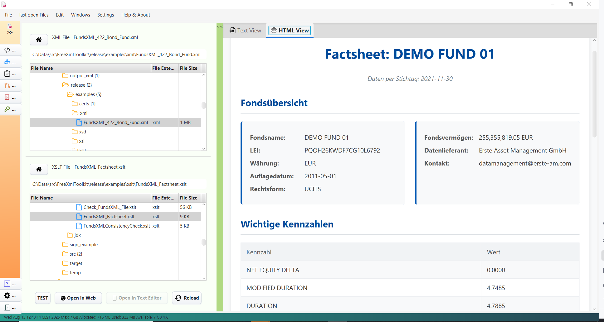

# XSLT Transformation

This section of the application allows you to perform XSLT (Extensible Stylesheet Language Transformations) to convert your XML documents into other formats, such as HTML, plain text, or another XML structure.

## How it Works

The transformation process uses two key files:

1.  **XML File:** The source document containing the data you want to transform.
2.  **XSLT File:** A stylesheet containing the rules that define how the XML data should be converted. It acts as a template for the transformation.

The tool applies the rules from the XSLT file to the XML file and generates an output based on the instructions in the stylesheet.

## Key Features

### File Selection
-   **File Explorers:** Two dedicated file explorer panes are provided, one for selecting your XML source file and another for selecting your XSLT stylesheet.
-   **Automatic Transformation:** The transformation is automatically triggered whenever you select a valid XML and XSLT file.

### Output Viewing
-   **Multiple Output Formats:** The tool can handle different types of output as specified in your XSLT file (e.g., HTML, XHTML, XML, or text).
-   **Automatic Tab Switching:** Based on the output method defined in your stylesheet, the application will automatically switch to the most appropriate view:
    -   **Web View:** For HTML or XHTML output, the result is rendered as a webpage directly within the application.
    -   **Text View:** For XML or plain text output, the result is displayed in a code editor with syntax highlighting for readability.

### User Interface
-   **Collapsible File Panel:** You can collapse the file selection panel to the side to maximize the viewing area for the transformation output.
-   **Open in Browser:** For HTML output, a button is available to open the generated result directly in your computer's default web browser.
-   **Error Handling:** If the transformation fails, a detailed error message is displayed to help you diagnose and fix issues in your XML or XSLT files.

---

[Previous: XSD Validation](xsd-validation-controller.md) | [Home](index.md) | [Next: PDF Generator (FOP)](fop-controller.md)
