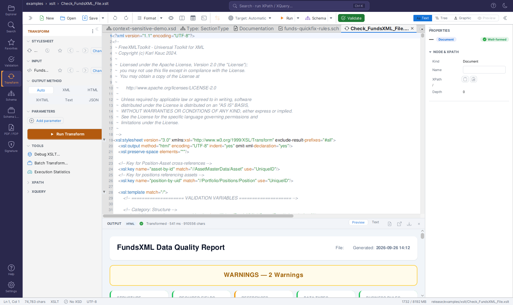

# XSLT Developer

> **Version:** 2.0.1

> **Note:** The standalone *XSLT Developer* tab has been retired. Its
> capabilities now live in the **[Unified Shell](unified-shell.md)'s Transform panel**
> (stylesheet, input, output method, parameters, XPath/XQuery) together with the
> advanced tools in the panel's **⋮ (overflow) menu** — **Debug XSLT…** (the interactive
> debugger with breakpoints, step, variables, call stack, watch), **Batch Transform…**,
> **Profile run**, and **Trace run**. This page describes how to do XSLT and XQuery
> development in the shell, plus a collection of ready-to-use XSLT and XQuery patterns.

FreeXmlToolkit is a full-featured environment for creating and testing XSLT stylesheets and
XQuery scripts. It includes live transformation, parameter support, batch processing, and
debugging tools.

---

## Overview


*An XSLT stylesheet open in the editor, the Transform panel on the left with the stylesheet
and input selected, and the transformation result in the OUTPUT panel below the editor*


XSLT/XQuery development in the Unified Shell provides:

- **Full code editors** for XML, XSLT, and XQuery — every file opens as a normal editor tab
- **Live preview and watch modes** for instant feedback while you edit
- **XSLT Parameters** for reusable stylesheets
- **Multi-file batch processing** for XSLT and XQuery
- **Performance metrics, profiling, and tracing**
- **An interactive debugger** with breakpoints, stepping, and variable inspection
- **Favorites integration** for quick access to stylesheets and input files

---

## Where Everything Lives

| Capability | Where to find it |
|------------|------------------|
| **Edit the stylesheet / query** | Open the `.xsl` / `.xq` file — it is a normal editor tab with syntax highlighting |
| **Choose stylesheet & input** | The **Transform** panel (activity bar → **Transform**): **STYLESHEET** and **INPUT** rows, each with a **Change** link, a **star** (favorites) menu, and **◀ / ▶** browse buttons |
| **Run a transformation** | The panel's **Run Transform** button — or, with the XSLT file active, the toolbar's **Run** button (`Ctrl+Enter`) |
| **See the result** | The **OUTPUT panel** docked below the editor (Text / Preview / Table views, open-in-browser, save) |
| **Parameters, output method** | The Transform panel's **PARAMETERS** and **OUTPUT METHOD** sections |
| **XPath / XQuery queries** | The panel's **XPATH** and **XQUERY** sections, or the bottom [Query Console](unified-shell.md#query-console) (`Ctrl+Shift+X`) |
| **Debugger, batch, profile, trace** | The Transform panel header's **⋮ (overflow) menu** |

---

## Getting Started

### Step 1: Choose Your Files

1. Open the **Transform** panel from the **Transform** icon in the activity bar.
2. In the **STYLESHEET** section, click **Change** to pick an `.xsl` / `.xslt` file — or pick
   one from the **clock** (recent) or **star** (favorites) menu, or drop a stylesheet file
   onto the row.
3. Check the **INPUT** section: by default it follows the **active editor document**, so
   simply open the XML you want to transform. **Change → Select XML file…** fixes the input
   to a file from disk instead.

### Step 2: Transform

Click **Run Transform**. (With the stylesheet itself as the active document, the toolbar's
**Run** button or `Ctrl+Enter` runs it against the selected
[Target](unified-shell.md#query-documents-the-target-selector).)

### Step 3: View Results

The output appears in the **OUTPUT panel** docked below the editor. The header shows a
format badge and the run status (`Transformed · N ms · M chars`). For HTML output, switch
the panel to the **Preview** view to see the rendered page, or click **Open in browser**.

---

## Live Preview and Watch Mode

Two toggles in the Transform panel's **⋮ menu** re-run the transformation automatically:

- **Live preview** — re-runs (debounced) whenever you edit the **input document**.
- **Watch stylesheet file** — re-runs whenever the chosen **stylesheet** changes on disk,
  which is handy while editing the stylesheet in another tab or tool.

This is ideal for developing and debugging stylesheets: make a change, and the OUTPUT panel
updates by itself.

---

## Using XSLT Parameters

XSLT stylesheets can accept parameters to make them more flexible. The **PARAMETERS**
section of the Transform panel lets you define these values.

### Defining Parameters in XSLT

```xslt
<?xml version="1.0" encoding="UTF-8"?>
<xsl:stylesheet version="1.0"
                xmlns:xsl="http://www.w3.org/1999/XSL/Transform">

  <!-- Define a parameter with a default value -->
  <xsl:param name="title" select="'Default Title'"/>
  <xsl:param name="show-prices" select="true()"/>
  <xsl:param name="currency" select="'EUR'"/>

  <xsl:template match="/">
    <html>
      <head><title><xsl:value-of select="$title"/></title></head>
      <body>
        <h1><xsl:value-of select="$title"/></h1>
        <xsl:if test="$show-prices">
          <!-- Show prices in the specified currency -->
        </xsl:if>
      </body>
    </html>
  </xsl:template>

</xsl:stylesheet>
```

### Setting Parameter Values

1. Expand the **PARAMETERS** section in the Transform panel
2. Click **Add parameter** to create a new row
3. Enter the parameter name (e.g., `title`)
4. Enter the value (e.g., `My Custom Report`)

Each row has its own remove button, and the values are passed to the stylesheet on every run.

---

## XQuery Development

XQuery is powerful for querying and transforming XML data. There are two ways to work with
it:

- **XQuery documents** — open (or create) a `.xq` / `.xquery` file; it gets its own editor
  with highlighting and autocomplete. Press the toolbar's **Run** button (`Ctrl+Enter`) to
  run it against the selected [Target](unified-shell.md#query-documents-the-target-selector);
  the result appears in the OUTPUT panel.
- **The XQUERY section** of the Transform panel — a multi-line query area with
  **Run XQuery**, evaluated against the transform input.

### Basic XQuery Example

```xquery
for $book in /books/book
where $book/price > 30
order by $book/title
return <result>{$book/title}</result>
```

### Built-in XQuery Examples

The XQUERY section's **Examples** menu inserts sample queries:

| Example                | Description                |
|------------------------|----------------------------|
| **Simple Query**       | Basic element selection    |
| **FLWOR Expression**   | For-Let-Where-Order-Return |
| **HTML Report**        | Generate HTML output       |
| **Data Quality Check** | Validate data completeness |

!!! tip
    The installation ships **17 ready-to-run XQuery scripts** in `examples/xquery/` and
    **32 XPath expressions** in `examples/xpath/` — open any of them and press
    `Ctrl+Enter`. See [Bundled Example Collections](xml-editor.md#bundled-example-collections).

---

## Multi-File Batch Processing

**Batch Transform…** (Transform panel **⋮ menu**) runs the active stylesheet **or** XQuery
script over many XML files at once.

1. Open the stylesheet (or XQuery file) you want to apply, then pick
   **⋮ → Batch Transform…** — a **Batch** tool tab opens.
2. Add the XML files to process (each file is transformed/queried **independently**).
3. Run the batch: the table shows one row per file with its status, and selecting a row
   shows that file's **RESULT**.
4. **Save All…** writes every result to a folder you choose.

The Explorer offers an even faster route: select **several XML files** in the workspace tree
(Ctrl/Shift+click) and press the [Transform bar](unified-shell.md#transform-bar-one-click-xslt-from-the-explorer)'s
**Transform** button — the Batch tool tab opens pre-loaded with those files and starts
automatically.

---

## XSLT 3.0 Examples

FreeXmlToolkit supports XSLT 3.0 via Saxon HE. Here are some advanced patterns:

### For-Each-Group (XSLT 2.0/3.0)

Group items without the Muenchian method:

```xslt
<?xml version="1.0" encoding="UTF-8"?>
<xsl:stylesheet version="3.0"
                xmlns:xsl="http://www.w3.org/1999/XSL/Transform">

  <xsl:output method="html" indent="yes"/>

  <xsl:template match="/">
    <html>
      <body>
        <h1>Books by Author</h1>
        <xsl:for-each-group select="books/book" group-by="author">
          <xsl:sort select="current-grouping-key()"/>
          <h2><xsl:value-of select="current-grouping-key()"/></h2>
          <ul>
            <xsl:for-each select="current-group()">
              <li><xsl:value-of select="title"/></li>
            </xsl:for-each>
          </ul>
        </xsl:for-each-group>
      </body>
    </html>
  </xsl:template>

</xsl:stylesheet>
```

### Using Maps and Arrays (XSLT 3.0)

```xslt
<?xml version="1.0" encoding="UTF-8"?>
<xsl:stylesheet version="3.0"
                xmlns:xsl="http://www.w3.org/1999/XSL/Transform"
                xmlns:map="http://www.w3.org/2005/xpath-functions/map">

  <xsl:output method="text"/>

  <xsl:variable name="config" select="map {
    'title': 'Report',
    'format': 'detailed',
    'max-items': 100
  }"/>

  <xsl:template match="/">
    <xsl:text>Title: </xsl:text>
    <xsl:value-of select="map:get($config, 'title')"/>
  </xsl:template>

</xsl:stylesheet>
```

### JSON Output (XSLT 3.0)

```xslt
<?xml version="1.0" encoding="UTF-8"?>
<xsl:stylesheet version="3.0"
                xmlns:xsl="http://www.w3.org/1999/XSL/Transform">

  <xsl:output method="json" indent="yes"/>

  <xsl:template match="/">
    <xsl:map>
      <xsl:map-entry key="'books'">
        <xsl:array>
          <xsl:for-each select="books/book">
            <xsl:map>
              <xsl:map-entry key="'title'" select="string(title)"/>
              <xsl:map-entry key="'author'" select="string(author)"/>
              <xsl:map-entry key="'price'" select="number(price)"/>
            </xsl:map>
          </xsl:for-each>
        </xsl:array>
      </xsl:map-entry>
    </xsl:map>
  </xsl:template>

</xsl:stylesheet>
```

### Text Value Templates (XSLT 3.0)

```xslt
<?xml version="1.0" encoding="UTF-8"?>
<xsl:stylesheet version="3.0"
                xmlns:xsl="http://www.w3.org/1999/XSL/Transform"
                expand-text="yes">

  <xsl:output method="html" indent="yes"/>

  <xsl:template match="/">
    <html>
      <body>
        <xsl:for-each select="books/book">
          <p>{title} by {author} - ${price}</p>
        </xsl:for-each>
      </body>
    </html>
  </xsl:template>

</xsl:stylesheet>
```

---

## Performance and Profiling

Every run shows compact statistics in the OUTPUT panel's status line:
`Transformed · N ms · M chars` — the **execution time** and the **output size**.

For a deeper look, enable **Profile run** in the Transform panel's **⋮ menu**: the next
transformation additionally opens a read-only **Profile** tool tab with overall timings and
**per-template execution times**, so you can see exactly where the time goes.

---

## Tracing and Messages

Enable **Trace run** in the **⋮ menu** to open a **Trace** tool tab with the next run. It
shows the sequence of **template matches** and all `xsl:message` output:

```xslt
<xsl:message>Processing book: <xsl:value-of select="title"/></xsl:message>
```

### Tips for Debugging

1. Use `<xsl:message>` to output debug information and read it in the Trace tab
2. Enable **Trace run** to see which templates actually fire, and in what order
3. For stepping through the stylesheet interactively, use the debugger (below)

---

## Interactive Live Debugger

**Debug XSLT…** (Transform panel **⋮ menu**) starts a full interactive debugger that lets
you pause a transformation, step through your stylesheet, and inspect state - similar to
debugging in an IDE. It opens the stylesheet as a document with a **breakpoint gutter** and
a **Debug** tool tab.

### Setting Breakpoints

- Click the slot in the editor's left margin (gutter) next to a line to toggle a red breakpoint.
- The **Breakpoints** panel lists every breakpoint with an enable/disable checkbox and a delete
  button. Double-click an entry to jump to that line.

### Step Controls

The Debug tab provides standard execution controls:

| Control | Description |
|---------|-------------|
| **Continue** | Resume until the next breakpoint |
| **Step Into** | Step into the current instruction |
| **Step Over** | Execute the current instruction without descending |
| **Step Out** | Run until the current template/function returns |
| **Stop** | Terminate the debug session |
| **Show in editor** | Jump the editor to the currently paused line |

A green arrow in the gutter marks the line currently executing; a hit breakpoint shows a yellow
arrow over the red circle.

### Inspecting State

When execution is paused, four panels show the live state of the transformation:

| Panel | Shows |
|-------|-------|
| **Variables** | Name, value, type, and scope (global/local) of every visible variable, plus the context item |
| **Call Stack** | Active template/function frames with file name and line; double-click a frame to jump to it |
| **Watch Expressions** | Custom XPath expressions you add to monitor specific values |
| **Breakpoints** | All breakpoints, persisted across sessions |

---

## Output Format

The Transform panel's **OUTPUT METHOD** section is a segmented control with
**Auto · XML · HTML · XHTML · Text · JSON**. **Auto** (the default) detects the format from
the stylesheet's `xsl:output` declaration; pick a concrete format to override the detection.

> XSLT version selection (1.0/2.0/3.0) is intentionally not offered: Saxon HE auto-detects
> the version from the stylesheet's `version` attribute.

---

## Keyboard Shortcuts

| Shortcut     | Action                 |
|--------------|------------------------|
| Ctrl+Enter   | Run the active XSLT / XQuery / XPath document against the selected Target |
| Ctrl+Shift+X | Toggle the bottom Query Console |
| F8           | Validate the active document |
| Shift+Alt+F  | Format (pretty-print) the active document |
| Ctrl+D       | Add the active file to favorites |

---

## XQuery Examples

### Data Extraction

```xquery
(: Extract all customer emails :)
for $customer in /customers/customer
return <email>{$customer/email/text()}</email>
```

### Transformation

```xquery
(: Transform to HTML table :)
<table>
  <tr><th>Name</th><th>Email</th></tr>
  {
    for $c in /customers/customer
    return <tr>
      <td>{$c/name/text()}</td>
      <td>{$c/email/text()}</td>
    </tr>
  }
</table>
```

### Aggregation

```xquery
(: Calculate statistics :)
let $orders := /orders/order
return <stats>
  <count>{count($orders)}</count>
  <total>{sum($orders/amount)}</total>
  <average>{avg($orders/amount)}</average>
  <min>{min($orders/amount)}</min>
  <max>{max($orders/amount)}</max>
</stats>
```

### Conditional Logic

```xquery
(: Categorize items :)
for $item in /items/item
return <categorized>
  <name>{$item/name/text()}</name>
  <category>{
    if ($item/price > 100) then "Premium"
    else if ($item/price > 50) then "Standard"
    else "Budget"
  }</category>
</categorized>
```

---

## Tips

- **Start with Live preview off** for large files to avoid slow updates
- **Use the Examples menu** to insert working XQuery templates
- **Enable Profile run** if transformations are slow — the per-template timings show where
- **Star your stylesheets** as favorites, then page through them with the STYLESHEET row's
  **◀ / ▶** buttons
- **Use Batch Transform** for processing multiple files efficiently
- **Enable Trace run** when troubleshooting complex stylesheets
- **Only process trusted stylesheets** - see [Security Features](SECURITY.md) for details on XSLT extension security

---

## Troubleshooting

| Problem                           | Solution                                                                                                               |
|-----------------------------------|------------------------------------------------------------------------------------------------------------------------|
| No output                         | Check the STYLESHEET row shows a stylesheet and the INPUT row shows the XML you expect                                 |
| Syntax error                      | Read the red error status in the OUTPUT panel header                                                                   |
| Slow transformation               | Enable **⋮ → Profile run** and check the per-template timings                                                          |
| Batch results empty               | Ensure files were added to the Batch tab and the run has finished                                                      |
| Parameters not working            | Verify parameter names match exactly                                                                                   |
| Java extension function not found | Java extensions are disabled by default for security. See [Security Features](SECURITY.md#xsltxquery-extension-security) |

---

## Navigation

| Previous                      | Home             | Next                                    |
|-------------------------------|------------------|-----------------------------------------|
| [XSLT Viewer](xslt-viewer.md) | [Home](index.md) | [PDF Generator (FOP)](pdf-generator.md) |

**All Pages:** [Unified Shell](unified-shell.md) | [XML Editor](xml-editor.md) | [XML Features](xml-editor-features.md) | [JSON Editor](json-editor.md) | [XSD Tools](xsd-tools.md) | [Profiled XML Generation](profiled-xml-generation.md) | [XSD Validation](xsd-validation.md) | [XSLT Viewer](xslt-viewer.md) | [XSLT Developer](xslt-developer.md) | [FOP/PDF](pdf-generator.md) | [Signatures](digital-signatures.md) | [IntelliSense](context-sensitive-intellisense.md) | [Schematron](schematron-support.md) | [FundsXML Extensions](fundsxml-extensions.md) | [Favorites](favorites-system.md) | [Templates](template-management.md) | [Tech Stack](technology-stack.md) | [Security](SECURITY.md) | [Licenses](licenses.md)
