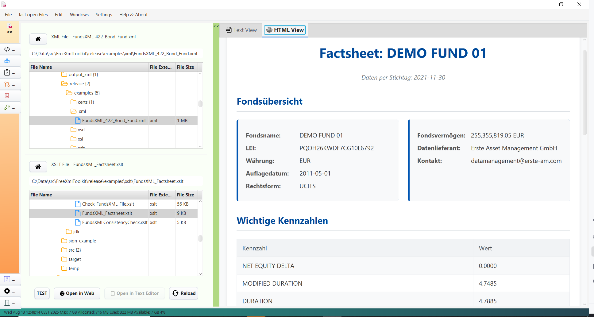

# XSLT Viewer

> **Last Updated:** December 2025 | **Version:** 1.1.0

The XSLT Viewer allows you to quickly transform XML documents using XSLT stylesheets. Simply select your files and view
the results immediately.

---

## Overview

The XSLT Viewer is designed for quick transformations where you want to see results immediately. For advanced features
like live editing, parameters, and batch processing, use the [XSLT Developer](xslt-developer.md) tab.


*The XSLT Viewer with file selection and result preview*

<!-- TODO: Screenshot needed - Show XSLT Viewer tab with XML and XSLT file selectors on left, and HTML Preview tab showing rendered output on right -->

---

## What is XSLT?

XSLT (Extensible Stylesheet Language Transformations) is a language for transforming XML documents. Think of it like a
recipe that tells the computer how to convert your XML data into a different format such as HTML, text, or another XML
structure.


*XSLT transformation: XML input + XSLT rules = Output*

**Common uses:**

- Convert XML data to HTML for web display
- Transform XML between different schemas
- Generate reports from XML data
- Extract and restructure data

---

## How to Use

### Step 1: Select Your Files

1. **Choose an XML source file** using the file explorer on the left
2. **Choose an XSLT stylesheet** using the file explorer below

The transformation runs automatically when both files are selected.

### Step 2: View the Results

The results appear in the tabbed panel on the right:

| Tab              | Description                                   |
|------------------|-----------------------------------------------|
| **Text View**    | Shows the raw output with syntax highlighting |
| **HTML Preview** | Renders HTML output as a web page             |
| **Performance**  | Shows transformation statistics               |

---

## Toolbar Actions

| Button      | Description                                   |
|-------------|-----------------------------------------------|
| **Reload**  | Re-runs the transformation with current files |
| **Browser** | Opens the result in your default web browser  |
| **Editor**  | Opens the result in your default text editor  |
| **Help**    | Shows help information                        |

---

## XSLT Examples

FreeXmlToolkit includes example XSLT stylesheets in the `examples/` folder. Here are some common XSLT patterns:

### Example 1: Basic XML to HTML

Transform a simple XML list to an HTML table:

```xml
<!-- Input XML -->
<books>
    <book>
        <title>XML for Beginners</title>
        <author>Jane Smith</author>
        <price>29.99</price>
    </book>
    <book>
        <title>Advanced XSLT</title>
        <author>John Doe</author>
        <price>49.99</price>
    </book>
</books>
```

```xslt
<!-- XSLT Stylesheet -->
<?xml version="1.0" encoding="UTF-8"?>
<xsl:stylesheet version="1.0"
                xmlns:xsl="http://www.w3.org/1999/XSL/Transform">

  <xsl:output method="html" indent="yes"/>

  <xsl:template match="/">
    <html>
      <head><title>Book List</title></head>
      <body>
        <h1>Available Books</h1>
        <table border="1">
          <tr>
            <th>Title</th>
            <th>Author</th>
            <th>Price</th>
          </tr>
          <xsl:for-each select="books/book">
            <tr>
              <td><xsl:value-of select="title"/></td>
              <td><xsl:value-of select="author"/></td>
              <td><xsl:value-of select="price"/></td>
            </tr>
          </xsl:for-each>
        </table>
      </body>
    </html>
  </xsl:template>

</xsl:stylesheet>
```

**Output:** An HTML page with a table listing all books.

---

### Example 2: Filter and Sort Data

Filter items based on a condition and sort the results:

```xslt
<?xml version="1.0" encoding="UTF-8"?>
<xsl:stylesheet version="1.0"
                xmlns:xsl="http://www.w3.org/1999/XSL/Transform">

  <xsl:output method="xml" indent="yes"/>

  <xsl:template match="/">
    <expensive-books>
      <!-- Select books over $30, sorted by price descending -->
      <xsl:for-each select="books/book[price > 30]">
        <xsl:sort select="price" data-type="number" order="descending"/>
        <book>
          <xsl:copy-of select="title"/>
          <xsl:copy-of select="price"/>
        </book>
      </xsl:for-each>
    </expensive-books>
  </xsl:template>

</xsl:stylesheet>
```

---

### Example 3: Using Templates for Modular Code

Use templates to organize complex transformations:

```xslt
<?xml version="1.0" encoding="UTF-8"?>
<xsl:stylesheet version="1.0"
                xmlns:xsl="http://www.w3.org/1999/XSL/Transform">

  <xsl:output method="html" indent="yes"/>

  <!-- Main template -->
  <xsl:template match="/">
    <html>
      <body>
        <xsl:apply-templates select="books/book"/>
      </body>
    </html>
  </xsl:template>

  <!-- Template for each book -->
  <xsl:template match="book">
    <div class="book">
      <h2><xsl:value-of select="title"/></h2>
      <p>By: <xsl:value-of select="author"/></p>
      <xsl:call-template name="format-price">
        <xsl:with-param name="amount" select="price"/>
      </xsl:call-template>
    </div>
  </xsl:template>

  <!-- Named template for price formatting -->
  <xsl:template name="format-price">
    <xsl:param name="amount"/>
    <p class="price">
      <xsl:text>Price: $</xsl:text>
      <xsl:value-of select="format-number($amount, '#,##0.00')"/>
    </p>
  </xsl:template>

</xsl:stylesheet>
```

---

### Example 4: XML to JSON-like Structure

Convert XML to a JSON-friendly text format:

```xslt
<?xml version="1.0" encoding="UTF-8"?>
<xsl:stylesheet version="1.0"
                xmlns:xsl="http://www.w3.org/1999/XSL/Transform">

  <xsl:output method="text"/>

  <xsl:template match="/">
    <xsl:text>[</xsl:text>
    <xsl:for-each select="books/book">
      <xsl:if test="position() > 1">,</xsl:if>
      <xsl:text>{"title":"</xsl:text>
      <xsl:value-of select="title"/>
      <xsl:text>","author":"</xsl:text>
      <xsl:value-of select="author"/>
      <xsl:text>","price":</xsl:text>
      <xsl:value-of select="price"/>
      <xsl:text>}</xsl:text>
    </xsl:for-each>
    <xsl:text>]</xsl:text>
  </xsl:template>

</xsl:stylesheet>
```

---

### Example 5: Conditional Formatting

Apply different styles based on data values:

```xslt
<?xml version="1.0" encoding="UTF-8"?>
<xsl:stylesheet version="1.0"
                xmlns:xsl="http://www.w3.org/1999/XSL/Transform">

  <xsl:output method="html" indent="yes"/>

  <xsl:template match="/">
    <html>
      <head>
        <style>
          .low-price { color: green; }
          .high-price { color: red; font-weight: bold; }
        </style>
      </head>
      <body>
        <xsl:for-each select="books/book">
          <p>
            <xsl:value-of select="title"/>:
            <span>
              <xsl:attribute name="class">
                <xsl:choose>
                  <xsl:when test="price &lt; 30">low-price</xsl:when>
                  <xsl:otherwise>high-price</xsl:otherwise>
                </xsl:choose>
              </xsl:attribute>
              $<xsl:value-of select="price"/>
            </span>
          </p>
        </xsl:for-each>
      </body>
    </html>
  </xsl:template>

</xsl:stylesheet>
```

---

### Example 6: Grouping with Keys (XSLT 1.0 Muenchian Grouping)

Group items by a common value:

```xslt
<?xml version="1.0" encoding="UTF-8"?>
<xsl:stylesheet version="1.0"
                xmlns:xsl="http://www.w3.org/1999/XSL/Transform">

  <xsl:output method="html" indent="yes"/>

  <!-- Key for grouping books by author -->
  <xsl:key name="books-by-author" match="book" use="author"/>

  <xsl:template match="/">
    <html>
      <body>
        <h1>Books by Author</h1>
        <!-- Select first book of each author group -->
        <xsl:for-each select="books/book[count(. | key('books-by-author', author)[1]) = 1]">
          <xsl:sort select="author"/>
          <h2><xsl:value-of select="author"/></h2>
          <ul>
            <!-- List all books by this author -->
            <xsl:for-each select="key('books-by-author', author)">
              <li><xsl:value-of select="title"/></li>
            </xsl:for-each>
          </ul>
        </xsl:for-each>
      </body>
    </html>
  </xsl:template>

</xsl:stylesheet>
```

---

## Included Example Files

FreeXmlToolkit includes professional example stylesheets in the `examples/xsl/` folder:

| Stylesheet                       | Description                      |
|----------------------------------|----------------------------------|
| `FundsXML_Factsheet.xsl`         | Generate a fund factsheet report |
| `FundsXML_ExecutiveSummary.xsl`  | Create an executive summary      |
| `FundsXML_DataQualityReport.xsl` | Data quality validation report   |
| `FundsXML_PortfolioAnalysis.xsl` | Portfolio analysis with charts   |
| `FundsXML_RiskReport.xsl`        | Risk analysis report             |

Use these with the example XML file `examples/xml/FundsXML_422_Bond_Fund.xml`.

---

## Performance Statistics

After each transformation, you can view performance metrics in the **Performance** tab:

- **Execution time** - How long the transformation took
- **Output size** - Size of the generated output
- **Memory usage** - Memory consumed during transformation

---

## Tips

- **Validate first** - Make sure your XML and XSLT files are valid before transformation
- **Check the error panel** - If transformation fails, check the error messages
- **Use the HTML preview** - For HTML output, the preview shows you exactly how it will look
- **Try the example files** - Learn from the included examples in the `examples/` folder
- **Need more features?** - Use the [XSLT Developer](xslt-developer.md) tab for advanced editing

---

## Next Steps

- [XSLT Developer](xslt-developer.md) - Full XSLT/XQuery development environment
- [PDF Generator (FOP)](pdf-generator.md) - Generate PDFs from XSL-FO stylesheets

---

## Navigation

| Previous                            | Home             | Next                                |
|-------------------------------------|------------------|-------------------------------------|
| [XSD Validation](xsd-validation.md) | [Home](index.md) | [XSLT Developer](xslt-developer.md) |

**All Pages:
** [XML Editor](xml-editor.md) | [XML Features](xml-editor-features.md) | [XSD Tools](xsd-tools.md) | [XSD Validation](xsd-validation.md) | [XSLT Viewer](xslt-viewer.md) | [XSLT Developer](xslt-developer.md) | [FOP/PDF](pdf-generator.md) | [Signatures](digital-signatures.md) | [IntelliSense](context-sensitive-intellisense.md) | [Schematron](schematron-support.md) | [Favorites](favorites-system.md) | [Templates](template-management.md) | [Tech Stack](technology-stack.md) | [Licenses](licenses.md)
